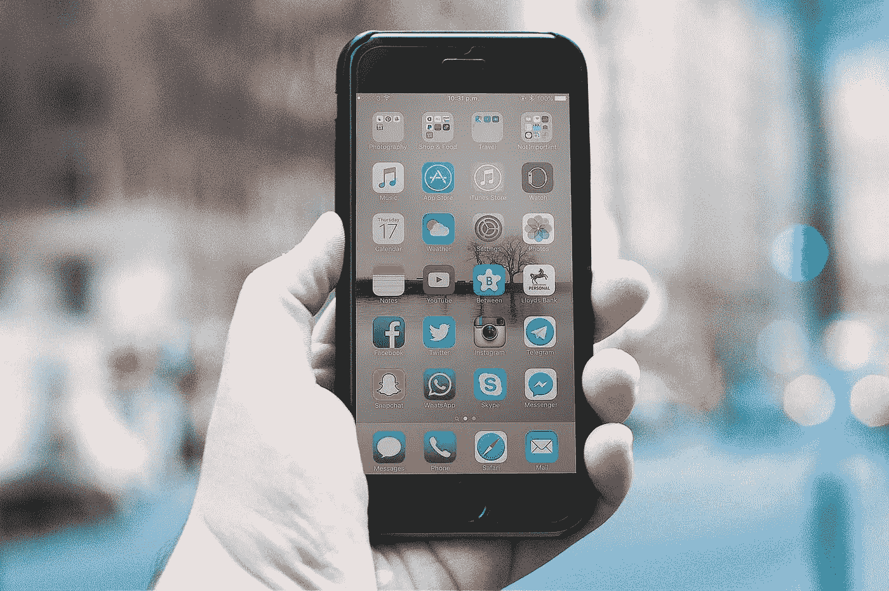
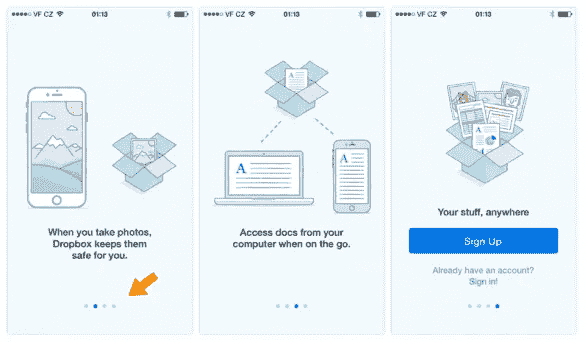
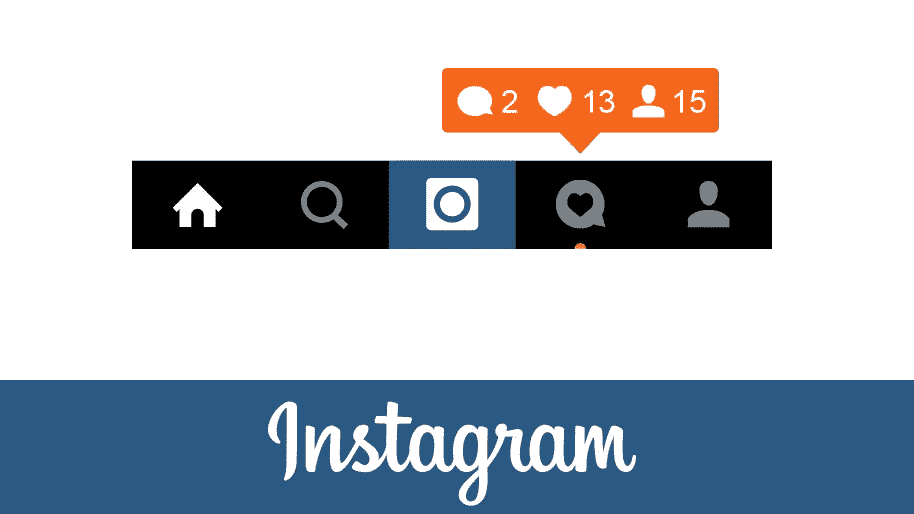
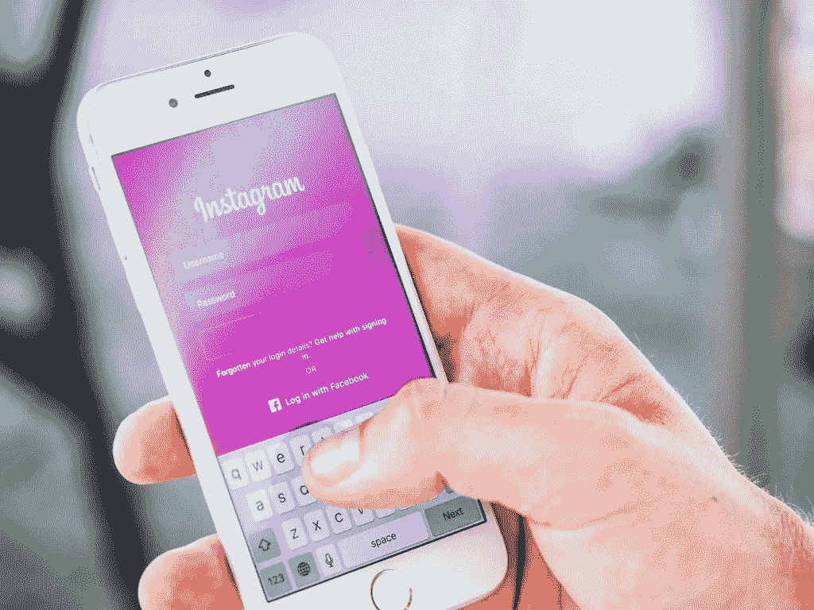
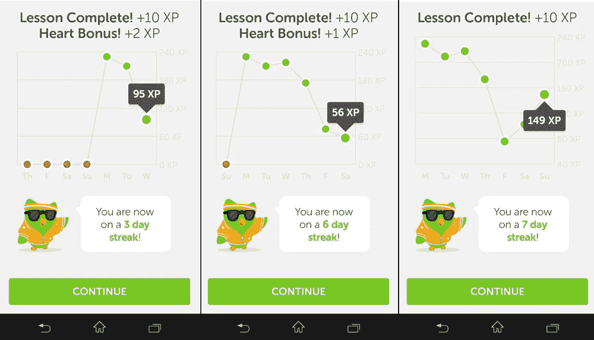
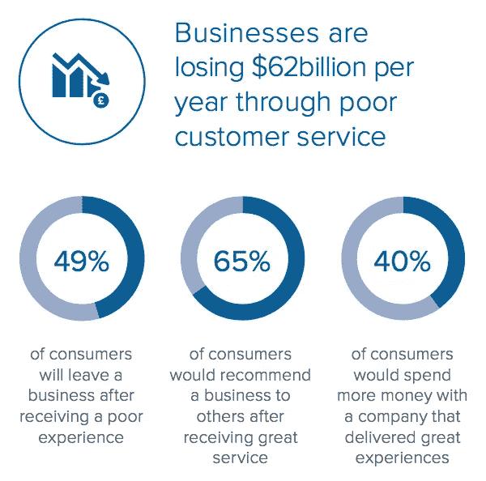
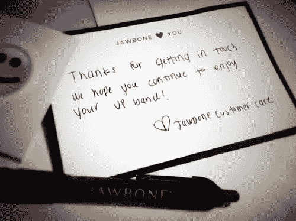

# 提高用户保留率的 5 个策略

> 原文：<https://medium.com/swlh/5-strategies-to-boost-user-retention-rates-6f47feea5ef8>

Originally published on [http://www.appsterhq.com](http://www.appsterhq.com/?utm_source=CP&utm_medium=Medium)

截至 2017 年年中，共有[500 万个应用](https://www.statista.com/statistics/276623/number-of-apps-available-in-leading-app-stores/)可供谷歌的 Play Store 和苹果的 App Store 下载。

然而，与此同时，近 85%的智能手机使用量被分配给了 5 个或更少的应用程序；几乎五分之四的用户[在第一次安装应用程序 72 小时后再也不会使用它。](http://www.androidauthority.com/77-percent-users-dont-use-an-app-after-three-days-678107/)

这表明，大多数人始终只使用少数几个应用程序，而很快就放弃了其他所有应用程序。

因此，留住客户对于以应用为中心的初创公司来说是一个严重的问题，这也是给我们在 Appster 的创业者带来困难的关键挑战之一。

为了帮助解决这个问题，我将描述 5 个有效提高客户保持率的关键策略。

# 什么是客户维系？

“获得客户**”和“保留客户**”是建立成功企业的两个基本方面。****

**我以前写过各种关于有效获取客户的意义和重要性的文章。**

**现在，一旦你成功获得了一个新客户，你就必须开始尽一切努力尽可能长久地留住这个客户。**

**[Inc.com](https://www.inc.com/encyclopedia/customer-retention.html)为客户维系提供了一个有用的定义:**

> ***“客户维系指的是一旦建立，企业能够长期维持的客户关系的百分比。客户保留是一个简单的概念:那些感到自己很重要，并以正确的方式定期交流的快乐客户会不断回来。”***

**首先吸引客户使用你的应用程序当然很重要，但在未来留住客户对你的创业公司的成功更为重要。**

**为什么？以下是两个主要原因:**

1.  **有效留住客户的公司比那些没有留住客户的公司发展得更快，**
2.  **留住一个现有客户的成本比获得一个新客户的成本要低得多(T2，有时会低 7 倍)。**

**现金不足是第二个最常见的原因，超过 90%的初创公司最终都失败了，明智地花钱绝对至关重要。**

**最聪明的方法之一就是最大限度地留住你的客户。**

**这里有 5 个策略可以有效地提高客户保持率:**

# **1.优化您的入职体验**

****

**Greylock 的成长顾问 Casey Winters 认为，入职是你成长战略中最重要的部分。**

**App onboarding 封装了向用户介绍你的 App，让他们熟悉它的工作原理，并说服他们成为长期用户的整个过程(来源: [1](http://info.localytics.com/blog/app-onboarding-101) 、 [2](https://www.shopify.com/partners/blog/mobile-app-onboarding) 、 [3](http://www.elasticode.com/what-is-onboarding.php) )。**

**正如我最近指出的那样:**

> ***“app on boarding 的主要目标是在使用你的应用的过程中温和地引导用户，直到他们最终有了‘啊哈！“那一刻”，即他们真正认识到你的应用为他们的生活提供的价值，然后成为忠实用户的那一刻。”***

**从这个意义上来说，你可以认为留住客户的第一步是成功获取客户。**

**换句话说，如果你不能首先成功*创造*一个付费客户，你就不能成功*留住*一个客户。**

**Dropbox、脸书和 Twitter 都在创业初期苦苦挣扎。**

****

**Dropbox on boarding**

**每家公司最终都意识到，让新用户完成一项或多项特定任务，对于将他们转化为长期用户至关重要。以 Twitter 为例，用户在注册后立即关注至少 10 个人是至关重要的，否则他们会放弃这项服务。**

**我最近[列出了 6 个具体策略](http://www.appsterhq.com/blog/app-user-onboarding)，初创公司可以用它们来为新用户创造无缝、顺畅的入职体验:**

1.  **减少摩擦；**
2.  **提供明确的进度指示；**
3.  **使用社交注册；**
4.  **提供激励措施；**
5.  **提供用例；和**
6.  **使用简短但有用的教程**

# **2.利用“触发器”(推送通知)**

**留住客户的最终目标不仅仅是确保客户将你的应用程序安装在他们的手机上，而是让他们*定期与*互动，即使用你的应用程序。**

**“推送通知”形式的“触发器”是鼓励用户继续使用你的应用程序的非常有效的方式。**

**对于初学者来说，一个[推送通知](https://www.lifewire.com/what-is-push-notification-1994351)是:**

> **“…一种应用程序向您发送消息或通知您数码事件的方式，而无需您实际打开应用程序。通知是“推”给你的，你不需要做任何事情。”**

**如果你在过去十年的任何时候使用过手机，那么你应该对推送通知很熟悉。**

**它们是自动生成的消息或图标，当你在 Instagram 照片上收到新的赞，在脸书邮报上收到新的评论，在 Quora 回答上收到新的投票，等等。**

****

**这些类型的触发因素令人难以置信地上瘾，不仅因为它们让一个人无论何时出现都会体验到短暂的快感，还因为它们“引导”那个人去期待额外的通知，以便体验类似的快感(来源: [1](https://www.psychologytoday.com/blog/brain-wise/201209/why-were-all-addicted-texts-twitter-and-google) 、 [2](https://www.vice.com/en_us/article/vv5jkb/the-secret-ways-social-media-is-built-for-addiction) 、 [3](http://www.tristanharris.com/2016/05/how-technology-hijacks-peoples-minds%E2%80%8A-%E2%80%8Afrom-a-magician-and-googles-design-ethicist/) )。**

**你需要不断让用户回到你的应用，推送通知是一种非常有效的方式。**

**然而，在你的应用中实现推送通知是一种可以容忍的、自愿的和“非垃圾”的方式，这一点很重要。**

****

**(image [source)](http://marinad.com.ar/wp-content/uploads/2015/01/screen-ig-menu-notifications.jpg)**

**使用推送通知时，请务必遵循以下指南(来源( [1](https://www.appboy.com/blog/push-notification-best-practices/) ， [2](https://hackernoon.com/the-must-follow-best-practices-for-your-push-notifications-5f878565d2a9) ):**

1.  **使用选择加入/选择退出系统，而不是任意强制通知用户的手机；**
2.  **围绕最常见和最有价值的数字事件设计你的触发器，而不是将它们用于应用程序中可能发生的每一个动作；**
3.  **抵制在你的推送通知中添加振动的冲动，因为这可能会惹恼用户，并可能导致他们卸载你的应用程序；和**
4.  **个性化你的通知，使它们不那么烦人(例如，“凯文只是喜欢你的照片，马克！”)**

# **3.鼓励客户投资**

****

**提高客户保持率的一个非常有效的方法是让你的客户*投资*你的应用。**

**我不是说让你的用户买你公司的股票。**

**相反，我指出了理解和实现基于“[沉没成本陷阱](http://www.investopedia.com/terms/s/sunk-cost-trap.asp)”的特性的重要性。**

**我最近[对](http://www.appsterhq.com/blog/3-crucial-features-high-growth-startups)这个过程解释如下:**

> ***“成功的创业公司创造了成长循环，在这个循环中，他们的客户使用他们的产品越多，他们的客户就越不可能永久放弃他们的产品。***
> 
> ***这种现象被称为“沉没成本陷阱”，投入的资源越多，我们就越容易坚持(或完成)某个系统、任务或行为。***
> 
> **如果你已经花了，比如说，两年的时间来建立你的 Instagram 个人资料，你就不太可能放弃 Instagram 并加入一个竞争对手的手机摄影应用。**
> 
> **与过去 10 个月相比，如果你只使用 Dropbox 几天，你更有可能放弃 Dropbox，去加入一个与之竞争的在线文件存储服务。在你所有的设备之间移动、重新组织和重新共享你已经在 Dropbox 上存储了近一年的文件简直太麻烦了。**
> 
> ***你在脸书上积累的朋友越多，你就越不可能关闭你的个人资料。”***

**这样的例子不胜枚举。**

**让你的客户在你的应用上投入时间和金钱的一个方法是加入一些功能，让你的客户随着时间的推移不断进步。**

**这可能是完成的课程数(一个教育应用)，通过的关卡数(一个游戏应用)，或者收到的社交分享数(一个博客应用)。**

**无论你选择哪种途径，请记住，我们的目标是通过使用持续的成就或成就作为用户不断回到你的应用程序的原因来增加客户保留率。**

**以下是 Duolingo 连续进步的一个例子:**

****

**(image [source](https://cdn.lingholic.com/wp-content/uploads/2014/05/Progress-graph.jpg))**

# **4.提供卓越的客户服务**

****

**当你第一次创业时，你既缺乏客户信任，也缺乏品牌信誉。**

**这可能会让人们对使用你的应用程序和成为付费用户非常谨慎。**

**提供卓越的客户服务是逐步建立客户信任、品牌忠诚度和客户支持的一种方式。**

**事实上，有很多创业公司以指数级速度扩张的例子，主要是因为他们出色的客户服务，比如[亚马逊就是一个明显的例子](https://www.forbes.com/sites/scottdavis/2016/07/14/how-amazons-brand-and-customer-experience-became-synonymous/#69b21a6a3cd5)。**

**正如连续创业者[德里克·西弗斯](https://www.helpscout.net/customer-service-quotes/)所说:**

> **做生意最重要的一件事就是让人们开心。如果你让人们开心，作为副作用，他们会很乐意掏钱给你。”**

**不足为奇的是，糟糕的客户服务不仅是客户放弃他们以前喜欢的公司的主要原因之一，也是企业极其昂贵的支出。**

**2016 年的一项美国[研究发现:](http://pages.newvoicemedia.com/rs/182-ZPE-371/images/newvoicemedia-insight-the-importance-of-consistent-custsomer-service-web-usa.pdf)**

****

**(image [source](http://pages.newvoicemedia.com/rs/182-ZPE-371/images/newvoicemedia-insight-the-importance-of-consistent-custsomer-service-web-usa.pdf))**

**因此，有效的客户服务对于获得*和*长期客户至关重要。**

**以下是提供一流客户服务的一些技巧:**

*   ****始终保持礼貌、谦恭和真诚**:当客户感觉他们是在用真实的想法和情感与另一个人交流，而不是与一个类似于照本宣科、没有生命的机器人交流时，他们会反应良好。**
*   ****快速响应**:即使你不能立即解决客户的问题，承认他/她的问题这一简单的行为也能极大地提高他/她对你公司的满意度。**
*   ****寻求反馈**:进行用户测试，创建跟进电子邮件，要求对服务质量做出坦诚的回应，并针对你的最佳客户收集使用你的应用的评价。**
*   ****奖励客户**:寻找机会用奖励给你的客户惊喜，比如免费赠品，作为使用你的应用或向你的客户服务部门提出问题的交换。**
*   ****提供大量免费、有用的信息**:如果客户能够访问你公司的网站，查阅详细、精心编写的常见问题解答，并且能够轻而易举地自行解决问题，他们会非常感激。**

**你也可以在你的客户服务中发挥创意，例如，为你的用户提供手写的感谢信，就像 Jawbone 当年做的那样:**

****

# **5.建立一个社区**

**提高客户保持率的最后一个策略是建立一个真实的用户社区。**

****

**21 世纪一些最成功的创业公司都植根于多样化和活跃的用户社区，这些用户不仅真正关心产品，还关心公司文化和其他用户的福祉。**

**Y Combinator 是一个非常强大的以社区为中心的创业孵化器的例子。**

**正如[约书亚·保罗](http://blog.socious.com/what-startups-know-about-building-community-that-many-bigger-businesses-are-just-finding-out)所指出的，强大的用户社区肯定能有效地增加客户保留率:**

> ***“构成一个强大的客户保持策略的品质，例如展示透明度的能力，让你的客户感到被关心和倾听，以及快速回答客户的问题，都可以通过客户社区模式轻松实现。***
> 
> ***通过您的在线社区，您可以更快、更容易地发现那些陷入困境或不开心的人，从而在关系受损无法修复之前，创造改善客户体验的机会。***
> 
> ***您的客户支持团队不仅可以主动接触不满意的客户，而且社区中的客户支持者也为您提供了一个全天候服务的安全网。”***

**如何有效地围绕你的应用建立一个强大的社区？**

**你可以从写大量与你的领域相关的博客文章开始，鼓励你的用户喜欢、评论这些文章，并与他们的朋友和同事分享。**

**邀请您的用户对您的常见问题做出贡献。**

**创建用户可以聚集、聊天和互相帮助的在线论坛。**

**你也可以考虑组织聚会，以此鼓励你的用户互相认识，并认识你公司背后的人。**

**Meetup.com 是完成这项任务的绝佳资源:**

**//**

## **感谢阅读！**

# **如果你喜欢这篇文章，请随意点击❤下面的心形按钮，帮助其他人找到它！**

****

> **最初发表于[http://www.appsterhq.com](http://www.appsterhq.com/?utm_source=CP&utm_medium=Medium)**

************