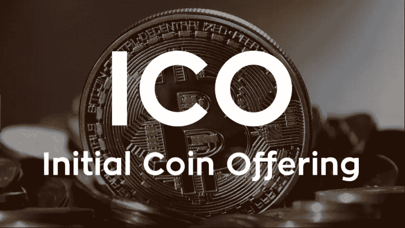
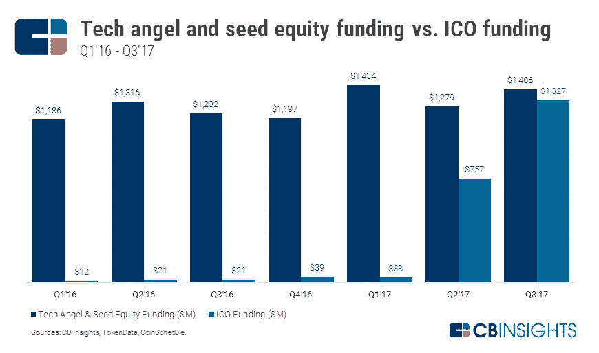

# 成功传播 ICO 的 5 个策略(上)

> 原文：<https://medium.com/swlh/5-strategies-to-successfully-communicate-an-ico-part-1-2e5184e4d8eb>

[根据 Coindesk 的数据，](https://www.coindesk.com/ico-tracker/)自 2017 年初以来，首次硬币发行或“ICO”已经筹集了超过 25 亿美元。因此，理解 ICO 实际上是什么可能是一个好主意。这个名字来源于资本市场首次公开募股(IPO)的时代错误。然而，这两种融资过程是非常不同的。在首次发行硬币(ICO)期间，一家公司提供被称为“代币”的数字资产，感兴趣的各方可以“贡献”这些资产。这些代币允许创业公司从各种投资者那里筹集资金。

根据[哈佛商业评论](https://hbr.org/2017/03/what-initial-coin-offerings-are-and-why-vc-firms-care)的报道，ICO 通常是这样工作的:“一种新的加密货币是在诸如 Counterparty、Ethereum 或 Openledger 等协议上创建的，其价值是由 ICO 背后的创业团队根据他们认为网络在当前阶段的价值任意确定的。然后，通过由市场供求决定的价格动态，价值由参与者网络决定，而不是由中央机构或政府决定。”

ICO fundraising is catching fire

[罗伯特·哈克特在《财富》，](http://fortune.com/2017/05/05/ico-initial-coin-offering/)中解释道:“这实际上是一个 Kickstarter 活动，使用区块链的“代币”(又名应用硬币、加密货币、数字资产)来筹集资金。”这些代币可以在未来交易公司的商品和服务，或者在加密货币交易所交易。不管你对 ICO 市场的看法如何，这个过程的核心是一些重大的创新。然而，由于目前在该领域缺乏监管，对于那些意图不良的公司和彻头彻尾的骗局仍然存在很多担忧。

记住这一点，如果你有一个真正的商业概念，你的公司正在考虑一个 ICO，你应该准备好通过向你的利益相关者传达你的想法或商业模式来建立信任。最重要的是，你需要谈论、写文章、发微博、宣传你的公司和 ICO，以便为一个成功的 ICO 建立知名度。你还需要有一个优秀的客户服务/业务开发团队来帮助人们了解他们投资的是什么。这两篇文章将深入探讨成功传播 ICO 的必备策略。

# 确定你的受众

成功的传播活动的第一步是识别和了解你的目标受众。以下是这方面的一些重要注意事项:

*   你的目标是什么类型的贡献者？
*   它们的识别特征是什么？
*   ICO 将如何影响您的潜在客户？
*   你将如何让你的员工和职员参与到这个过程中来？
*   你将如何沟通和利用你的关键利益相关者和战略合作伙伴？
*   你将如何瞄准你所在行业的影响力中心，如媒体、博客和社交媒体的主要成员或行业领袖？

无论你是否了解他们，你的企业有多个目标受众，你需要在正确的时间有效地与他们联系，以确保你的 ICO 成功。你的传播策略的每一个其他元素都应该考虑到你的特定目标受众。

# 开发引人注目的信息(然后使用它们)

在为 ICO 做准备时，信息传递可能是您沟通策略中最重要的组成部分。在一个不断被越来越多的机会轰炸的环境中，一家希望进入市场的公司必须有一个与公众产生共鸣的明确的价值主张。公司应该清楚地阐述它们的价值主张和它们解决的问题，提供有关管理团队的详细信息，概述增长前景，最重要的是，提供令人信服的理由，说明投资者为什么应该相信它们的潜力。

# 为 ICO 建立信任

信任的重要性怎么强调都不为过，尤其是在一个有许多可疑 ICO 候选人的炒作市场。除了与投资者接触，公司还必须努力培养公众、影响力中心和关键利益相关者的信任感。这在一定程度上是通过在解决投资者可能存在的潜在担忧时保持透明、坦诚和诚实来实现的。加密货币和区块链公司尤其必须努力建立信任，因为媒体关注比特币的安全性，交易所因黑客攻击或盗窃而损失所有投资者的资金，在线钓鱼者在业内猖獗。人们不想投资或说积极的话，也不想分享他们不信任的个人和公司的好消息。信任是你声誉管理的中心。

如果你要为你的 ICO 进入一个外国市场，投资于书面媒体的翻译以及视频和播客的语言培训将确保你公司的白皮书和其他材料没有可能让读者怀疑你公司合法性的错误。这种无错政策包括社交媒体发布、广告文案，基本上是任何面向外部的内容。

为了获得更多建立信任的资源，大卫·阿默兰在《在不确定的世界中建立基于知识的信任》中谈到了建立信任。

既然我们已经解决了传达 ICO 的几个关键步骤，本系列的第二部分将深入探讨核心基础知识，如时间表规划和内外沟通策略。

*原载于 2017 年 11 月 6 日*[*【www.kcdpr.com】*](http://www.kcdpr.com/five-strategies-communicate-ico-part-one/)*。*

## 这个故事发表在 [The Startup](https://medium.com/swlh) 上，Medium 的出版物拥有超过 256，410 人的关注。

# 订阅[在这里获取头条](http://growthsupply.com/the-startup-newsletter/)。

