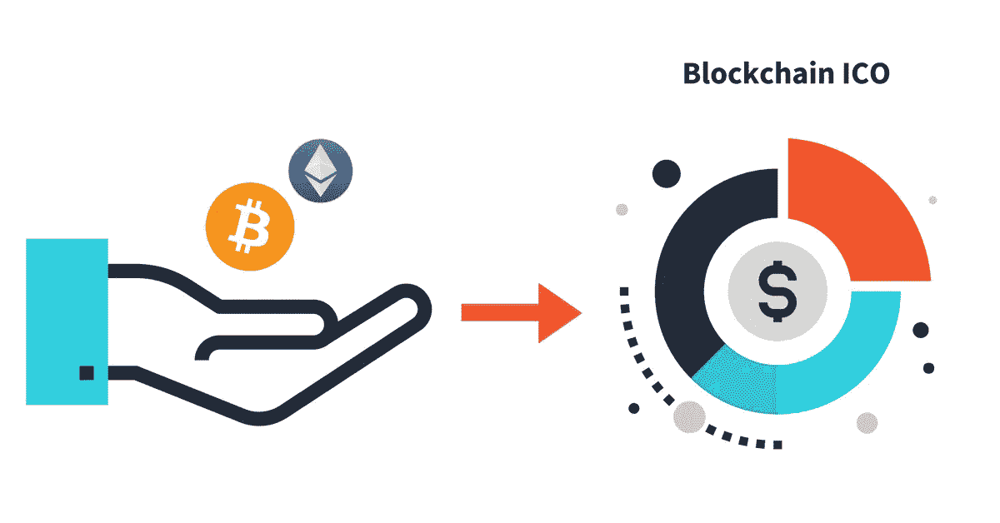

# 成功传播 ICO 的 5 个策略(下)

> 原文：<https://medium.com/swlh/5-strategies-to-successfully-communicate-an-ico-part-2-4257f0b9f192>

[我之前的帖子](http://www.kcdpr.com/five-strategies-communicate-ico-part-one/)详细介绍了识别受众、创建差异化信息以及注重建立和维护信任以成功传播 ICO 的关键步骤。现在，让我们在本系列的第二部分将注意力集中在时间、计划和执行上。

**制定一个三管齐下的时间表**

通往 ICO 的道路不是一个短暂或简单的过程。一个公司要做好准备可能需要几个月的准备和规划，特别是如果该组织没有必要的资源和人员来完成这项工作。因此，公司应该开始制定时间表，并提前为每个时期制定相应的沟通策略。对于任何重大举措或计划来说，规划都是至关重要的，ICO 也不例外。

建议的时间表可以分为以下几个阶段:

*   ICO 前时期(6-9 个月)
*   ICO 令牌销售期，包括售前(1-2 个月)
*   ICO 后时期(1 个月)

每个阶段都有自己的一套技术和详细的截止日期和事件，因此考虑到每个阶段的沟通策略将有助于您的公司保持领先地位。

## 前 ICO 时期的通信

前 ICO 时期的强大宣传活动有助于确保你的公司在你上市之前就引起媒体、潜在投资者、分析师和有影响力人士的注意。

一旦决定采用 ICO，您就应该制定战略沟通计划，尤其是如果您的公司没有现成的战略。在潜在投资者面前定位你的公司之前，你要精心构思你想告诉公众的故事。确定关键发言人和个人，他们将是你公司未来的形象代言人。

在详述您的价值主张和主要竞争优势时，分析您最接近的竞争对手，以更好地了解他们在做什么，并以突出的方式定位您的组织。这些考虑应该成为你日常沟通计划的一部分，并随着潜在 ICO 的出现而变得更加重要。

ICO 之前的其他沟通必需品包括制作和分发白皮书、制作公司概述视频、撰写文章、接受媒体采访，以及为发布和吸引关注者制定一个精心构建的社交媒体计划。

## ICO 令牌销售通信

虽然战略沟通在 ICO 流程的每个阶段都至关重要，但代币销售阶段通常是最繁忙的阶段。

这里有两个关键的沟通点需要考虑:

> 在发布之前，您最初的努力是否为成功奠定了基础？
> 
> 你的网站、白皮书和其他营销方式是否准确地反映了你的公司、你与众不同的原因以及你对未来的计划？

如果你的沟通团队在 ICO 发布前就做好了工作，那么潜在投资者、媒体和公众就会在你发布之前对你公司的故事有所了解。理想情况下，他们会对你公司的使命和增长潜力有一个基本的了解，因为你已经利用媒体、博客、博客和其他影响力中心作为与公众沟通的工具。

你的代币上市是你的公司有效传达你如何适应更广阔的市场以及为什么投资者应该长期相信你的公司的机会。在 ICO 发布之前，请确保您有一个指定的发言人，并为媒体采访中无疑会问到的关键问题准备好谈话要点和信息。你公司的发言人接受过适当的媒体培训，知道如何尽可能地控制信息，这一点很重要。这也是你想要传达关于你公司的历史、领导和方法的独特角度的地方，所以媒体准备好帮助你的公司从竞争者中脱颖而出。

## 后 ICO 时代通信

当公司未能利用已经完成的工作和首次发行硬币后的积极势头时，就会出现一个常见的沟通错误。你的沟通策略应该在 ICO 之后继续，以确保你的公司在最初的兴奋消退后仍然保持相关性。

利用你在整个过程中与记者建立的联系和关系。一定要让他们了解公司的重要公告和业绩。尽可能主动提供对更广泛行业趋势的评论。随着公司的发展，寻求扩大您的媒体关系计划，以新的出版物和记者为目标。

在 ICO 过程中使用的许多战略和战术可以继续实施，因为您将继续努力调整您的投资者关系工作。底线是——在 ICO 之后很长一段时间内，沟通计划都应该继续。

## 评估贵公司的沟通能力

在制定公司的沟通策略时，流程的一部分应该是评估您当前的团队是否准备好管理该流程带来的需求。

虽然您的内部沟通和营销团队在过去处理其他公共关系和外联活动时可能没有问题，但 ICO 将带来一系列全新的挑战。这包括与国家金融和商业媒体合作，管理采访请求，为每个采访请求开发适当的信息和谈话要点，以及为您的投资者关系计划建立必要的基础设施和流程。

这将需要比 ICO 之前的日常沟通工作更多的时间、策略和专业知识，因此您可能需要考虑一个在这方面有经验的战略合作伙伴来帮助管理您的需求。

一家公司的传播战略和向公众传达的关于该组织的价值主张、领导力、过去业绩和增长潜力的信息，可能意味着一个大获成功的 ICO 和一个令人失望的首次亮相之间的差异。如果您的公司计划在未来举办 ICO，请确保实施详细的沟通计划(包括我们提到的“必须具备的条件”)是高级管理层和沟通团队在会议室讨论的重点。

这个系列最初发布到[底线博客](http://www.kcdpr.com/strategies-successfully-communicate-ico-part-2/)

## 这个故事发表在[的《创业](https://medium.com/swlh)，这里有 258，400 多人聚集在一起阅读 Medium 关于创业的主要故事。

## 订阅接收[我们的头条新闻](http://growthsupply.com/the-startup-newsletter/)。

