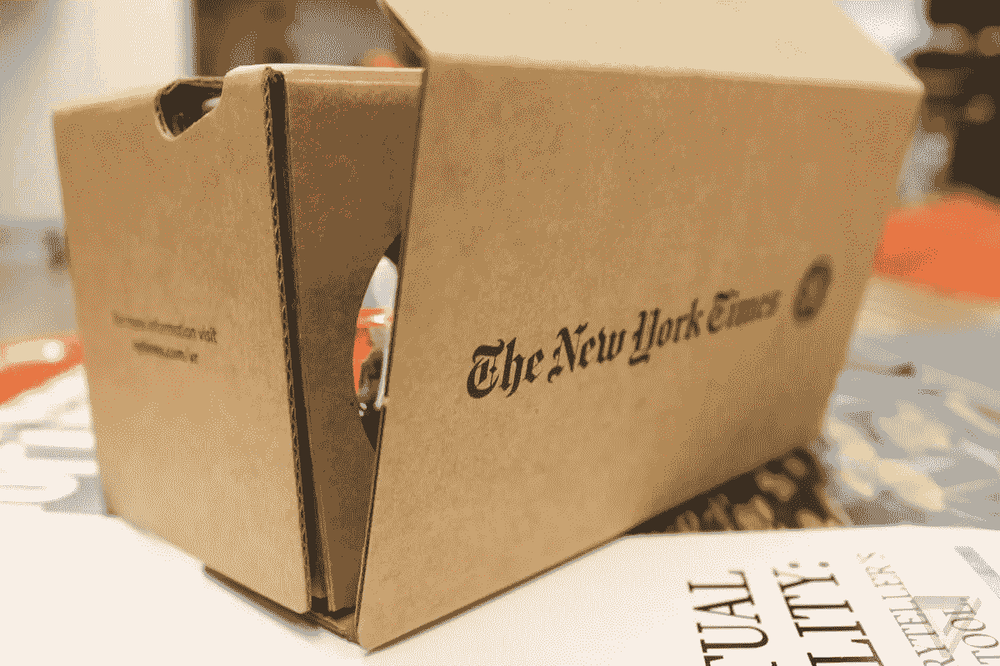
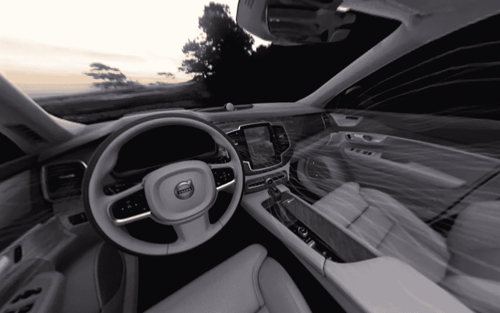
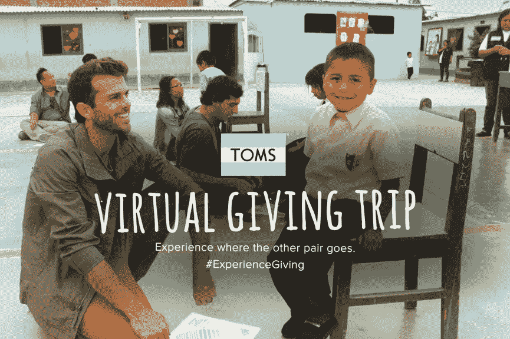
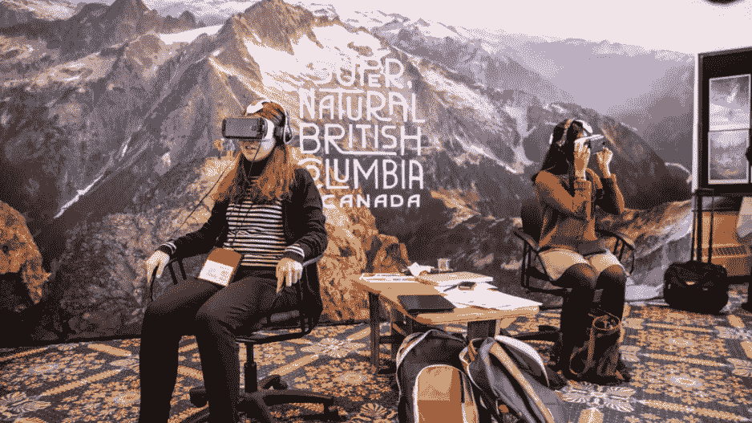

# 5 个惊人的虚拟现实营销活动，将激发你的下一个商业想法

> 原文：<https://medium.com/swlh/5-stunning-vr-marketing-campaigns-that-will-inspire-your-next-business-idea-4f8402598ce0>

## 窃取这些疯狂的创意营销想法，从人群中脱颖而出。

事实是，如果没有令人惊叹或原创的东西，大多数营销和推广都不起作用。

以付费展示广告为例:只有 0.6%的人会真正点击它们(这是根据谷歌的说法，谷歌在游戏中有很多皮肤)。说到赞助内容，我知道我不是唯一一个不停滚动的人。简单地说，大多数广告都播放完了，我们宁愿盯着一堵砖墙或一个静音的屏幕，也不愿被它们轰炸。

另一方面，成功脱颖而出的创意广告可能会非常有效——就像上一届超级碗的潮牌广告[让互联网赞不绝口](https://www.reddit.com/r/videos/comments/7vbv3n/all_of_tides_brilliant_superbowl_ads/)。

我已经写了虚拟现实[如何很有可能彻底改变营销](https://www.thinkwithgoogle.com/intl/en-gb/tools/)，所以，在这篇文章中，我想分享一些伟大的活动，这些活动将激励你创作交付的广告。(即使你还没有使用 VR，前面也有一些外卖和大量的灵感。)

# 1.《纽约时报》——虚拟现实直达你的家门口

虚拟现实是讲述(和体验)故事的绝佳方式。然而，有很多人没有虚拟现实设备，或者认为购买虚拟现实设备非常昂贵。

制作[惊人的虚拟现实新闻](http://www.nytimes.com/marketing/nytvr/)的《纽约时报》通过向其订户发送谷歌纸板护目镜(试着说快 5 倍)解决了这个问题[。纸板产品(售价约 10 美元)允许任何人通过智能手机观看 NYT 的虚拟现实，这极大地促进了他们的虚拟现实新闻的需求和观众。](https://www.theverge.com/2016/4/28/11504932/new-york-times-vr-google-cardboard-seeking-plutos-frigid-heart)

NYT 的绝妙想法正显示了便捷的情绪传递对你的业务的重大影响。

# 2) **考斯特博物馆的虚拟现实商品**

虚拟现实正在艺术界引起轰动，而且不仅限于艺术本身。

看看考斯特博物馆就知道了。因为它位于沙特阿拉伯，所以对我来说(和其他美国人一起)参观它是一次长途跋涉。幸运的是，如果你不能赶上飞机，你可以得到他们的“Viewseum”——一个一体化的虚拟现实套件，让你在沙发上探索博物馆。更好的是，那些参观博物馆并购买产品作为礼物的人成为了博物馆的大使和倡导者。

要点:即使你不做虚拟现实，也可以考虑与你的品牌相关的赠品——这将把你的客户转变为福音传播者。

# **3)** **沃尔沃——从你的客厅“驾驶”汽车**

我们大多数人都想在买车之前亲自驾驶、感受和体验一辆车。然而，如果你和我一样，你也不会想把有限的业余时间花在和汽车销售人员打交道上。

看看沃尔沃最近的活动就知道了，它允许你使用智能手机和谷歌 Carboard“驾驶”汽车。当他们将它用于沃尔沃 V40 车型时，仅两天内就销售一空。

事实证明，品牌背后的图标(气味、味道或一般体验)会强烈地推动购买决策。想想:麦当劳薯条的味道。如果你能找到一种方法把它传递给客户，你就会有一个价值百万美元的想法。

# 4)TOMS——见证你的慈善行动

TOMS 因其使命而闻名，即把顾客购买的鞋子与给有需要的孩子的赠品相匹配。它不仅对人类有益，也是一种强有力的情感营销工具。他们通过推出虚拟现实体验来增强对双方的影响，虚拟现实体验实际上显示了配对的鞋子去了哪里，以及它们如何帮助当地社区。

TOMS 创始人 Blake Mycoskie 表示，这带来了客户的积极好评，并将在未来的沟通中发挥重要作用。

正如 Vrse 的克里斯·米尔克在他的 TED 演讲中解释的那样，虚拟现实可以成为“终极移情机器”。同理心(当道德和正确使用时)是最终的营销和商业工具之一。如果你的品牌背后没有意义、故事和使命，谁会在意呢？

# 5)不列颠哥伦比亚省——虚拟旅游发展迅猛

我们生活在一个[体验经济](/writers-guild/will-virtual-reality-will-save-the-art-world-cec6c3678739)——人们重视事件并分享它们(甚至超过产品本身)。所以通过这种方法，VR 被当作一种强有力的工具来销售也就不足为奇了。

不列颠哥伦比亚省利用这一优势，允许潜在游客在家以身临其境的方式体验自然奇观(并与朋友分享体验)。结果旅游业飞速发展。[点击这里，亲自体验一下。](https://www.destinationbc.ca/News/Local/Destination-BC-Creates-The-Wild-Within-VR-Experien.aspx#.Wt9SfMgvw2w)

想为你的企业增压吗？通过一种身临其境的情感工具，创造一种相似的体验，在理解和购买之间架起一座桥梁。

底线:这些例子表明，创意和情感营销可以产生重大影响。说到营销自己，不要害怕跳出框框；结果可能会让你吃惊。

## 行动号召:

在[LTProject.com](http://www.ltproject.com)了解更多关于虚拟现实和营销的信息。如果您对 VR 如何用于营销有任何见解，请在那里联系我或给我留下评论！

## 这篇文章发表在[《创业](https://medium.com/swlh)》上，这是 Medium 最大的创业刊物，有 318，983+人关注。

## 订阅接收[我们的头条新闻](http://growthsupply.com/the-startup-newsletter/)。

