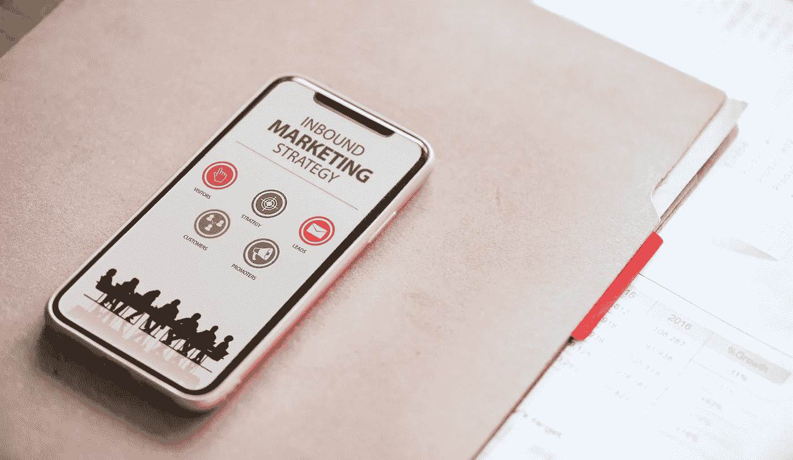

# 程序员应该知道的关于营销人员的 5 件事

> 原文：<https://medium.com/swlh/5-things-programmers-should-know-about-marketers-817f5dda2ee>

## 在与这两个团队都进行了大量的工作之后，他们似乎有很多地方都不了解对方。

我的职业生涯始于网页设计和开发，在我意识到我并不像我想象的那样喜欢这份工作之前，我为许多客户建立了网页“体验”。所以，我转而成为了一名营销人员。

尽管如此，我仍然和程序员一起工作。在我工作过的企业中，他们通常是最渴望学习市场营销的人，并且最终已经掌握了最多的市场营销知识。

他们也最容易对营销人员感到失望，尤其是当我们中的一个人因为一些营销原因搞砸了他们的工作。

为什么？很可能是因为这两种类型的工作有着根本的区别，如果你用一种方式来看待这个世界，你就会用这种方式来看待一切。

所以，如果有 5 件事是我希望每个程序员都知道的，那就是…

1.  市场营销比修复 bug 之类的事情更难安排。虽然你可以为你的活动和费用计时，但你不能为你的回应计时。每个部分都包含了人和情感。
2.  编程是理性的，营销不是。一行代码每次都会执行相同的内容，而市场营销则相反——做得越多，效果越差。
3.  不像一般的程序员，一般的营销人员有时只是运气好。
4.  没有营销，你的工作对不了解它的世界其他人来说一文不值。营销是告诉每个人它所提供的价值。
5.  仅仅因为一些营销人员很糟糕并不意味着所有的营销人员都很糟糕。也不是所有的程序员都很棒，所以要有耐心。

## 想和我免费聊 30 分钟营销策略吗？[在我的日历上安排一个时间](https://calendly.com/alexdriddle/consult/)！如果你喜欢我的作品，请在[推特](https://twitter.com/AlexDRiddle)或[媒体](/@AlexDRiddle)上关注我，别忘了点击那个鼓掌按钮。

## 这篇文章发表在 [The Startup](https://medium.com/swlh) 上，这是 Medium 最大的创业刊物，有 303，461+人关注。

## 在这里订阅接收[我们的头条新闻](http://growthsupply.com/the-startup-newsletter/)。

