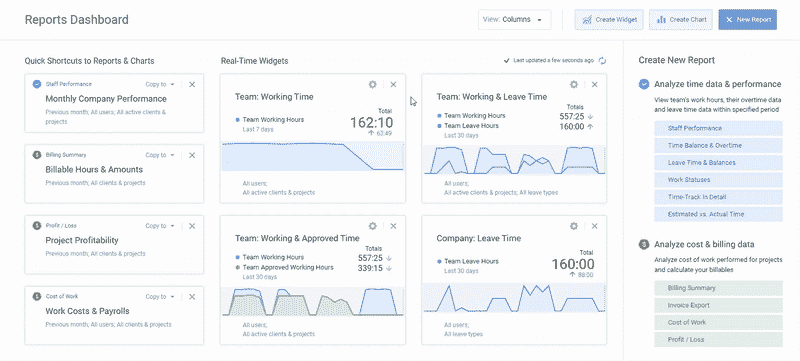

# 改善团队时间管理的 5 件事

> 原文：<https://medium.com/swlh/5-things-to-improve-time-management-within-a-team-7c39a8ffc87e>

任何建立团队的中层管理者都知道在工作场所提高生产率的艰难。很难激励员工尽最大努力，了解他们的时间管理技能，并获得如何改善团队内部时间管理的见解。幸运的是，忙碌的企业家和团队经理可以做一些实际的事情，不仅可以提高他们的个人生产力和组织能力，还可以让他们的团队共同繁荣。让我们看看怎么做。

# 1.记录您团队的时间

确保跟踪团队的时间开销，并为此选择合适的工具。有时候，追踪时间花费了太多的时间，这破坏了这个想法。

因此，如果你想更有效地管理一个团队，你需要一个高效的工具。它可以在多个方面提升您的业务:从管理工作分配和跟踪时间到运行报告和分析报告，这样您就可以发现弱点并进行修改。

*Reports dashboard in* [*actiTIME*](https://www.actitime.com/) *— set up real-time data widgets
and add report shortcuts for quick access*

专业化产品最大的好处在于，它能让你看到每个人都在做什么，简化工资计算，并按时交付项目。该工具可以适应您的工作流程，并用于削减业务成本。

不过，所有这一切的一个方面可能有点挑战性:人们通常不愿意采用新工具。让我们看看如何正确地做这件事，这样你和你的团队就可以事半功倍地提高工作效率。

# 2.适应新技术，并在这方面帮助您的员工

很容易介绍新的软件产品，给人们一些说明，让他们从第一天开始使用它。但这并不总是有效的:帮助登机往往是必要的。

要正确地做到这一点，消除职场人士对新奇事物的冲击，就要循序渐进。详细指导你的员工如何使用该工具。此外，关注每个团队成员将会看到的好处。

别忘了自己也是个活跃用户。你的员工不会采用一项你似乎不喜欢的技术。

专家说，更好的时间管理的第一步是准确知道我们的时间花在哪里。现在你可以实现这一目标，并带领你的团队踏上征程。

# 3.回顾你的管理实践

如果你想在竞争中领先一步，成长为一名经理，你需要后退一步，看看你的实践是否真正有效。这需要回顾你的管理技巧，与同事和工人交谈并获得反馈，并做笔记。

之后，花几天时间概述你作为经理的当前习惯和做法，集思广益，找出可以改变的地方。也许是时候改变一下方向了。或者也许有新人加入或者进入一个新的领域意味着你必须建立新的技能或者继续你的培训。

不仅如此，你还应该考虑到公司各个层次的管理层。他们也可以经历这个过程。这确保了每个部门都有最新的项目管理、文化公司、协作和激励计划。

# 4.减少管理工作量

有了智能的时间管理技术，人们可以在更短的时间内完成工作。负责整个团队的忙碌的企业家也是如此。当你真正实现你所追求的进步时，你可以找到减少管理的方法。

管得太多有什么不好？那就是你没有给团队成员足够的授权或指导。

管理本身占用了你很大一部分时间。但是，激励你的团队完成更多工作，通过培训帮助员工建立新技能，发现新人才并让他们加入，以及做出重大决策的愿望呢？

重新开始做所有这些事情的唯一方法是减少管理层的忙碌。

有一件事可以帮助你实现这个目标，那就是不要对你的员工期望太高，而是专注于承担项目准备阶段的责任。

# 5.实施远程工作实践

多项研究表明，远程人才是未来的发展方向，原因有很多。远程员工是那些在工作和个人生活之间找到平衡，并且对自己的生活方式非常满意的人。

这正是你所需要的——开会时的笑脸。这样的人精力充沛，但有动力做好工作，同时又足够自律。

如果你还没有，让更多的远程工作者加入你的团队。这让你可以从全球范围内选择一些充满激情和努力工作的人，而不是受到地点的限制。

一旦你的团队中有了更多这样的人，在培训期结束后，你就可以将项目的所有方面委派给他们，让他们做自己擅长的事情。

这让你有更多的时间专注于重要的事情，如业务增长。

任何忙碌的企业家都不应该以压力告终，或者忘记他们要对一个团队负责。遵循上面的建议，做一个懂得如何管理自己时间的高效员工经理。

## 这个故事发表在[的创业](https://medium.com/swlh)上，这是 Medium 最大的创业刊物，有 320，924+人关注。

## 订阅接收[我们的头条新闻](http://growthsupply.com/the-startup-newsletter/)。

