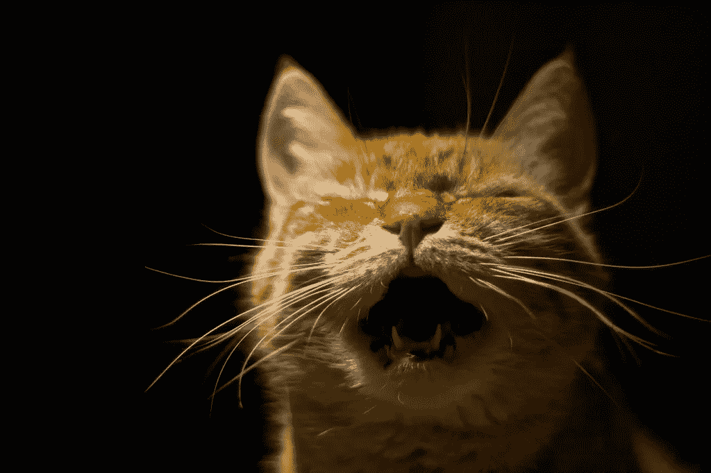

# 永远不要对自由撰稿人说的 5 件事

> 原文：<https://medium.com/swlh/5-things-to-never-say-to-a-freelance-writer-8916e8c12091>

“[Scream](https://www.flickr.com/photos/mjhagen/2973212926/)” Flickr photo by [Mingo Hagen](https://www.flickr.com/photos/mjhagen/) shared under a [Creative Commons (BY) license](https://creativecommons.org/licenses/by/2.0/).

成为自由作家是我做过的最好的职业决定。离开公司生活成为自己的老板已经五年了，我从来没有后悔过。

拥有选择自己的项目和在任何我想去的地方工作的自由就像听起来一样棒，所以我每天都感到非常幸运。