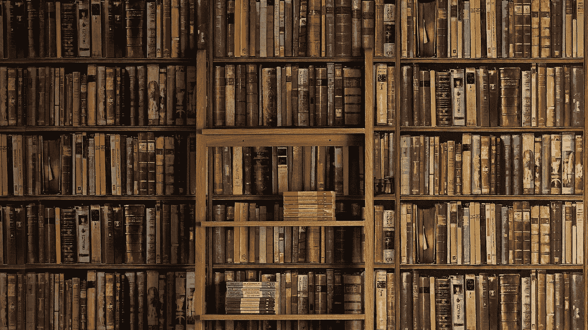

# 我们可以从“工作中不要为小事操心”中学到的 5 件事

> 原文：<https://medium.com/swlh/5-things-we-can-learn-from-dont-sweat-small-stuff-at-work-827b08cd59d>

Books

理查德·卡尔森的第一本书*不要为小事而烦恼*给我的个人生活和职业生涯带来了很多好处。我们如何与他人互动，如何成为一个好的倾听者，如何处理有压力的情况等等。

我最近读了理查德·卡尔森的另一本好书，名为 ***不要为工作中的小事而烦恼*** 。这本书关注的是职场中的个人发展。就像上一本书一样，这一本他写了 100 分。

谈到工作场所，千禧一代有一个超级独特的特点。大多数千禧一代倾向于抱怨，感到失望，并在工作场所没有他们预期的那么酷时离开。

这本书为我们提供了一个故事，可以激励我们这些千禧一代更好地了解职场。当我读这本书时，我发现了五个重要的章节。

# **1 停止预测疲劳**

> “OMG，明天已经是星期一了，我需要做报告，做月度报告和参加会议”，“这是一个超级忙的一周，我只能睡 3 个小时！”。

我们听到很多这样的抱怨，来自我们的同事，甚至来自我们自己。

以这种方式或任何方式预测疲劳的问题是，它显然会加剧疲劳。它将我们的注意力转移到我们睡眠的时间和我们会有多累。

我们不需要不断提醒自己，我们会超级累，我们每天只会睡 3 个小时。

如果我们有很多事情要做，把它们列下来，一件一件去做；如果我们睡眠不足，尽可能多睡一会儿(网飞系列真的那么重要吗？).有了这个，我们将会有更好的一天和一周。

# 点燃一支蜡烛，而不是诅咒黑暗

顾名思义，这种策略包括采取积极的、以解决问题为导向的(不管多小)态度来改善情况，而不是抱怨哪里出了问题。

这意味着寻找解决方案，而不是提醒或强化问题。

在我的公司，每周五我们都会进行匿名调查。调查的目的是让每个人表达他们对公司的看法、抱怨、意见或对公司的赞赏。

每周五，在团队会议上，人力资源团队将大声朗读调查，高层管理人员必须回答每一个问题。

一些问题包括:

为什么我们没有太多的文化或宗教庆祝活动

*“为什么我们不能让我们的办公室看起来更漂亮，更有趣？”*

一位高层人士给出了答案:

## ***“与其抱怨我们所缺少的，你为什么不参与进来，做志愿者，让办公室变得更漂亮，更有趣呢？”***

如果我们看到我们公司出现了问题，我们不应该诅咒现状，而应该采取行动改变它。如果办公室太无聊，你为什么不发起一个有趣的活动呢？停止抱怨，开始行动吧！

# **3 不要为要求苛刻的老板流汗**

苛求的人的真相是(通常)他们对每个人都苛求。换句话说，不是针对个人的。问题是，我们认为苛求的先生或夫人是“想要得到我”。

与其抱怨他或她的态度，不如试着偷着从他们身上学到一些好的东西。我们需要改变处理这类人的方式。

我们可以试着打开自己，去理解他们想教给我们的东西，不要把他们的行为当成是针对自己的。

最好在早期学习，这样以后当我们拥有自己的公司时，我们就知道如何与我们的员工、客户以及投资者打交道。

有了这项技能，我们将不再像过去那样敌对和防御。学习需要时间，但是这个技能是值得的。

# 记住这句格言，“用蜂蜜可以抓到更多的苍蝇”

当我们善良、有爱心、有耐心时——当我们是公平、好的倾听者时，当我们真诚地关心他人时——我们的态度会体现在我们所做的每一件事上。

因此，人们喜欢和我们在一起，分享他们的成功秘诀，并想尽一切可能帮助你。

这并不难做到——一个简单的行为，比如向需要帮助的人提供帮助，说“**早上好**”，主动提出一起出去吃午饭，当你的同事分享故事时，做一个好的倾听者。

# 放松你的自我

这是这本书最有趣的部分之一，谈论我们的自我。

自我是我们自吹自擂、夸大、批评和评判他人(以及我们自己)的部分。

自我非常以自我为中心，就好像它需要大喊:“看着我！!"

因为自我是如此的自我专注和自私，它鼓励我们失去对他人的同情和兴趣。

例如，当我们在一个团队中做一个项目时，一个人负责一个部分，每个部分都有自己的目标。

自我会强迫我们说“嘿，我的部门是最棒的！ ”。从自我的角度来看，如果我们表现不好，我们得不到别人的关注，自我也会让我们感到紧张。

从现在开始，每当我们处于“证明模式”时，试着去感受投入了多少精力。

你会觉得超级累，因为自我流失这么多，为了什么？！

放松我们的自我会有很多收获

首先，我们会觉得好像卸下了一个巨大的负担。我之前说过，处于“证明模式”需要付出很多努力和精力。

第二，我们会对其他人更感兴趣。正如理查德·卡尔森在他的书中所说，我们将更好地倾听，成为更好的朋友，变得更加慷慨。

理查德·卡尔森还写了其他 95 章。但是，仅仅从这五点，我们就可以了解到很多关于工作生活的事情。

# 在你走之前！

*   我是吉隆坡的一名内容营销人员。如果我能为你做些什么，请在 LinkedIn 上联系我
*   如果你想为你的下一个内容营销寻找一些灵感， [**在这里查看我的最新文章**](https://www.linkedin.com/pulse/iprices-content-marketing-showcase-andrew-prasatya/) 。我们制作了 100 多份数据驱动的研究报告&，获得了 1000 多家顶级媒体的报道，包括路透社、福布斯和 Business Insider。

## 这篇文章发表在 [The Startup](https://medium.com/swlh) 上，这是 Medium 最大的创业刊物，有 343，876 人关注。

## 订阅接收[我们的头条新闻](http://growthsupply.com/the-startup-newsletter/)。

