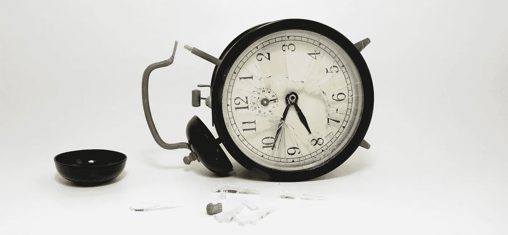

# 限制你潜力的 5 个浪费时间的习惯

> 原文：<https://medium.com/swlh/5-time-wasting-habits-that-limit-your-potential-f4fb8e105d8b>

为了在生活和事业上获得成功，你需要学会珍惜时间。

有几个名字每个月都会出现在我的收件箱里。我保证他们会问我是否想边吃边聊，喝一杯，让他们看起来像是在谈生意。

任何稍微了解我的人都知道我只关心生意，甚至只是一般的社交。但是有一件事最让我恼火，那就是人们只是在浪费我的时间。他们可能会谈论希望一起工作，或者为什么他们的团队和我的团队会合作得很好，但最终没有达成任何交易，也没有签署任何文件。

那我带着什么离开呢？也许是一次愉快的谈话，让我的一些希望落空，把我本可以用在其他地方的几个小时的时间扔出窗外。

# 时间不仅仅是流逝的每一分钟

我记得读过一些关于时间主题的非常深刻的东西，它完全改变了我的生活。

它说，“时间是唯一不能继承、窃取或借用的东西。”

我把它应用到我生活的方方面面。上大学时，我创办了自己的第一家公司和一个全国公认的致力于大学生心理健康的[基金会](https://www.jedfoundation.org/)。我去了美国排名第一的党校，并且是这个国家最大的兄弟会之一的主席。

怎么会？

我把时间投资在我知道会有回报的地方。

我们所做的决定，以及我们选择如何投入时间，必须对我们有益，才能推动我们前进。我必须知道，把时间花在一个从未完成交易的人身上不会帮助我得到我想要的业务。我必须知道，把我所有的时间都花在事业刚刚起步的人身上，对我成为我所敬仰的领导者没有多大帮助。

在营销行业工作时，我注意到五个浪费时间的习惯，它们阻碍了大多数人发挥他们的真正潜力。

# 1.接受浪费的会议。

就像我之前分享的，人们总是想要安排会议。这让他们觉得更有效率，但是如果没有任何收获，那就只是浪费时间。在步入会议之前，在你浪费时间谈论可能会发生什么或可能会发生什么之前，知道你将会遇到什么。

# 2.留住糟糕的员工。

除掉坏人可能比引进优秀人才更重要。如果你不能很快让错误的人离开，你只做了一半的工作。这听起来像是一个合理的解释，但如果你早点做出决定，让他们走，很可能是在帮这个员工的忙。它可以对参与的每个人都有利，没有恶意。

# 3.维持有害的客户关系。

哦，你知道，“不劳而获”的客户。

裁掉那些总想要东西却不付钱的客户。那些不重视你所提供的，并不断质疑你的价格。如果他们现在不重视你，他们永远也不会重视你，你会不断地证明你所做的工作是有价值的，不管它有多廉价。

放开他们。给他们点颜色看看。告诉他们再见，不要回头。只与欣赏你价值的客户合作。

# 4.试图找到捷径。

我们被训练去寻找捷径。复制粘贴，剽窃，再利用，略读，等等。但是根据我的经验，捷径总是导致失败的项目和不愉快的客户。

希望有人能发现快捷方式中固有的错误，并让你改正它，或者从头开始。你花在纠正错误上的时间比你走捷径节省下来的时间还要多；如果是世卫组织的客户发现了这些错误，不仅会耗费你的时间和金钱，还会失去他们的尊重和信任。

# 5."即兴发挥"

你带着计划来办公室吗？你那天或一周有日程安排吗？你知道你今天需要处理哪些项目，按什么顺序处理吗？

如果没有，那么恭喜你:你正在“即兴发挥”。

“即兴表演”的意思是在没有行动计划的情况下进入任何状态。当你“即兴”安排你的一天时，你会被拉进每一个会议，你通常会回复每一个电话。

通过计划你的优先事项来开始你的一天，你不会浪费时间，而且你知道哪些项目是优先的；不仅最重要的任务会先完成，而且你还能完成更多的任务，因为你不会浪费太多时间去半途而废。

[*本文原载于 Inc 杂志。*](https://www.inc.com/ron-gibori/5-habits-to-double-your-productivity-in-half-time.html)

感谢阅读！:)如果你喜欢，请点击下面的心形按钮。对我来说意义重大，也有助于其他人了解这个故事。

**在**上打招呼

[**Quora**](https://www.quora.com/profile/Ron-Gibori-1)**|**[**insta gram**](https://www.instagram.com/rgibori/)**|**[**LinkedIn**](https://www.linkedin.com/in/rongibori/)**|**[**Twitter**](https://twitter.com/rongibori)**|**[**Inc 杂志**](https://www.inc.com/author/ron-gibori) **|** [**网站**](http://www.idea-booth.com)

如果你喜欢这个故事，请点击👏按钮并分享，帮助其他人找到它！欢迎在下方留言评论。

## 这个故事发表在 [The Startup](https://medium.com/swlh) 上，这是 Medium 最大的企业家出版物，拥有 270，416+人。

## 在这里订阅接收[我们的头条新闻](http://growthsupply.com/the-startup-newsletter/)。

