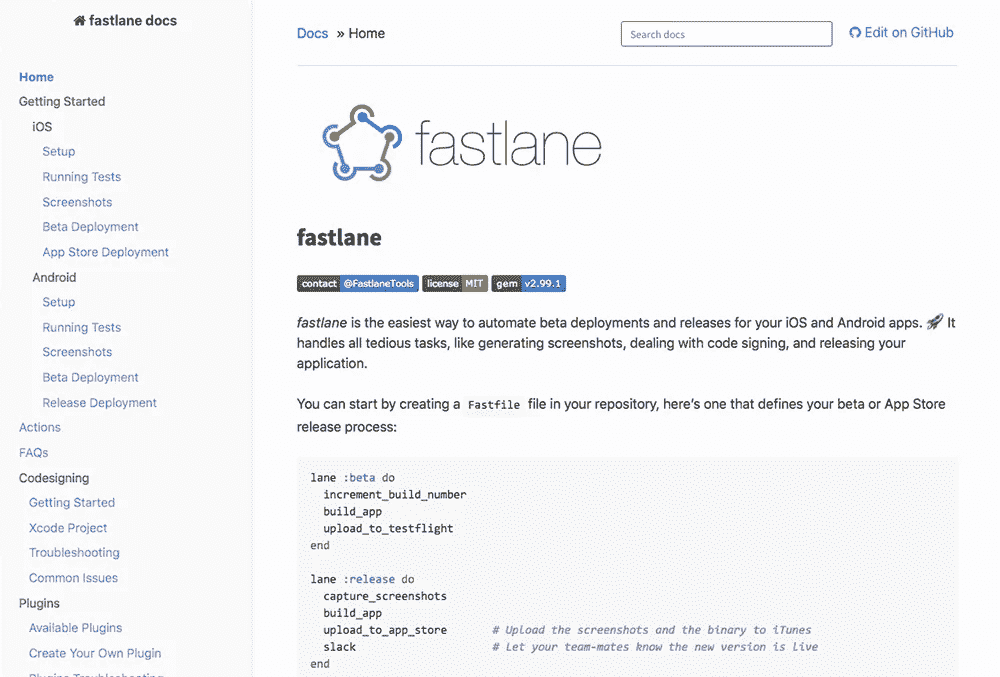

# 加速应用开发的 5 种工具

> 原文：<https://medium.com/swlh/5-tools-to-speed-up-your-app-development-6979d0e49e34>

***由赖因德创立***

*构建一个应用程序是一个高成本、高强度的过程，无论是在时间上还是在财力上。有时候你没有预算来开发一个昂贵的应用，或者你需要快速进入市场来抓住机会。你应该削减应用程序的功能，还是寻找其他地方来加快应用程序的开发过程？*

*在这篇文章中，我们将看看 5 种不同的工具，你可以用它们来加速你的应用程序开发过程。这是有利有弊的:你可以降低开发应用的成本，同时更快地发布应用。*

*我们将检验的大多数工具也帮助您加速项目的迭代。以 fastlane 为例，它自动化了手动应用程序部署任务，因此您可以缩短发布周期，并将更多时间用于修复错误和实现功能。*

*让我们开始吧！*

# *1.[解析服务器](https://parseplatform.org/)*

**

*我们要看的第一个工具是[解析服务器](https://parseplatform.org/)。这是一个开源的云后端，有大量的附加服务，如数据库、推送通知、文件存储和用户管理。*

*它是这样工作的:*

*   *在流行的平台即服务(PaaS)上创建一个解析服务器的实例，如 [Heroku](https://www.heroku.com/)*
*   *将您的解析服务器实例连接到一个流行的数据库即服务(DaaS ),如 [mLab](https://mlab.com/)*
*   *将您的应用程序与新的 Parse Server 实例集成，并开始使用它的一些工具*
*   *利润！现在，您拥有了一个成熟的基于云的后端服务。*

*Parse Server 是 2017 年初关闭的已故 Parse 服务的再生。Parse Server 不像 Parse 那样为你提供现成的服务，而是让你推出自己定制的基于云的后端。*

*它是开源的，你可以在许多基础设施提供商上设置你的解析服务器实例，比如 [AWS](https://aws.amazon.com/) 、 [Heroku](https://www.heroku.com/) 、[谷歌应用引擎](https://cloud.google.com/appengine/)、 [Azure](https://azure.microsoft.com/en-us/) 和[数字海洋](https://www.digitalocean.com/)。*

*Parse Server 连接了许多对应用程序开发人员有用的后端工具，如推送通知和文件存储。对于这些服务中的每一项，你可能都需要另一个服务提供商，比如亚马逊 S3 或 T2 one signal。虽然这些工具很棒，但是需要几个服务提供商会使您的设置和维护工作变得复杂。Parse Server 不像其他平台那样是一体化的。*

*Parse Server 的一大特色是云功能。使用 JavaScript，您可以编写简单的任务，只要 Parse Server 中的事件被触发，就可以执行这些任务，比如上传文件或存储数据库对象。*

*假设你有一个电影推荐应用，比如 IMDB。当用户创建一个电影评论时，您可以使用服务器端脚本挂钩到该事件，并向该用户的追随者发送推送通知，通知他们新的评论。*

*有了 Parse Server，应用程序开发人员花在构建后端服务和维护 web 服务器上的时间更少，而花在构建应用程序和功能上的时间更多。它是可扩展的、可负担的、相对容易维护的、可定制的，并且带有大量有用的内置工具。*

***优点***

*   *支持大量平台，包括物联网*
*   *优秀的文档和示例代码*
*   *活跃的开源社区*

***缺点***

*   *需要一个独立的平台来运行，比如 Heroku*
*   *扩展选项取决于基础架构*
*   *它不是全能的*

***定价***

*开源且免费，但是你需要像 Heroku 这样的基础设施来运行 Parse Server。一个简单的设置大约每月 20 美元。*

***平台***

*iOS，macOS，tvOS，Android，JavaScript，React，。NET，Unity，PHP，Arduino，嵌入式 C*

# *2.[浪子](https://fastlane.tools/)*

**

*[fastlane](https://fastlane.tools/) 是一个专注于*持续集成*和*持续部署* (CI/CD)的工具。这是一种奇特的说法:每当你创建一个新的应用程序版本，它会自动推送到最终用户或测试人员那里。fastlane 通过自动化工具和流程支持您的工作流程。*

*想象一下，你做了一个应用程序，你刚刚在应用商店发布了 1.0 版本。几周后，你发现并修复了一些错误，并实现了一个新的应用程序功能。你想把你的应用程序的改进版本 1.1 分发给 beta 测试人员，然后把它推广给每个用户。*

*你应该这么做:*

*   *您创建一个新版本，并在 App Store Connect 中发布它*
*   *您可以为每个设备型号手动制作新的应用截图*
*   *你更新你的应用程序的元数据，截图等。*
*   *你用 TestFlight 把测试版本推给测试人员*

*作为一个单人开发者，这是可以管理的。但是想象一下你在一个分布式团队中工作。你可以同时使用多个版本的应用程序——包含修复的当前版本，以及包含新功能的“2.0”版本。或者你每隔一两周就会推出应用更新。*

*您会看到应用程序的部署及其手动任务会占用相当多的时间！必须有一种方法来加速和自动化这一过程…*

*这就是快车道发挥作用的地方。当每个人的应用都被卡在 QA 和正在度假的首席开发人员之间时，你的应用却在快车道上飞驰。*

*fastlane 是这样做的:*

*   *为多种设备型号和语言自动创建应用程序屏幕截图*
*   *自动分发应用测试版，如设置版本、管理代码签名、上传应用和记录应用更改*
*   *自动化应用发布工作流程，如设置元数据、上传截图和提交应用进行审核*
*   *在您的团队中自动进行代码签名，即在您团队的开发人员之间私下共享开发密钥和证书*

*本质上，fastlane 由一系列操作组成，如上传应用程序版本，以及连接多个操作的工作流。每一个动作都是脚本化的，这意味着你可以按照你认为合适的方式定制它们。fastlane 集成了最流行的 CI/CD 工具，如 CircleCI、Jenkins 和 Travis CI。*

*最棒的是。是开源的！这意味着开发者可以为这个工具做出贡献，构建他们自己的动作和插件。每个 fastlane 工具都有详细的文档记录，包括示例和最佳实践，这使得它成为每个应用程序开发人员工具箱中的必备工具。*

***优点***

*   *为您节省大量时间*
*   *自动化繁琐的任务*
*   *通过减少手动操作来避免错误*

***缺点***

*   *需要一些努力来设置*
*   *对于单独的开发人员或不经常的构建来说，这是多余的*

***定价***

*免费开源！*

***平台***

*iOS 和 Android*

# *3.应用程序设计模板*

**

*你的应用程序的设计很重要。在 App Store 排名中，你会不断看到设计良好的应用程序比同等的设计不良的应用程序排名更高。*

*您的应用程序用户比以往任何时候都更关心良好的用户体验。我们安装更少的应用程序，花更多的时间在我们熟悉的应用程序上。一方面，用户不太愿意用一个不了解的 app 去冒险。另一方面，应用开发者有机会凭借无可挑剔的设计、UI/UX 和品牌脱颖而出。*

*听起来不错，对吧？嗯，没那么快！从头开始设计一个应用程序需要大量的时间、金钱和资源。也许你的内部设计师没有太多设计移动应用的经验，或者你的精简和吝啬的应用原型的预算只占了适度的图形设计。*

*这就是设计模板的用武之地。设计模板只不过是为你的应用程序预先设计的现成图形。你可以采用你喜欢的组件和风格，或者简单地复制粘贴整个图形设计。*

*我们最喜欢的设计模板包括:*

*   *[现在](https://www.invisionapp.com/now)、[和](https://www.invisionapp.com/tethr)、[通过视觉做](https://www.invisionapp.com/do)*
*   *来自脸书的 iOS 11 iPhone GUI*
*   *拜安纳特公司的 Stark UI 套件*
*   *莉娜·塞列兹尼奥娃缝制*
*   *阿德里安·奇兰的《凤凰城》*
*   *迈克尔·弗拉鲁普的[应用像素](https://applypixels.com/)*

*许多设计模板是专门为特定类型的应用程序制作的，如社交、生产力或电子商务应用程序。你也可以使用这些图形设计模板来创建你的应用模型。*

*你可以使用脸书的 iOS GUI 模板，使用默认的 iOS 布局和组件，创建 1 对 1 的应用模型。来自 [Apply Pixels](https://applypixels.com/) 的模板可以帮助你设计应用图标和截图，甚至可以在你的应用商店页面上展示它们的外观。*

*使用设计模板时，请确保检查其许可和使用条款。一个应用程序设计模板可能是免费的，但这并不意味着你可以自动使用它，改变它或收费。原创作品总是受其创作者的版权保护，所以当有疑问时，不要使用它或要求明确的许可。*

***优点***

*   *节省大量时间和金钱*
*   *价格实惠且通常质量上乘*
*   *大多数模板都是可定制的*

***缺点***

*   *需要时间来定制*
*   *找到你需要的东西需要时间*
*   *许可选项并不总是清晰的*

***定价***

*免费/付费*

***平台***

*任何的*

# *4.[油漆代码](https://www.paintcodeapp.com/)*

**

*第一次看到 [PaintCode](https://www.paintcodeapp.com/) 做它的事情，你会觉得它很神奇！这是一个简单而有效的工具，它非常好地完成了一件事:为可视化设计的 UI 组件生成编程代码。*

*它是这样工作的:*

*   *你用 PaintCode 可视化地设计一个 UI 组件，比如一个按钮*
*   *PaintCode 生成其 Swift、Objective-C、Java、C#、JavaScript 或 SVG 代码*
*   *您在应用程序中使用代码，UI 组件出现在屏幕上*

*传统上，开发人员手工编写代码。创建了一个按钮，设置了它的颜色、文本和边框，按钮显示在应用程序中。这是一个简单的 UI 组件，所以想象一下当组件变得更复杂时要花多少时间。*

*开发人员和设计人员经常不得不在设计人员的意愿和开发人员可以在代码中重新创建这些设计的程度之间进行调解。通过 PaintCode，设计师可以创建外观精美的 UI 组件，并在应用程序中看到这些设计变得栩栩如生。像素完美，零来回，没有坏脾气*“哦不，我做不到！”*来自开发者。*

*PaintCode 将其绘图导出到单个文件中，因此只要更新 UI 组件，您就可以简单地重新导入该文件。您还可以使用参数变量和表达式，例如一次性将颜色底纹更新为新的配色方案。*

*更棒的是……paint code 有一个 Sketch 插件，这是一个流行的图形设计工具。使用该插件，您可以直接将草图导出到 Swift 或 Objective-C。因此，您不必在 PaintCode 中重新创建图纸，而是直接从 Sketch 中导出它们！*

*PaintCode 附带了大量的教程、精心编写的文档和响应支持。*

***优点***

*   *节省时间和来回奔波*
*   *灵活且可定制*
*   *支持 4 大应用平台*

***缺点***

*   *要求精通设计和开发*
*   *一些开发人员不喜欢生成的代码*
*   *对面向界面构建器的工作流的有限支持*

***定价***

*免费试用，1-3 人团队 99 美元/年*

***平台***

*iOS、macOS、Android 和网络*

# *5.牛逼的 iOS 和 Android*

**

*[牛逼](https://github.com/vsouza/awesome-ios)技术上不是工具，而是资源。而且是值得分享的资源！*

*Awesome 是一个应用程序开发的资源、框架、库、课程、书籍、博客、播客、工具和模板的列表。在 GitHub 上简单搜索一下就会发现，从 iOS 到 Swift 到 Android 再到 JavaScript，几乎所有东西都有很棒的列表。*

*我们最喜欢的牛逼榜单是:*

*   *Vinicius Souza 的令人敬畏的 iOS*
*   *[尤尔根·斯顿普的令人敬畏的机器人](https://github.com/JStumpp/awesome-android)*
*   *辛德雷·索胡斯的[令人敬畏的名单列表](https://github.com/sindresorhus/awesome)*

# *进一步阅读*

*你只要站在巨人的肩膀上，就能更快地开发出更好、更赚钱的应用。如果你可以利用现成的工具，为什么要重新发明轮子呢？*

*永远记住[发现并理解](https://learnappmaking.com/how-to-choose-the-right-tech-stack-for-your-app/?utm_source=guest_post&utm_medium=link&utm_campaign=AppSee&utm_term=5_Developer_Tools)这些工具在内部是如何工作的。现在，一个应用程序模板可以加速开发，但是在启动阶段之后，投资一个图形设计师会有回报。*

*构建基于云的后端服务很方便，但在某些情况下，构建自己的 webservice 更明智。更明智的开发人员知道何时使用哪种工具，并且在他的工具箱中有一套不同的工具。*

*话虽如此——不要退缩。正如我们所看到的，快速而聪明的开发过程有很多好处！*

***一旦你构建了你的应用，并且你正在寻找最好的发布后工具，看看这些资源:***

*   *[**2018 年 11 大 iOS 应用分析工具**](https://blog.appsee.com/top-11-ios-app-analytics-tools-in-2018/?cpnid=701b0000000Wd7c&utm_source=medium&utm_medium=link&utm_campaign=learnappmaking_5_tools_speed_up_app_development&utm_content=top_11_ios_analytics_2018)*
*   *[**2018 年十大安卓分析平台**](https://blog.appsee.com/top-10-android-analytics-platforms-2018/?cpnid=701b0000000Wd7c&utm_source=medium&utm_medium=link&utm_campaign=learnappmaking_5_tools_speed_up_app_development&utm_content=top_10_android_analytics_2018)*
*   *[**15 个最佳 iOS 和 Android 推送通知平台**](https://blog.appsee.com/the-15-best-ios-and-android-push-notifications-platforms/?cpnid=701b0000000Wd7c&utm_source=medium&utm_medium=link&utm_campaign=learnappmaking_5_tools_speed_up_app_development&utm_content=15_best_ios_android_push_notifications)*

****

## *这篇文章发表在 [The Startup](https://medium.com/swlh) 上，这是 Medium 最大的创业刊物，拥有+ 378，330 名读者。*

## *在这里订阅接收[我们的头条新闻](http://growthsupply.com/the-startup-newsletter/)。*

**