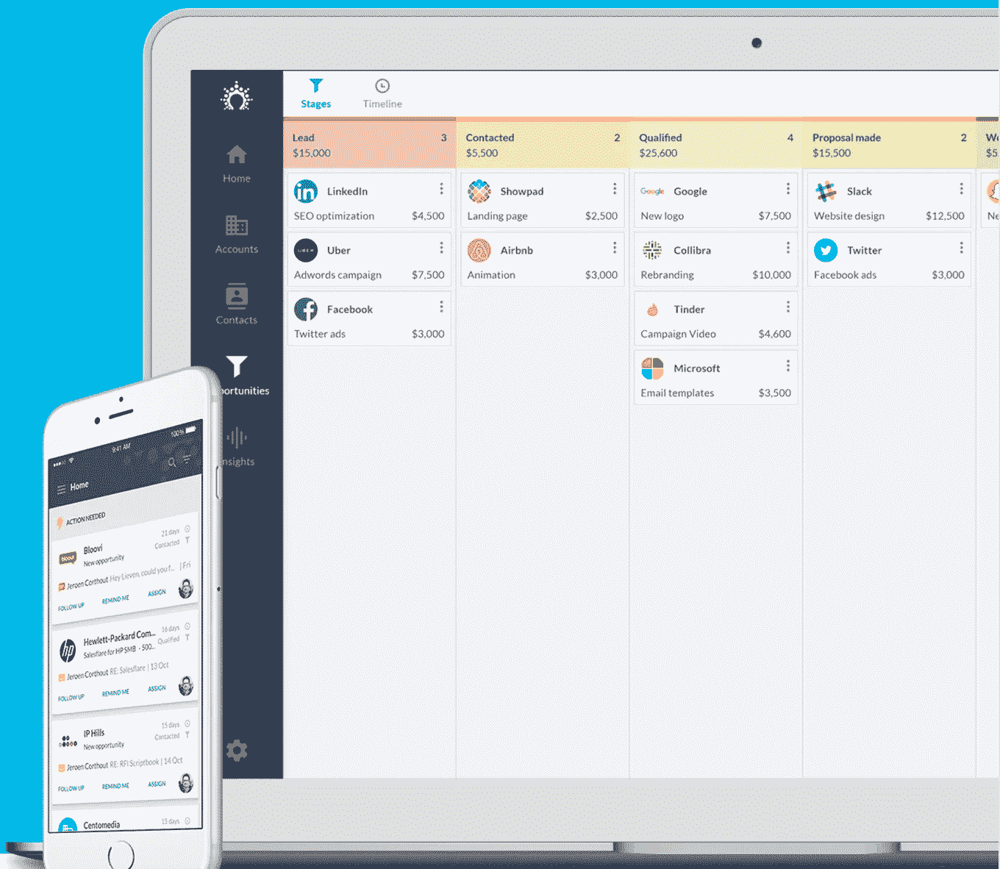

# 我们用来更好地管理公司的 5 种工具

> 原文：<https://medium.com/swlh/5-tools-we-use-to-manage-our-company-better-da48adbe604f>

创业的时候，在公司管理方面没有太多的担心。这个团队很小，你可以很容易地面对面或通过电子邮件交流。如果每个人都知道该做什么，谁会关心项目的组织和管理或者时间报告呢？当你开始从几个人的团队发展到更大的规模时，问题就来了，你意识到由于沟通不畅、没有工作流结构或会计问题，你损失了多少时间。

# 当到了决定你成长速度的时候了…

当你的企业成长时，你会面临很多重要的决定。雇用新员工是一回事，但如果你不创造一个环境或**公司的生态系统**来实现有效的沟通、任务执行或新想法的产生，你将失去你的员工的价值和效率。

> "今天的技术使得自动运行大多数其他不用动脑的任务成为可能."[吉尔·DC，Salesflare](https://blog.salesflare.com/sales-pipelines-101-a9ac1d355eec)

# 逐步实施工具和新的解决方案

重组公司以使其为更快的增长做好准备不是一件容易的事情，但有很多解决方案可以让你的日常工作变得更容易，并可以自动化许多不必要的任务。立即开始使用它们并不明智，但是在真正需要的时候逐步实施它们，无疑有助于企业更快地发展。即使你足够幸运，在没有任何工具的情况下成长，你最终也会面临至少实现其中一些工具的挑战，当你已经雇佣了几十或几百人时，要做到这一点会更加困难。我已经为太多面临这个问题的公司工作过，所以我迫不及待地向你展示 **5 种工具**，你可以用它们来更好地管理你的公司，为更快的发展做准备。

# 1.使用员工计划工具管理工作时间和时间表

如果你是一家初创公司，你可能不需要监控你在每项任务上花了多少时间，也不需要安排工作时间，但要做长远打算！一旦你开始雇佣更多的团队成员，恰当地管理他们的工作就会越来越困难。这不是不信任的问题。它是关于使用关于人们在特定任务上花费多少时间的信息来提高你的业务的整体绩效。这是关于知道你的团队成员什么时候可以提供帮助，而不需要任何书面报告或在电子邮件对话上浪费时间。

> “在当今时代，基于云的技术解决方案是一个很好的选择。这使得可能有其他任务的员工只需看一眼智能手机就能查看自己的日程安排。”[基拉·柯伊克，普兰泰](https://www.planday.com/blog/how-tech-can-improve-employee-satisfaction/)

## [Planday](https://goo.gl/WWgw3q) —云时间跟踪和员工调度工具，帮助您管理小型或大型团队

Planday — employee scheduling, time tracking, leave management

借助 [Planday](https://goo.gl/WWgw3q) ，我们可以轻松地为员工或团队成员创建工作日程。它还可以让我们跟踪花费在特定任务上的时间，所有这些都由移动应用程序支持，因此您可以随时了解您的**团队成员的时间表**的任何变化，或者可以获得任何休假计划或病假的通知。作为工作时间管理的补充，Planday 在其应用程序中提供了一个消息传递工具，因此它也可以用作团队沟通工具。

## 替代方案: [Timecamp](https://goo.gl/Rgos8n) —一个纯粹用于时间追踪的工具

Timecamp 是一个非常简单的工具，专注于一项活动——追踪时间。它能让你监控花在特定活动、项目上的时间，并能自动检测你花在访问特定网站上的时间。如果你想知道你在脸书身上浪费了多少时间，这个问题很有用。

# 2.使用云项目管理工具管理项目和职责

当你的公司开始成为一个重复任务和新项目的结构化集合时，监控进度和划分责任将变得越来越困难。这就是项目管理工具成为必备工具的地方，特别是因为你必须在业务生命周期的早期就开始考虑创建工作流和流程，而不是在一个非常混乱的环境中醒来。

## [团队合作项目](https://goo.gl/WffYyk) —一个先进的、可扩展的项目管理工具，帮助您管理计划和职责

Teamwork Projects — managing projects, milestones, responsibilities

[团队合作](https://goo.gl/WffYyk)是管理项目的一个非常实用的工具，因为它使您能够创建和管理特定的任务，分配团队成员或附加必要的文件。然而，它不仅仅是项目管理，因为它可以让你创建**详细的图表和报告**，并通过社交体验增强你的项目，在公司的新闻仪表板上显示你的团队成员在做什么。团队合作有内置的时间跟踪工具，所以你也将知道你花了多少时间在特定的任务上。

> “团队合作项目提供了出色的项目管理支持，包括大量工具、易于使用的设计和可靠的功能。”吉尔·E·达菲，pcmag.com

**备选:** [**特雷罗**](https://goo.gl/MsNoUJ) **—可能是最流行、最简单、最免费的项目管理工具**

Trello 是一个你们大多数人可能都知道的工具。它简洁、简单、直接，如果你不在项目管理过程中寻找更高级的功能，它可能就足够了。

# 3.使用云 CRM 工具在一个地方管理您的联系人和销售

不管你经营的是互联网、电子商务还是服务行业，你都应该跟踪你的客户、联系人和销售额。这就是为什么 CRM(客户关系管理)工具被创造出来，帮助你存储、分享和管理你的客户，并构建你接近新客户的方式，试图销售你的产品或服务。有了现代化的云 CRM 解决方案，就不需要实施高级定制系统。您按用户付费，并可能在不同的功能计划之间进行选择，因此您为您实际需要的产品付费。

## [Salesflare](https://goo.gl/KScBbG) —超智能 CRM 系统

Salesflare — manage your customers’ data and sales pipeline

[Salesflare](https://goo.gl/KScBbG) 是一款在线 CRM 工具，可帮助您管理销售进度、客户数据和拓展流程。我们发现 Salesflare 的出色之处在于它非常智能，这意味着它可以根据您的电子邮件或社交媒体自动**检测联系人**，从而节省了大量自动输入联系人的时间。当然，有了这个工具，你还可以完全访问移动应用程序，所以如果你不得不在旅途中处理一些事情，也不用担心。

## 备选方案:[敏捷 CRM](https://goo.gl/ubbUPd) —具有营销自动化功能的免费 CRM 工具

[敏捷 CRM](https://goo.gl/ubbUPd) 是更昂贵的 CRM 工具的免费替代品，它不提供任何高级自动化功能，但对于预算有限的公司来说仍然是一个不错的选择。更重要的是，敏捷提供了一些营销自动化功能，这些功能在其他这类解决方案中很难找到。

# 4.使用沟通工具更有效地与团队沟通

您可能会在其他工具中找到沟通功能，包括项目管理或员工日程安排工具，但从我们的经验来看，它无法取代专门为此目的而创建的功能全面的沟通工具。

## [松弛](https://goo.gl/Brmpcu)——在小型和大型团队中沟通的明显选择

Slack — team communication, conversation channels

就纯粹的交流而言， [Slack](https://goo.gl/Brmpcu) 可能没有真正的竞争对手。它可以让你轻松添加新用户，管理团队，对话频道，共享文件，最重要的是快速**搜索对话**。所有这些都是完全免费的。如果你还没有使用 Slack 进行团队交流，你一定要试一试，看看它是如何帮助你的团队更好地交流的。

## **替代:**[**Quip**](https://goo.gl/AkSoAa)**—专注于文档协同的工具**

[Quip](https://goo.gl/AkSoAa) 除了让您有机会快速联系到您的每个团队成员，还能让您实时协作处理文档，包括 Excel 电子表格，如果您已经厌倦了处理不同版本的文档，这是一个有用的选择。

# 5.使用在线会计工具管理会计和财务

就管理公司的会计和财务而言，向您的会计师发送发票似乎就足够了，但从长远来看，您需要更加了解您的公司是如何运作的，并且可能需要帮助来自动化您与您的会计师之间的沟通过程。有了在线记账工具，你也可以自己打理记账流程，只要你还有足够的时间。

## 一本管理你的会计和财务的在线工具

Freshbooks — accounting and finance online software

有了 [Freshbooks](https://goo.gl/iGKvyT) ，开发票就容易多了，也漂亮多了。您可以设计自己的布局，在旅途中通过移动应用程序开具发票，并轻松促进您和您的会计之间的沟通。该系统自动检测特定发票的付款，甚至在其界面内接受信用卡付款。Freshbooks 非常直观，用户友好，可扩展，所以你可以轻松地管理你的财务，即使你成长为一个更大的团队。

> “商业上的成功需要团队的努力，而不是一个人的努力。FreshBooks 明白这一点，这就是为什么他们的平台是为团队合作而构建的。”尼克·达灵顿，nickdarlington.com

## 替代方案: [Invoicera](https://goo.gl/iv6FwS) —一款免费的开票软件

[免费版的 Invoicera](https://goo.gl/iv6FwS) ，可以让你轻松地为多达 3 个客户开具和管理发票。如果您正在寻找一体化解决方案，它还可以为您提供简单的项目管理功能。

# 为了超越你的竞争对手，变得更有效率

如今，时间可能是最有价值的货币，所以你是否愿意花一些钱购买额外的工具或软件来**为你和你的团队节省一些时间**？你必须自己计算这是否真的会产生正的投资回报。只要你的团队不需要以上任何一项，就没有必要实施额外的干扰，但要警惕任何使用这些工具来促进你成长的信号。

*在*[*picksaas.com*](https://goo.gl/db4Mmh)*中，我们发现了帮助您发展电子商务、服务、网站或其他业务的工具。我们帮助您找到合适的营销、分析甚至设计工具，帮助您的公司变得更加有效。要获得我们关于发展您业务的最佳工具的更新，您可以随时* [*订阅我们的邮件列表*](https://picksaas.us16.list-manage.com/subscribe/post?u=0a811ad254e7cd14718599e3a&id=bdf0cfd955) *或在*[*Twitter*](https://twitter.com/picksaas)*上关注我们。*

如果你觉得这份材料有用，别忘了鼓掌，看看我们最新的关于提高营销效率的 5 种工具的材料。

## 这个故事发表在 [The Startup](https://medium.com/swlh) 上，Medium 的出版物有超过 256，410 人关注。

# 订阅[在这里获取头条](http://growthsupply.com/the-startup-newsletter/)。

