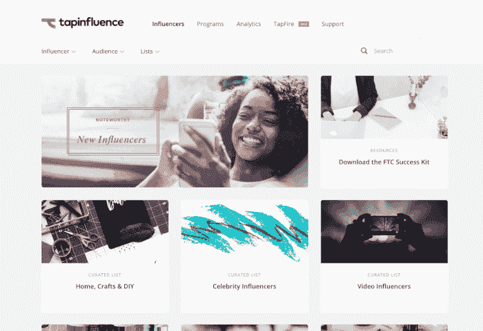
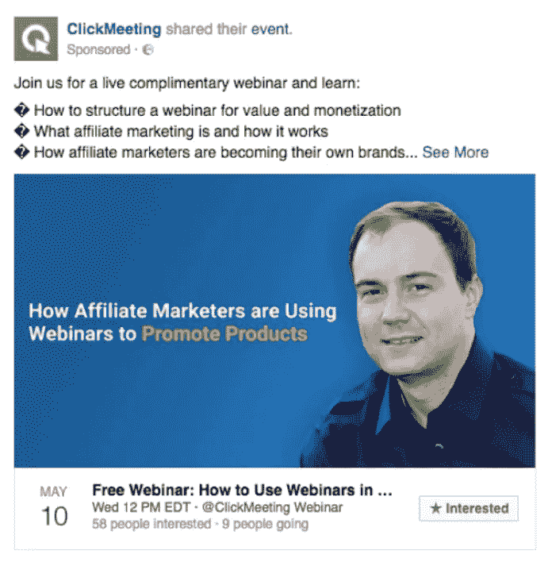
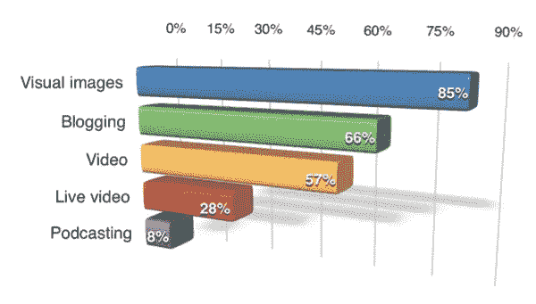
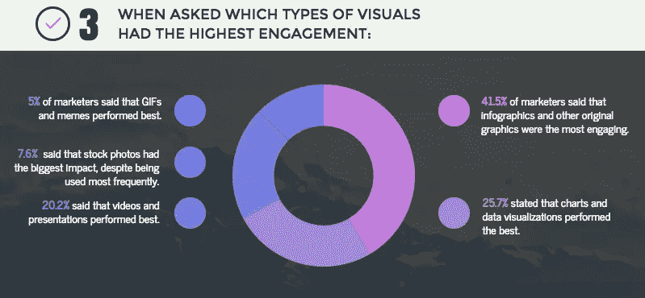
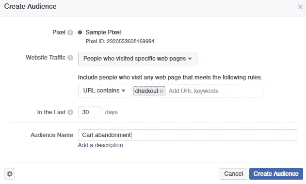
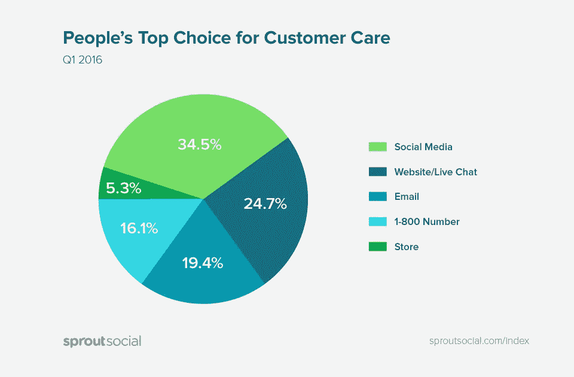
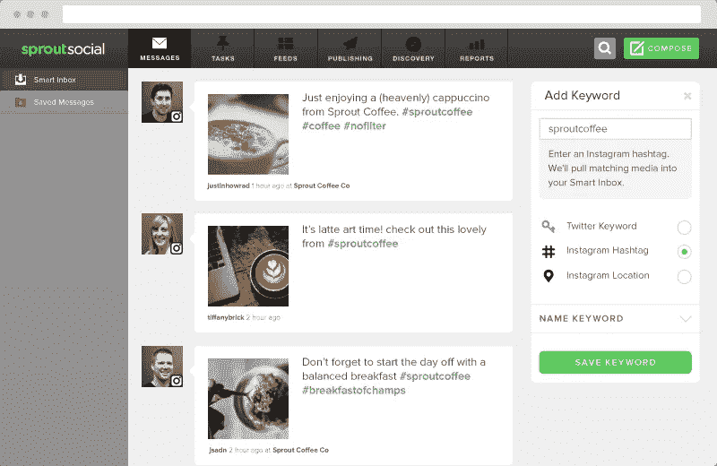
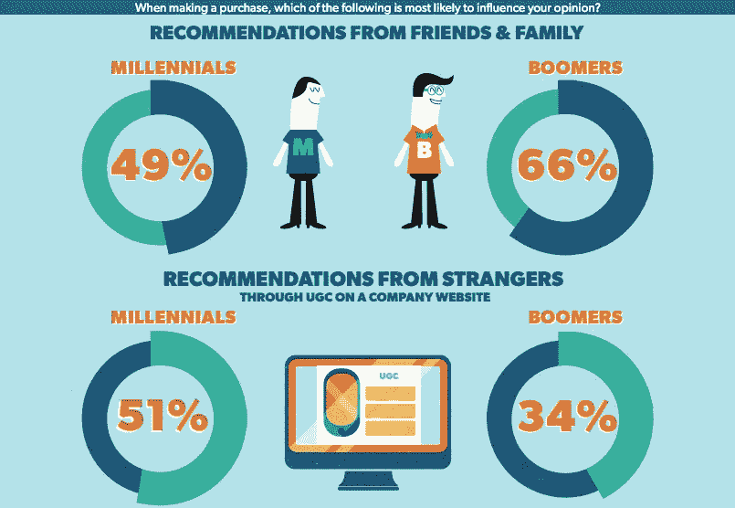
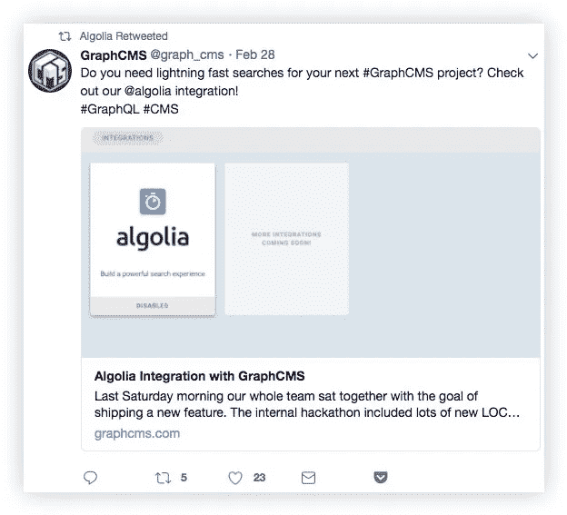
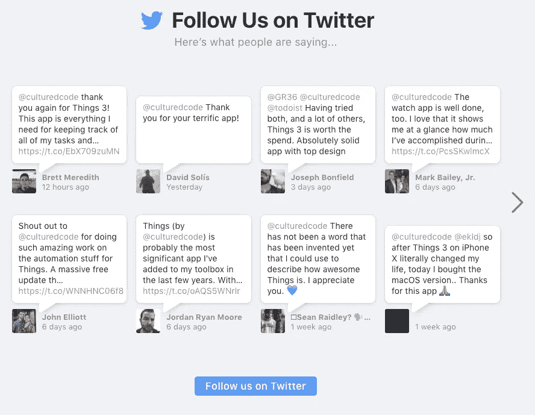

# 5 种久经考验的社交策略，帮助你的 SaaS 业务发展

> 原文：<https://medium.com/swlh/5-tried-tested-social-strategies-for-your-saas-business-to-grow-7585cf99c81e>

SaaS 产品的市场每年都在增长。事实上，它现在价值 1164 亿美元。与 2008 年的 55 亿美元相比，这是一个巨大的增长。这也意味着 SaaS 企业的竞争正在加剧，你需要脱颖而出，才能体验持续增长。

为此，你需要大幅提升你的[社交媒体战略](https://sproutsocial.com/insights/social-media-marketing-strategy/)。

以下是一些非常有效的社交媒体营销策略，将帮助你的 SaaS 业务增长:

# 1.与相关影响者合作

如果你紧跟市场营销的最新趋势，你一定听说过[影响者营销](https://sproutsocial.com/insights/influencer-marketing/)。它包括与在各自领域和领域拥有发言权和大量追随者的个人合作。

事实证明，影响者营销在赢得消费者的信任并促使他们做出购买决定方面非常有效。

事实上， [TapInfluence](https://www.tapinfluence.com/influencer-marketing-statistics/) 发现，与传统的数字营销渠道相比，影响者可以帮助实现 11 倍的投资回报率。然而，[只有 15%的 B2B 公司](https://www.marketingprofs.com/charts/2017/31524/the-state-of-influencer-marketing-in-2017)正在进行影响者营销活动，相比之下，55%的 B2C 公司正在进行这种活动。

因此，通过与行业内有影响力的相关人士合作，你有一个超越竞争对手的绝佳机会。这些有影响力的人可以帮助宣传你的产品，并让他们的观众了解产品的好处和特点。他们可以帮助提高品牌知名度，并在你和他们的追随者之间建立信任。

但是，为了达到预期的效果，你必须只与对你的目标受众有影响力的人合作，这一点很重要。像 [Tapinfluence](https://www.tapinfluence.com/) 、[upflow](https://upfluence.com/)和其他工具使得寻找相关受众的影响者变得更加容易。

像 ClickMeeting 这样的 SaaS 公司已经在他们的社交媒体策略中使用了影响者营销。由于该产品是一个网上研讨会创建工具，该团队寻找网上研讨会领域的影响者。

然后，这些有影响力的人会邀请主持网络研讨会，有效地展示产品的优势。该公司和嘉宾主持人都通过社交媒体宣传该会议，以吸引大量相关与会者。

# 2.创建更多视觉内容

如果你想吸引社交媒体的观众，视觉内容是至关重要的。在社交媒体上使用视觉效果的营销人员数量每年都在增长。根据[社交媒体审查员](https://www.socialmediaexaminer.com/visual-content-and-social-media-marketing-new-research/)的数据，2017 年期间，85%的营销人员在社交媒体营销中使用了视觉内容，而 2016 年这一数字为 74%。

除此之外， [HubSpot](https://research.hubspot.com/content-trends-preferences) 发现社交形象往往是消费者的偏好，尤其是年轻消费者。18 岁至 24 岁的受访者中，60%的人希望看到他们支持的品牌的更多社会形象。25 岁至 34 岁的受访者中有 56%的人持同样观点，35 岁至 44 岁的受访者中有 42%的人持同样观点。

你可以从创建原始图形开始，比如信息图，它既吸引人又能提供信息。事实上， [Venngage](https://venngage.com/blog/visual-content-marketing-statistics/) 发现这种视觉形式往往会在社交媒体上推动最高的参与度。

有几个工具可以让你[为社交媒体](https://sproutsocial.com/insights/free-image-creation-tools/)创作原创图片。

Canva 是一个很好的选择，因为它不仅可以让你创建原创的信息图表，还可以让你构建定制的社交媒体图表。 [Piktochart](https://piktochart.com/) 是另一个不错的选择，你可以定制大量的现有模板来创建引人注目的信息图。

你可以在社交媒体活动中使用的另一种有效的视觉形式是视频。即使在之前引用的 HubSpot 研究中，18 至 24 岁年龄段中有 52%的受访者希望看到更多的社交视频。25 至 34 岁年龄组中 47%的受访者和 35 至 44 岁年龄组中 35%的受访者也是如此。

总的来说，这项研究中 53%的受访者选择视频作为他们希望在未来更多看到的内容类型，领先于所有其他类型的内容。这意味着你的 SaaS 业务应该充分利用视频来教育你的观众关于你的产品的特点和好处。

例如，Zendesk 使用不同的内容格式来吸引脸书观众。他们甚至制作对观众有用的教育视频，例如关于 CSAT 收视率的视频。

# 3.充分利用脸书的重新定位

不是每个登陆你网站的人都会皈依。其中一些会立即反弹。其他人可能会浏览你的产品，并出于某种原因决定离开。有些人甚至会考虑购买，但一旦他们发现你的服务成本，他们就会改变主意。一旦这些访客离开，你可能会永远失去他们。

好消息是[脸书重新定位](https://sproutsocial.com/insights/facebook-remarketing/)有助于改变这个游戏。

这有助于你重新吸引那些之前似乎对你的服务感兴趣的人。你可以再次向他们提出更好的提议，迫使他们改变信仰。例如，可以通过提供免费试用的广告重新定位那些在定价页面[放弃你的网站的人。](https://shanebarker.com/blog/rules-follow-creating-facebook-ad-image/)

此外，你还可以用限时折扣来吸引他们，迫使他们注册。否则，尝试提供其他免费产品，如电子书、教程、网络研讨会等。机会几乎是无穷无尽的。

一些 SaaS 公司已经[能够在仅仅七天内利用脸书重新定位实现](https://www.biddyco.com/retargeting-kick-in-the-pants-technique/)1284%的投资回报率。

# 4.提供更好的社交客户支持

来自 Sprout 的数据发现，社交媒体是消费者客户服务的首选，超过了电子邮件、电话和其他渠道。

由于消费者可以通过社交媒体获得即时支持，我们应该期待看到这一渠道在提供客户支持方面的使用增加。因此，如果你想发展你的 SaaS 业务，你需要专注于提高你在社交媒体上提供的支持的质量。

定期监控您的直接信息，并尝试立即回答客户的询问。目标是减少他们获取信息的麻烦，从而改善他们与您的业务互动的体验。这可以帮助你提高客户保持率。

此外，回答潜在客户对你的服务、定价方案、条款和条件等的任何问题。目标是最终引导他们做出购买决定，并让他们更容易完成购买。这可以帮助你产生有价值的线索。

Salesforce 在回应 Twitter 上的客户问题和投诉方面做得很好，它倾听并让客户确切知道如何解决问题。

> 嗨，丹，听到你的遭遇，我们很难过。你能告诉我们与你的账户相关的电子邮件地址吗？我们很乐意为您调查此事。
> 
> *—sales force(@ sales force)*[*2018 年 3 月 6 日*](https://twitter.com/salesforce/status/971071455453696002?ref_src=twsrc%5Etfw)

除此之外，你还可以监控社交媒体上关于你的品牌和产品的转化。然后，您可以参与这些对话，并回复客户或潜在客户对您的产品或服务的任何投诉。Sprout Social 的一套[社交媒体监控工具](https://sproutsocial.com/features/social-media-monitoring)可以帮你做到这一点。您不仅可以监控品牌提及，甚至可以过滤提及，以确定您应该关注的最重要的对话。

# 5.通过用户生成的内容获得信任

无论是在 B2C 行业还是 B2B 领域，消费者都信任其他消费者。事实上， [Bazaarvoice](http://media2.bazaarvoice.com/documents/Bazaarvoice_WP_Talking-to-Strangers.pdf) 发现，51%的千禧一代和 34%的婴儿潮一代甚至会相信陌生人的推荐。

因此，如果你希望获得潜在客户的信任，其他客户的推荐可能是一种非常有效的社交证明形式。社交媒体是以用户生成内容的形式展示这些推荐的绝佳平台。你可以通过社交媒体分享品牌提及、客户故事、评论和推荐。

这样做的目的是利用你的社交媒体渠道与查看你个人资料的潜在客户建立信任。同时，分享你的客户故事和评论可以让他们感到被认可和重视。所以这同时提高了你的客户保持率。

Algolia 在利用他们的 Twitter 个人资料展示品牌提及方面做得很好。他们定期转发用户关于他们产品的帖子。

他们还转贴他们整合的其他 SaaS 平台的帖子。这是一个很好的方式来加强你与他们的关系，并向你的潜在客户展示你的服务提供的可能性。

此外，你可以重新定位社交媒体品牌提及和社交媒体评论，以赢得网站访问者的信任。文化代码在这方面做得很好。

# 结论

这是五个最有效的社交策略，可以帮助你的 SaaS 业务增长。虽然这些策略中有许多可以用来产生高质量的潜在客户，但也有一些可以帮助你留住现有客户。这一点至关重要，因为你能留住的客户越多，你的业务就越强大。

你对这些策略有什么想法？你有什么其他的策略可以分享吗？请在下面的评论中告诉我们。

*原载于*【sproutsocial.com】

***关于作者***

*[谢恩·巴克](https://shanebarker.com)是[内容解决方案](https://contentsolutions.io/)和 [Gifographics](http://gifographics.co/) 的创始人兼首席执行官。你可以在[推特](https://twitter.com/shane_barker)、[脸书](https://www.facebook.com/ShaneBarkerConsultant/)、[领英](https://www.linkedin.com/in/shanebarker/)、 [Instagram](https://www.instagram.com/shanebarker/) 上和他联系。*

**

## *这个故事发表在 [The Startup](https://medium.com/swlh) 上，这是 Medium 最大的企业家出版物，拥有 308，692+人。*

## *在这里订阅接收[我们的头条新闻](http://growthsupply.com/the-startup-newsletter/)。*

**