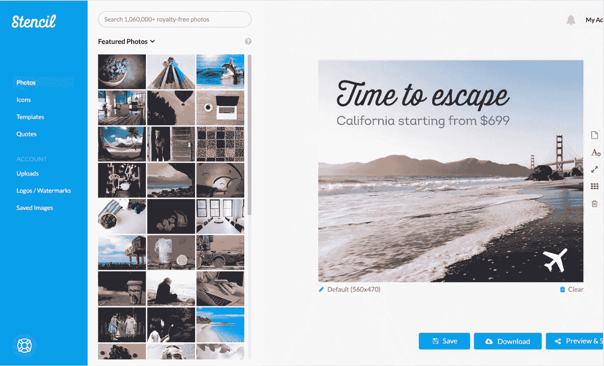
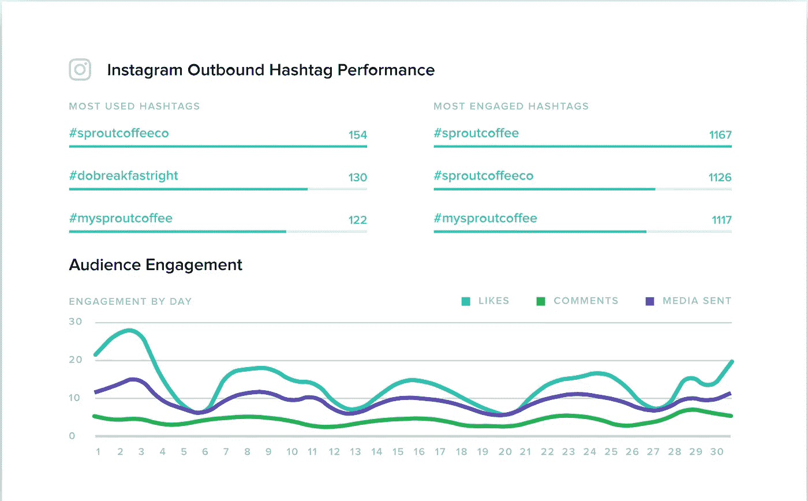
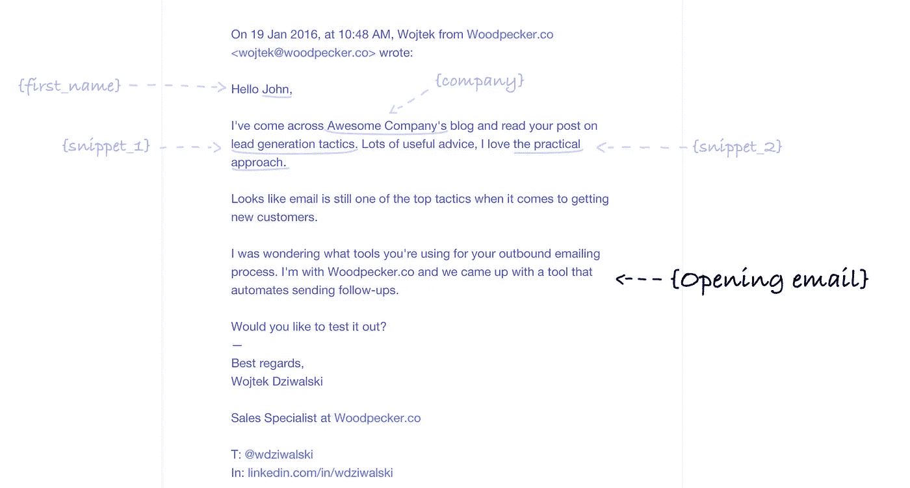
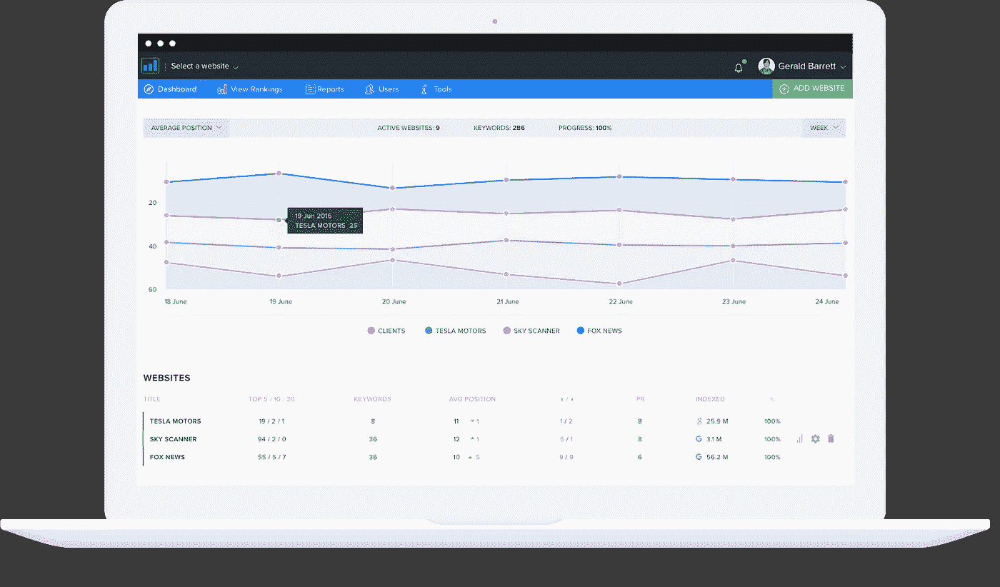
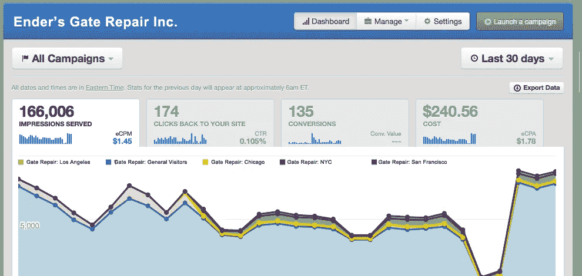

# 我用来提高营销效率的 5 种工具

> 原文：<https://medium.com/swlh/5-types-of-tools-i-use-to-boost-my-marketing-efficiency-1d82321a1205>

我们处在网络营销的时代。这个广告世界看起来与我们几年前生活的世界完全不同。一切都可以立即发生，我们需要的所有工具就在我们的桌面上，我们可以管理住在离实际客户数千英里之外的大多数营销资源。尽管如此，我们在网络营销过程中仍有许多事情要做，比如社交媒体发布、营销活动策划或电子邮件推广，这些都需要花费太多时间。幸运的是，其中一些很容易实现自动化。

# 是什么推动了在线营销的成功？

我认为，要成功实施营销，需要做三件事:

## 内容/材料需要有价值

没有更多的空间来存放普通内容。它只需要给世界带来一些额外的价值。

## 它需要精心设计

内容和支持图形都必须结构良好，视觉上具有吸引力或吸引力。

## 它需要一个可靠的分销策略

如果隐藏在黑暗中，即使是最有价值的内容或材料也永远不会被成千上万的观众看到。

因此，可能以上所有这些都需要一起发挥作用，并很好地保持一致，以使您的任何活动取得成功。

所有这些都需要很多时间，但是我使用了一些技巧和工具来使我的生活变得更容易，所以我迫不及待地向你展示其中的一些，并希望它们能帮助你加快你的营销活动。

# 1.使用简单的在线工具设计您的博客/社交媒体帖子

在当今世界，你不需要任何艺术知识来设计自己的帖子，并使它们看起来既整洁又有吸引力。你需要参加 Photoshop 课程的时代已经过去了，通过使用简单的在线工具，如 [Stencil](https://goo.gl/b5p49y) 或 [Canva](https://goo.gl/c3qGeP) ，我不仅可以轻松设计社交媒体帖子，还可以设计名片、信息图或演示文稿。

## [模板](https://goo.gl/b5p49y)——设计社交媒体帖子的必备工具

Stencil — design your social media posts with simple drag&drop editor.

使用 Stencil，设计脸书、Twitter 或任何其他社交媒体帖子就像拖放特定元素一样简单。您可以从大量许可的背景照片中进行选择，并使用预定义的图形和图标来增强您的设计。Stencil 在创建时就考虑到了社交媒体，因此它会根据所选的网络自动调整设计的大小，并让您在不同的设备上查看图形预览。Stencil 可以让你每月免费创作 10 个设计，所以我强烈建议你试一试。

## Canva —创建定制设计的工具

在设计社交媒体帖子以外的图形时，Canva 是我迫切需要的。它有一个庞大的预定义定制设计库，如信息图、名片、演示文稿、礼券或许多其他设计。您可以通过拖动图标或图形对象等特定元素并更改模板的图案或颜色来轻松实现个性化。Canva 是一个免费的工具，但是，如果你想访问高级图形，它的“每对象”价格模型可能会非常昂贵。

# 2.安排、自动化和分析你的社交媒体帖子

如果你厌倦了在不同的社交媒体平台之间复制、修改和粘贴帖子，你应该知道你可能是在浪费时间。你的很大一部分活动可以使用社交媒体管理工具自动化，比如我用来在一个地方为多个社交媒体平台安排帖子的 [Sprout Social](https://goo.gl/NzxVhw) 或 [Buffer](https://goo.gl/94gJAz) 。更重要的是，这些工具将为你提供关于社交媒体营销渠道绩效的深入数据。

## [萌芽社交](https://goo.gl/NzxVhw)——发布和管理你的社交媒体的工具

Sprout Social — social media scheduling and analytics.

通过 Sprout Social，你可以安排在众多社交媒体网络上发布帖子，包括脸书、Twitter、LinkedIn 或 Instagram。如果你需要一张快速的照片来支持你的帖子，它还可以让你访问图形库。但是这个工具最棒的地方在于，它真的专注于分析你的帖子以及整个社交媒体活动的表现。这真的可以提供大量关于哪个频道、帖子或标签最有效的信息。

## Buffer——一个简单免费的社交媒体日程安排工具

Buffer 没有提供高级的分析功能，因为它只是允许监控特定帖子的性能，但如果你正在寻找一个免费的工具在一个地方安排帖子，它可能是一个完美的选择。它很容易与脸书、Twitter 和脸书连接，根据我的经验，在 picksaas，它非常适合提前安排 Twitter 帖子。

# 3.使用冷邮件工具自动发送电子邮件

如果你积极主动地推广你的内容，将材料发送给营销人员、分支机构或任何其他准备分享你的材料的实体，你可能会花很多时间为每个人制作电子邮件，也许只是更改收件人的姓名、公司名称或工作职位。加快这个过程的一个好方法是使用像啄木鸟[或 T2[SalesHandy]这样的工具，我用它来自动化个性化电子邮件和发送后续信息的过程。](https://goo.gl/1uokoy)

## [啄木鸟](https://goo.gl/1uokoy)——个人邮件自动化工具

Woodpecker — an app to automate your mailing campaigns.

有了啄木鸟，你可以上传你的联系人名单。csv 包括名字、姓氏、公司、职位或您认为相关的任何其他字段，并自动发送标准的非图形电子邮件。您只需将自定义元素添加到您的邮件中，它们会自动填充特定收件人的数据，因此不再需要手动电子邮件个性化。此外，您还可以设置发送后续邮件的特定规则(例如，当某人在特定时间内没有回复时)。所有这些都节省了我大量的时间，同时保持了对话的私密性。

## SalesHandy —一个更高级的电子邮件拓展工具

SalesHandy 是一个稍微高级一点的工具，适用于要求更高的想要发送或监控附件的营销人员。它还可以让你集成最流行的 CRM 软件，这样你就可以记录任何活动，这对大型企业来说尤其有用。

# 4.研究关键词/管理 SEO 定位

无论你是在准备营销材料、博客帖子还是 AdWords 活动，你首先要做的事情之一就是研究你将要使用的关键词，这将使你有更大的机会接触到你的目标受众。在适当的位置使用关键词可能有助于提高你在谷歌搜索结果中的位置，但为了做到这一点，你首先需要知道哪些关键词值得使用(高容量)，或者哪些关键词被竞争对手使用。为了优化你的营销内容，检查你的网站相对于特定关键词的表现也是值得的。对于 SEO 平台来说，这是一件非常容易的事情，比如 SEO 排名平台。

## [SE 排名](https://goo.gl/Z8sy2k)——一个监控你的网站的谷歌定位的工具

SE Ranking — online tool to monitor your website’s SEO.

SE 排名是一个非常先进的工具，可以在一个地方管理您的搜索优化。它可以让你研究竞争对手的关键词定位，并实时监控你在特定关键词上的表现。它为我们提供了大量关于你的竞争对手的有用信息，你可以用这些信息来计划你的营销活动。尽管 SE 排名是一个付费工具，但如果你需要一个真正与你的营销活动相关的关键词来源，用最便宜的 7 美元/月的版本装备自己绝对是值得的。

## 搜索关键词的免费方式

如果你正在寻找一种快速的方法来检查特定关键词的数量、受欢迎程度或每次点击成本，SEMrush 肯定会有所帮助。你可以很容易地输入特定竞争对手的网站地址，并检查其主要关键字定位或他们在付费流量上花了多少钱。它可以完全免费地提供所有基本的洞察力，但你仍然可以用一个高级版本来增强它的功能。

# 5.管理您的脸书广告/ AdWords /再营销活动

如果你是一个深入使用最流行的营销渠道，如脸书广告或 AdWords 的高级营销人员，你可能知道你要花多少时间来建立，管理，分析或优化活动。幸运的是，我用广告管理工具自动化或至少加速了这些活动，比如[完美观众](https://goo.gl/fjKWFF)或 [AdEspresso](https://goo.gl/b5sYda) 。

## [完美受众](https://goo.gl/fjKWFF) —管理你的重新定位活动的工具

Perfect Audience — a tool to manage your retargeting campaigns.

如果你想接触到之前的访问者或用户，你需要更深入地重新定位你的受众。这可以在特定的营销渠道中手动完成，但有了完美的受众，你就有机会在一个地方管理所有的重新定位活动，包括移动应用程序、脸书广告、Twitter 或展示广告。这是从你的再销售中获得最佳投资回报的好方法，同时也为你节省了很多时间。

## [AdEspresso](https://goo.gl/b5sYda) —管理你的脸书/Instagram 广告的工具

如果你的主要广告渠道是脸书，内置的广告创建器或强大的编辑器并不是优化你的广告活动设置的最佳方式。AdEspresso 可能会成为提高脸书广告工作效率的重要工具，它具有可视化的分析数据、简单的 A/B 测试和自动优化建议。这绝对是一款云软件，尤其是对于脸书广告的重度用户。

# 找到最适合你工作方式的工具

在网络营销中，它不仅仅是寻找和经营正确的营销渠道。这也是为了最大限度地利用您的可用时间，并实现这些流程的自动化，从而产生积极的投资回报。这就是为什么探索自动化和优化特定任务的选项是值得的。上述在线工具对我来说是一个良好的开端，可以提高效率，减少花在不必要的任务上的时间，并探索营销产品或服务的新渠道。至少尝试其中的一些，看看它们是否能帮助你变得更有效率。

在[picksaas.com](http://picksaas.com)，我们帮助您发现适合您业务的工具。我们真的希望你觉得这份材料有用，所以不要犹豫，在评论中分享你的意见或问题，如果我们碰巧给你的营销人员的工作带来了一些额外的价值，请给予掌声。

## 这个故事发表在[的《创业](https://medium.com/swlh)》上，这是一份面向企业家和创业公司的媒体领先刊物。

# 你可以订阅[在这里获取头条](http://growthsupply.com/the-startup-newsletter/)。

