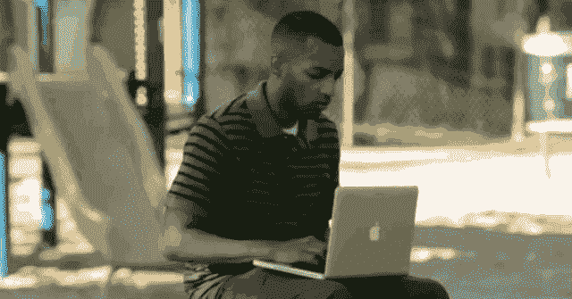
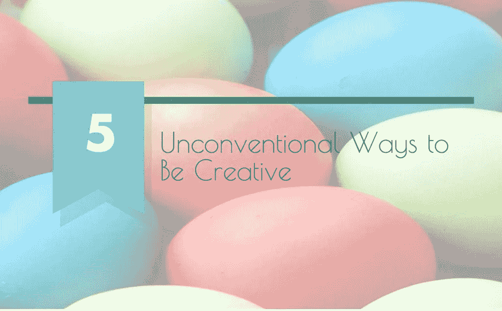
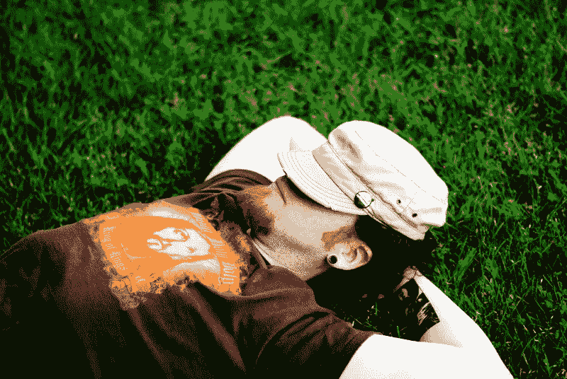

# 让你的创造力源源不断的非常规方法

> 原文：<https://medium.com/swlh/5-unconventional-ways-to-get-your-creative-juices-flowing-e3fd9f05b4ab>

*via* [*Unsplash*](https://images.unsplash.com/photo-1420802532821-8a885e88e95c?q=80&fm=jpg&s=1a8b8e0e88f2b594e4d756c1cb90267d)

我们的大脑很懒。是的，这是经过科学证明的。

在科学频道的一个实验中，一扇门被随机放置在公园的中央。在旁观者的注视下，一个参与实验的人会走向它，打开门，走过去。

*然而，他不会出现在另一端，门会自己关上。*

不用说，观察家们感到困惑。那个人消失到哪里去了？

在现实中，该男子利用门的掩护偷偷溜走，藏在另一个物体后面，而他的团队成员通过遥控关上门。

“这是我们大脑有多懒的一个很好的例子，”神经经济学家保罗·扎克博士在视频中说。“当我们穿过一扇门时，我们走直线。我们无法想象——因为我们已经多次看到这种模式——有人会右转。”

这是因为我们的大脑经常使用过去经验建立的联系或神经通路来解读我们周围的世界。事实上，如果我们听之任之，我们的大脑将永远“选择最节能的路径”，[在她的书*领导力神经科学*中写道](http://www.fastcompany.com/3045424/work-smart/what-it-takes-to-change-your-brains-patterns-after-age-25)麻省理工学院高级讲师塔拉·斯沃特。

不幸的是，这意味着我们的大脑不太擅长创造。事实证明，创造力就是建立新的联系——这是沉思的创造性类型似乎共有的技能。

2011 年，神经科学家 Vilayanur S. (V.S.) Ramachandran 博士[发现](http://blog.hubspot.com/marketing/the-science-of-creativity) **联觉**——一种[导致人们不由自主地将一种感官知觉与另一种感官知觉联系起来的情况——在艺术家、诗人和小说家中是普通人的八倍。](https://www.psychologytoday.com/blog/finding-butterfly/201104/are-you-synesthete)

她宣称，这是“创造力的基础——将看似不相关的想法、概念或思想联系起来。”

出于这个原因，我们必须做一些违背直觉的事情来激发我们的创造力，这是有道理的，即使这些事情一开始可能会觉得不自然。

所以，放弃通常的建议——这里有五种非常规的方法让你的创造力源源不断。

via [Piktochart](https://magic.piktochart.com/editor/589)

# 与世隔绝

我们每天有多达一半的时间是在办公桌前度过的——对一些人来说，可能更多。正因为如此，许多人试图充分利用这一点，在桌面上装饰励志名言、家人和朋友的照片以及描绘山海的壁纸。

一些公司甚至给员工津贴来清理他们的办公桌！

如果你想变得有创造力，你可能应该反其道而行之:尽可能减少感官输入。

原因如下。切断感官输入[可以让](https://blog.bufferapp.com/the-power-of-shutting-down-your-senses-how-to-boost-your-creativity-and-have-a-clear-mind)“大脑中‘不断确保你不会死’的部分放松一秒钟，让大脑中创造性的、放松的部分出来玩耍，”格雷厄姆·塔利说。

格雷厄姆是波特兰一家感觉剥夺坦克中心的老板。

via [Flickr](https://www.flickr.com/photos/missnita/1226567016/)

当然，在办公室完全关闭感官输入几乎是不可能的。但是，如果你足够幸运可以在家工作或者对你的工作环境有所控制，作家贝尔·贝丝·库珀[建议](https://blog.bufferapp.com/the-power-of-shutting-down-your-senses-how-to-boost-your-creativity-and-have-a-clear-mind)做三件事:

1.  减少视觉输入:躺在一个黑暗的房间里，让你的思绪自由游走。遮光窗帘最适合这种情况，但眼罩或眼罩也很好。
2.  **关噪音:**这个应该很简单。买一副舒适的衬垫耳机或入耳式耳机，屏蔽你周围的各种干扰和噪音。找一个靠窗的座位，看着世界流逝。
3.  **孤立自己:**字面意思就是远离这个世界。你不一定要进入漂浮池才能做到这一点——Belle 建议定期洗澡，戴上耳塞和眼罩。

# 白日梦

via [Flickr](https://www.flickr.com/photos/mateusd/15033566162/in/photolist-oUsXsA-6U5NGZ-6U9LN3-6U9LoJ-6U9KYJ-rKA52-otViED-aboWfo-gJd3z-nypciw-8A8UMS-aNriGa-aNritD-bzkyNF-7QdRxR-b1fWZF-agUTLc-agUTC2-6NoSaF-wxaxaa-6NoSie-88LqK6-aR8i3D-aR8hTn-aR8hJv-8A5Nrn-8A8Tw5-nhbxZn-8gokMJ-oUg2Lt-2gmyv1-gubqf-8A8UfC-2gmyuL-pPDMdL-8A5MRp-2XFkCS-ocSmLe-EAcif-nhby3i-76UDBo-nfhwq3-4nDY71-hwn14v-nqziWs-9VLR18-pa6tG1-6TeTQY-8caRBH-eheiUK)

*开什么玩笑？真是浪费时间！如果我当着你的面这么说，我想你会这么说。事实上，心理学家西格蒙德·弗洛伊德形容白日梦是“幼稚的”哎哟。*

相反，最近的研究表明，白日做梦可能是释放你创造性解决问题潜力的关键。

由加州大学的研究人员进行的一项研究发现“参与简单的外部任务，让大脑自由活动，可能有助于创造性地解决问题。”在实验中，参与者执行了一项“不寻常的使用任务”，在这项任务中，他们要想出尽可能多的奇怪方法来使用一个物体。

接下来，参与者在再次做同样的任务之前做了四件事情中的一件:

*   做一项艰巨的任务
*   做一件不难的工作
*   休息 12 分钟
*   跳过 12 分钟的休息时间，马上做任务练习

事实证明，在第二轮“非正常使用任务”中表现更好的那一组是那些执行要求不高的任务的人。有趣的是，这组人在完成任务时也报告了高度的白日梦。

只要确保在昏昏欲睡之前开始你的项目，因为白日梦[只在你已经为你的项目付出一些努力的时候才起作用](http://99u.com/articles/16136/7-ways-to-boost-your-creativity)。

# 上单口喜剧课

你喜欢看哪一部——恐怖片还是喜剧片？如果你的答案是后者，那么你就在启动创造力列车上领先了一步。

在西北大学的一项研究中，心理学家卡鲁纳·苏布拉马年[发现](https://www.psychologytoday.com/blog/the-tao-innovation/201406/the-power-humor-in-ideation-and-creativity)“创造性洞察力与解决问题之前大脑前扣带皮层(ACC)的活动增加相关。”ACC 是大脑中参与解决问题的区域，情绪积极的受试者似乎“在任务中有更多的 ACC 活动。”

事实上，根据马里兰大学的研究人员的说法，仅仅是看喜剧就能使我们解决脑筋急转弯的能力提高一倍以上。喜剧似乎提高了我们的精神灵活性，以意想不到的方式吸引我们的大脑。

这反过来有助于我们建立联系，这是我们以前看不到的。

即兴表演和单口喜剧是众所周知的地球上最难的演出。让人们发笑并不容易，尤其是当他们期待它的时候！

因此，参加这些领域的课程将有助于以你从未想过的方式拓展你的想象力。彼得·罗比，达特茅斯大学的工程学教授，[实际上在他的设计思维课程中包括了](http://www.fastcompany.com/1576793/do-improv-comedians-make-best-design-thinkers)一门即兴表演课:

> “即兴表演要求玩家接受他们被给予的东西，建立在他人的想法之上，并鼓励大胆的想法……每个人都认为他们知道如何头脑风暴，但事实上，头脑风暴通常受到自我审查、竞争和嘲笑等问题的困扰……即兴表演是学生学习推迟判断的好方法。”

# 早餐吃点新东西

我们很多人都有一套早上起床后就要做的事情。我们洗漱完毕，启动咖啡机，往烤面包机里扔两片面包，然后启动电脑。一个巧妙的 5 分钟流程进入我们的工作日。

如果你想在那一天发挥你的创造力，最好稍微改变一下。在最近发表在《实验社会心理学杂志》上的一篇论文中，Simone Ritter 和他的同事[发现](https://www.psychologytoday.com/blog/beautiful-minds/201206/why-weird-experiences-boost-creativity)任何一种让你跳出“正常思维模式”的新体验都有助于提升你的创造力。

在一项实验中，他们让参与者用黄油和巧克力片准备一份三明治。是的，这是一个奇怪的组合，但是他们要求他们的参与者接下来做的事情变得更加奇怪:

> *一些人被告知以一种不寻常的顺序准备三明治，首先将巧克力片放在盘子上，然后在面包上涂黄油，然后将涂有黄油的面包面朝下放在有巧克力片的盘子上。他们让另一组人按照通常的顺序做三明治，而另一组人只是看一段视频，视频中的人用不寻常的方式或通常的方式做三明治。*

结果是:那些以不同寻常的顺序制作三明治的人“与其他组相比，在认知灵活性方面得分最高。”

如果这样一个简单的练习能带来如此大的不同，那么可能性是无穷的。某天早上泡一杯茶代替咖啡。找个好地方吃午饭。或者尝试在您的工作流程中添加新的应用程序。试着用不同的方式让你的大脑参与进来，你可能会在那天发现一些新的东西。

# 夜猫子，在清晨做需要创造力的任务(反之亦然)

我之前提到过，创造力的关键是让我们的大脑处于一种状态，在这种状态下，它的运作效率低于它想要的。

根据科学作家玛丽莎·费森登的说法，当我们疲劳时，我们大脑的过滤器往往会休息一下，[。这意味着一大堆松散的想法涌入我们的大脑。](http://elitedaily.com/life/people-are-creative-when-tired/1145773/)

via [Unsplash](https://images.unsplash.com/photo-1444220451343-9fcc0681ff8d?q=80&fm=jpg&s=cbd2babdbefc85c4a0fe0185d1ae6f86)

这是一个好消息，因为这意味着我们的大脑在建立那些它如此擅长的联系时变得效率更低。模糊的大脑更容易接受新的想法和观点。

马莱克·b·威斯和罗斯·t·咤克斯进行的一项实验证明了这一点。400 名学生——分别被称为“早起的云雀”和“夜猫子”——被要求在不同时间解决基于洞察力和分析能力的问题。

对于需要更多创造性思维的基于洞察力的问题，参与者在不太清醒时表现得更好。

所以，对于夜猫子来说，最佳时间自然是凌晨。对于我们早起的人来说，情况正好相反——过了就寝时间就不睡觉，做一些无组织的思考。

**你还有其他非常规的方法来激发你的创造力吗？**

## *这篇文章第一次出现在*[*Piktochart 博客*](http://piktochart.com/5-unconventional-ways-to-be-creative/?utm_source=medium&utm_medium=blog&utm_campaign=repurposed_content) *上，其中有一些很棒的研究支持的、有见地的文章，谈论创意、设计和讲故事。* [*你应该看一下*](http://piktochart.com/blog/?utm_source=medium&utm_medium=blog&utm_campaign=repurposed_content) *。*

发表于*[**# SWLH**](https://medium.com/swlh)**(***创业、流浪、生活黑客)**

******