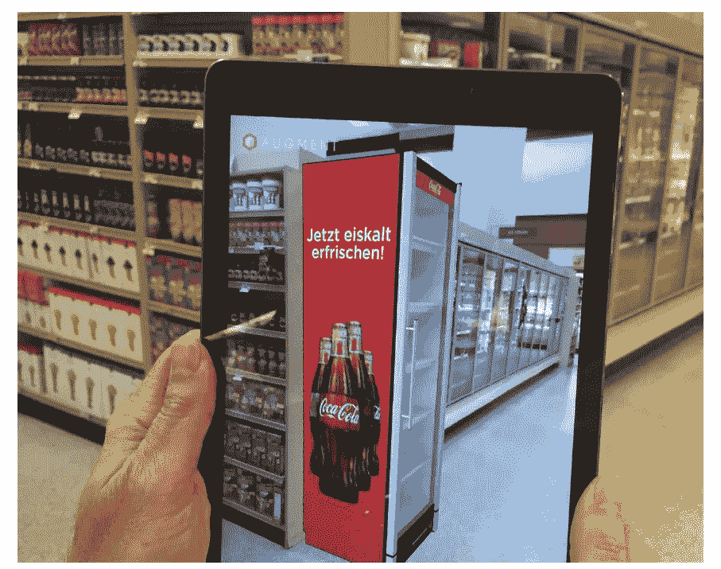

# 促进企业销售的增强现实的 5 个用例

> 原文：<https://medium.com/swlh/5-use-cases-of-augmented-reality-that-boosted-businesses-sales-2114ac35bf5a>

增强现实今年 26 岁了。AR 于 1992 年由美国空军首次开发，现已稳步发展成为一项技术，成为我们日常生活中的主食。AR 的第一个主要拐点 Pokémon Go 教会了数千万用户如何使用手机与现实世界中的虚拟物体进行交互。可以肯定地说，数字世界正迅速变得更加真实。

## #AR 软件市场预计到 2022 年将达到 352.2 亿美元。

Snapchat 的自拍面具允许用户变形为 Chewbacca 或 Luchador，乐高的 AR-Studio 将会呼吸的龙扔进塑料玩具中，Emantras 的 3.99 美元的青蛙解剖在拯救青蛙生命的同时，向学生传授生物学的勇气和荣耀。多亏了 ARKit 和 AR Core，这是 iOS 和 Android 平台的软件开发工具，苹果和谷歌继续奠定基础，使尖端的 AR 体验变得像构建应用程序一样简单。

但是，增强现实的变革可能性不仅仅是为了娱乐价值:它们是严肃的业务。来自全球的财富 500 强公司正在以极快的速度将 AR 解决方案纳入产品线并进行营销。例如，奥迪(Audi)和起亚(Kia)等汽车制造商已经开始尝试抛弃纸质手册，让驾车者通过将手机对准仪表盘来了解是什么导致发动机指示灯发光，从而了解新车的特性并排除故障。很快，客户将不仅仅是对 AR 体验感到高兴，他们还会期待 AR 体验。

增强现实展示产品特性和功能的承诺不仅仅是一个额外的奖励——它还是一个销售驱动力。通过让消费者只需轻轻一点就能购买的产品变得栩栩如生，AR 在相对初级阶段可以帮助推动客户参与并最终增加公司的底线。看看这五个企业使用 AR 来推动销售的使用案例:

# 1.宜家家居（瑞典公司）

用苹果的 ARKit 开发的第一个主要商业应用是 IKEA Place。这家斯堪的纳维亚家具制造商进军 AR 领域，使用移动设备的摄像头来可视化虚拟宜家商品在任何给定空间的外观。从沙发床到床头柜，超过 3200 件物品可以放在客厅、卧室、办公室或任何可以放椅子的地方。这也是一种令人难以置信的用户友好方式，可以将 AR 进一步推向主流。

Image source: IKEA

对于搬家工人、装修工人或只是好奇新灯具会占用多大空间的人来说，IKEA Place 让他们在购买大件商品时不再需要猜测。IKEA Place 让用户可以实时预览最终结果，而不是测量房间，开车去商店，把平板盒子装到车上，开车回家，组装一件家具，然后发现它不适合你的空间。

Image source: IKEA

想想对宜家底线的好处:通过允许用户通过 AR 测试一项重大购买，该公司能够减少退货并提高客户满意度。

## 应用程序下载量超过 200 万次，加上网上购物的便利，难怪宜家网站仅在 2017 年就有 23 亿访客。

# 2.扎拉

> 61%的购物者更喜欢提供增强现实体验的商店。如果购物者可以在 AR 体验产品，71%的人会更经常回来，40%的人会支付更多。—零售认知

宜家可能正在将其虚拟商店带入现实生活，但将虚拟生活带入实体店的是快时尚零售商 Zara。今年 4 月，Zara 用只能通过 Zara AR 应用程序体验的模型和产品演示取代了橱窗展示和店内人体模型。

鼓励“*购买增强现实*中的外观”，客户可以将智能手机指向看似简单的标牌，并为虚拟时装秀带来活力。在简短的视频剪辑中，模特们昂首阔步地走过 Zara 的过道和橱窗，为春季时装注入了活力。当然，模特的服装离用户的购物车只有一步之遥，这是从时装秀到零售的无缝过渡。

Image source: Official Zara instagram account

虽然促销活动只持续了两周，但 Zara 对 AR 的创新性使用让人们得以一瞥在不久的将来，亲自试穿服装就像乘马车旅行一样过时。尽管 Zara 没有分享其 AR 应用程序的任何销售数据，但很容易看出虚拟时装秀的独特消费者体验，加上只需轻点几下就可以将模特的服装运送到你家的便利，是一场*t 台*成功的方程式。

# 3.PEZ

谁会想到一家 91 岁的糖果公司会走在 ar 技术的前沿？每个人都记得 PEZ，这是一种欢快的奥地利甜点，由一个有趣的自动售货机提供，上面有卡通人物或历史人物的头像。通过 2018 年发布的新 AR 应用程序 PEZ Play，PEZ 引入了一种新的方法来增加喜悦和消费者参与，以促进糖果包的销售。

Image source: [zappar.com](http://www.zappar.com/static/img/showcase/pez-world/screen-shot-2016-08-11-at-17.56.36.jpg)

它是这样工作的:PEZ Play 应用程序与 PEZ 补充包中包含的特定糖果代码进行交互。扫描糖果代码解锁进入 PEZ 世界:一个互动角色，益智游戏和基于技能的挑战的集合。这 13 种不同的迷你游戏令人上瘾，是儿童友好的冒险，由小 PEZ 人主演，他们画画，搭配水果，自拍，可以在社交媒体上分享。六种不同的糖果代码随机包含在数百万包 PEZ 中，确保玩家必须购买多包 PEZ 才能获得完整的体验。

虽然 PEZ 游戏只有几个月的历史，但很容易看出这个简单的 AR 推广将如何推动 PEZ 糖果的额外销售。在享受了一次 PEZ 游戏的体验后，儿童和成人都会被驱使去购买更多的 PEZ 来完成 PEZ 世界的任务。

# 4.可口可乐

不仅仅是消费者市场在利用 AR——在 B2B 环境中，促进销售的机会也在增加。

> 到 2022 年 B2B 的 VR 体验数量将占所有体验的 40%。—b2bmarketing.net

软饮料领导者可口可乐与 AR 开发商 Augment 合作，帮助解决困扰其 B2B 销售部门的一个典型问题:可视化饮料冷却器在零售店中的外观和大小。看到一个充满更酷选项的目录或网站是一回事；让它们变得栩栩如生，看看一个库存充足、完全商品化的展示品如何适合摆放在过道的尽头是另一回事。

Image source: augment.com

可口可乐使用 AR 可以让潜在的 B2B 客户浏览他们商店的每一个可能的选项。通过模拟不同形状、尺寸和设计的软饮料冷却器，销售团队帮助其客户做出更好的产品决策。更好的是，Augment 的可口可乐应用程序直接与 Salesforce 集成，允许客户捕捉每个购买选项的照片。

# 5.封面女郎

CoverGirl 的虚拟改造将自拍变成了最佳自我的一瞥。使用手机、平板电脑或电脑上的摄像头，这款数字化妆工具使用 AR 在你的面部实时图像上涂抹口红、眼线、腮红和其他美容产品。不需要化妆湿巾或纸巾来吸干你的嘴唇——cover girl 的软件允许你尝试数百种产品组合，保护你的皮肤，并节省美容柜台后工作人员的时间。

Image source: [beautypackaging.com](http://www.beautypackaging.com/contents/view_breaking-news/2018-02-08/covergirl-launches-virtual-tryon-mobile-web-experience)

虚拟改头换面并不歧视化妆选择，也不歧视平台使用。这是网络上最好的 AR 体验之一，可以直接通过浏览器获得，让你的主屏幕免受另一个应用程序的影响。一旦你找到了完美的树荫，它就在你的购物车旁。

很容易看出封面女郎的软件如何通过让商店不必在犹豫不决的顾客身上浪费产品样品来省钱。但是虚拟改头换面能推动销售吗？看一看一个关键指标来表明它们是:封面女郎的竞争。玫琳凯、欧莱雅和美宝莲也提供类似的 ar 体验，以帮助顾客确定他们最喜欢的外观。当客户正在推动一个行业中的大多数主要品牌采用相同的软件解决方案时，AR 必须做正确的事情。

# AR 已经到了

从甜甜的糖果到烟熏眼，宜家、Zara、PEZ、可口可乐和封面女郎采用的软件都围绕一套核心原则提供了截然不同的 AR 体验:

*   **消除猜测:**这些 ar 体验帮助客户做出决定，而不必依赖纸质模型、产品样本或他们自己的想象力，而不必预测口红的颜色或装满苏打水的冰箱在收银台附近会是什么样子。
*   **提供即时反馈:**无论是快时尚还是沙发床，AR 都向顾客实时展示某样东西会是什么样子。
*   **愉快地互动:**看到你的脸或客厅的新版本，就像帮助虚拟的 PEZ 人物爬上一堵墙一样令人兴奋。在仅仅存在了 26 年之后，AR 才刚刚开始迈出第一步，以一种新的方式来看待世界。公司应该开始接受 AR，将其作为在产品旅程的任何一站推动消费者参与的新方法。

在[https://www.ciklum.com/our-thinking/](https://www.ciklum.com/our-thinking/)寻找更多激动人心的故事、报道和统计数据

## 这篇文章发表在 [The Startup](https://medium.com/swlh) 上，这是 Medium 最大的创业刊物，有+368，675 人关注。

## 在此订阅接收[我们的头条新闻](http://growthsupply.com/the-startup-newsletter/)。

