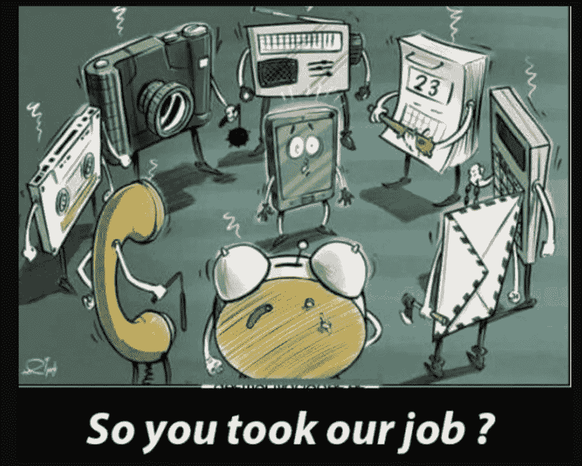

# 创业公司利用移动设备颠覆行业的 5 种方式

> 原文：<https://medium.com/swlh/5-ways-that-startups-are-going-to-use-mobile-to-disrupt-industries-a1b4a5704a8f>

在过去的几年里，我们都见过“颠覆”这个时髦词。

没有什么地方比手机更容易看到颠覆了。

根据[皮尤研究中心](http://www.pewinternet.org/fact-sheet/mobile/)，仅在美国，就有 95%的人口拥有手机。截至 2014 年，地球上的移动设备比人口还多。

但是看看这幅漫画，你会更清楚地看到这种破坏:

手机已经取代了许多物品的工作，而就在 20 年前，这些物品还是美国家庭和办公室的必需品。每年，为移动设备创造技术的创新者不断推动社会前进，提高生产力和效率。

但是接下来呢？

下一波颠覆会是什么样子？在未来几年里，我们可以从以下五个方面看到手机对行业的影响。

# 重新定义我们的购物方式

你还记得我们用纸质地图从一个地方旅行到另一个地方吗？如果你去一个新的城市，你将不得不在游客中心停下来拿一张纸质地图，或者不断地向陌生人问路以到达你想去的地方。从那以后，苹果地图和谷歌地图占据了街道和人行道，让你比以往任何时候都更容易到达你想去的地方(并准确知道你需要多长时间到达那里)。

下一步是什么？

**地图用于*室内*寻路。**

你可能一生中至少有一次在购物中心里迷路了。此外，你必须亲自去一家特定的商店，看看你想要的产品是否有货。像 MappedIn 这样的公司正在通过与品牌合作为商场和商店制作地图来解决这些不便。可以预计，这些类型的店内地图将继续变得更加主流，并超越商场，进入机场、体育场、杂货店和任何你可以想象的室内场所。

虽然大多数人都将注意力转向了 Lyft、特斯拉和优步等公司，认为它们是汽车行业的重大变革者，但一股全新的技术浪潮也瞄准了汽车行业。

买车可能是一件令人头疼的事情，甚至是彻头彻尾的压力。

如果你问一屋子的年轻人，他们是否愿意永远不再走进汽车经销店，很可能有将近一半的人会举手。经销店的体验可能会让你感到粗略，不受你的控制，就像一个让你购买你并不真正需要的华而不实的东西的长期计划。

这就是为什么像 [AutoGravity](https://www.autogravity.com/) 这样的初创公司正在通过你的手机将汽车融资放在你的手掌中(字面上)。AutoGravity 允许您浏览所有品牌、型号和饰件，探索各个经销商的库存，并从经销商那里获得多达四个公平的融资优惠，而无需走进大门。

但并不是所有的初创公司都希望扰乱购买过程。一些人希望让驾驶过程更加安全，并依靠数据和移动设备来实现这一目标。

[Zendrive](https://www.zendrive.com/how-it-works/) 认识到 90%的碰撞是由人为错误造成的，四分之一是由于驾驶时使用手机造成的。这家初创公司使用智能手机传感器，通过监控碰撞、攻击性驾驶、分心驾驶等来测量司机的行为，然后根据数据提供量身定制的驾驶建议。个人和企业都在使用 Zendrive，他们希望跟踪(并改善)他们的员工在方向盘后的表现。

# 给现实世界第二次生命

去年夏天，当全世界都参与到寻找稀有的口袋妖怪的行动中时，我们都见证了一点未来。虽然我们认识到不仅仅是游戏的增强现实元素吸引了所有人的注意力，但我们也必须承认，这对增强现实开发者和整个行业来说是一个巨大的进步。

但增强现实的最大进步之一是数百万人在没有意识到它是 AR 的情况下使用的功能:Snapchat 镜头，它有能力将你的脸变成 70 年代的摇滚明星或可爱的猫。

蒂姆·库克(Tim Cook)最近在 AR 上的言论表明了他对该技术发展方向的看法:

“它会以一种大的方式发生，当它发生时，我们会想，没有它我们怎么生活。就像我们想知道今天没有手机我们是怎么生活的一样。”

毫无疑问，像苹果、脸书、谷歌和 Snapchat 这样的大公司正在把赌注压在 AR 上。看看谷歌和劳氏公司最近的合作吧:

但是更有斗志的创业公司并没有认输。像 [Meta Vision](https://www.metavision.com/) 这样的许多初创公司已经将他们的视野直接指向市场，并得到了 Robert Scoble、will.i.am 等人们的好评。

增强现实的未来会怎样？不可能真正预测，但可能性是无穷的。本尼迪克特·埃文斯分享了一个视频，展示了增强现实可能如何改变世界的几个例子:

得益于 Apple Pay 和 Samsung Pay 等服务，手机已经改变了我们的支付方式。虽然移动支付在北美的采用率仍有一段路要走，但全球各地的初创公司正在引领金融领域的其他创新。最近，开发人员已经开始创建和销售向其他金融科技初创公司提供银行 API 的服务，类似于 [Stripe](https://stripe.com/) 为支付处理所做的事情。

创业公司推动社会前进的一种方式是让普通人在旅途中更容易管理自己的财务。多年来，感觉你需要一个投资规划师或高薪财务顾问来获得投资支持。如今，像 [Robinhood](https://www.robinhood.com/) 、 [Betterment](https://www.betterment.com/) 和 [Wealthfront](https://www.wealthfront.com/) 这样的初创公司正在努力帮助千禧一代通过手机管理和投资他们的金钱。许多初创公司创造了“机器人投资者”，将人类排除在等式之外，这种情况让许多财务规划者对他们职业的未来感到紧张。

P2P 贷款已经存在多年，没有太多的技术支持，通常是以友好握手或书面合同盖章的贷款形式。最近，技术为创业公司打开了大门，帮助人们直接从朋友和他们网络中的人那里借钱。在亚洲， [P2P 平台已经变得越来越受欢迎，可以在各种情况下进行借贷——从婚礼资金(以新人期望收到的现金礼物为担保)到高风险房产的高收益贷款。](https://www.bloomberg.com/news/articles/2016-08-24/china-imposes-caps-on-p2p-lending-to-curb-shadow-banking-risk)

# 赋予医疗保健新的生命

我们都见证了放置在智能手机或手表中的传感器对医疗保健的价值。无论是计算我们的步数还是监测我们的心率，在我们努力过上更健康的生活时，将移动设备融入我们的健康提供了大量数据、见解和一点乐趣。

然而，医疗保健行业作为一个整体，对于初创公司来说，进行重组相当具有挑战性。我们相信，在未来几年，我们将开始看到该行业发生更多重大变化，不仅是向人们提供医疗保健的方式，还有人们和企业管理健康的方式。

医生和创业公司都在大力推动可以远程管理的护理。像 [Better PT](http://www.betterpt.com/patients/) 和 [Dialogue](https://dialogue.co/) 这样的公司允许患者与医疗专业人员进行视频咨询以进行诊断。一些应用程序甚至允许患者直接通过聊天接收处方，并通过智能手机将其发送到药房。

最近，我们已经看到一些组织采用移动应用程序，如[转换器](https://changers.com/)、[运行管理员](https://runkeeper.com/)和[平静](https://itunes.apple.com/us/app/calm-meditation-to-relax-focus-sleep-better/id571800810?mt=8)，以便将健康的工作生活游戏化。团队正在下载这些应用程序，并记录下一个月或一个季度中谁骑得最远或冥想最多。

# 未来还有什么？

当然，没有人真正知道未来会发生什么——尽管我们知道它将由梦想家、创新者和规则破坏者创造。

只有看清世界的人，才有能力将未来变得与众不同。如果你是一家初创公司，正在寻求帮助，构建一个你认为可以改变世界(或至少解决一个紧迫问题)的移动应用程序，我们很乐意了解更多关于你正在构建的内容。取得联系！

*原载于 2017 年 4 月 10 日 www.mindsea.com***。**

**

## *这个故事发表在 [The Startup](https://medium.com/swlh) 上，这是 Medium 最大的企业家出版物，拥有 292，582+人。*

## *在这里订阅接收[我们的头条新闻](http://growthsupply.com/the-startup-newsletter/)。*

**