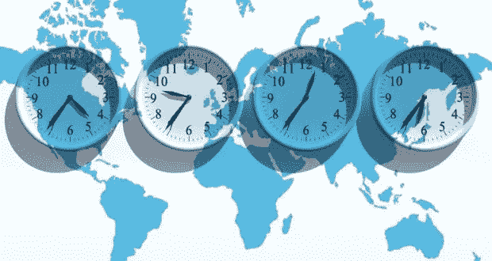

# 5 种避免时差的方法

> 原文：<https://medium.com/swlh/5-ways-to-avoid-jet-lag-feebcfc6e4d>

Changing time zones isn’t easy.

我们的身体是个神奇的东西。它可以在多种情况下承受很大的压力，最终变得更加强大。但是说到旅行，当我们进入新的时区时，我们的身体有时会很难适应。我们开始难以保持清醒或入睡，我们的能量水平开始波动。如果我们旅行到一个新的时区，我们很可能希望有足够的能量，不管我们是为了工作还是为了娱乐。确保你保持精力充沛的最好方法是让你的身体适应新的时区。为了有所帮助，这里有 5 种方法，我们可以侵入我们的身体，以避免时差反应，并更容易地适应新的时区(不使用褪黑激素作为补充)。

1.  **接地—** 接地基本上就是赤脚站在地球上。虽然你可能会读到它，并把它当作嬉皮士的胡说八道，但接地是有科学依据的。当你在空中飞行时，你的身体会带静电，一旦你赤脚站在地上，离子会把你带回正常的消极状态。接地可以在土壤、草地、沙地甚至砖块或混凝土上工作，但只要确保你在户外就能获得最大的好处。
2.  **晒晒太阳——**阳光是调节你生理节奏的好方法，生理节奏是你体内的生物钟。如果你在户外，吸收一些阳光，你的身体会很好地告诉你这是一天中的哪一天，并且更容易适应新的时间表。在你旅行之前，如果你能在外面复制你要去的地方，你也许能在实际到达那里之前稍微调整一下。例如，如果你要去的地方晚上 7 点就天黑了，比你现在所在的时区早了 5 个小时，那么在下午 2 点左右你还在家里的时候，进入室内，避开太阳。一旦你到了新的地方，一定要出去让你的身体适应一下。
3.  **锻炼—** 你的身体在适应日常生活方面做得很好。如果你有特定的锻炼时间，在新时区的同一时间锻炼会让你的身体适应。在老鼠身上进行的一项研究表明，锻炼改变了这些老鼠体内肌肉组织的生物钟。如果你因为某种原因不能同时锻炼，那么任何形式的锻炼都有助于身体做出某种调整。
4.  **禁食—** 在你的*新*地点，早餐前禁食 12-16 小时，让你的身体适应新的时区。当你正常睡眠时，你显然不吃东西，所以当你进入禁食状态时，你的身体更容易适应新的位置。例如，如果您通常在早上 8 点吃早餐，那么您会希望在新地点的时间内，从下午 4 点到晚上 8 点停止进食。因此，如果那个新地点比你早 12 个小时，你会想在你的时间早上 4 点到 8 点之间停止进食。很困惑，对吧？
5.  **多喝水—** 当我们飞往新的时区时，在飞机上点一杯葡萄酒或啤酒是很诱人的。如果我们真的想适应新的时区，最好不要喝酒、汽水或果汁，而是喝大量的水。喝水不仅有助于我们保持水分(飞机上空气中的水分比撒哈拉沙漠中的少)，还能让我们的身体更有效地转换档位，适应新的时区。

你喜欢这篇文章吗？在我的[网站](https://earlyrisersmovement.com/podcast1)、 [iTunes](https://itunes.apple.com/us/podcast/early-risers-podcast/id1343955996?mt=2) 或 [Google Play](https://goo.gl/Nvt1ra) 上查看我的播客，了解更多信息！或者在下面给我留言，让我知道你最喜欢的旅行地点。

## 这篇文章发表在 [The Startup](https://medium.com/swlh) 上，这是 Medium 最大的创业刊物，拥有 318，120 多名读者。

## 在此订阅接收[我们的头条新闻](http://growthsupply.com/the-startup-newsletter/)。

