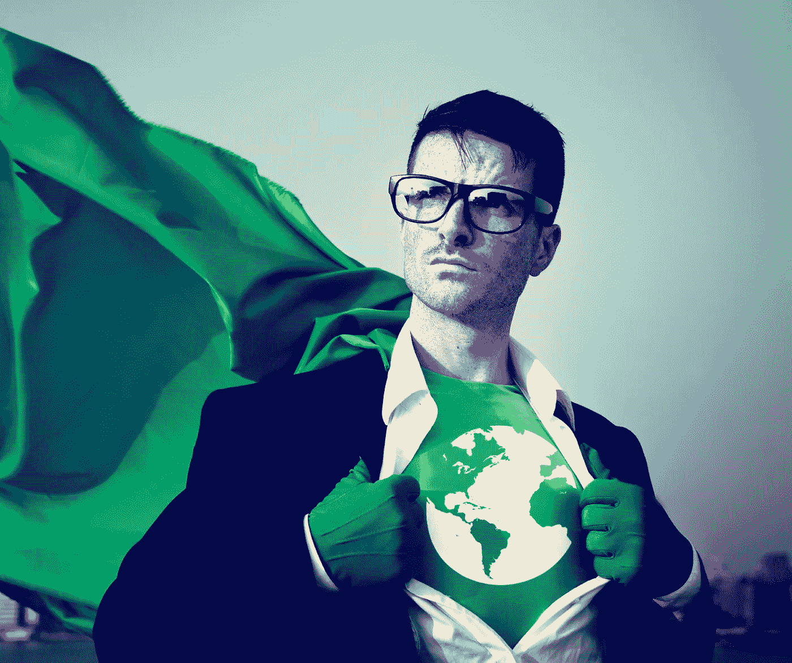

# 今天创造社会影响的 5 种方法

> 原文：<https://medium.com/swlh/5-ways-to-create-social-impact-today-b3a1c85238fc>

社会影响通常被认为是有一个伟大的想法，必须根除世界上的一个主要问题，否则它是无用的。有一个重大的使命和愿景是令人惊讶的，但它也经常让许多真正想开始社会企业家、社会企业甚至开始积极影响社会的人脱轨。