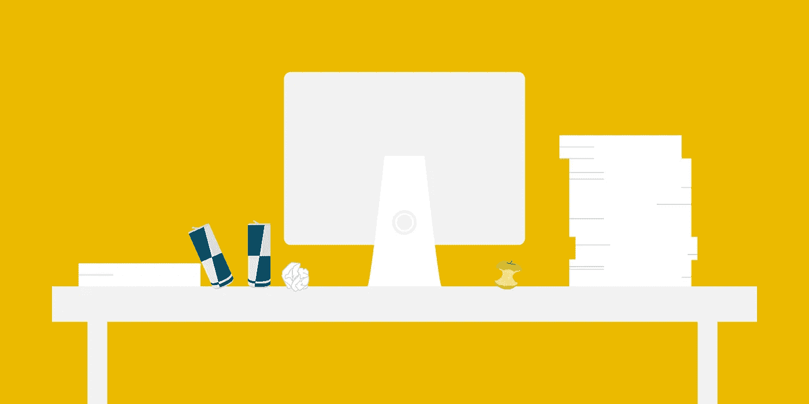
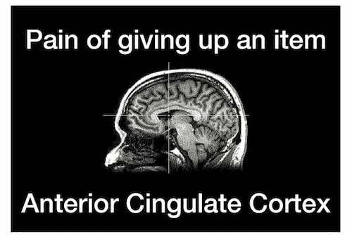
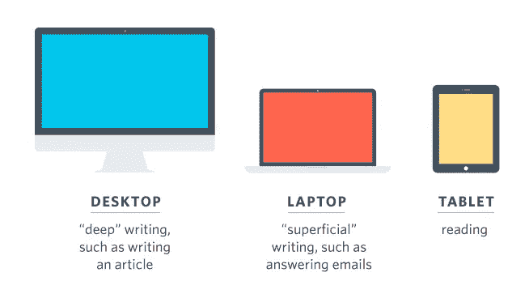

# 侵入你工作空间的 5 种方法

> 原文：<https://medium.com/swlh/5-ways-to-hack-your-workspace-c75bac5b0269>

## 在你的空间影响你之前，先影响你的空间

一些事情和我们周围的事情一样影响我们的生产力。然而，我们大多数人很少花时间退一步，真正分析我们的工作环境。

相反，我们在工作中采取“一劳永逸”的方法。

我们去同一个办公室，同一个咖啡厅，同一个共同工作的空间，努力让自己进入高效的工作流程。自从一年半前在[剧组](http://crew.co)工作时开始变得冷漠以来，我陷入这种心态的次数比我愿意承认的还要多。

所以我开始问:如果我们要花这么多时间工作，为什么不试着把我们工作的地方变得尽可能好呢？

无论你是在家里，在共享空间，还是在咖啡店，都有快速简单的方法来帮助你的工作空间为你服务。

# 为什么我们的环境很重要(即使我们没有注意到)

你可能认为你已经有了一个很好的设置，但是仔细阅读我们的环境在潜意识层面上影响我们的方式，你会开始对你的环境感到非常不安。

研究表明，我们的工作习惯，无论是好的还是坏的，通常都与某种外部触发或暗示有关，研究人员[正越来越多地将其与我们的环境联系起来](http://www.sciencedirect.com/science/article/pii/S002210311100254X)。我们去同样的地方，在同样的办公桌前工作，并不断被同样的影响因素所包围。

这很好，对吧？找一个好的工作环境，你就会被迫进入心流状态。但不幸的是，就像大多数与我们的大脑如何工作有关的事情一样，在表面之下还有更多。

随着我们的进化，我们的潜意识大脑被训练来保护我们的安全，即使我们没有意识到这一点。当我们受到威胁时，我们需要迅速做出决定，这是我们的大脑通过一种叫做“薄切片”的东西来做的。这意味着它从现实中提取一个小的元素，并对其进行概括，并由此决定采取什么样的行为。

因此，你工作场所中的那些触发因素和线索不仅仅以你可以有意识理解的方式影响着你，它们还改变着你潜意识的思维和行为方式。

不相信我？以下是[一些研究表明，我们的环境在改变我们的思维和行为方式方面有多么荒谬有力:](http://www.uncommon-knowledge.co.uk/articles/uncommon-hypnosis/environment-to-influence-people.html)

*   在被要求评价一个假想的人之前，拿着一杯热咖啡几秒钟的学生比那些拿着冰咖啡的学生更有可能描述他们是温暖的、友好的
*   如果眼前有一个公文包，或者甚至墙上有一个公文包的图片，人们会表现得更有竞争性。即使人们事后没有意识到见过公文包，这种情况也会发生。
*   如果你和一个不断使用*失望*、*沮丧*、*低落*、*无意义*和*失望*等词汇的人交谈，你可能会有同样的感觉
*   甚至空气中洗涤液的淡淡香味也能让人感觉比平时更干净整洁

那么，我们如何创造一个最佳的环境，让我们在工作日感觉到我们想要的方式:有动力，有效率，有创造力？

# 在杂乱杀死你之前杀死它

办公桌凌乱的创意者和思想家由来已久。正如艾伯特·爱因斯坦曾经雄辩地指出的那样:

> "如果一张杂乱的桌子标志着一个混乱的头脑，那么，一张空桌子是什么的标志呢？"

然而，无论是你的衣柜还是办公桌，你周围多余的东西都会对你专注和处理信息的能力产生负面影响。

这正是普林斯顿大学的神经科学家在观察人们在有组织和无组织环境中的任务表现时发现的。研究结果表明，你周围的物理混乱会争夺你的注意力，导致表现下降和压力增加。

一组加州大学洛杉矶分校的研究人员最近观察了洛杉矶的 32 个家庭，发现所有母亲的压力荷尔蒙在她们处理自己的物品时都激增。

类似于多任务处理对你大脑的影响，物理混乱使你的感觉超负荷，让你感到压力，并削弱你创造性思维的能力。

然而，这并不像摆脱生活中多余的东西那么简单。我们不会仅仅因为懒惰或无组织而制造混乱，放弃它们会伤害你的大脑。

耶鲁大学的研究人员最近发现，你大脑中与疼痛相关的两个区域，即前扣带皮层 T21 和脑岛会随着你对自己拥有的东西的放弃而变亮，并感受到与以下事物的联系:

当你因被纸割伤或喝太热的咖啡而感到身体疼痛时，大脑中的这一区域就会被激活。

你的大脑认为失去你最珍贵的东西和导致你身体疼痛的东西是一样的。

那么我们该怎么做来减少杂乱的压力呢？

*   **应用限制:**无论是 Twitter 关注者、浏览器中打开的标签、笔记本还是杂志，设定硬性限制并坚持执行是停止积累更多的最佳方式。
*   **使用小的存储空间:** [帕金森定律](https://crew.co/backstage/blog/dont-need-time/)说我们会填满我们可用的时间，这同样适用于杂乱。更小的空间意味着更少的杂乱空间。
*   每月对你的空间进行一次检查:每个月留出时间进行清洁、分类和丢弃。
*   **制定每日清洁计划:** Crew 首席执行官 Mikael 建议[在每个工作日结束时清理你的桌面](https://blog.crew.co/how-clutter-effects-you-and-what-you-can-do-about-it/)这样待办事项就不会拖延，你就有了一个全新的开始

# 寻找激发你灵感的地方

坐在窗边，我们会从大空间中获得灵感或精神焕发，这是有原因的。除了大量的维生素 D 之外，建筑还会对我们的生产力产生巨大的影响。

作者 James Clear 举了一个研究员 Jonas Salk 的例子，他花了几年时间试图找到治愈 50 年代肆虐美国的小儿麻痹症的方法，然后去了意大利中部安静的山区，在那里他住在一个 13 世纪的方济各会修道院，被称为圣方济各阿西西大教堂。

空间改变了他的思维方式:

> “那里建筑的灵性如此鼓舞人心，以至于我能够进行直觉思维，这远远超出了我过去所做的任何事情。
> 
> 在那个历史遗迹的影响下，我直觉地设计了这项研究，我觉得这项研究将会产生小儿麻痹症的疫苗。
> 
> 我回到匹兹堡的实验室验证我的概念，发现它们是正确的。"

乔纳斯的例子只是众多例子中的一个。

众所周知，拥有更多自然光线的学校为学生提供了更好的学习环境，考试成绩也因此而提高。众所周知，自然光和新鲜空气也能提高工作效率。

你可能无法选择你的工作空间，但是有一些快速的解决方法:寻找一个有来自窗户或天窗的自然光的地方；觉得堵了就去外面散散步；或者只是探索一个新的位置。

一个新的环境确实能产生新的想法。更令人兴奋的是，研究表明在新的地方培养新的习惯实际上更容易。

# 用不同的地方来表达不同的思想

我们知道不同的地点会影响我们，所以为什么不利用这一点呢？

我们的大脑喜欢习惯，如果我们能够将某些品质与不同的地方联系起来，它可以帮助我们进入更好的工作流程。这被称为“任务关联”，你的大脑知道当你在某个地方时，你正在采取某个行动。

作家格雷戈里·奇奥蒂举了一个很好的例子来说明[如何通过改变他使用的设备来迫使自己进入一个更好的工作流程。在他的例子中，他训练他的大脑知道当他在他的桌面上时，是时候进行像文章这样的深度写作了。笔记本电脑是用来做更简单的工作的，比如电子邮件或非正式的帖子。最后，平板电脑只能用来阅读。](http://www.sparringmind.com/changing-habits/)

这种方法非常有效，它甚至被用于[帮助治疗失眠患者](http://www.ncbi.nlm.nih.gov/pmc/articles/PMC3554970/)，告诉他们只有在真的累了的时候才能去卧室。如果在合理的时间内没有睡好，他们会被指示离开，去做另一项任务，直到他们再次感到疲劳。

如果你能为不同的任务建立多个工作空间，你也能强迫你的思维进入某个特定的流程，仅仅是通过身体上的某个地方。

一个很好的例子是作家兼艺术家奥斯汀·克里昂，他在自己的空间里放了两张桌子:一张“模拟”桌子，里面放满了纸、笔和记号笔；和一个带笔记本电脑和平板电脑的“数字”书桌。创意的产生和“发挥”只发生在模拟桌面上，而塑造、编辑和发布则发生在数字领域。

# 为成功做好准备

我们可能认为我们有意志力和控制力去完成更困难的任务，但是在内心深处我们都很懒。但这不全是我们的错。我们的大脑被教导要不惜一切代价保存能量，并完全根据难易程度为我们做出潜意识决定。

所以，如果你想创造一个高效的工作空间，就要专注于让你想做的事情变得更容易，让你不想做的事情变得更难。

斯坦福大学教授、心理学家 BJ·福格称之为“为懒惰而设计”。

有时就像关掉手机并把它放在抽屉里一样简单，所以每次你想检查它时，你都必须经历一个漫长的过程，而其他时候可能意味着拔掉电视插头并把它放在壁橱里。

我最近使用的一个技巧是在一天结束时关闭浏览器中的所有标签页(这对任何作家来说都是一个地狱般的苦差事)，只留下我最重要的任务。第二天，最简单的选择就是继续做前一天剩下的事情。

我当然不是第一个使用这种技术的人。就连海明威也习惯在句子中间停下来，这样他总是知道第二天从哪里开始。

# 管理你的感官

除了你空间的物理布局和心理联想，还有一些辅助的东西你也可以控制。你周围的声音和你听的音乐会对你的工作效率产生巨大的影响。

我们以前写过[音乐的力量](https://crew.co/backstage/blog/the-magic-of-music-and-what-it-does-to-your-brain)和[如何为正确的任务找到正确的轨道](https://crew.co/backstage/blog/productivity-playlist)，但重要的是要注意，某些声音会对你的工作方式造成难以置信的伤害。

研究表明，在所有事情中，[断断续续的讲话——听到谈话的小片段——会对你集中注意力的能力产生难以置信的负面影响。](http://www.fastcompany.com/3051835/know-it-all/how-background-noise-affects-the-way-you-work)

[一项荟萃分析](http://peterhancock.cos.ucf.edu/wp-content/uploads/2013/02/174-Szalma_Hancock_2011_Noise.pdf)检查了 242 项关于噪音影响表现的研究，发现当执行认知任务时——如保持注意力、阅读和处理文本以及处理数字——表现受间歇语音的影响比受连续语音(音量和节奏变化不大)或非语音噪音的影响更大。

对于我们这些共享空间或办公室的人来说，这是个坏消息。

不过还是有选择的。如果你找不到一个安静的地方，降噪耳机或淹没语音的音乐可以帮助你重新获得注意力。

当谈到我们工作中的先天因素和后天因素时，后天因素几乎总是最重要的。我们已经形成的习惯和我们周围的触发因素会对我们的工作质量和一天的完成量产生巨大的影响。

但是通过一点正念和调整，我们可以创造一种空间，帮助我们更快、更频繁地进入心流。

*嘿！我是乔里。屡获殊荣的作家、编辑和内容策略师。如果你想一起工作，在***或* [*上查看更多类似的帖子。*](http://jorymackay.com/)*