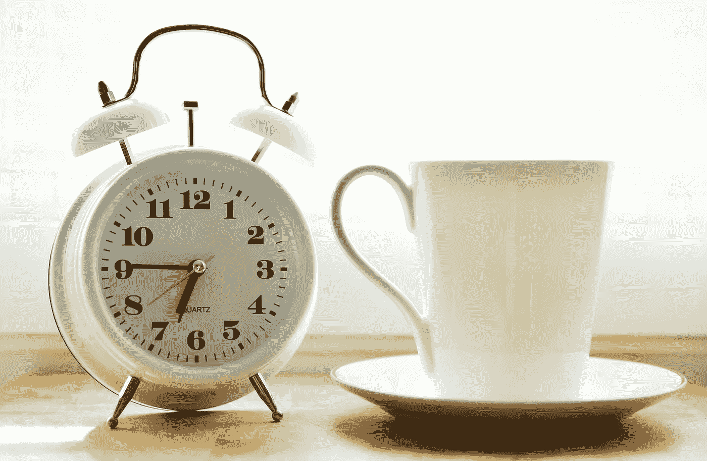
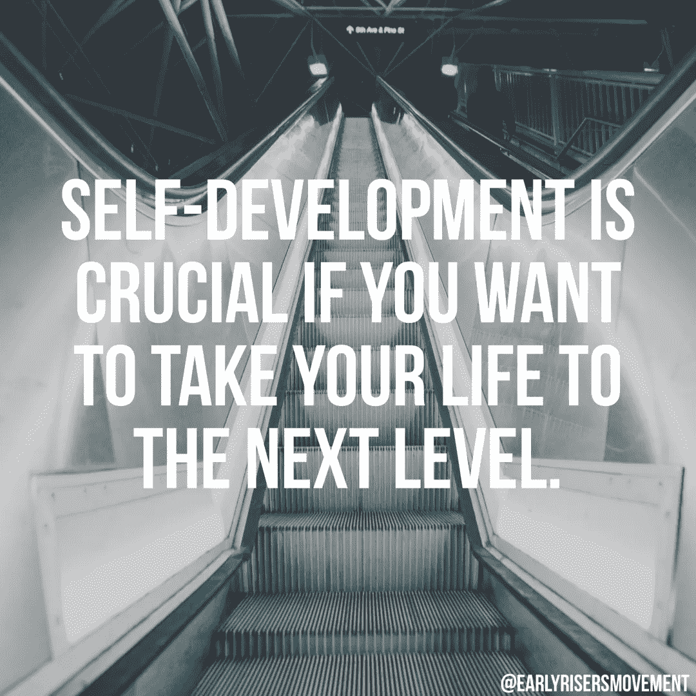
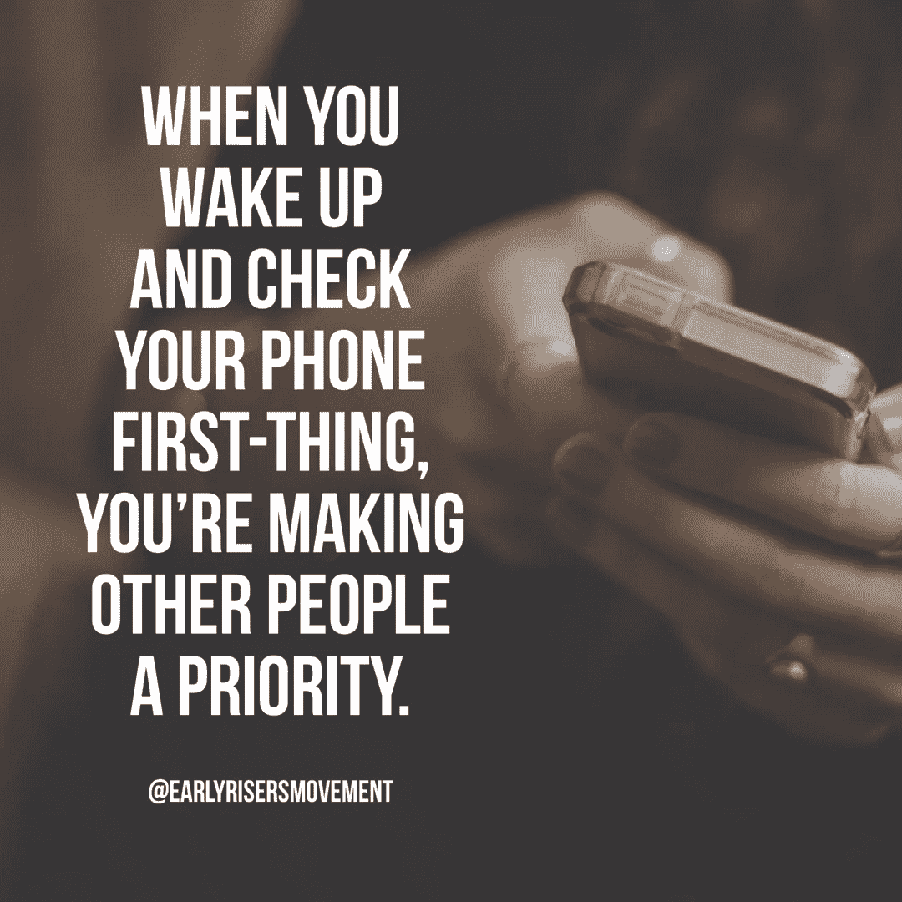
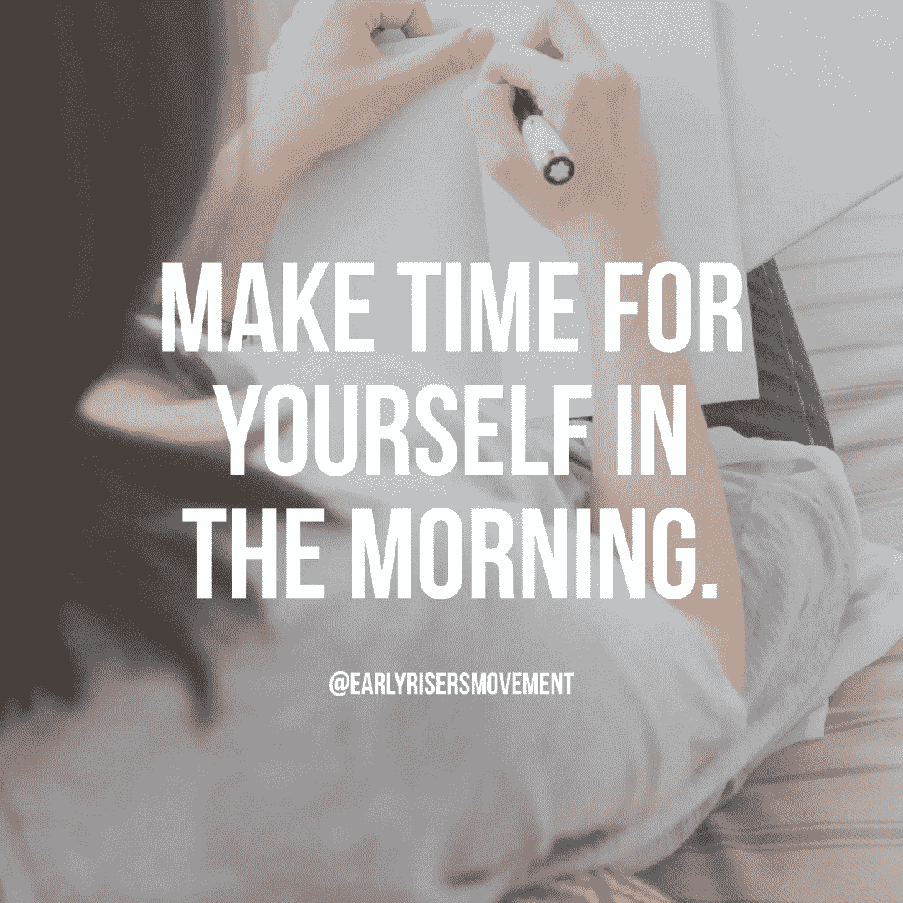

# 彻底改变你早晨的 5 种方法

> 原文：<https://medium.com/swlh/5-ways-to-revolutionize-your-mornings-b8fb86a6f406>

你有没有尝试过早起并且富有成效，但是发现你似乎不能动起来？你有没有发现自己很难动起来，或者就是无法集中注意力？在这篇文章(和下面的视频)中，我列出了 5 件你应该在早上做的事情，以充分利用你醒着的时间。你不需要为了使用这些建议而提前三个小时起床，但是只要你给自己留出一定的时间，你就会开始看到一些惊人的变化。

1.  从你的日常习惯中去除贪睡——按下贪睡键可能是你早上第一件事要做的最糟糕的事情。我写了一篇[文章](/swlh/4-reasons-to-stop-hitting-snooze-immediately-10d28ad33d31)关于为什么按下贪睡键是如此糟糕，但基本上，它会让你感觉*比你第一次起床时更累，它教会你拖延和屈从于暂时的舒适是没问题的。是的，试图停止按贪睡键是很困难的，如果你需要帮助，一定要看看我写的一本电子书，名为[“无贪睡设置”](https://early-risers-movement.com/sales-page)。这本电子书展示了我曾经每天早上打 1-6 次瞌睡，然后几乎完全从我的生活中去除它的确切框架。*
2.  给自己腾出时间——有多少次你醒来后马上去为别人做一些事情？当我们把他人作为一天中的第一要务时，我们就错过了每天为自我发展创造时间的机会。与其一觉醒来就匆忙准备去为别人工作，为什么不花几分钟到几个小时在你身上呢？无论是冥想、写日记，还是只是花点时间集中注意力，早上为自己留出时间会减轻你的压力，增加你的生活满意度。
3.  **前一天晚上做准备—** 如果你上床睡觉时清楚地知道第二天早上要做什么，你的执行效率会更高、更有效。首先整理好你的衣服，去掉那个决定，如果你要去健身房锻炼，确切地知道从你去健身房到你离开的这段时间你要做什么。如果你不想每天晚上都花时间做计划，那就在周日晚上计划好一周的早晨。只要你睡觉的时候知道第二天早上你要做什么，你就会发现你的效率有所提高。
4.  不要看手机——当你醒来的第一件事就是看手机时，你让别人比你自己更重要。你可能会看到一些你不想看到的东西，从你一天的第一刻起，你就对你的情绪产生了负面影响。即使你没有看到任何负面的东西，你仍然把*你的时间*扔到一边，好像它不重要。每当你开始你的早晨，确保你每天早上至少花 30 分钟从网络世界中退出。
5.  **坚持你的例行公事——**你可能需要一段时间来找到最适合你的早晨例行公事，但是一旦你想通了，一旦你进入状态，确保你坚持下去。尽量不要在*休假，至少在前 21 天*不要休假，并确保你保持一致。一旦你继续保持这种一致性，你的日常生活就会成为一种习惯，你会发现起床开始运动要容易得多。

# 录像

你喜欢这个帖子吗？一定要和朋友分享！

[如果您想通过电子邮件直接接收每周博客更新，请点击此处](https://earlyrisers.activehosted.com/f/5)。

请随时在脸书的[或 Instagram 的](http://facebook.com/groups/earlyrisersmovement)或[上与我联系](http://instagram.com/earlyrisersmovement)

# 值得思考和分享的名言

## 这个故事发表在 [The Startup](https://medium.com/swlh) 上，这是 Medium 最大的创业刊物，拥有 313，216+人关注。

## 在这里订阅接收[我们的头条新闻](http://growthsupply.com/the-startup-newsletter/)。

