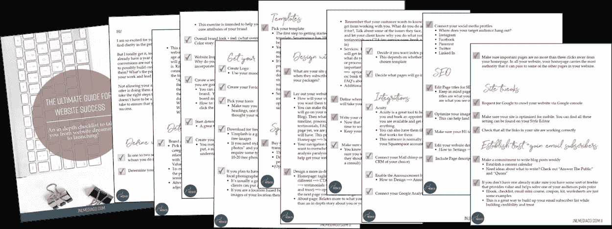

# 你需要知道的 5 个网站品牌推广技巧

> 原文：<https://medium.com/swlh/5-website-branding-tips-you-need-to-know-about-d9de5bbd0593>

“person writing on white book” by [rawpixel](https://unsplash.com/@rawpixel?utm_source=medium&utm_medium=referral) on [Unsplash](https://unsplash.com?utm_source=medium&utm_medium=referral)

你听说过品牌和网页设计这两个词，但是“网站品牌”呢？

网站品牌化仅仅意味着你的网站在品牌上！

如果你还没有制定你的品牌战略，那么一定要看看我写的博客文章，内容包括“[如何制定你的品牌战略:给创意者&企业家](https://www.jnlmediaco.com/blog/how-to-develop-your-brand-strategy-for-creatives-entrepreneurs)”。

那么，你如何确保你的网站是品牌网站呢？

这里有五个简单明了的网站品牌推广技巧，你可以开始实施:

# 1)为你的网站创建一个情绪板

即使你已经有了一个标志——你应该为它开发一个情绪板，但如果你(或你的设计师)没有，你现在可以这样做！

[情绪板](https://www.jnlmediaco.com/blog/squarespace-website-design-branding-launch-for-allison-barlow-makeup-artist?rq=allison)对你的网站设计非常重要，因为它们有助于建立你的品牌+网站风格和感觉的视觉表现。

以下是我为以前的客户制作的一些情绪板的例子:

# 2)调色板

创建一个情绪板也将帮助你开发你的品牌调色板！你的调色板颜色是你将在整个网站、社交媒体图片、文具、电子书等中使用的五种颜色

一旦你选择了你的调色板(嗯，也许我应该写一篇关于如何做到这一点的博客文章…敬请期待)确保不要偏离你的颜色，这样你就能留在品牌上。你选择的颜色应该反映你品牌的风格、感觉和氛围，所以在你的网站上使用它们是你保持品牌的方式。

# 3)字体

当谈到网站品牌时，像字体这样小的东西会产生巨大的差异，因为它在你的网站和任何品牌材料(电子书、图片、社交媒体帖子等)中创造了一致性..)是你创造的。

拥有一套 H1、H2、H3、H4 和正文字体将有助于保持你的品牌连贯性。

# 4)复制

复制你网站上的文字，转化为你向你的理想客户传递的信息是另一个大问题！

有一种叫做“品牌文案”的东西，它应该反映你的核心价值观，并与你的理想客户对话。哪种语言最能引起你理想客户的共鸣？

你是不是超级专业，而且说话很重行话，因为你的理想客户也是如此？或者你更放松，称你的观众为“宝贝”,因为他们主要是女性？

# 5)社交媒体

最后一条可能会让你感到困惑，但请继续关注我。就像我在之前多次说过的[，你的品牌有两面:有形的一面和无形的一面。](https://www.jnlmediaco.com/blog/branding-101-for-creative-entrepreneurs)

1.  品牌的有形资产包括:标志、图标、替代标志、水印、纹理、调色板和排版
2.  你品牌的无形资产包括:价值观、声音、个性和故事

包括你的社交媒体链接会给你另一个途径来展示你的品牌无形的一面，并与你的观众建立关系。

# 行动呼吁

[下载《网站成功终极指南》](https://www.jnlmediaco.com/checklistdownload):一份深入的清单，带你从网站梦想到启动！已经推出了一个网站，但它不是服务于它的目的？这份清单也非常适合你！

*最初发表于*[T5【www.jnlmediaco.com】](https://www.jnlmediaco.com/blog/5-website-branding-tips-you-need-to-know-about)*。*

## 这篇文章发表在 [The Startup](https://medium.com/swlh) 上，这是 Medium 最大的创业刊物，有+ 379，938 人关注。

## 在此订阅接收[我们的头条新闻](http://growthsupply.com/the-startup-newsletter/)。

