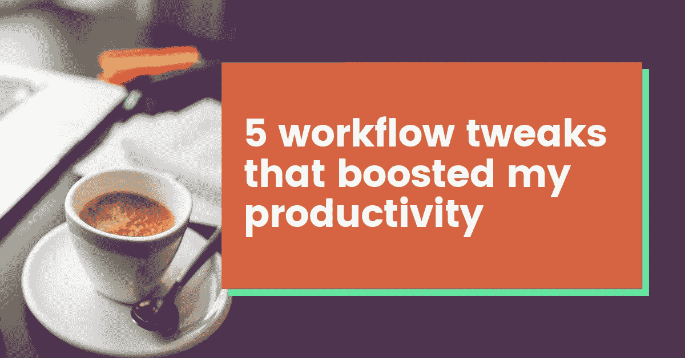

# 提高我工作效率的 5 项工作流程调整

> 原文：<https://medium.com/swlh/5-workflow-tweaks-that-boosted-my-productivity-10d1a4301a1b>

作为一名全职自由职业者，我是这样做的

我曾经是生产力黑客的狂热读者。互联网上充斥着关于你必须拥有(或不能拥有)哪些成功习惯的文章，或者百万富翁企业家的日常生活是什么样的，我以公司最快的速度阅读了这些文章。