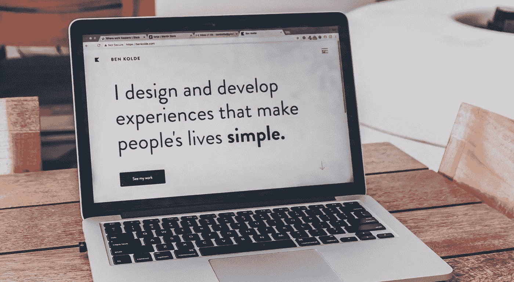

# 50 个激发灵感的个人作品集

> 原文：<https://medium.com/swlh/50-personal-portfolios-for-inspiration-e006c812c98d>

## 当你创建或改进你的网站时，你可以利用的例子

Source: [Unsplash](https://unsplash.com/photos/bs2Ba7t69mM)

# 介绍

无论你是在申请工作，试图让你的工作更有影响力，还是仅仅想在互联网上闯出一片天地，你都应该有自己的网站。

创建和更新你过去的工作和经历的个人作品集是一个很好的工具，既可以联系到其他人，也可以反映你的工作。最起码，有自己的域名还是蛮酷的。

有了像 Wordpress、Squarespace 和 Wix 这样功能强大、价格合理的工具，进入门槛就非常低了。即使你不是一个有经验的网站开发者或设计师，你也可以创建一个非常棒的网站。

# 入门指南

当我开始创建我的网站时，我发现弄清楚从哪里开始是这个过程中最困难的部分。

我解决这个问题最有效的方法就是看看其他的个人作品集和网站，分析我喜欢和不喜欢的地方。这让我在开始设计时，对自己想要创造的东西有了更清晰的想法。

> “我不创造。上帝创造了。我集合起来，从各个地方偷东西来做”——乔治·巴兰钦

幸运的是(大声喊出来，过去式我)，我收藏了许多我在旅途中遇到的最喜欢的。

不再赘述，这里有 50 个个人投资组合和网站的例子供你参考。尽情享受吧！

 [## 旧金山的产品设计师 Steph Parrott

### 你好。我是斯蒂芬。我是一名产品设计师，目前在 Box 工作。最初来自伟大的白色北方，现在住在…

www.stephparrott.com](http://www.stephparrott.com/)  [## Angela Nguyen M_ -视觉交互设计师

angelanm.com](http://angelanm.com/)  [## hey@rleonardi.com·罗比·莱昂纳迪

### 罗比·莱昂纳迪是居住在纽约市的自由职业者。他做插图、设计和动画。他的专长…

www.rleonardi.com](http://www.rleonardi.com/)  [## 谭杰文

### 白天是 NYT 的设计师。夜间目录和抄本编辑。机器人大脑。

tanmade.com](http://tanmade.com/)  [## 关于韦德·杰弗瑞

### 韦德杰弗瑞是纽约的设计师和艺术总监，他的实践是基于创造长期的…

www.wadejeffree.com](http://www.wadejeffree.com/about)  [## 我是加里·盛

### 谷歌工程师/杜克大学和 IMSA 大学校友/跳舞的菠萝的联合创始人/寻求正义的活动家。音乐，设计…

www.garysheng.com](http://www.garysheng.com/)  [## 工作

### 我提供了概念、方向、设计和艺术指导，奥利弗·哈里斯提供了额外的帮助。这些在哪里呢…

www.pandayoghurt.co.uk](http://www.pandayoghurt.co.uk/)  [## 布雷特·贝杰龙

### 布雷特是纽约市的创意总监。

brettbergeron.com](http://brettbergeron.com/)  [## 玛丽卡·法夫尔

### 法国艺术家玛丽卡·法夫尔的作品

malikafavre.com](http://malikafavre.com/)  [## Brittany Chiang |前端软件工程师

### 注重设计的前端软件工程师，专注于构建漂亮的界面和体验

brittanychiang.com](https://brittanychiang.com/)  [## 梅勒妮·戴维- UX 设计/艺术指导

### 我是来自奥地利的 UX 设计师和艺术总监，住在柏林。

melaniedaveid.com](http://melaniedaveid.com/)  [## 作者 Stella Ding -我的作品集

### 2016 年夏天，我在 Joy 实习，在 Y Combinator 公司实习。我在 YC 的时候…

bystellading.com](http://bystellading.com/?ref=uxdesignweekly)  [## 拉斐尔·德罗雷斯

### 自由前端开发人员在比利时根特。专注于网络、创造性的互动和流畅的动画。

rafaelderolez.be](https://rafaelderolez.be/)  [## 行星科学家|品牌约翰

### 其他兴趣包括远端撞击喷出物的形成；冲击喷射；剥落；…的冲击源

brandoncjohnson.com](http://brandoncjohnson.com/)  [## 亚历克斯·拉卡斯

www.alexlakas.com](http://www.alexlakas.com/)  [## 萨夏·格雷夫:设计师、开发商、企业家

### 萨夏·格雷夫:设计师、开发商、企业家

Sacha Greif:设计师、开发商，Entrepreneursachagreif.com](http://sachagreif.com/)  [## 奎恩顿·J·哈里斯

### 昆顿·哈里斯不断发展的故事

quinntonharris.strikingly.com](http://quinntonharris.strikingly.com/)  [## Sean halp in-网页设计师和开发人员-关于

### 肖恩哈尔平，爱尔兰网页设计师在加拿大多伦多的投资组合。

seanhalpin.io](http://seanhalpin.io/)  [## 工作

### 平面设计，绘画，版画，艺术。

www.marleighculver.com](http://www.marleighculver.com/)  [## 托尼·多里奥

### 托尼还发现了一些名人坐在别致椅子上的照片，这些照片是在温暖舒适的摄影棚里用…

tonydorio.com](http://tonydorio.com/)  [## 关于

### 在学术界之外，我为 YouTube 制作在线视频内容，专注于教育的交叉领域…

taharkhan.com](https://taharkhan.com/)  [## 谁是“红色”？-红色俄国佬

### LinkedIn | Twitter |脸书 07 年:毕业于叶史瓦大学 09 年-'11 年:与瑞秋结婚，搬回西雅图，学习…

redrussak.com](http://redrussak.com/)  [## 关于

### 我所做的大部分事情，都是着眼于我的工作有多酷，我如何能不断做新的事情，以及我如何能…

www.hankgreen.com](https://www.hankgreen.com/)  [## 妮可·赛迪

### 我是一名居住在阿姆斯特丹的 UX 设计师。我热衷于旅行、合作和通过我的…

nicolesaidy.com](https://nicolesaidy.com/)  [## 安德鲁·黄

### 音乐人兼视频制作人黄立人官方网站。

andrewhuang.com](http://andrewhuang.com/)  [## 哈里斯堡网页设计和 Squarespace 开发商

### 哈里斯堡网页设计公司。我作为 Squarespace 开发者&设计师的经历让我…

www.devonstank.com](https://www.devonstank.com/)  [## 新加坡为基础的前端工程师，专门从事建立商业网站，以丰富的互动网络…

### 提供创造性的设计方案来解决商业问题是我最擅长的。我用 JavaScript、CSS、Java 和…

jessdesigntan.com](http://jessdesigntan.com/)  [## 查理·韦特作品集

### 查理·韦特是体验设计总监@GoPro 和前互动总监@Focus Lab。跟随他的工作…

www.charliewaite.me](http://www.charliewaite.me/)  [## 关于

### Ximena Vengoechea 是一名作家、插图画家、设计师和研究员。她的背景是产品战略、行为…

www.ximenavengoechea.com](http://www.ximenavengoechea.com/)  [## 关于

### 哥伦比亚 2014 年|都市人|美食家|探险家|有抱负的尤克里里教徒|旅游癖

www.sarahlichang.com](http://www.sarahlichang.com/)  [## Pascal van Gemert -网络开发人员-交互式简历

### 我是 Pascal van Gemert，一名精通前端技术的 ninja webdeveloper /创意程序员。

www . pascalvangermert . nl](http://www.pascalvangemert.nl/#/profile)  [## 主页

### 获奖的设计师和总部设在英国剑桥的开发人员的组合网站；专注于丰富的互动…

www.adamhartwig.co.uk](http://www.adamhartwig.co.uk/)  [## 劳伦·妮可·史密斯

### 劳伦·妮可·史密斯是一名设计经理

www.laurenicolesmith.com](http://www.laurenicolesmith.com/)  [## 约书亚·麦卡特尼-作品集

### 嗨，我是乔希·麦卡特尼——一位来自纽约，出生于英格兰北部的资深艺术总监，也是一名前婴儿。

www.joshuamccartney.com](https://www.joshuamccartney.com/)  [## 伊恩·恩德斯

ianenders.com](http://ianenders.com/)  [## 主页

### 凯丽·史怀哲是 CSCH 的创始人，这是一家帮助企业和个人的创新战略和咨询公司

www.callieschweitzer.com](http://www.callieschweitzer.com/)  [## 纳撒尼尔·科洛克

### 纳撒尼尔·科洛克的简历和背景。

www.nathanielkoloc.com](https://www.nathanielkoloc.com/)  [## 乔恩·凯尔

### 我是斯巴达克斯。

jon-kyle.com](https://jon-kyle.com/)  [## 戴德勒“DEDA”贝恩:投资组合

### Deidre 'Deda' Bain 的官方作品集网站，查看她的网页设计和平面设计作品集。

deda.me](http://deda.me/)  [## 拉齐特·古普塔

### 我受到人类行为和好奇心的启发。从企业到零售，我对创建…

rachit91.github.io](https://rachit91.github.io/#scroll-to-work?ref=uxdesignweekly)  [## 乔伦。

### 这是乔伦。我是 UX 战略家。我研究和设计对双方都有意义的战略、服务&产品…

www.thisisjoren.com](https://www.thisisjoren.com/)  [## 工作

### 👋🏻我是莉安娜！我在 Atlassian 设计东西。

www.leannaleung.me](https://www.leannaleung.me/)  [## 瑞安·米格拉夫·❧

### 瑞安·米格拉夫斯的个人网站。我希望你的生活充满冒险和爱。

www.ryanmiglavs.com](http://www.ryanmiglavs.com/)  [## 主页

### Nickki Nguyen 是加州奥克兰的一名设计师。

itsnickki.com](https://itsnickki.com/)  [## 保罗·安内特

paulannett.com](https://paulannett.com/)  [## 凯琳·洛尔-在找合适的东西吗？

www.kellynloehr.com](http://www.kellynloehr.com/)  [## 泰勒·罗杰斯

### 泰勒·罗杰斯是 WeWork 的产品设计师，之前在 Bespoke Post 工作。

tdr.io](http://tdr.io/)  [## 投资组合

www.willhchan.com](http://www.willhchan.com/)  [## Buzz Usborne -产品设计师

### @GetPrevue & Designer @HelpScout 创始人 Buzz 的作品集。前设计主管@Atlassian、@CampaignMonitor &…

www.buzzusborne.com](https://www.buzzusborne.com/)  [## 邵可佳设计

### 我是谷歌的 UX 设计师。之前，我在可汗学院、SAP 和惠而浦实习，并在大学学习人机交互…

www.kejiashao.com](http://www.kejiashao.com/) 

咻。这当然不短，但我希望它能给你提供足够的灵感，让你在创建或改进自己的网站时从中汲取灵感。

声明一下，我最喜欢的一些人包括[加里·盛](http://www.garysheng.com/)、[罗比·莱昂纳迪](http://www.rleonardi.com/)、[斯特拉·丁](http://bystellading.com/)和[莉安娜·梁](https://www.leannaleung.me/)。还有很多值得一提的例子(上面提到了其中的许多)，但目前就这些了。祝你好运！

感谢阅读！如果你喜欢这篇文章，请继续向鼓掌按钮展示你的爱。对更多的帖子感兴趣吗？请务必[关注我](https://twitter.com/cdeweyx)并订阅下面的[我的简讯](https://www.conordewey.com/)以接收任何新内容。想了解更多关于我和我在做什么，请查看我的网站。

## 这篇文章发表在《创业公司》杂志上，这是 Medium 最大的创业刊物，有 330，853 人关注。

## 订阅接收[我们的头条新闻](http://growthsupply.com/the-startup-newsletter/)。

