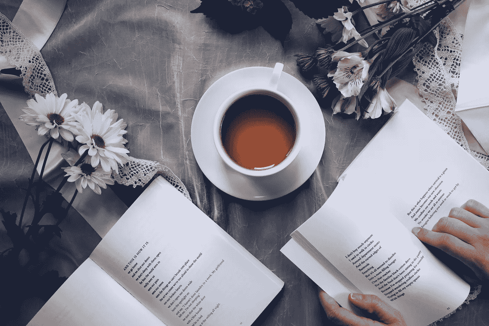

# 50 个有重大影响的自我护理小行动

> 原文：<https://medium.com/swlh/50-small-acts-of-self-care-with-a-big-impact-67baa897d1b2>

## 日常工具包

Photo by [Thought Catalog](https://unsplash.com/photos/OJZB0VUQKKc?utm_source=unsplash&utm_medium=referral&utm_content=creditCopyText) on [Unsplash](https://unsplash.com/search/photos/tea?utm_source=unsplash&utm_medium=referral&utm_content=creditCopyText)

1.  睡眠充足。
2.  做 5 分钟瑜伽，伸展背部、腿部和肩部。
3.  早上，在开始新的一天之前，花 10 分钟喝喝茶或咖啡，或者早点到办公室，安静地喝杯咖啡。
4.  微笑着开始新的一天，想想你感激的 5 件事。
5.  前一天晚上为你的一天做好准备，以避免早上的压力。
6.  小心地将护肤品或润肤露按摩到皮肤里，而不是漫不经心地涂抹。
7.  使用[芦荟应用程序](https://aloe.club/)设计你的自我护理仪式，并给自己发送温和的自我护理提醒。
8.  以一种你真正喜欢的方式使用你的通勤时间:读一本书，听你最喜欢的播客或最喜欢的音乐。
9.  使用 [Offtime](http://offtime.co/) 应用程序，在我们超互联的世界中找到一些数字平衡。
10.  吃一顿健康的早餐，即使你度过了紧张的一天，也不会感到饥饿。
11.  当你拿自己和别人比较时，停下来。
12.  在你累了之前上床睡觉，让自己放松下来，读一本书，拥抱一下，喝杯茶或者听一些放松的音乐。
13.  使用[睡眠应用](http://www.sleepfulnessapp.com/)引导冥想和睡眠轨迹，以平稳入睡。
14.  用正确的食物滋养你的身体。这比你想象的要容易。
15.  使用[发泄 App](http://www.vent.co/) 匿名表达自己的感受。
16.  去接受治疗，即使你不认为你“需要”它。每个人都需要一些心理健康护理。使用 [Talkspace](https://www.talkspace.com/) 应用程序作为传统方法的一种方便且廉价的替代方案。
17.  在任务之间休息一分钟，深呼吸。
18.  以你最喜欢的方式移动你的身体——在你的公寓里跳舞，散步，骑自行车旅行或者去上瑜伽课。
19.  充分利用你的午餐和咖啡休息时间:去散步，读一本书，小睡一会儿，做任何你现在需要的事情。
20.  使用[瑜伽工作室应用](http://www.yogastudioapp.com/)在家进行快速 DYI 瑜伽练习。你可以下载特定的课程，也可以创建自己的瑜伽流程，然后用超级平静的瑜伽声音观看和聆听指导。
21.  画，涂鸦或涂色什么的。
22.  点蜡烛或熏香。
23.  向你生命中最重要的人表达你的感受。告诉他们到底发生了什么。
24.  在你最喜欢的地方度过时光。一家咖啡店。公园里的长椅。你舒适的沙发。一个图书馆。一个美丽的花园。
25.  以积极的肯定开始你的一天，比如“我被爱着”
26.  在网飞狂欢一天——如果这是你现在需要的。
27.  注意——你吃什么，说什么，想什么，怎么做。
28.  冥想——即使只有 5 分钟。如果你不知道如何去做，平静或 T2 会提供简单的指导冥想。
29.  自己花点时间。你做什么都不重要。和自己在一起就好。
30.  洗个泡泡浴。即使你是一个男人，相信我——它对你的灵魂有魔力。
31.  每天检查自己，给自己需要的东西。你饿了吗？吃点东西吧！你累了吗？休息一下！你感到孤独吗？联系你的家人或朋友！
32.  准备工作时、打扫卫生时、心情不好时，放些好音乐，或者只是一直放。
33.  创造一些东西。
34.  说“不”。
35.  洗个长长的热水澡。
36.  喝杯茶放松一下。
37.  只为自己做一顿饭，心无旁骛地享受。
38.  做你最喜欢的童年活动。
39.  看你最喜欢的电影。
40.  在床上吃早餐。
41.  看日落。
42.  自己按摩。
43.  原谅自己，放下过去。
44.  在家做个快速面部美容。
45.  小睡一会儿。
46.  有高潮。
47.  尝试桑拿或蒸汽浴。
48.  通过写日记来释放你的想法和情绪。
49.  请一天精神健康日。
50.  做一些让你发笑的事情。

# 你准备好升级心态了吗？

注册到我的电子邮件列表，就可以获得我的免费资源和我的最佳内容的每周摘要，与其他伟大的作家混在一起。我希望你能加入我的部落！

**👉🏼** [**注册**](http://bit.ly/signup-lizhuber) **到我的邮箱列表**

[http://bit.ly/signup-lizhuber](http://bit.ly/signup-lizhuber)

**👉🏼** [**注册**](http://bit.ly/signup-lizhuber) **到我的邮箱列表**

## 这篇文章发表在 [The Startup](https://medium.com/swlh) 上，这是 Medium 最大的创业刊物，有 326，962+人关注。

## 在这里订阅接收[我们的头条新闻](http://growthsupply.com/the-startup-newsletter/)。

