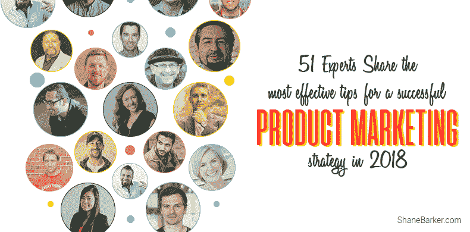
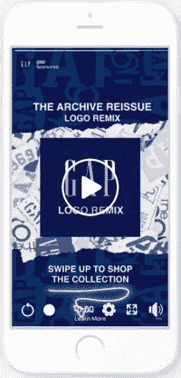

# 51 位专家分享了 2018 年成功产品营销策略的最有效技巧

> 原文：<https://medium.com/swlh/51-experts-share-the-most-effective-tips-for-a-successful-product-marketing-strategy-in-2018-fbc5c02d37fe>

> 这篇文章最初出现在谢恩·巴克的博客上。

产品可能来来去去，但对营销的需求是永恒的。你可能会采用尖端技术或利用最好的研究来创造新产品。但现实是，只有当你有一个稳健的产品营销策略时，你才能指望回报。

然而，即使营销本身的概念可能是不朽的，但营销趋势是不断发展的。为了成功获得产品营销的好处，你需要在游戏中处于领先地位。要做到这一点，你需要了解市场营销的最新趋势以及人们想要什么。

在这篇文章中，我与 51 位专家合作，为你带来一些他们最喜欢的 2018 年产品营销策略。但首先，这里有一些我个人最喜欢的。

# 1.个性化客户体验

无论你身处哪个行业或企业，个性化对改善客户体验都大有帮助。这无疑是，我最喜欢的 2018 年产品营销策略。

你能做的最简单的事情就是提供与客户感兴趣的产品相似的产品建议。无论你是想在网飞上找节目还是在亚马逊上找产品，你肯定都遇到过这样的建议。

*图片经由网飞*

这些有助于实现三个重要目标。这表明你关心你的顾客和他们的喜好。这也表明你在尽力帮助他们。你也要确保你的产品被展示给相关的观众。

本质上，你是在推销你的产品，而不是听起来咄咄逼人，垃圾邮件，甚至是贫困。

# 2.利用 Instagram 和故事

Instagram 平台和 Insta Stories 功能正在重新定义品牌看待营销的方式。如果你还没有利用它们，你就错过了一些重要的机会。如果你真的对营销很认真，Instagram 需要成为你产品营销策略的一个组成部分。

该平台一直在以令人难以置信的速度增长，已经拥有超过 [8 亿](https://www.statista.com/statistics/253577/number-of-monthly-active-instagram-users/)月活跃用户。然而，Instagram Stories 却是一个更大的惊喜。它不仅超过了它的前辈 Snapchat，而且现在拥有超过 3 亿的每日用户。

故事是吸引观众的好方法。通过标签、位置、投票和贴纸等功能，你可以让你的产品脱颖而出。此外，如果你在 Instagram 上有超过 10，000 名粉丝，你甚至可以将你的故事链接到你的产品页面。现在，你甚至可以在 Instagram Stories 上播放[轮播广告。](https://business.instagram.com/blog/carousel-ads-for-instagram-stories/)

*图片来自 Instagram*

# 3.与有影响力的人合作

每当我认为我已经谈了足够多的影响者营销，我会惊喜地发现还有很多。影响者营销是现在产品营销的下一件大事吗？嗯，这更像是目前最好的东西，而且它会一直留在这里。

[在一项调查中，54%的女性表示，她们在看到有影响力的人代言的产品后会购买。更有趣的是，他们中有 63%的人根据影响者的推荐使用过新产品或品牌。一些他们可能从未考虑过的事情。难怪这是获得客户最快的方法之一。](https://activate.bloglovin.com/docs/whitepaper/consumer_survey_november_2016.pdf)

因此，如果你试图实施一个必然成功的产品营销策略，现在就开始利用影响者营销。

# 专家分享的 51 种产品营销策略

看看这 51 个由专家分享的产品营销策略，可以帮助你提升你的产品营销。

# #1.赛义德·巴尔基——[optin monster](https://www.optinmonster.com/)

了解你的客户角色是一个经常被忽视的，但却是更好地与你的产品营销目标受众沟通的重要组成部分。一旦你知道你在和谁说话，所有的事情都会水到渠成。你能够写出更好的博客文章，并包含正确的关键词，将你的目标市场一次又一次地带回你的网站。

# #2.[iSocialFanz](https://medium.com/u/ec6da987622c#3.<a class=)

产品营销必须将话题从产品是什么或做什么转移到为什么要创造产品以及产品将如何影响消费者的生活。3/4 的千禧一代宁愿把钱花在体验上，也不愿花在他们渴望的产品上。

这是一个很能说明问题的统计数据，应该会吓到那些仍在宣传产品特性或制作只谈论产品是什么的广告的产品营销人员。

产品营销必须关注围绕产品创造的体验以及产品为消费者创造的体验，因为这是当今数字原生消费者所关心的。

# #5.[Ranky](https://medium.com/u/198ecf0318c6#6.Yoav Vilner——<a class=)

为你的产品营销投入大量时间研究竞争对手。某个时候肯定有过类似的产品发布，他们要么成功了，要么失败了。了解他们做对了什么，哪里做错了，这样你就能增加成功的机会。除此之外，瞄准准确的买家角色是强制性的，能够接触到他们需要合适的营销团队。

# #7.丹·墨菲[DBD 国际](https://medium.com/u/5670c4406c1b#8.大卫·布瑞尔——<a class=)

品牌是差异化的艺术。因此，首先，你必须评估产品类别空间的噪音水平。

从那里，你了解到 2 件事:1)空间有多吵？(这样你就可以正确估计别人会听到什么)，以及 2)其他人在做什么，这样我们才能找到真正的差异化点？

这些发现随后被应用到从品牌故事到品牌声音和设计的方方面面。专注于这一点，因为经过适当的分析，你将拥有独一无二的声音，而不是试图成为每个人的一切(这将导致一个稀释的混乱，对任何人都没有意义)。

然后，不断提炼信息，明确设计、信息、外观和感觉，并删除所有多余和无关的信息。这导致了清晰和统一的信息。你想要从等式中删除每一点数字脂肪，这样你的品牌就变成了一个精简、吝啬的品牌机器。

# #9.[塞姆拉什](https://medium.com/u/74299d3ff72c#10 <a class=)

在过去，了解你的客户并利用这些知识来开发吸引用户的产品是非常重要的。如今这还不够。

竞争变得越来越激烈，为了打破噪音，你的信息必须非常个性化，并且应该在一个完美的时间传递。

当我们只制定产品营销战略时，我们主要关注技术和流程相关方面，如正确的规划流程、跨渠道和跨区域的活动执行以及投资回报跟踪。

但是一旦你掌握了这些基本原则，你在产品营销策略中的首要任务就是定义“如何与你的客户建立关系，以及如何让他们关心你的产品和品牌。”

我们最终发现，这些问题的答案与技术或流程优化关系不大，更多的是关于鼓励营销团队更具创造性和同情心的文化。

# #16.戴维·m·霍布森— [创始人](http://www.foundr.com/)

根据我的经验，成功的产品营销策略有三个关键组成部分。

首先是研究和理解。真正花时间去了解你的受众和客户。他们是谁，他们的痛点是什么等等。

总是乱猜。可能的话，在购买前进行调查和验证。当人们手头拮据时，他们的反应会非常不同。

调查和民意测验有助于你测试理论和了解你的受众，售前和验证将向你证明你是否在正确的轨道上(或没有)。

太多的企业家对他们的想法感到兴奋，冲出去，并希望其他人也一样兴奋，但如果没有正确的研究和理解，它可能会落空。

有时可能只是他们用一种不同于目标客户的方式进行了沟通。

第二个关键因素是不要执着于你的想法。这是一个巨大的错误，与第一个要素(研究和理解)紧密相连。有趣的是，我倾向于在更有经验和更成功的企业家身上看到这一点。

他们已经学会听从自己的直觉，拒绝“反对者”。但有时他们就是错了，不想听。如果你的想法和计划没有得到其他人的认同，你必须愿意放弃它。你越成功，你身边就有越多“是的”男人和女人。

如果有人不同意你的想法。拥抱它。深入。问问你自己，“如果他们是对的呢？”

三个。执行力就是一切。一旦你决定了要做什么，就不要在作战计划上花太多时间。设定严格的日期。负起责任，最好设置一些看板冲刺。

最后，奖金部分来自罗伯特·格林的《权力的 48 条法则》

“接受这样一个事实:没有什么是确定的，也没有什么法律是固定不变的。保护自己最好的方法就是像水一样流动无形；永远不要赌稳定或持久的秩序。一切都变了。”

祝你好运！

# #17.瓦伦丁·拉杜——[全转换](https://www.omniconvert.com/)

了解谁是你的买家角色
1。有时候，覆盖许多角度和广泛的目标群体似乎很有吸引力，但如果没有足够的意识开始面向所有目标&所有市场，那么肯定对你的产品有害

2.放大痛苦！
你的第一份工作不是吹嘘你的功能或你的解决方案。你的工作是强调你的买家角色带着你正在解决的痛苦生活有多难——然后才谈论你对他的问题的解决方案。

3.情绪>数据
使用尽可能多的数据来产生情绪，以强调你的产品的不同点——即使你在 b2b 领域，人们也在购买你的产品，而不是公司。

4.不要交流，除非你知道这肯定会对你的受众的新闻订阅/电子邮件收件箱产生影响——在这个注意力短暂的时代，你真的需要有一个出色的活动来引起注意。

5.如果你不做基于客户的营销，确保你与销售团队保持同步。营销、产品和销售部门应通力合作，制定成功的上市战略

6.数据驱动
在活动之前和活动期间，围绕活动、参与度、渠道、网站实验收集尽可能多的数据。

# #18.nicholeelizabethdemere.com

产品营销策略从一开始就面临着最大的出错风险——准确定位能为你提供产品/市场契合度的正确客户，并设计与他们对话的正确价值主张(语言-市场契合度)。

这是基础，如果你不能准确定位你的理想客户，并确定你的产品能满足他们的真正需求，世界上没有任何产品营销策略能拯救你。因此，在我研究“产品营销策略”之前，我会确保这个基础是坚实的——并且是基于从与理想客户的实际交谈中收集的客户声音定性数据。

这些访谈给你原材料，让你的价值主张正确，让你的广告和网页文案语言正确，并确定达到他们的最佳渠道。

从那以后，你就可以让他们进门了，但是一个真正成功的产品营销策略不能停留在收购上。最好的、最高的投资回报率战略关注的是留住客户，这需要在入职期间(甚至之前)引入客户成功要素，以实现立竿见影的效果，并帮助客户在未来实现他们的理想结果。这是激活病毒式口碑增长的因素，比你能想到的任何外部激励都要多。

# #19.[许愿池](https://medium.com/u/769b3fc4b4ad#20.詹姆斯·舍雷尔——<a class=)

大多数营销人员已经知道创造一个理想的客户角色有多重要，但是很少有人比最初的练习走得更远，“这就是我们认为我们的客户想要的。”

最近，我们的增长团队、产品/UX 团队和设计师们聚在一起，像往常一样起草网站变更/优化。然后，我们让首席运营官进来(冷)扮演我们理想客户的角色。如果有什么突出或没有任何意义，他们的困惑通知我们的设计，复制和产品开发。

扮演你的顾客可以让企业走出产品营销的回音室。

# #21.布莱恩·伯奇— [试运行](http://www.dryrun.com/)

知道。你的。顾客。不是你认为你的客户是谁，或者你希望他们是谁，而是他们是谁。这将有助于你建立一个强大的契合点，从而增强你的可信度和权威性。在这里，尽你所能首先辨别和定义那个人是谁，然后努力想象他们的角色。虽然这看起来像是一个非关键任务，但在这个项目上投入的时间将为您的业务的其他部分节省大量的时间和资源。

真的(真的！)擅长讲你的故事。以令人信服和真实的方式讲述您的故事，以一种非常真实的方式将您销售的“是什么”与“为什么”联系起来，从而在客户的整个旅程中打开良好客户关系、品牌倡导者和巨大投资回报的大门。

# #22.约翰·保罗·阿吉亚尔— [约翰·保罗·阿吉亚尔](http://www.johnpaulaguiar.com/)

对我来说，一个成功的产品营销策略应该在你的产品准备上市前至少 30-60 天开始。

你首先想知道世卫组织你的完美观众是谁，谁需要你的产品，为什么。

接下来你要找到你的观众在网上花时间的地方，社交平台、论坛、脸书、LinkedIn 群组等等

一旦你知道他们把时间花在哪里，你也想在那里，联系和互动，回答关于你的产品是什么和它将帮助解决什么问题的问题。

现在你想有一个强有力的故事，你为什么创造你的产品，谁帮助了你和其他人。

你想让人们和你联系起来，告诉他们你的产品是如何帮助你的，以及它将如何帮助他们。

一旦你想通了所有这些，你会想要开始建立你的产品发布或通知列表。

创建一个免费的电子书或短视频系列，以你的产品为目标，并开始让人们选择你的免费礼物，并通知你的发布日期。

如果在发布前的 30 到 60 天内做得正确，你将会有一个相当大的观众群，他们将会在发布日准备好跳到你的产品上。

额外提示:我在 12 月份的 Twitter 产品发布会上使用了脸书和 Twitter live 会话，我每隔 2-3 天就进行问答会话，回答任何与我的产品有关的问题。

这对于建立我的发布列表非常有效，而且对于在发布前每周几次在人们面前展示我的产品和发布日期也非常有效。

# #23.[大使](https://medium.com/u/d39a3ef7f9be#24.<a class=)

一个成功的产品营销策略的关键组成部分是围绕着与你的用户或客户建立良好的关系。以下是建立良好关系的 4 个关键要素…

1)参与——必须有双向对话。糟糕的产品营销策略只是“谈论”用户，理想情况下，你应该参与并建立信任，这样你就可以进行健康的双向讨论。

2)透明度—信任是通过透明度建立起来的。让用户了解决策过程。分享错误、学习和其他信息，既建立信任，又显示你是人..

3)反馈——鼓励反馈。确保听到用户的声音。对于大多数企业来说，用户/客户是你(作为一家公司)存在的理由。不要忘记这一点。征求反馈，继续迭代产品进行改进。

4)换位思考——站在用户的立场上。想想他们使用你的产品或服务的感受？这让他们在工作中看起来很棒吗？了解他们的动机，你就能在未来更好地与他们交流和互动。

一旦你停止与客户交谈，开始与他们建立关系，你会发现你的产品营销策略为你的用户和你的企业都带来了价值！

# #27.马特·贾纳威——【MattJanaway.co.uk 

从数字的角度来看，一个成功的[产品营销策略](https://www.smartinsights.com/digital-marketing-strategy/online-marketing-mix/creating-best-marketing-mix-product-launch/)始于匹配客户意图——这是经常被忽略的一点。在传统的线下世界，企业填补了产品需求的空白，而在网上，一个聪明的产品营销人员会匹配行业中我们称之为“搜索意图”的东西

这是一个反向营销策略，从根本上说是一个非常简单的战术。匹配“搜索意图”允许企业填补在线市场的空白，在这个市场上，互联网用户已经在搜索他们需要或想要的东西。

通过创造符合这一意图的新产品，企业可以大大减少促销商品所需的预算。这是因为反向营销可以帮助你做到这一点。在你发布新产品之前，先去网上市场调查你的想法。你可能会惊讶地发现你发现了什么新的空白，在那里你可以不费吹灰之力就切入市场！

# #28.[营销实验室](https://medium.com/u/13ea2332d307#29.迈克·麦克马纳斯— <a class=)

在当今饱和的市场中推出新产品时，了解如何利用“数字策略”达到最佳效果是成功推出产品的最重要因素。

与以往任何时候相比，传统营销人员和数字团队正走到一起，讨论他们如何在新的发布中平等地发挥自己的重要作用。

在某些情况下，当业务以数字为重点时，传统的营销策略被抛到一边，取而代之的是更智能的可追踪技术。企业开始看到融合 T2 和网上营销策略 T3 带来的巨大利益，从而在所有渠道产生轰动效应。

例如，线下和线上营销技术的融合应该通过提前几个月在网上“软发布”新一季服装系列的过程，用于时尚行业。

这确保了当季到来时，产品页面在谷歌搜索中排名靠前——这是一个简单但未被充分利用的策略。另一个很好的例子是“预购”为你的追随者提供在商品生产前预订商品的能力需要深入的前瞻性规划和实施，然而，这是亚马逊和苹果等公司使用的一个伟大策略。

下次你和你的团队推出新产品时，问问自己如何利用数字技术？正是这些小问题决定了产品发布会是成功还是失败。

# #30.[支援忍者](https://medium.com/u/be0403b44063#31.科迪·麦克莱恩——<a class=)

成功的产品营销战略的关键组成部分是:

1.了解谁是你的客户，他们关心什么

无论他们是千禧一代还是 Z 世代，为了让你成功，他们关心的事情和他们愿意花费时间(和金钱)做的事情必须与你的产品相交。

2.价值主张

创建一个可行的原型，然后根据市场对你的提议的反应慢慢调整。这一阶段的灵活性将决定产品的未来；例如，你可能设想你的产品是用于一种功能，但发现它实际上被客户用于其他用途。找到你的产品最强的用途，以更好地适应市场。

3.展示对市场需求的理解

客户并不关心你的产品是否是最好的，他们关心的是你的产品能为他们做什么——以及这是否能快速和最佳地完成。你必须证明这一点，这是对市场真正需求的理解。你不想把你的产品卖给不需要它的人，所以花点时间精心策划一个故事，让能使用它的人产生深深的共鸣，因为这些人最终会成为你最大的拥护者(和关联者)。

4.通过社交媒体进行 A/B 测试

这与展示对市场需求的理解密切相关。A/B 测试是一种让客户决定你产品未来的高成本意愿。如果你没有关于人口统计的具体证据，A/B 测试是一种昂贵的(但非常有效的)获得更多信息和一些 ROI 的方法。

5.让数字来决定

在 A/B 测试之后，结果将决定最终上市和销售的产品类型。最重要的是，你的预算将决定你营销策略的每个阶段进行得如何。通常，你的钱越多，你的价值主张越有吸引力，你被潜在客户看到的机会就越大。

# #32.[邮鸟](https://medium.com/u/58ca320d0123#33.安德里亚·卢比尔——<a class=)

了解你的受众，定位你的信息，保持你的品牌的一致性，并确保它有一个强大的声音和影响力，是一个成功的产品营销战略的关键组成部分之一。

# #34.[最近有人引用杰夫·贝索斯的话说，广告是为那些不够好的产品做的。有时候我对营销也有同感。

如果做得好，市场营销需要付出很多努力。这需要很多人，大量的时间，通常还需要一些现金。太多的事情发生在糟糕的产品上。

也就是说，这是一个嘈杂的世界。

即使是伟大的产品也需要推广。

在我看来，成功的产品营销的一个关键步骤发生在产品上市之前，甚至在你有产品要卖之前。

我说的是与有影响力的人建立关系，他们可以帮助你以有机的、自然的、本质上可分享的方式传播信息。

选择合适的人，培养长期的人际关系，帮助别人，这样你就建立了一个银行账户，可以偶尔提取。这是一种经常被忽视的初期营销方法，它可以用很少的资金投入就让一个新产品或服务有一个良好的开端。

](https://medium.com/u/b3b03f4c6215#35.<a class=)

# [#37.](https://medium.com/u/b3b03f4c6215#35.<a class=)[Appcues](https://medium.com/u/fe2a78739c9b#38.泰·马宁——<a class=)

产品营销策略的成功在很大程度上取决于两件事。对客户的同情和内部影响的能力。

顾客同理心要求产品营销人员不仅要抛开自我，倾听顾客的心声，还要采取行动，为他们解决问题。最佳的产品营销策略为内容生产、产品反馈和走向市场的变化留出空间，从而在客户的旅程中为他们提供帮助。

内部影响的能力需要大量的信任。产品营销必须被视为公司内部的主导声音，以跨职能整合团队。人们必须相信产品营销能看到全局，才能接受他们的观点，他们必须看到产品营销不仅能发现问题，还能帮助解决问题。

# #39.林塞·安德森— [交通和线索](http://trafficandleads.com/)

我在我的点击技巧中总结了成功的<online>产品营销策略的关键要素。查看以下步骤:</online>

好奇心。创造能点燃潜在客户好奇心的内容是成功营销的第一步。这包括图像、故事和通过视频、博客帖子和图像展示的个性。

L —土地。在客户好奇并浏览你的网站后，你的网站必须是移动友好的，安装了像素和分析，看起来专业。

我—不可抗拒的提议。99.9%去你网站的人不会准备购买。不要让他们从缝隙中溜走，开发一个不可抗拒的提议，窃取他们的电子邮件地址，这样你就可以建立关系。

C —培养。继续通过电子邮件营销，机器人和直接重定向广告建立信誉。

K —继续走。在线营销活动中最难也是最重要的部分是一致性。坚持发送电子邮件，重新定位，确保你的潜在客户继续从你和你的品牌那里听到消息。

# #40.帕特里克·坎贝尔— [利润井](https://www.profitwell.com/)

对我来说，产品营销策略的核心是比以往任何时候都更好地了解你的目标客户；我说的不是 HubSpot 爷爷和 Marketo 奶奶的买家角色。

我说的是量化的人物角色，其中你知道每个人物角色最有价值和最没有价值的特征，这些买家经常去哪里，以及最终你的买家的支付意愿。有了这些数据，产品营销的所有其他方面都变得容易了，因为你做出了明智的决定，避免了猜测和检查。

# #41.[多亏了 livestream.com 的一项研究，我们现在知道 80%的用户宁愿看视频也不愿看博客。这是否意味着博客在不久的将来会被淘汰？还是还有他们的位置？

我不认为博客会消亡。虽然许多用户可能更喜欢看视频而不是读博客，但在很多情况下这是不可能的——例如在工作中或通勤时。在这些情况下，阅读是更好的媒体形式。你也有 20%的人宁愿看内容也不愿看视频。另外，为了让一个视频在搜索引擎中排名靠前，它需要有围绕它的内容。我给博客作者的建议是混合内容——这样你会让每个人都开心，而不会疏远某一部分。

5-由于最近顶级公司的黑客攻击，安全性和隐私成为消费者最关心的问题。作为数字营销人员，我们如何应对这些恐惧？

我们可以做很多事情来保护客户的安全和隐私。首先，我建议使用密码管理器。许多营销人员在多个网站上使用相同的密码，这将用户的安全和隐私置于风险之中。第二，我们应该加密我们的网站和商店，尤其是那些接受客户付款的网站和商店。加密设备是另一个重要步骤，尤其是如果您经常携带工作设备旅行。最后，我们还应该保持软件更新，以降低黑客攻击发生的风险。向消费者解释你采取的步骤，并鼓励他们也这样做。

6-没有跟上最新趋势的营销人员可能会落后。但是以现在科技发展的速度，我们如何保持领先？

幸运的是，这并不像听起来那么难。首先，关注行业内的顶级博客很重要。考虑像 QuickSprout、搜索引擎 Land 和 Razor Social 这样的网站。你可以订阅他们的时事通讯，并在上下班途中阅读每日文摘。

第二，和同事聊聊。找出他们听到了什么，并讨论你自己的新闻。你也可以在 Twitter 和 LinkedIn 上与人交流。另一个好主意是利用像谷歌趋势和谷歌警报这样的工具。使用趋势找出人们发布和搜索的内容，并为相关营销关键词设置提醒。

最后，关注大品牌。他们有资源付钱给人们，让他们跟上潮流。

](https://medium.com/u/bcea471fe804#42.<a class=)

# [#43.Guy Sheetrit—](https://medium.com/u/bcea471fe804#42.<a class=) [超越顶级 SEO](https://www.overthetopseo.com/)

定义明确而现实的目标，计划越详细，你的整体结果就越好。
在建立一个富有成效和成功的产品营销策略时，你应该总是能够回答以下问题:
受众意识(内部和外部)。
有针对性的市场知识。
产品的价值。
顾客/卖家视角。
沟通和优先级。
为最终客户和未来客户增加价值。

一旦你有了上述问题的答案，你应该对你的活动有一个超级清晰的了解。

# #44.克里斯托弗·琼斯——[LSEO.com](https://lseo.com/)

这三个产品营销策略将帮助你的产品脱颖而出，让人们掏钱购买你的产品。

首先，你需要一个令人信服的故事。你做的东西人家不买；他们买你为什么这样做。所以你需要一个令人信服的理由来解释你为什么这么做。回答你解决了什么问题，解决了问题会让他们有什么感觉。

第二，虚心接受反馈。作为超过 25 家公司的技术投资者，我一次又一次地学到了一件关于建立伟大公司的事情——伟大公司是通过尽快将产品送到客户手中并公开听取反馈来建立的。顾客喜欢什么？他们讨厌什么？什么会使产品更好。变得虔诚地倾听产品反馈，随着时间的推移，你会创造出非常成功的产品。

最后，建立最终的客户形象，利用脸书受众营销和重新定位，引导您的客户通过您的销售漏斗。当然，根据你的产品类型，你可能要考虑谷歌广告词(和谷歌重新定位)、电子邮件、移动营销和其他增长型营销技巧和策略。

# #45.里卡多·卡萨斯— [华氏营销](http://www.fahrenheit.io/)

品牌:消费者在购买某一特定产品时会受到各种选择的轰炸。一个坚实的产品营销策略，在各种媒介中保持一致，是一个很好的起点。确保你看起来比货架上的邻居更好，更有光泽。

可信度:创建一个内容库，并通过社交媒体渠道进行整合。人们不一定要阅读材料，但他们需要看到它就在那里。如果你的品牌在网上随处可见，当消费者在货架上看到你的产品和竞争对手的产品时，他们会记住你。

价值:每个人都喜欢交易。确保你的产品看起来更好，更可信，价格与竞争对手相当。为消费者提供便利。

# #46.[拉斐尔·加特](https://medium.com/u/2c08a1095c0a#47.<a class=)

我坚信成功的产品营销策略有三个主要组成部分:

1.了解你的市场。大多数创业公司/产品失败是因为他们不了解他们的市场，他们对竞争对手、市场规模、客户需求等一无所知。

2.专注于建立信任，而不是推销。请停止在每一份《脸书邮报》、时事通讯、YouTube 视频和博客文章中推销。首先要做的是与你的目标受众建立关系，建立信任。

3.只相信数据。在商业(和营销)中，没有本能这回事。“相信你的直觉”是胡扯，除非你是史蒂夫·乔布斯或埃隆·马斯克。对于普通创业者(比如我和你)，最好的做法是:相信数据！

# #49.[布里兹](https://medium.com/u/fa86a73924c8#50.杰西·范多伦——<a class=)

从帮助一个客户的业务增长 800%的过程中，我学到了以下几点对于创造一个成功的产品营销策略是至关重要的。

1.实验，实验，实验！通过 A/B 测试，你可以清楚地识别并了解你的受众，从那里你可以开始考虑利用一个便宜的、可扩展的市场来瞄准你的理想客户，比如脸书。

2.利用个性化的力量——通过不断个性化和优化您的活动，您可以期待客户互动在您的产品营销战略中大幅提升。

3.一旦你找到了适合你的产品营销策略，确保尽可能自动化这个过程。通过实施自动化，您的系统将变得运行成本更低，更多高质量的销售线索将会开花结果。

# #51.[普通债券](https://medium.com/u/e0bff166a706?source=post_page-----fbc5c02d37fe--------------------------------) — [普通债券市场](http://www.normbondmarkets.com/)

最有效的产品营销策略是了解你的目标受众。利用内容营销。构建销售漏斗。为发布前、发布中和发布后的策略留出时间。检验你的假设。基于结果进行优化。重复一遍。

> 这篇文章最初出现在谢恩·巴克的博客上。

**关于作者**

[谢恩·巴克](https://shanebarker.com)是[内容解决方案](https://contentsolutions.io/)和[礼品制作](http://gifographics.co/)的创始人兼首席执行官。你可以在[推特](https://twitter.com/shane_barker)、[脸书](https://www.facebook.com/ShaneBarkerConsultant/)、 [LinkedIn](https://www.linkedin.com/in/shanebarker/) 、 [Instagram](https://www.instagram.com/shanebarker/) 上和他联系。

## 这个故事发表在 [The Startup](https://medium.com/swlh) 上，这是 Medium 最大的创业刊物，拥有 308，471+人关注。

## 在这里订阅接收[我们的头条新闻](http://growthsupply.com/the-startup-newsletter/)。

