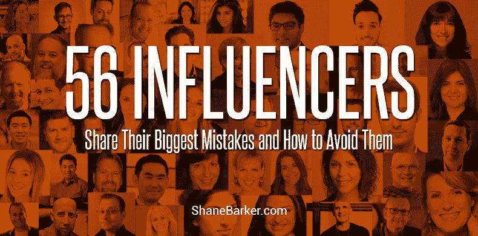

# 56 位有影响力的人分享他们最大的错误以及如何避免它们[专家综述]

> 原文：<https://medium.com/swlh/56-influencers-share-their-biggest-mistakes-and-how-to-avoid-them-expert-roundup-946fc758cf32>

2017 年，影响者营销出现了 198%的指数级增长。这在很大程度上可以归因于它在建立品牌意识和提高企业销售方面的功效。

完美执行的影响者营销活动看起来不可思议，对品牌大有裨益。客观的第三方甚至会称之为毫不费力和有机的。

但是坦白说。

没有剧本。没有规则或指导方针。没有一个框架可以用来设计完美的活动。

精选的相关内容:

*   [7 个有影响力的营销工具来推动您的营销活动](https://shanebarker.com/blog/influencer-marketing-tools-boost-campaign/)
*   [你的品牌应该关注的 5 个最重要的影响者营销目标](https://shanebarker.com/blog/influencer-marketing-goals-brand-focus/)

影响者营销是一个棘手的景观，其不断变化的性质和新兴趋势。

每天都有新的挑战，即使是最有影响力的人也不知道如何提高参与度。

对一个品牌有效的可能对另一个品牌无效。这种不确定性使他们更容易犯错误。

虽然一些影响者的错误比其他人更常见，但了解所有这些错误是很重要的。毕竟，只有当你意识到任何陷阱时，你才能避免它们。

# 典型的影响者错误

在我们继续听取专家的意见之前，让我们快速浏览一下一些常见的影响者错误。

# 对一切都说“是”

我在新的影响者身上见过几次。他们倾向于对任何接近他们的品牌说是，而不考虑该品牌是否符合他们的定位。

除此之外，他们还倾向于同意品牌或代理机构让他们做的任何事情。

重要的是要质疑品牌和品牌建议的内容是否适合你的受众。

# 忽视联邦贸易委员会的指导方针

我看到新的和有经验的影响者犯的另一个常见的错误是忽视联邦贸易委员会的指导方针。

根据指导方针，品牌和影响者向消费者披露他们的付费合作关系以确保他们做出明智的决定至关重要。

不是每个人都明白哪种合作关系需要#广告或#付费标签。

# 购买假追随者和订婚

影响者可能犯的最大错误是购买虚假的追随者和参与。无论是通过评论豆荚还是使用机器人，无论哪种方式，都是错误的。

我知道这是一个数字游戏，但使用假数字只会玷污你和这个行业的声誉。

影响者还会犯很多其他的错误。重要的是从你和别人的错误中吸取教训。

这就是这篇专家综述的目的。所以，闲话少说，让我们听听专家们关于他们过去犯过的最大的影响者错误，以及如何避免它们。

请注意:这篇综述是按照升序编排的，而不是根据专业知识。

精选的相关内容:

*   [关于脸书影响者营销你需要知道的一切](https://shanebarker.com/blog/facebook-influencer-marketing/)

# #1.[安慰](https://medium.com/u/6c3b5484d114#2.<a class=)

最大的影响者错误:我最大的影响者错误来自于短暂的对我遇到的任何事情说是。

我最终接受了一次对我来说令人兴奋的经历，但却没有引起我的观众的共鸣。

教训:对于那些被认为是有影响力的人来说，深入了解总体受众中的微观受众，并据此做出决策是至关重要的。

# #6.[切尔西·克罗斯特](https://medium.com/u/cb495b5f5b17#7.<a class=)

最大的影响者错误:我所犯的最大的影响者错误之一是让代理机构或品牌在过去简单地说就是“掌控大局”

我的意思是，等待品牌建议创意，激活平台，预算等。

我在这个领域工作了 10 年，我学到的是，这个领域对大多数人来说是陌生的，他们需要被告知你的能力、创意概念和主导渠道是什么。

在许多情况下，有影响力的人更容易要求一个创造性的预算，并与客户分享他们在该预算内可以做哪些创造性的工作和工作范围。

这有助于简化对话，消除无休止的电子邮件链。作为影响者，我们知道受众的兴趣和参与行为是什么样的。

我们需要进行展示，并让品牌了解如何以最真实的方式与我们的社区建立联系！作为一个影响者，尝试以下建议来避免影响者的错误。

# #9.[迪尔德丽·布雷恩里奇](https://medium.com/u/62bb125284b4#10.<a class=)

最大的影响者错误:当你被认为是一个影响者时，你的社区信任你。他们向你寻求重要的信息和想法，他们会根据你的建议采取行动。

你首先要对他们负责，不辜负他们的期望。当你发展这种纽带时，为产品背书就是关于你的社区喜欢什么和需要什么。

你的粉丝会很快告诉你，他们对你通过与某个品牌合作提供的东西感到满意，以及他们不喜欢什么。

你与谁结盟，对每个人都是双赢的。

但是，如果你没有充分研究公司和产品，并相信社区的好处，那么你的粉丝会很快意识到，你心里并不是他们的最佳利益。

# #13.[熟练数字](https://medium.com/u/f4eca66bb8d2#14.埃里克·恩格— <a class=)

最大的影响者错误:作为一个影响者，你可能犯的最大的错误之一就是忘记你是如何成为一个影响者的。

一般来说，这是因为你给你的观众带来了一些很好的信息或价值。

对我来说，这是基于我在 SEO 和内容营销上 20 年的投入，以及我愿意自由分享我所学到的任何东西。

最重要的是努力学好这些材料，然后努力围绕我所学的内容进行演示。

在过去的五年里，我有过几次在演讲活动中为我的观众准备一个杀手级的演讲的经历。

我对我正在演示的材料的背景通常足够强大，这样的演示我仍然可以做得很好，但是好还不够好。

我努力为来听我演讲的人提供最好的体验。当我知道我成功了，这是一种非常满足的感觉，当我意识到我失败了，这是一种失望。

教训？

永远不要让缺乏准备成为你不能在舞台上展示自己的原因。

每次你登上舞台，都是帮助人们的机会，让他们的生活变得不同，即使只是在他们如何工作的一些技术方面。千万不要浪费它！

# #15.埃文·卡迈克尔——[埃文·卡迈克尔](https://www.evancarmichael.com/)

作为一名影响者，我犯的最大的影响者错误是接受一个品牌作为对另一个客户的帮助。

我知道这不符合我的价值观，但我试图让它发挥作用，因为我想帮助我的客户。

一个月后我们分手了，这是我为一段感情付出的最大努力，这对双方都没有好处。

我再也没有犯那个错误了。

# #16.[因马尔](https://medium.com/u/1fce0c1d6e6b#17.<a class=)

最大的影响者错误:一个个人建议，如果你想成为一个影响者，那么你需要花时间回答每个联系你的人，不管他们是谁，也不管他们的影响力有多大。

我与其他有影响力的人有联系，我发现他们经常会分享我的内容，但当我直接问他们对这件作品的看法时，我只得到蟋蟀。

这让影响者觉得他们的内容和名字被利用了。

当然，我也犯过错误，因为这是你学习的方式。

我参加了一个 Klout 比赛，一时冲动选择了一个标签#momthevote，这个标签有点像病毒一样流行。

我没有做过调查，显然这个组织认为他们拥有这个标签，尽管你不能拥有/注册一个标签。

这个组织对此很反感。我道了歉，改了我的标签，然后他们就消失在空气中了。

这个故事的寓意是:做好你的功课。

# #19.伊恩·布罗迪——[伊恩·布罗迪](https://www.ianbrodie.com/)

最大的影响者错误:对我来说，最大的影响者错误是停留在你的荣誉上——认为因为你已经“做到了”(在你自己的小世界里)，现在这一切都会自动发生，你不必做所有让你成为影响者的事情。

当然，那不是真的。

你需要跟上那些首先给你带来影响的东西:高质量的博客文章、现场视频等等。

你需要继续做你自己(例如，与你的观众互动并帮助他们)，不要因为你出现在几个“十大”名单中并被引用几次就认为你很特别。

精选的相关内容:

*   [10 个说明 B2B 影响者营销力量的例子](https://shanebarker.com/blog/b2b-influencer-marketing/)

# #20.[动态沟通者](https://medium.com/u/d04a680df1bd#21.<a class=)

影响者最大的错误是没有把所有事情都写下来。

请确保您已经详细概述了影响者协议的每个部分，包括您将提供什么、他们将提供什么以及每个交付件的时间表。

此外，确保你的合同规定了你是按活动付费(比如 Instagram 故事)还是参与付费(点击链接)。

了解一家公司对每项活动的关键绩效指标的看法也很有用，因为你可以在未来的谈判中引用这些数据。

# #25.[日历](https://medium.com/u/55e3be46646f#26.<a class=)

最大的影响者错误:我最大的影响者错误是没有利用我的能力去尽可能地影响他人。

忙于创业让我产生了更少的思想领导力内容，错过了通过博客帖子和文章影响他人的机会。

为了避免这种影响者的错误，我现在花更多的时间来识别所有机会，然后将我的思想领导力传递给潜在客户和其他利益相关者。

我有一个团队也帮助我识别这些机会，同时我也自动化了大部分内容共享流程。

精选的相关内容:

*   [你应该知道的影响者营销的 6 个重要 KPIs】](https://shanebarker.com/blog/important-kpis-of-influencer-marketing/)

# #29.[胡安·梅罗迪奥](https://medium.com/u/3f6738b2f40b#30.<a class=)

最大的影响者错误:我最大的影响者“错误”是在社交网络上上传了我的国家的一位著名政治家的照片。

这张照片的原因是因为我们正在进行一个慈善项目，但社交网络上有很多人攻击我上传这张照片，因为他们认为我在支持那个政客。

所以，我认为最好不要把政治问题和你的个人品牌混为一谈，因为人们可能会理解不同的事情，从而影响你的声誉。

精选的相关内容:

*   [如何利用有影响力的人产生大规模的 UGC](https://shanebarker.com/blog/leveraging-influencers-user-generated-content-scale/)

# #32.Kat Sullivan — [营销解决](https://www.marketingsolved.com/)

作为影响者，我犯的最大的错误是不分析数字。

如果我能回到过去，从头开始，我会更详细地回顾我们的数据。

数据真的是解开你的观众喜欢(和不喜欢)的关键，所以你可以专注于给他们真正喜欢的内容。

我也会更多地关注参与人数，而不是喜欢。喜欢很好，但参与更好。

当你有了人们点击或评论的东西时，你就知道你已经建立了联系，并在为你的观众服务。

一旦你发现了趋势和模式，你就可以确定什么对你的品牌最有效，并与你的社区建立更好的关系。

# #33.[社交高手](https://medium.com/u/cdb1cf1729ad#34.<a class=)

在我作为影响者的旅程中，迄今为止我犯的最大的影响者错误就是我帮助客户克服的一些错误。

关于人们施加影响的途径以及他们这样做的动机，有一些普遍的误解。你自己可能也有过这种想法。

与流行的观念相反，与我一起工作的大多数演讲者、作者和播客最初都不愿意走到聚光灯下；他们不是想炫耀。

他们专注于他们的使命，他们的目的，他们的客户，几乎排除了其他一切。

我也不例外。我如此专注于帮助和服务他人，以至于我没有停下来考虑从正面领导，而不是呆在幕后。我根本没想到我应该在舞台上。

领导者充满激情和奉献精神，因此花时间培养自己的形象通常是他们最不想做的事情，直到有人站出来指出，他们没有与更广泛的受众分享他们的专业知识，这对潜在受众造成了伤害。

我帮助我的客户卖出更多的书，获得更多报酬更好的演讲机会，并通过寻找、吸引和转化他们的理想客户来发展他们的业务。

我花了很长时间才意识到我应该为自己做同样的事情。

为了避免我所犯的影响者的错误，确保你在为他人服务时不会忽视自己。

像关注客户的生意一样关注自己的生意。向自己展示你给予他人的同样的优雅；花时间关注你并不自私。

一旦你向内看，并站出来分享你的愿景，你将会影响更多的人，让更多人的生活变得更好。

你的观众需要你，正如我的观众需要我一样。你能做到的。你的时间到了。

精选的相关内容:

*   脸书直播和 Instagram 故事的真正价值？您可以通过影响者营销解锁的数据！

# #36.[伦纳德·金](https://medium.com/u/7d7d0522e43a#37.伦纳德·金——<a class=)

我犯的最大的影响者错误是，当我对某件事非常生气，以至于判断失误，并在网上大肆抱怨。

正因为如此，有人告诉我，我不如别人，我懒惰，是个混蛋，是企业家的耻辱(尽管我从未称自己为企业家……)，是个被宠坏的爱哭的人，等等。

我感到愤怒的是，像 Postmates 这样的食品配送服务怎么不送到我家门口，而像必胜客、多米诺骨牌和韩国小餐馆这样的其他公司总能找到办法确保食品直接送到我家门口。

我一个月只使用过两次送货服务，一半的时间他们都没有送到我家门口。

这导致了与司机、客户服务代表等的争论，我不明白为什么其他较小的公司能够解决这个问题，而一个只专注于一件事情的公司却不能解决这个问题。

为了防止这种事情在我的生活中再次发生，我已经从手机上删除了所有的送餐应用程序，并发誓再也不使用 Postmates 这样的送货服务订购。

抱歉，老婆，但是如果你想要外卖，你必须自己订，因为我不允许再靠近送餐软件了。

其他人也可以通过远离像 Postmates 这样的食品交付应用程序来避免犯同样的影响者错误。

# #38.紫丁香公牛——[紫丁香公牛](https://www.lilachbullock.com/)

最大的影响者错误:谢天谢地，我还没有犯任何大的影响者错误；但回想当初，当我刚刚开始获得影响力时，我记得收到这么多来自品牌的合作请求是多么令人高兴…而说不是多么困难！

然而，作为有影响力的人，我们需要尝试与我们相信的、与我们的受众相关的品牌合作:如果这不是你的受众需要或想要的东西，那还有什么意义呢？

精选的相关内容:

*   [82 位专家分享他们最喜欢的影响者营销技巧，以增加曝光率](https://shanebarker.com/blog/influencer-marketing-tips-expert-roundup/)

# #39.[林奇亚](https://medium.com/u/856a3ca110f#40.玛利亚·西普卡——<a class=)

影响者可能犯的最大错误是优先考虑虚荣指标，如追随者数量，而不是通过真正相关的内容培养有机追随者。

虚假粉丝、机器人和其他基于[欺诈的影响者营销](http://www.linqia.com/insights/why-linqia-is-a-leader-in-influencer-marketing-fraud-prevention/)做法的盛行，稀释了 reach 等一度备受尊崇的指标的声望。

随着受众和营销人员变得越来越精明，有影响力的人必须投入更多的时间来创造真正引起共鸣的引人入胜的内容，而不是花更少的时间以感知影响力的名义支持追随者。

培养强大追随者的最佳方式是:

1.大胆一点，把你的故事建立在一次情感之旅或经历上，将你和读者联系起来。

2.仔细聆听每个特定平台上受众的鼓点(如评论、参与、观看、保存、点击率)，以验证您分享的内容以真实的方式产生共鸣。

3.一旦你知道了什么对你的核心受众最有效，就用相关的标签，用你的经过性能测试的方法去接触更广泛的相关受众。

专注于为你的读者创造真正的价值，随着时间的推移，你会看到你的追随者随着你的努力而增加。

# #41.玛丽·史密斯——[玛丽·史密斯](https://www.marismith.com/)

最大的影响者错误:我会说我做的品牌大使工作没有足够的自吹自擂！

我一直依赖品牌/企业以各种方式联系我，所以都是内向型的。我真的感到很幸运能在这个地方；然而，我知道这些年来我本可以做更多的大使工作。

对于其他有影响力的人，我建议在你的社交渠道简历、网站、Messenger 聊天机器人等中主动加入。，你提供影响者营销服务。

申请脸书的[品牌合作经理](https://www.facebook.com/collabsmanager)，一旦被接受，请填写您的作品集。

接近脸书直播的赞助商和合资伙伴，帮助你更好地赚钱。

此外，积极寻找并加入一些有影响力的营销服务平台和/或代理机构，为您带来稳定的合格大使客户。

你已经努力工作来建立你的平台，所以确保你通过给你的观众带来高度相关的，高质量的优惠来优化和赚钱。

# #42.马克·特拉普哈根——[石庙](https://www.stonetemple.com/)

最大的影响者错误是，当让我获得最初影响力的焦点话题消失时，没有找到特定的焦点。

我通过成为某个特定平台的专家而获得了行业声望和声誉，但后来那个平台失去了光芒。

我还在努力寻找我的下一个重点。现在我因很多事情而出名，这有利于获得更多不同的机会，但当你成为某个特定主题的“关键人物”时，奇迹就会发生。

你想听到的是，“哦，你想了解 X？去和马克·特拉普哈根谈谈。”

精选的相关内容:

*   [你现在需要知道的 21 个节省时间的影响者拓展工具](https://shanebarker.com/blog/influencer-outreach-tools/)

# #43.Meghan DuCille — [提及](https://mention.com/)

影响者可能犯的最大错误是不能保持真实。

如果你的观众蜂拥至你的频道来寻找关键话题或主题，而你突然在这个圈子之外分享内容，你就有降低你作为一个有影响力的人的可信度的风险。

影响者营销行业正在快速发展。现在比以往任何时候都更重要的是，你要拥有自己的品牌:对你选择的合作伙伴具有战略性，并确保它们最适合你的受众。

如果产品或服务的品牌价值与你的品牌故事不一致，你的观众会注意到的。

不确定您的内容是否真实可信？利用您的受众指标，如情绪和参与度，深入了解哪些内容有效，并与您的受众产生共鸣。

# #44.[餐桌上的 MBA](https://medium.com/u/d83f238edc31#45.迈克尔·卡乌拉— <a class=)

最大的影响者错误:永远知道你和谁上床。我要分享的这个教训是痛苦的，因为它刚刚发生，伤口还在愈合。

如果你打算利用你的影响力来推荐一种产品或服务，事先尽可能多地了解这种产品或服务，以及你将要与之建立关系的人。

当你与一家公司建立关系，并决定利用你的影响力向他人推荐该产品或服务时，如果该产品或服务未能交付，你最终将承担责任。

这件事刚刚发生在我身上。

过去 3 年，我投资了一家初创公司，并认为我完全知道我在和谁合作。我只是一个小股东，因此对企业的方向几乎没有控制权，因为创始人和投资者董事会是大股东。

不过，我确实利用了我的社会影响力来推广公司，推动其发展。

在意识到我向公司提出的建议没有被采纳后，我辞职了，但为时已晚，我辞职后不久公司就关闭了，这反过来影响了我。

虽然我没有控制权，但我确实掌握了自己的决策权，我认为作为有影响力的人，我们都可以从中吸取教训。

幸运的是，我一直与那些知道我的立场的人保持着良好的关系，他们都非常支持我，尽管就个人而言，我感觉很糟糕。

做了 20 多年的企业家，我能和你分享的一件事就是你每天都在学习。

当我开始下一个新的冒险时，对我个人来说，我已经决定，我用我的影响力做的任何事情都只能是我能控制其方向的事情。

我知道这不是每个有影响力的人都能做到的，但是如果你没有控制力，愿意快速切断联系，并且有“能力和力量”来运用你的影响力，向那些你影响过的人分享你切断联系的原因。

精选的相关内容:

*   [影响者营销和千禧一代:如何让他们合作](https://shanebarker.com/blog/influencer-marketing-and-millennials/)

# #46.[谢丽尔·普劳夫](https://medium.com/u/a201e7e89d55#47.<a class=)

最大的影响者错误:我是一名视频营销策略师，所以我一直在创作视频——包括公开的(社交媒体)和私人的(客户培训)，但我一直在努力保持一致性。

我想很多企业家都会有同感。

我犯的最大的影响者错误是等待太久才承诺每周一次的节目。

承诺一场演出意味着不给自己一个退路。这意味着奉献自己，坚持你的演出时间表，不管生活在那一周抛给你什么。

我的建议是致力于制作一部适合你的节目。

# #52.斯蒂芬·詹姆斯——[项目生活掌握](https://projectlifemastery.com/)

作为一名影响者，我犯的最大的错误是将我的需求置于我的追随者的需求之上。

例如，在我作为一个有影响力的人的职业生涯早期，我有机会向我的观众推销一些东西，这会让我赚很多钱。

我没有做足够的研究来确保我要推广的东西真的会让我的追随者受益。不幸的是，我推广的东西最终事与愿违，因为它不是质量，没有服务于我的观众的需求。

结果，我最终失去了一些我与观众建立起来的信任和好感。这是一个愚蠢的错误，受金钱的影响，而不是真正想为我的观众服务。

自从那次经历后，我总是提醒自己把我的观众和追随者放在第一位。如果我分享任何东西，首先必须让他们受益。如果它能让我次要受益，那很好，但那不是我唯一的关注点。

我相信，如果我首先带着热情和诚实为我的观众服务，经济回报就会随之而来。

精选的相关内容:

*   [如何接触影响者的终极指南](https://shanebarker.com/blog/ultimate-guide-reach-influencers/)

# #53.[沃伦·惠特洛克](https://medium.com/u/75e22e7c52f6#54.<a class=)

我犯的最大的影响者错误是，我多次误判了自己对公司的价值。我经常让自己认为，免费或少量工作会向他们展示我是一个团队成员，非常适合。

营销人员和代理机构并不太关心这个。他们有预算和目标，需要完成订单。

就像哑巴是相反的。表现得像个名人或者不专业。

你对观众的价值和你的表演能力是至关重要的，但就像每个人的遭遇一样，商业是关于关系的。

找到何时说“是”和何时坚持的平衡点会让你的收入翻倍。尝试以下建议来避免影响者的错误。

# #56.[扬·古尔文内克](https://medium.com/u/b4c9c0f2742e?source=post_page-----946fc758cf32--------------------------------)——[远见营销](http://visionarymarketing.com/)

最大的影响者错误是，有一次我把我的博客交给某个 SEO 专家进行优化，他想出了一些奇怪的语句，在我的博客中摸索，在搜索控制台中调整东西，然后把事情完全搞糟了。

然后，我决定把他做的一切都拿走，并在一周内把我的拜访次数增加了一倍。

一个人应该总是对人们使用你不懂的词汇感到厌烦，即使你对这个话题知道得很多。

SEO 学科充斥着伪专家，他们最终对 Google 索引你的内容的方式一无所知。

事实上，我甚至不确定谷歌是否有人知道，他们一直在调整算法，我非常怀疑这是由一个人/团队完成的。

无论如何，他们不会因为显而易见的原因而发布公告。

至于搜索引擎优化，有影响力的人应该保持简单，脚踏实地，为他们的观众提供好的内容。它们将是你内容的真正放大器。

精选的相关内容:

*   Instagram vs. YouTube:哪个平台最适合你的影响者营销活动？
*   [影响者关系管理——品牌如何与影响者建立真正的联系](https://shanebarker.com/blog/influencer-relationship-management-brands-can-establish-real-connections-influencers/)

***原载于***[***【Shanebarker.com】***](https://shanebarker.com/blog/influencer-mistakes-expert-roundup/)***。***

**关于作者**

谢恩·巴克是[内容解决方案](https://contentsolutions.io/)和 [Gifographics](http://gifographics.co/) 的创始人兼首席执行官。你可以在[推特](https://twitter.com/shane_barker)、[脸书](https://www.facebook.com/ShaneBarkerConsultant/)、 [LinkedIn](https://www.linkedin.com/in/shanebarker/) 、 [YouTube](https://www.youtube.com/channel/UCiD3HGr_vpDp0ApavL-bEGA) 、 [Instagram](https://www.instagram.com/shanebarker/) 上和他联系。

## 这个故事发表在 [The Startup](https://medium.com/swlh) 上，这是 Medium 最大的企业家出版物，拥有 355，974+人。

## 在这里订阅接收[我们的头条新闻](http://growthsupply.com/the-startup-newsletter/)。

