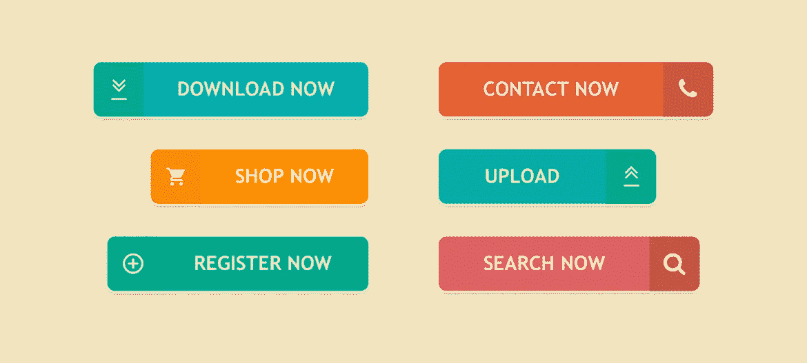
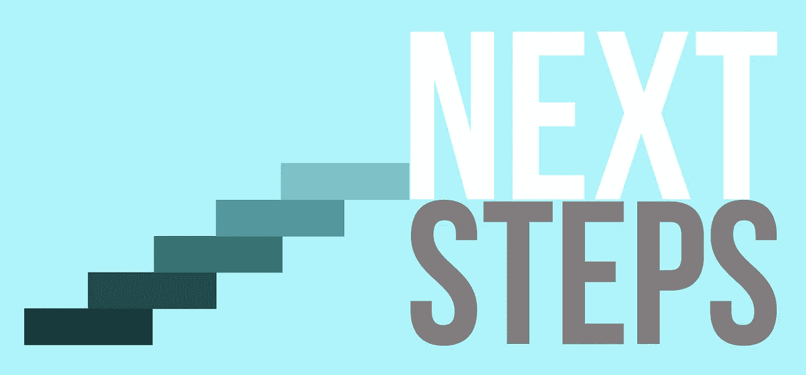
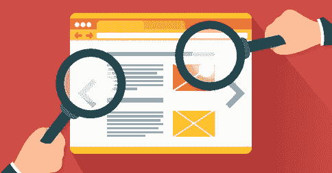
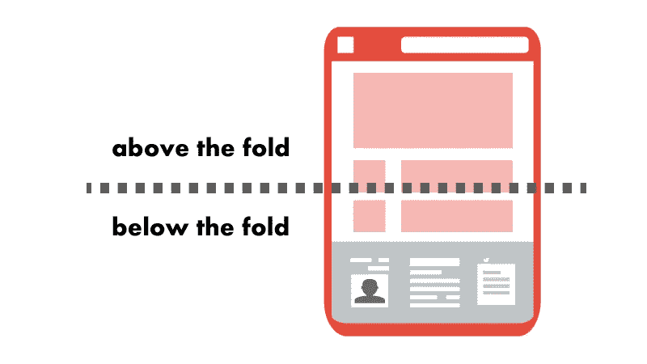
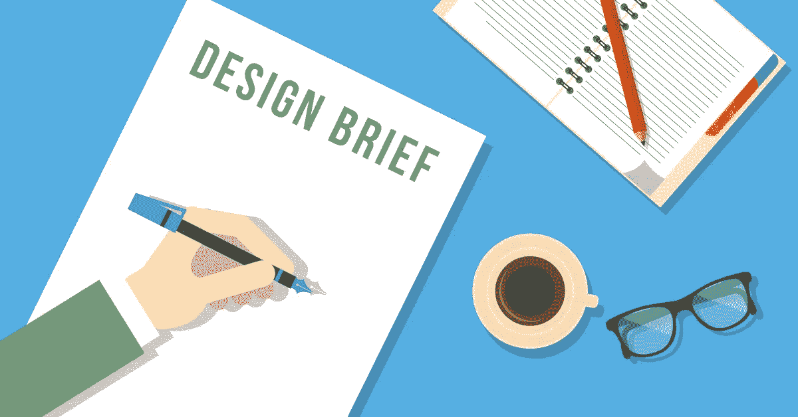
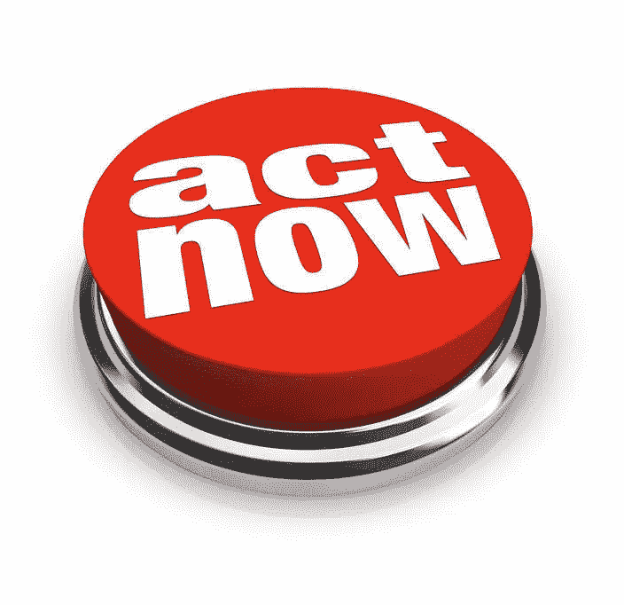

# 设计和发布“行动号召”的 6 个最佳实践。

> 原文：<https://medium.com/swlh/6-best-practices-to-design-and-place-your-call-to-action-6089dafdbafd>

它不仅仅是一个写着“立即购买”的按钮

Photo from google

# CTA —行动呼吁

***CTA 是诱使潜在客户采取行动的按钮或链接。***

今天，行动号召不仅仅是“点击这里”按钮。它将与页面内容保持一致，帮助客户快速轻松地完成客户之旅。

使用哪种行动号召取决于页面的功能以及您希望客户采取哪种行动来进入下一步。

> 以下是设计和实施行动号召的 6 个最佳实践。

## 容易找到

让它容易找到，这样**就会从其他链接中脱颖而出**。

*   使用醒目的颜色，从背景色中脱颖而出，尝试页面上其他地方从未使用过的颜色。
*   在它的周围留下足够的空白。

## 在折叠上方

这意味着客户可以在第一次看到页面时看到按钮，而无需向下滚动。

## 使用简短的、面向行动的词语。

你的行动号召应该不超过五个字。

> 记住，少即是多。

## 使用第一人称说话

研究表明，这显著提高了点击量。例如，'**创建我的账户**'比'**创建你的账户**'更有效

## 将 CTA 放在右页

您需要将您的 CTA 放在与**客户决策过程**一致的正确页面上。

例如，当顾客浏览你的网站时，

*   使用**立即注册**按钮进行促销或销售，
*   当有人正在查看产品并准备购买时，“添加到购物车”非常好用。
*   在你的博客上使用“**订阅**或“**沙尔山**e”CTA，这样可以鼓励人们分享他们的经验。

## 创造紧迫感

这会引发人们现在就行动。

会点击**销售**？还是“**五折，今天只有**”？

> 将您的行动号召与页面内容以及客户需要什么来激励销售线索采取行动保持一致！

# 行动呼吁

> *如果您从中发现了价值，如果您能加入我们并给我回信，我将不胜感激。还有别忘了关注我的微信官方账号阅读更多。
> 
> Search “盐和胡椒 SaltAndPepper” on WeChat.

# 顺便说一下，👏🏻*鼓掌*👏🏻如果你喜欢这篇文章，请举手(高达 50 倍)。它鼓励我坚持每天写作，并帮助其他人找到它:)

## 这篇文章发表在《创业》(The Startup)杂志上，这是 Medium 最大的创业刊物，有 311，185 人关注。

## 在这里订阅接收[我们的头条新闻](http://growthsupply.com/the-startup-newsletter/)。

