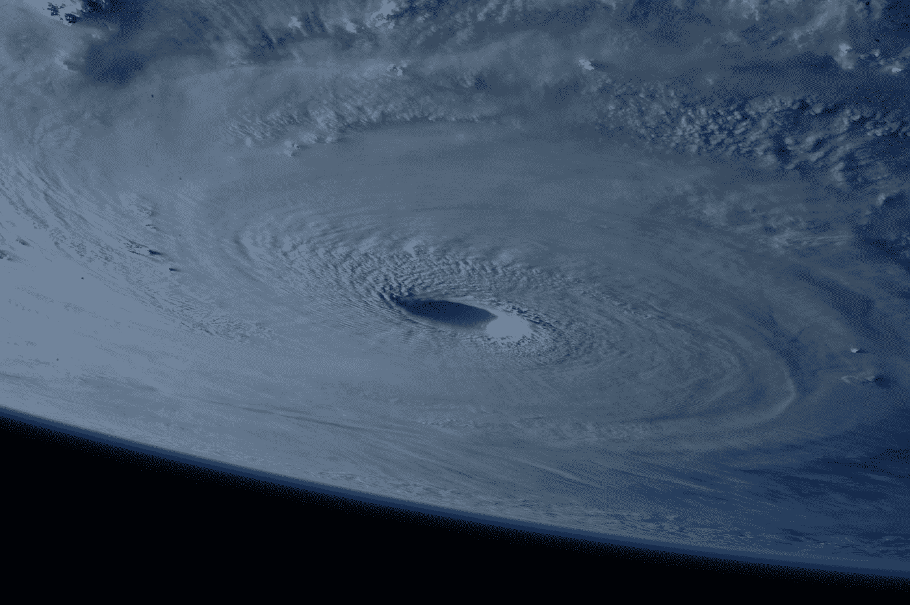

# 6.黑洞还是黑眼睛？

> 原文：<https://medium.com/swlh/6-black-holes-or-black-eyes-for-science-f97b0617c383>

“tornado screengrab” by [NASA](https://unsplash.com/@nasa?utm_source=medium&utm_medium=referral) on [Unsplash](https://unsplash.com?utm_source=medium&utm_medium=referral)

任何宏观的结构都可以用粗略的笔画来创建，因此讨论起来不应该那么复杂。简单的问题可以被问及整体。一个这样的问题是，整体是否在某种程度上是一个统一的整体，一切都基于一个未知的单一原则，或者部分是否在某种程度上总是独立的——作为结论，一个最终统一的结果不可能存在。这个问题和…