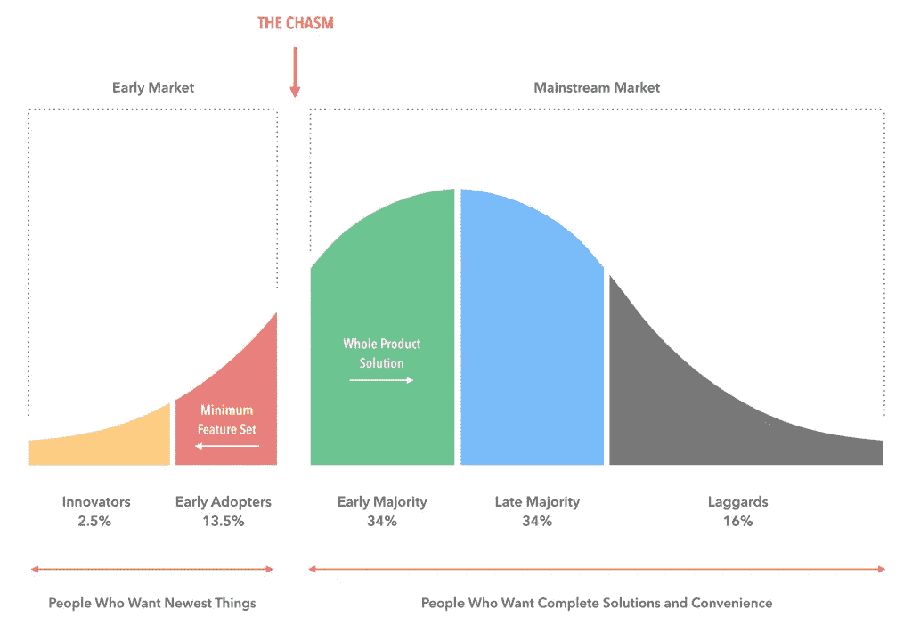

# 第一次创业要避免的 6 个代价高昂的错误

> 原文：<https://medium.com/swlh/6-costly-mistakes-to-avoid-as-a-first-time-entrepreneur-c4796fe22695>

Originally published on [http://www.appsterhq.com](http://www.appsterhq.com/?utm_source=CP&utm_medium=Medium)

创建一家成功的创业公司绝非易事。

许多成功的企业家在最终创建一家公司并扩大规模并实现盈利之前，会先创办几个失败的企业。

造成这种情况的部分原因是，第一次创业的人经常会犯一些关键错误，损害他们的业务。

鉴于超过 90%的初创公司最终都失败了，今天的创始人需要尽可能多地获取关于[在 21 世纪成功创业的可靠知识](http://www.appsterhq.com/blog/realities-21st-century-start-ups)。

获得这种知识的一个重要方面涉及到对初次创业者最常犯的错误的理解。

我想强调作为一个新的创始人你应该避免的 6 个关键错误，这可能会增加你启动和维持一个成功创业的机会。

# 1.“饥荒心态”

正如我在[之前的](http://www.appsterhq.com/blog/best-million-dollar-app-ideas) [文章](http://www.appsterhq.com/blog/4-startup-myths-entrepreneurs-success)中所讨论的，许多创业者新手似乎认为，最重要的是，建立一个成功的创业公司就是要发现[一个真正革命性的想法](http://www.appsterhq.com/blog/markets-fancy-ideas-create-successful-start-ups)。

传统观点认为，一旦创始人提出一个“改变游戏规则”的想法，那么他/她开始赚取数百万美元只是时间和细节的问题。

这种愿景鼓励许多创始人对自己的想法极度保密。

担心如果他们与他人分享任何想法或计划，那么别人一定会窃取他们的想法或计划，新企业家经常将他们的想法“藏在胸前”。

> 这是“饥荒心态”的一个例子，人们认为，人 A 成功的唯一途径是以人 B、C 和 D 为代价(即，世界是一个“[零和游戏](http://www.investopedia.com/terms/z/zero-sumgame.asp)”)。

然而，保守你的想法是与你作为一家新公司的创始人应该追求的完全相反的方法。

我最近解释了为什么会这样:

> “其他企业家正是你应该与之分享想法的人……你需要反馈，大量的反馈。那么，为什么不从那些有能力把他们的想法从一开始带到市场并获利的人那里获得呢？
> 
> *与他人分享你的想法可以让有能力、有经验的人给你指出正确的方向，为你提供重要的建议，并帮你联系愿意帮助你和/或为你争取客户的人。这就是企业家为彼此做的事情。我们的文化是一种分享文化，而不是一种基于饥荒心态的文化……*
> 
> *此外，在你证明你的想法的潜力之前，没人会对你的想法感兴趣……然而，一旦你证明了你的反对者不是这样，就没有必要再隐瞒你的想法了，因为每个人都已经知道了。”*

因此，拒绝与他人分享你的想法是一种严重的误导，不仅因为你剥夺了愿意并能够帮助你实现目标的人的无限资源，还因为当你将产品推向市场时，世界(包括你的竞争对手)已经非常熟悉你的想法了。

还有一个事实(见 [1](http://www.appsterhq.com/blog/reasons-why-startups-dont-need-patents) 、 [2](http://www.appsterhq.com/blog/best-million-dollar-app-ideas) 、 [3](http://www.appsterhq.com/blog/4-startup-myths-entrepreneurs-success) )许多最成功的初创公司——包括脸书、Instagram、PayPal、Shopify、Twitter 和 YouTube——都从最初的想法转向了今天赖以生存的利润丰厚的产品/服务。

最后，在将一个潜在的伟大创意转化为巨大成功的业务时，创意远不如有效的执行重要。

有效执行的一个关键部分是超越发现，实际上是*测试*产品创意。

这里[在 Appster](http://www.appsterhq.com/?utm_source=CP&utm_medium=Medium) 上，我们花了很多时间写关于[测试产品创意](http://www.appsterhq.com/blog/test-product-idea-real-world-feedback)的重要性，以及利用真实世界的反馈开发和评估[最小可行产品](http://www.appsterhq.com/blog/mvp-app)的重要性。

所以，不要浪费时间把你的想法藏在一个安全的地方……除非你真的想让*没人*看到它们，包括你的潜在客户。

# 2.低估或误解“现金流”的重要性

CB Insights 进行的一项受欢迎的研究表明，近三分之一的创业公司因为资金耗尽而失败。

除了试图销售一种没有足够市场需求的产品，没有足够的现金来继续运营是所有创业失败的第二个最常见的原因。

作为一名新创企业的创始人，如果你想让你的公司生存下去并蓬勃发展，你就必须对广泛的经济学原理有一个坚实的理解。

“现金流”是一个关键概念，许多创业者新手似乎经常对此感到困惑。

Investopedia 为“正”和“负”现金流提供了一个相当专业的定义:

> *“现金流是流入和流出企业的现金和现金等价物的净额。正现金流表明公司的流动资产在增加，使其能够清偿债务，对业务进行再投资，向股东返还资金，支付费用，并为未来的财务挑战提供缓冲。负现金流表明一个公司的流动资产在减少。”*

用更简单的语言来说:

*   **正现金流:**当流入企业的资金量超过流出的资金量，即*积累资金*
*   **负现金流:**当流入企业的资金量少于流出的资金量，即*亏损*

创业者新手经常误解现金流的动态以及如何正确管理现金流。

现实是，创业公司从第一天起就开始“烧钱”,也就是说，每天的每一秒都要花费你的运营成本。

这意味着，例如，完全有可能有一个“蓬勃发展”的企业，但仍然是负现金流:

*   你已经开始销售你的产品；
*   您的客户群正在大幅增长；和
*   你的长期销售潜力是巨大的。

然而:

*   为了达到这一点，你已经承担了很多债务(例如，雇佣你的员工，开发你的 MVP，营销你的产品，等等。);和
*   您每月的支出(例如，租金、工资等。)超过你正在创造的收入。

因此:

*   如果你的收入不开始超过你的支出，那么你将会耗尽现金，被迫关门大吉。

所有谨慎的企业家都应该定期练习[现金流预测](https://www.cashanalytics.com/cash-flow-forecast/)(也称为现金流预测)。

现金流预测是一种预测技术，用于确定企业的“财务健康状况”。

正如美国小企业管理局[解释的那样](https://www.sba.gov/blogs/projecting-your-business-cash-flow-made-simple):

> *“预测让你清楚地看到钱什么时候进来，什么时候出去，以及在你支付了你的支出和记录了你的收入之后，每个月底你还剩多少钱。了解现金流预测方面的数字，可以让你看到企业现金流入和现金流出中的潜在陷阱。”*

因此，预测对于确保你的初创企业烧钱的速度不会超过你维持经营所需的速度至关重要。

掌控你的现金流，你将比肆意挥霍更有可能成功。

# 3.为每个人打造产品

新手创业者经常认为，成功的创业公司专门制造具有大众吸引力的产品。

寻求创造全世界都想要的东西，业余企业家可能会不断改变他们的产品概念，增加补充功能，以吸引越来越多的消费者。

然而，正如我最近解释的那样，这种方法是严重错误的:

> *“新创始人有时会试图通过将产品投放到大众市场来创造比脸书更大更好的东西，但他们却忘记了马克·扎克伯格和他的同事们实际上从未将任何类型的大众市场作为目标。相反，脸书试图赢得常春藤盟校学生的青睐——这是一个利基市场。*
> 
> *事实上，最好的产品往往是那些一开始就专注于赢得一小部分用户的心，然后才扩展到更多领域的产品。*
> 
> 苹果公司用它的 iPhone 瞄准了科技极客和“飞行爱好者”;特斯拉追逐高净值的科技爱好者；Pinterest 起步很小，以至于在早期它与大多数用户进行了面对面的交流。"

传统智慧认为，建立成功企业的关键是创造几十个不同行业都有需求的东西，与此相反，你必须认识到:

> **对于初创公司来说，主流市场通常是一个*墓地*，尤其是对于那些在技术领域运营的公司**。

主流客户通常对新技术没有信心:他们寻求的是安全性、可靠性和品牌地位，而初创公司往往故障多、不熟悉、未经测试。

作为一个初创公司的创始人，你必须把精力集中在早期市场，而不是主流市场:

上图是根据*穿越鸿沟*的作者[杰弗里·摩尔](http://www.geoffreyamoore.com/)的作品制作的著名图表。

Everett Rogers 的早期研究表明，颠覆性技术产品通常会被不同类型的人以不同的方式采用，即创新者、早期采用者、早期多数、晚期多数和落后者。基于这一研究，Moore 认为，在试图“跨越鸿沟”并在主流市场寻求成功之前，初创公司必须瞄准早期采用者市场。

作为一名创业新手，你的目标应该是:

*   为了修复你软件中的错误，
*   回应关注(并赢得人心！)的早期用户，
*   在试图追赶一家五口走出购物中心或一位去上瑜伽课的中年妇女之前，稳步建立你的品牌认知度。

本质上，你需要瞄准创新者和早期采用者，也就是说，那些被新奇事物吸引的人，那些敢于冒险的人，那些热衷于接受新设计和新技术的人，以及那些为你的产品提供反馈的人。

这正是苹果、脸书和谷歌所做的。这些公司在早期都没有瞄准主流市场——你也不应该，直到时机成熟。

# 4.注意力不集中，注意力分散

失败的创业公司通常有一些重要的共同点:他们的创始人最终会失去注意力，因为“我们能做什么”而变得过于分心问题，以便充分关注和解决“我们必须做什么？”问题。

Y Combinator 联合创始人保罗·格拉厄姆[坚持认为](https://www.inc.com/laura-montini/what-more-than-630-startups-have-taught-paul-graham.html)“根本原因通常是缺乏专注”，甚至当一家初创公司因缺乏资金而破产时，他建议“初创公司要做的最重要的事情就是专注”。

作为一名新的创始人，你必须保持专注，将你的时间和精力投入到最重要的事情上，即研究你的市场和了解你的客户，设计你最可行的产品，发展和扩大规模。

你需要意识到，随着时间的推移，当你与其他创始人互动、与你的客户互动、开始推出你的产品时，几乎无限的可能性将会实现。

这本身并不一定是一件坏事，但当你试图同时追求太多的机会，或者只是被创业生活的乐趣和兴奋分散注意力，从而让自己分散注意力时，危险就来了。

例如，除非你正在积极寻求为你的公司筹集资金，也就是说，这是你现在创业的具体重点，那么你不应该仅仅因为投资者要求与你会面，就放弃一晚上的工作去与他们共进晚餐。

更实际的是，想想史蒂夫·乔布斯在苹果公司的行为。

为什么世界上最大的公司只卖 3 种产品，即 iPhones、iPads 和 MAC/macbook？(是的，苹果近年来扩大了产品范围，但你明白了)。

当史蒂夫·乔布斯回到苹果时，该公司正在销售许多不同种类的产品——例如，打印机、PDA、游戏机等。——但是乔布斯杀了他们所有人，只专注于一台笔记本电脑和一台个人电脑。

他的目标是让这两款产品都变得“超级棒”。就乔布斯是否实现了这个目标而言，[苹果的销量](http://www.macworld.co.uk/news/apple/apple-q2-2017-financial-results-revenue-figures-apple-earnings-report-3581769/)不言自明。

建立一个成功的创业公司是极其困难和耗时的:帮自己一个忙，并承诺在整个过程中保持专注，尤其是当一点钱开始滚滚而来，显然“更大更好”的机会开始出现的时候。

# 5.混淆失败，“快速失败”和放弃

随着 Eric Ries 的“[精益创业方法](http://theleanstartup.com/principles)”的到来，一种新的失败哲学开始席卷硅谷，并随后传遍了西方世界。

至少几年来，“[快速失败，经常失败](http://whatis.techtarget.com/definition/fail-fast)”(FFFO)一直是创业界最流行的口头禅之一。

G 考虑到围绕快速失效方法的所有争议——许多人现在显然将其归结为“炒作”——今天的创始人应该从 FFFO 背后的基本哲学或关键见解中获得灵感，而不是关心对其确切含义、应用等的不同观点。

快速失败既不等同于放弃，即完全放弃某事，也不等同于致命的失败，即彻底摧毁或毁掉你的公司。

这样的失败是没有计划的，也是不想要的。不应该是[拜物教](https://hbr.org/2014/07/do-you-really-have-to-fail-to-succeed)；应该避免。

毫不奇怪，许多新创始人害怕失败。

这种恐惧有多种形式，其中最常见的是采取完美主义的态度和行为。

企业家们花了太多的时间来制作名片、标识、撰写和修改商业计划、增加产品功能和修补产品等等。——所有这些都是为了推迟他们最终推出解决方案、见证市场反应的关键时刻，不管是有意识的还是无意识的。

这是一种可以理解但有害的方法:如果你将要犯错误——几乎可以肯定你会犯——那么作为一名企业家，你希望尽可能快地犯那些错误，这样你就可以从中吸取教训并纠正你的路线。

*这个*应该是 FFFO 的意思。

本质上，不要害怕尝试，这是最重要的，*测试*不同种类的策略，作为你开发、营销和启动运营的一部分。

创建设计良好的试点项目，并使用分析来收集关于您的努力进展情况的具体数据。

当你失败时，调查原因，然后采取纠正措施，让你的创业朝着更有效、更明智的方向发展。

如果你没有从使用/应用它们中学到任何有价值的东西，金钱、时间和精力只会被浪费。

Instagram、PayPal、Twitter、YouTube 和许多其他公司都在现实世界的数据显示某些东西根本不起作用后，改变了他们业务的一个或多个主要方面。

真正的创业者不放弃；他们设计、测试、评估、再测试、[和支点](http://www.appsterhq.com/blog/start-ups-business-plans-lean-canvases-pivots)。

作为一名新的创始人，你需要做好失败的准备，因为你的一些(或全部)假设被证明是错误的/被误导的，然后被迫调整方向。

但是不要仅仅因为你认为这会给你在创业世界中带来“可信度”而故意失败。

将你的一生和所有资源奉献给最终会被遗忘的事物，这并不光彩。

# 6.选择了错误的联合创始人，没有签署股东协议

联合创始人[之间的分歧往往会导致和/或直接导致](https://www.cbinsights.com/blog/startup-failure-reasons-top/)初创公司的死亡。

保罗·格拉厄姆相当明确地坚持认为，良好的联合创始人关系是成功创业的基础:

> “联合创始人对于初创公司来说，就像选址对于房地产一样重要。你可以改变房子的任何东西，除了它的位置。在一家初创公司，你可以很容易地改变你的想法，但改变你的联合创始人是很难的。初创公司的成功几乎总是由其创始人决定的。”

[在 Appster](http://www.appsterhq.com/?utm_source=CP&utm_medium=Medium) 这里，我们同样向客户强调寻找同样热情和[敬业的联合创始人](http://www.appsterhq.com/blog/5-strategies-successful-startup-co-founder-relationships)的重要性，建设[坚实的创业团队](http://www.appsterhq.com/blog/strategies-building-start-team)的重要性，以及创造支持性和真实的团队文化的重要性。

出于各种各样的原因——包括创业公司通常是从朋友或同事之间的现有关系中成长起来的，他们非常兴奋/渴望建立和执行一些特殊的东西——许多首次创业者不太注意起草和签署联合创始人协议。

联合创始人协议是“公司所有者(股东)之间的合同，定义了他们相互的义务、特权、保护和权利，通常包括公司的章程或细则。”[来源](http://www.businessdictionary.com/definition/shareholders-agreement.html)

现在，不可否认的是，每个人都有很大的不同。

有些人非常厌恶风险；其他人更倾向于碰运气。有的喜欢计划、运筹帷幄，行动缓慢；其他人倾向于“心血来潮”，采取“果断行动”。

有些人确实兑现了他们的承诺；其他人在任务进行到一半时改变了焦点，交付了与最初商定的不同的东西。有些人在遇到困难时“随机应变”；还有的“在压力下屈服”，变得不靠谱。

不难找到描述一些初次创业者糟糕经历的恐怖故事。

当你和一个朋友一起创建了一家公司，并非正式地决定对半分所有收入，但 12 个月后你们中的一个离开了公司，而另一个留下来将你的初创公司发展成一家利润丰厚的企业，会发生什么？

离开的那个还能拿到所有收益的 50%吗？在没有正式协议的情况下，如何以某种方式执行决定？

或者以 Zipcar 为例:该公司两位联合创始人之间的分歧最终导致一位联合创始人承担了所有风险，离开了自己的工作，每周工作长达 100 个小时，而另一位从未离开她作为学者的全职工作，工作时间不到一半，但仍保留着公司的同等份额。

让这些轶事成为一个警告信号:作为一个新的创始人，花时间恰当地起草并签署一份联合创始人/股东协议是至关重要的。

这样做是必要的，至少有两个主要原因:

1.  它允许你和你的合伙人建立清晰和公平的准则:谁负责什么，每个人得到多少股份；和
2.  它创建了一个框架，在你的关系恶化和/或你的创业最终关闭的不幸事件中，可以通过这个框架采取官方的和可执行的行动。

## //

## 感谢阅读！

# 如果你喜欢这篇文章，请随意点击下面的按钮👏去帮助别人找到它！

# 对应用程序有想法吗？[我们来谈谈](http://www.appsterhq.com/?utm_source=CP&utm_medium=Medium)。

在过去的几年里，我们已经帮助建立了超过 12 个数百万美元的创业公司。[查看我们如何帮助您](http://www.appsterhq.com/?utm_source=CP&utm_medium=Medium)。

> 最初发表于[http://www.appsterhq.com](http://www.appsterhq.com/?utm_source=CP&utm_medium=Medium)

