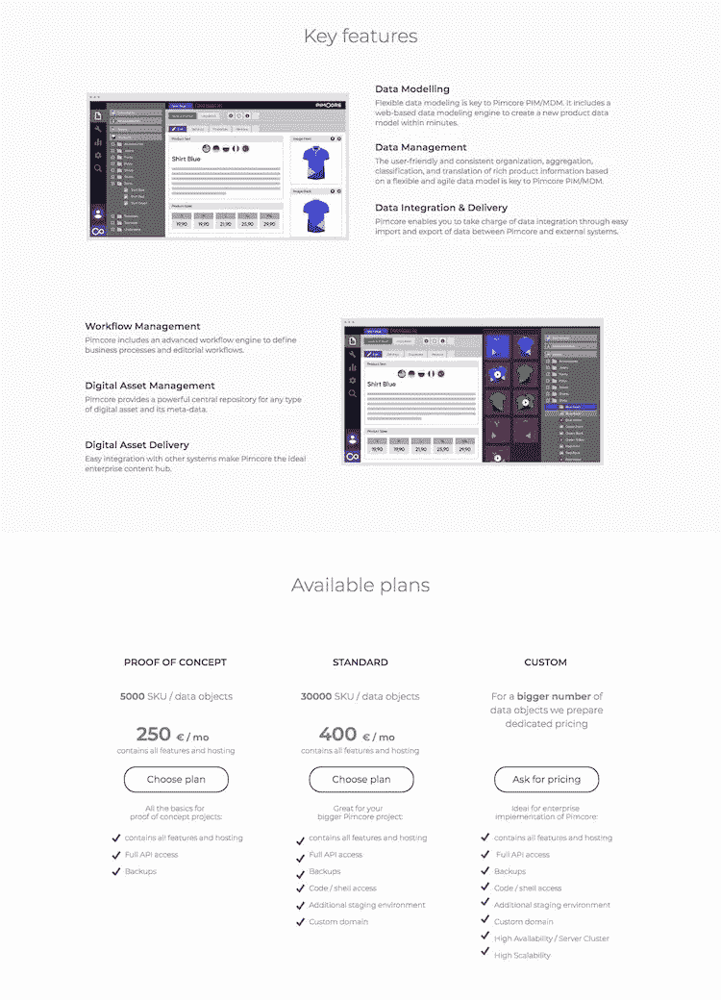

# 最佳 B2B 登陆页面的 6 个例子(以及从中窃取的秘密)

> 原文：<https://medium.com/swlh/6-examples-of-the-best-b2b-landing-pages-and-the-secrets-to-steal-from-them-ccd7793b5ae7>

*由* [*詹妮弗·佩珀*](https://twitter.com/pepperswrite) *负责内容创作的营销经理在 Unbounce*

我们从经验中知道，B2B 产品和服务很难在登录页面上完全展现出来。

无论是定义你的转换目标，订购你的页面部分，还是写能引起共鸣的文案，都不总是在公园里散步。更不用说 B2B 可能会涉及这么多的决策者，你可能需要呼吁。大规模展示软件等东西的价值，可能比解释你的尖端悬浮滑板如何让一个人受益更棘手。

但是，在我们看来，建立一个成功的 B2B 页面归结为几个关键的事情:

*   创造吸引人的体验，让潜在客户敏锐地意识到你所解决的问题
*   简单明了地推销你的产品，以及
*   巧妙地引导游客通过考虑，走向转换。

说服在理论上听起来很棒，嘿，但这实际上涉及到什么呢？

为了帮助你更好地理解什么是一个有效的 B2B 登录页面，我们分析了六个做得很好的非绑定页面。浏览示例，看看他们做得特别好的地方，以及如何将他们的技术提升到一个新的水平。

# 1.云上的 PIM

Image courtesy of [PIM on Cloud](https://www.pimoncloud.com/).

> 窃取的最佳实践:在适当的情况下，让潜在客户经历客户旅程的几个阶段。

当然，每个行业的销售周期都不一样，但是这个过程总是从建立兴趣开始，并且(理想情况下)以购买决定结束。如果设计得当，一些登录页面可以在读者从上到下滚动的过程中带领他们经历每一个阶段。我们发现云的长表单登录页面上的 PIM 在这方面做得非常好。

该品牌通过提供服务描述来建立**认知度**(在前两页中)，他们通过一系列功能和优势来引导潜在客户进行**考虑**，然后通过详述可用计划和行动号召(即分别为“选择计划”或“询问价格”)来推动**转化**。

尽管一些登录页面旨在增加漏斗底部的转化率，但提供更全面的旅程——就像 PIM on Cloud 所做的那样——可以为潜在客户提供更广泛的网络来了解更多信息。这个页面甚至可能是许多 PIM 品牌谷歌广告的目的地 URL，因为它是如此高级。

当然，一些访问者从一开始就知道他们在寻找什么，所以 PIM on Cloud 在这个页面上包含了锚导航，以提供一个选择冒险的体验。得益于此，**更多合格的潜在客户可以直接跳到与他们最相关的细节**。虽然登陆页面上不应该有太多的链接(例如，你的主网站导航会是一个真正的禁忌)，但是如果你试图一次覆盖大量信息，推荐使用锚导航*。他们可以让像这样的长页面更容易理解。*

***奖励:** PIM on Cloud 的登录页面为读者提供了一个常见问题解答部分和一个联系表格，让潜在客户有更多机会评估他们的决定，并让品牌收集有价值的线索。当你制作包含广泛优惠的登录页面时，一定要考虑是否可以使用 FAQ 来缓解任何潜在的摩擦，并留下一种人们可以直接与你联系的方式，以防万一。*

# *2.资源大师*

**

*[Image courtesy of](https://unbounce-wpengine.netdna-ssl.com/photos/Resource-Guru-full.jpg) [Resource Guru](https://resourceguruapp.com/).*

> *窃取的最佳实践:帮助潜在客户将一个复杂的想法可视化。*

*许多 B2B 产品和服务解决复杂的问题。因此，**登录页面需要以这样一种方式设计，让潜在客户容易理解功能和优势**。做到这一点的一个方法是整合视频、图像甚至动画等视觉元素，所有这些都有助于推动转化。根据 Eyeview 的说法，[在你的登录页面上使用视频可以将转化率提高 80%](https://unbounce.com/landing-page-articles/the-benefits-of-using-video-on-landing-pages/) 。*

*资源大师的登陆页面非常有效，因为观众一登陆它就用一个大的播放按钮来迎接他们。按下播放是直观的，并启动一个高质量的解释者视频。他们让这段视频来说话，然后迅速要求访问者采取行动。*

# *更上一层楼:*

*除了简单的播放按钮，这个登录页面还可以包含一个以人脸为特色的视频缩略图。**与您的视频内容一致的视觉上引人注目的缩略图实际上可以** [**提高播放率**](https://www.skeletonproductions.com/insights/video-play-rate) 。*

*此外，在登录页面上以文本形式重复视频脚本中的所有核心要点总是一个好主意。这确保了即使你的播放率很低，潜在客户仍然可以了解你的报价，而不必点击播放。不管他们那天是把耳机落在家里了，还是更喜欢短信，有个后备计划还是不错的。*

# *3.眨眼*

**

*Image courtesy of [Blink](https://blinkux.com/).*

> *偷窃的最佳实践:附上正确的证据来建立信任和可信度。*

*Blink 在**上方的登陆页面主要依赖于推荐和一系列精选的高端客户**，这些都在他们的联系方式下方。此外，Blink 没有深入研究产品特性，而是通过**展示行业奖项**来支持他们的专业知识。*

# *更上一层楼:*

*尽管推荐、标识和其他社会证明是有效的，但值得注意的是，Blink 错过了在本页开始时(立即)解释他们实际上为客户做了什么的机会。*

*根据尼尔森诺曼集团(Nielsen Norman Group)的调查，[访问者在一个页面上花费的时间有 57%发生在折叠上方(74%花费在前两个屏幕上)](https://www.nngroup.com/articles/scrolling-and-attention/)。如果你公司的产品在底部，就像在 Blink 的登陆页面一样，访问者可能会在没有上下文的情况下点击离开。总的来说，在解释为什么你最擅长做这件事之前，确保你的页面进入了你所做的事情的细节。*

# *4.媒体代客*

**

*Image courtesy of MediaValet.*

> *窃取的最佳实践:布局和效益文案的三大法则。*

*[三法则是记忆内容最成功的方法之一](https://www.copyblogger.com/rule-of-three/) —我们已经看到它在电影、广告等领域的应用，MediaValet 的登录页面也不例外。*

*数字资产管理公司在展示他们的主要优势和证明时应用了三原则。这个**清晰、简洁、易于使用的结构也是登陆页面成功布局的关键:**它介绍产品，用统计数据支持他们的主张，并为潜在客户提供一个请求演示的简单方法。**访问者越容易消费和保留您登录页面上的内容，他们就越有能力做出购买决定**。他们也更有可能保持滚动，而不是被太多的信息淹没。*

# *更上一层楼:*

*标题清晰是关键，你只有开头几个词来说服人们继续阅读。在我看来，MediaValet 可以从使用不同的副标题中获益(“使用数字资产管理在一个中心位置组织您的资产、营销内容和媒体。”)作为他们的主要标题，使他们的产品提供更明显。*

# *5.Vivonet 信息亭*

**

*Image courtesy of Vivonet Kiosk.*

> *窃取的最佳实践:浮动 CTA 按钮给你更大的转换机会。*

*登陆页面只有一个目标——说服访问者采取行动。无论下一步打算做什么，你的工作是创建一个清晰的、战略性的行动号召，让访问者知道下一步该做什么。使用多个 CTA 可能会分散你的观众的注意力，但是一个始终如一的 CTA 会跟随访问者的整个体验吗？那是非常清楚的。*

*Vivonet Kiosk 使用一个浮动的 CTA 按钮，当访问者向下滚动页面时，该按钮会跟随他们。无论他们身在何处,“与我们谈论信息亭”按钮仍会显示在屏幕的右下角。*

# *6.打开*

**

*[Click here to see the full page.](https://unbounce.com/ppc-landing-pages/)*

> *偷窃的最佳实践:与你的潜在客户交谈。*

*好吧，你抓到我了。我在这里使用了一个 Unbounce 示例，但是我想你会同意它非常好。这是我们创建的一个登录页面，介绍我们解决的问题并推动注册。*

*在截图中，你可能会注意到这个页面实际上打破了我们上面建立的一个规则:它包含了主站点导航。把这看作是一个混合体，也是一个展示你有多灵活的很好的例子。我们的页面结构具有登陆页面的说服力(并使用我们的构建器构建)——但巧妙地融入了我们网站的其余部分，生活在我们的域中并共享网站的导航。当我们想要为网站特别快速地构建网页时，我们经常这样做，否则将需要大量的开发工作。*

*既然向营销人员开放了市场，我们也想克服我们许多人在谈到其他人的活动时产生的怀疑的坚硬外壳。所以这个登陆页面**使用对话框架来建立信任**。在推销我们的平台之前，它简单明了地概述了这个问题——运行广告已经变得越来越昂贵——以及解决方案。聊天机器人的加入会邀请你问一些我们没有提到的问题，让对话继续下去。*

*当然，带有教育语气的登录页面有失去读者注意力的风险——就像一个无聊的老师一样。**除了更友好的语气，我们还使用互动元素、动画和引用数字营销人员的话作为社交证明。**所有这些元素让事情变得生动，并提供更多细节。*

**

*就像 PIM on Cloud 的例子一样，我们也预计到不太合格的潜在客户可能会访问该页面，所以我们包括标签和[可折叠页面部分](https://community.unbounce.com/t/how-to-create-a-collapsible-page-section/4408)，提供更多信息或回答问题。举例来说，如果一个读者不太理解我们所说的“登陆页”是什么意思，而碰巧点击了这个页面，他们可以不用离开就能知道答案。像任何优秀的健谈者一样，我们既听又说。*

**有灵感了吗？* [*学习如何通过七个简单的步骤*](https://unbounce.com/how-to-create-a-landing-page/) *来设计和构建一个 B2B 登陆页面。**

**原载于 2018 年 10 月 31 日*[*unbounce.com*](https://unbounce.com/landing-page-examples/6-examples-of-the-best-b2b-landing-pages/)*。**

*[*脸书*](https://www.facebook.com/Unbounce/)*|*[*LinkedIn*](https://ca.linkedin.com/company/unbounce)*|*[*Twitter*](https://twitter.com/unbounce)*|*[*insta gram*](https://www.instagram.com/unbounce/)*

**

## *这篇文章发表在 [The Startup](https://medium.com/swlh) 上，这是 Medium 最大的创业刊物，拥有+383，719 名读者。*

## *在这里订阅接收[我们的头条新闻](http://growthsupply.com/the-startup-newsletter/)。*

**