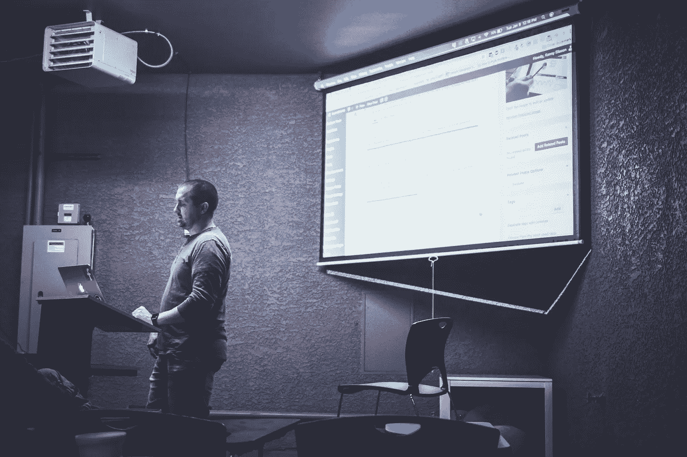

# 2018 年，任何人都可以免费学习的 6 项令人难以置信的盈利技能

> 原文：<https://medium.com/swlh/6-incredibly-profitable-skills-anyone-can-learn-for-free-in-2018-5c1f55a70f66>

## 你必须学会挣钱。

每当我遇到那些对自己的职业一成不变的人，我总是对那些积极开发新技能以进入不同行业的人着迷——借助互联网的力量，这样做从未如此容易。

也就是说，并不是所有的技能都是平等创造的。平均而言，有些公司比其他公司利润高得多。如果我准备在 2018 年做一些完全不同的事情，以下是我会考虑的前 7 项。

## 用 Python 编程

由于在线学习编程非常容易(编程本身仍然很难，但对于新的学习者来说有如此多的资源)和高收入潜力，编程通常是每个列表的第一位。

Python 被广泛用于物联网设备和许多机器学习应用程序——这两个领域现在都有巨大的增长，对程序员的需求很大。

Codecademy 有一个很棒的面向初学者的免费 Python 入门书。

## 文案

好的写作是一件远不会被自动化取代的事情，也是一项普遍需要的技能。

无论你是在为公司博客写内容，还是在他们的宣传册上写内容，优秀的文案总是很抢手的。作为一个额外的奖励，一旦你知道一些基本的搜索引擎优化，你可以提供优化你的博客文章的溢价。

琳达有一门关于[内容营销](https://www.lynda.com/learning-paths/Marketing/become-a-content-marketer)的很棒的课程，可以进入撰写营销文案，如果你在大多数地方有借书证，这是免费的。

## 三维建模

随着增强和虚拟现实的发展，对能够为这些新媒体创造体验的人的需求也在增加。

在美国，3D 建模师的平均工资是 65，000 美元。我预计这一数字将在未来十年上升。

虽然这不是一个真正免费的资源，但 Udemy 确实有一个很棒的关于使用 Blender 的[课程，通常你花 12 到 20 美元就能得到。](https://www.udemy.com/blendertutorial/)

## 翻译

越来越多的公司希望推出多语言版本的网站，随之而来的是对高质量翻译服务的需求。

如果你已经会说第二种语言，那你就已经准备好了。否则， [Duolingo](https://www.duolingo.com/) 似乎是初学者最好的资源。我肯定不会只使用 Duolingo，因为他们的“流利分数”不会让你接近被雇用，但这是一个很好的起点。

## 数据分析

2018 年公司可用数据量惊人。他们中的大多数人都在努力决定哪些数据是重要的，以及如何分析所有这些数据——这正是你的用武之地。

仅在谷歌分析领域，就有一个巨大的市场为咨询顾问开放。能够向企业展示他们的流量来自哪里，他们如何与网站互动，以及如何获得更多的流量，对他们的增长有着不可思议的强大作用。

谷歌本身也提供这方面的课程，如果你想走这条路，我强烈推荐。

## 脸书广告

在制作高针对性广告方面，从来没有一个平台像脸书这样强大。他们拥有的用户数据点数量令人难以置信。

这对企业来说是一个巨大的机会，但大多数人不知道如何利用它。

[脸书在平台上提供他们自己的课程](https://www.facebook.com/blueprint)，在 [Udemy](https://www.udemy.com/facebook-ads-facebook-marketing-mastery-guide/) 上也有一些不错的。对于脸书的广告，很多都是从经验中学习来的，所以不要害怕弄脏你的手，用一些低预算的测试活动来显示你知道你的东西。

那么，你认为 2018 年哪些技能的需求在增长？你今天会学到什么？

## 这篇文章发表在 [The Startup](https://medium.com/swlh) 上，这是 Medium 最大的创业刊物，有 307，871+人关注。

## 订阅接收[我们的头条新闻](http://growthsupply.com/the-startup-newsletter/)。

