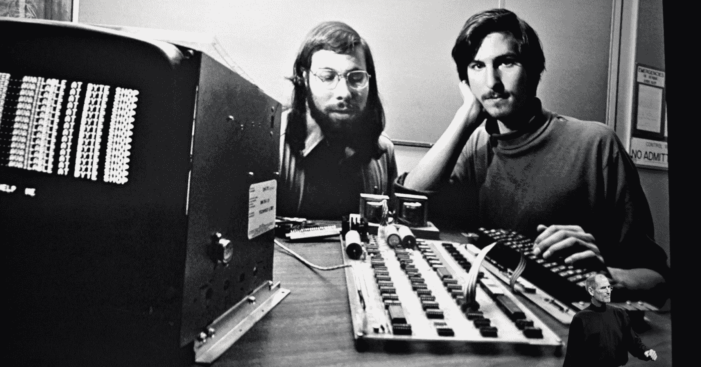
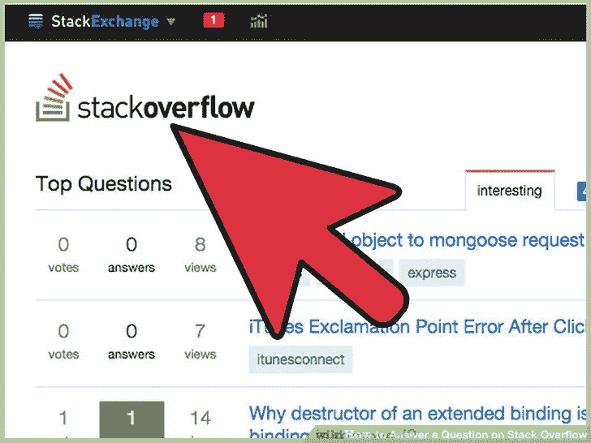

# 在招聘合适的科技人才时，非科技类创始人应该问的 6 个面试问题

> 原文：<https://medium.com/swlh/6-interview-questions-for-non-tech-founders-to-ask-when-hiring-the-right-tech-talent-df16bbb23e62>

你不需要学习“行话”就能找到最好的技术人才。

2018 年见证了商业世界有史以来最伟大的成就。苹果成为了第一家价值 1 万亿美元的公司，令人惊讶的是，它是由一位非技术创始人史蒂夫·乔布斯创立的。

对于乔布斯来说，找到史蒂夫·沃兹尼亚克一定感觉像是在 Tinder(也是由一个非技术人员创立的)上找到了完美的伴侣。很难相信，史蒂夫·乔布斯真的很难找到合适的人来帮助他创造他的愿景，这是许多非科技创始人的情况。

[Indiez](http://indiez.io/) 与 600 多名非技术创始人密切合作，我们已经学会并开发了正确的策略来为你雇佣**最好的**技术人员。

永远不要因为自己不懂技术而沮丧。这些问题将帮助你雇佣最好的技术人才，而不必学习所有与之相关的术语。

在我们开始之前，我想我们需要从苹果那里学习一点建议。如果这不适合你的公司，你不需要雇佣最有经验的专业人士。

在 20 世纪 80 年代，在苹果的首次招聘中，他们将技术招聘的重点放在训练有素的专业人员身上。

*“根本没成。他们大多数都是笨蛋。他们知道如何管理，但不知道如何做任何事情。”史蒂夫·乔布斯*

你想出了这个产品创意，你知道你想要什么，你需要雇佣适合你创业的人。

乔布斯和沃兹尼亚克作为 20 世纪最大的创新者而闻名。雇佣经验丰富的专业技术人员永远都不适合他们。他需要充满激情的人，这些人了解当时的技术水平，但随后需要将技术提升到一个新的水平。

**个性需要符合你的产品愿景，一旦你知道自己想要什么……你可以采纳这条建议，找到合适的“技术人员”**。

# **#1 说说你自己**

你需要雇佣适合你的公司、文化和品牌的人。这个问题对了解候选人非常重要。如果他们有相似的爱好和兴趣，那么你就会知道你是否能和他们建立良好的工作关系。

你需要和这个人保持良好的关系，因为你不了解你项目的技术方面。你还可以检查他们的沟通技巧，以及他们是否能够清楚地解释某些你永远不会知道的技术方面。

在你发现他们的个人兴趣后，你就开始在商业层面上询问他们的情况。

你可能无法理解他们告诉你的关于他们商业头脑的所有事情，但作为一名非科技类创始人，你有一个优势——你可以衡量他们的热情。

关掉，不要听那些话…观察他们谈论工作的方式、表情和手部动作。这将有助于你真正理解他们是喜欢它还是仅仅为了它而做。

# **#2 你有个人博客吗？你在社交网络上活跃吗？**

这不是必须的，但却是一个有趣的参数。如果候选人有博客，这将使他们领先于其他潜在候选人。

你将能够真正理解他们的思维过程，以及编程是“工作”还是“激情”

我建议你看一看[stack overflow](https://stackoverflow.com/)——检查候选人是否积极参与其中，并检查他们的因果关系得分。任何有激情的开发者都会活跃在这个平台上，不断提供反馈和创新的想法。

其他要检查的社交媒体属性是 [Twitter](https://twitter.com/?lang=en) 和 [Quora](https://www.quora.com/) ，这些平台因为不同的原因而辉煌。Twitter 会告诉你他们会定期查看行业新闻，而 Quora 会让你知道他们想帮助那些没有相同知识的人。

# 你能为我的项目投入多少时间？

现在，这是为那些雇用自由职业者或兼职人员。 [Indiez](http://indiez.io/) 是一个 100%远程工作社区，我们拥有来自全球的最优秀人才。我们有‘兼职者’和对 Indiez 完全忠诚的人。

根据你的项目的长度和复杂程度，你可能只想雇佣你知道致力于你的项目的人。

解读你的需求，然后在面试阶段明确“技术人员”需要具备的承诺。许多开发人员和程序员确实在多个项目上工作，所以你把面试作为一种明确双方期望的方式是非常重要的。

# **#4 你认为自己是软件开发人员还是产品经理？**

最理想的答案是**两个**。这个问题帮助你评估每个候选人的优势和劣势，以及他们与你正在创建或将要创建的团队相比如何。

产品经理非常擅长设计新的功能和界面，并且能够理解你的项目的商业方面。因此，如果你找到一个具备产品经理素质的软件开发人员，你就赢了。

如果候选人回答了这个问题，并且觉得他们对产品没有任何感情，那么就不要聘用他们。他们只是创造，他们不发展。

# 你会如何管理一个程序员团队？

即使你不打算组建大型技术团队，也要找到你的领导。这应该问每一个有 2 年以上经验的技术人员。

作为一名非技术型的创始人，你会理解增长的重要性，这可能会一直萦绕在你的脑海中。如果你要建立你的 100 万美元的创业公司，你需要从最初的面试中找到最初的领导者。

了解他们的领导能力有助于你知道当你扩大一个技术团队时，你可以把他们放在哪里。当扩张不可避免地发生时，你会知道你的“科技奇才”中谁有足够的信心来领导。

# **#6 给我解释一下你用的代码**

不要慌！

你不需要知道任何编码或者理解他们告诉你的任何事情。

你问这个的原因是想看看你是否能理解他们的解释方式。你会不会因为这个人讲解的很明白很简单就能理解一些技术上的东西？

受访者会知道你不是技术人员，所以询问一些他们工作的例子将会看到他们是否有能力与一个非技术型的创始人一起工作

你也可以衡量他们对之前工作的热情和信念。

# **现在你知道他们了，我怎么知道他们真的*擅长科技？***

对于任何一个非科技类的创始人来说，这都是最艰难的挑战。

我根据对候选人个性的了解提出了 5 个问题。现在是时候向他们提出关于他们技术知识的真正问题了。

你可以从看到一个候选人如何解决一个真正的技术问题中学到很多。给自己留点时间，不要陷入假设性的谈话，而是看看他们在现实生活中的表现。看方法、心态、方法论，而不是审美和推敲。请候选人大声思考，即使你不是技术人员，你也能知道他是如何思考的，以及他是否在任何地方自相矛盾

使用[这个优秀的现实生活问题集合](https://aircto.com/interview-questions)和可用的答案，这样你就知道什么是正确的，什么是错误的。

**需要帮助构建您的产品吗？当你需要建造什么东西的时候，Indiez 会在这里为你服务。我们的远程社区将在您的道路上为您提供帮助，并快速为您构建产品。我们拥有世界上顶尖的 1%的创业人才，我们将保证在最后期限前完成任务。**

## 让我们建造令人敬畏的。🙌

## 启动？好好做！加入 100 多位与 Indiez 一起打造成功产品的了不起的创始人。

## [在此了解更多关于我们的信息— Indiez.io](http://www.indiez.io/?utm_source=Blog&utm_medium=medium_bottom_inline_link&utm_term=serial_entrepeneurs)

## 这篇文章发表在[《创业](https://medium.com/swlh)》上，这是 Medium 最大的创业刊物，有+366，567 人关注。

## 订阅接收[我们的头条新闻](http://growthsupply.com/the-startup-newsletter/)。

