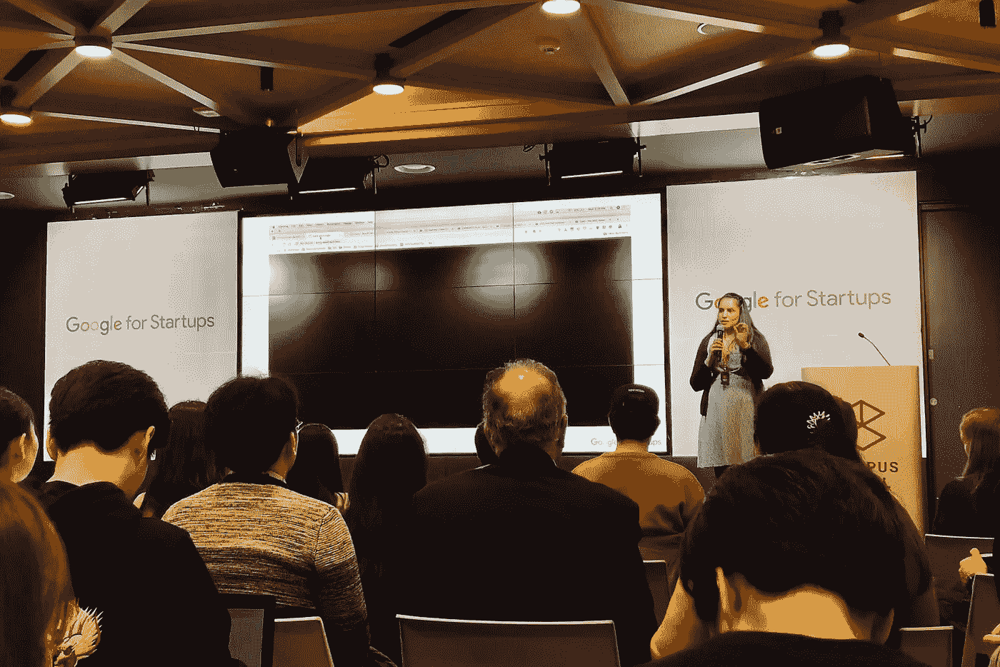

# 关于数字品牌建设的 6 个关键见解

> 原文：<https://medium.com/swlh/6-key-insights-on-digital-brand-building-adad4d108ef9>

今天，我参加了在韩国首尔举行的为期一周的 Google for Startups——校园创业学校。

今天的演讲人对由[安普拉吉塔·贾恩](https://www.linkedin.com/in/aprajita/)领导的
- **数字品牌建设**-
-**通过合作关系发展**由[达苏尔·森](https://www.linkedin.com/in/daseul-son-b608142/)领导的提出了一些有价值的见解

我计划在本周分享他们对我的*创业系列*的见解。

*以下是关于* ***数字品牌建设的一些关键见解*** *来自* [安普吉塔·贾恩](https://www.linkedin.com/in/aprajita/):

# 1.向顾客征求意见

***AirBnB*** 在推特上向其用户询问功能创意。他们创造了一个功能，当人们一起为同一个房间付款时，他们可以分别付款。这解决了顾客在分享房间价格时遇到的一个问题。划分成本的过程导致了用户的失望。他们的收入飙升，因为它使用户能够购买价格更高的房间，并减少了不得不要求其他人偿还房间费用的痛苦。

# 2.简化流程

多米诺骨牌每秒钟在网上卖出 75 个比萨饼。他们注意到网上订单比电话订单平均高出 2 美元。他们把重点转移到增加网上订单上。他们将一个 25 步的流程缩减到只有 5 步。他们依靠数据来预测他们将要下的订单，并添加了一个功能，在他们的网站上不活动 10 秒钟后实现零点击购买。简化在线订购流程有助于增加收入。

始终考虑客户不需要做的事情，并简化他们的体验。

# 3.量身定制个人品牌体验

金宝汤为不同的 YouTube 观看者提供了 1700 个不同的广告。他们通过区分向不同兴趣的人展示哪些广告来实现这一目标。

这导致销售额增长了 55.6%。这是一个不可思议的壮举，特别是对于一个消费品包装公司(CPG)来说，它通常不会为其广泛的客户群提供专业的品牌体验。

# 4.将游戏化引入其中

拼字游戏为玩这款游戏的人提供免费的网络连接。他们通过向用户提供免费 wifi 来激励他们，如果他们在网上分享他们的游戏结果，Scrabble 会给他们双倍的时间。

游戏化正在成为一个大趋势。企业家和企业应该考虑以一种有趣的方式吸引用户。

# 5.创造社会福利

中国社交信息服务微信(WeChat)利用其录音功能发起了一场有声读物捐赠活动。他们开始在书的背面贴上二维码，并要求人们为盲人捐赠他们的声音。

令人惊讶的是，超过 20 万人分享了他们的声音，并因此产生了 10 本有声读物。微信有效地开展了一场社会公益活动，提升了他们的品牌形象。

# 6.鼓励用户参与

德国汽车制造商欧宝发起了一场病毒式的营销活动。他们要求前来试驾车辆的顾客在驾驶时拍摄自己。欧宝告诉他们将它发布在社交媒体上，客户将在下次购买车辆时获得积分。

*的观点*类似于传统的口碑营销。

当我们设计产品的时候。我们需要看到数据，并找到实现我们品牌的最佳方式。

尝试这些营销策略中的一种，希望它能对你建立自己的数字品牌有所改变。

## 这篇文章发表在 [The Startup](https://medium.com/swlh) 上，这是 Medium 最大的创业刊物，有+395，714 人关注。

## 订阅接收[我们的头条新闻](http://growthsupply.com/the-startup-newsletter/)。

