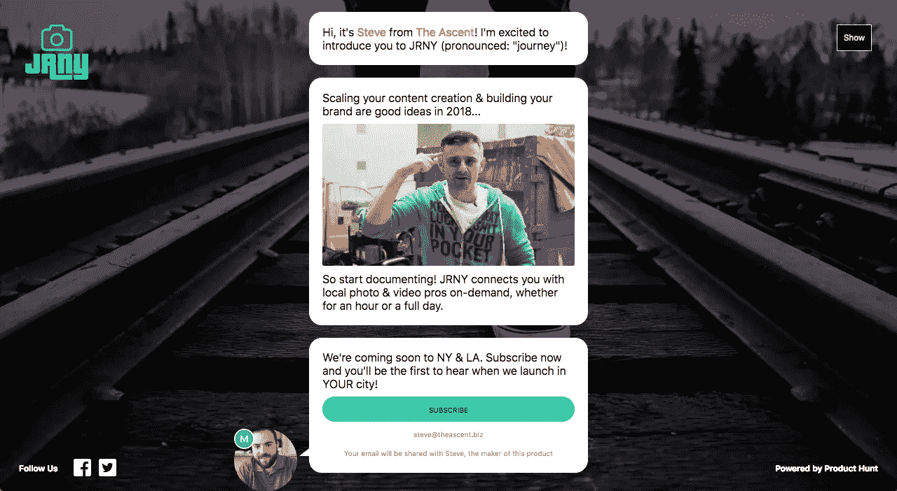
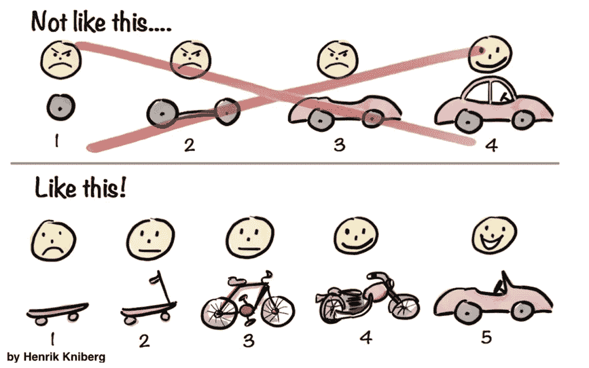
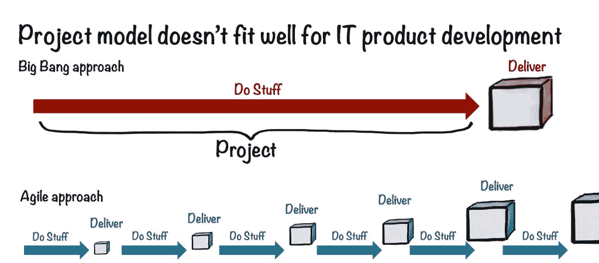

# 从为创作者创建市场平台中获得的 6 条真知灼见

> 原文：<https://medium.com/swlh/6-powerful-insights-from-bootstrapping-a-marketplace-platform-for-creators-aef9ef41aec7>



[**Follow JRNY’s progress on Product Hunt!**](https://www.producthunt.com/upcoming/jrny)

## 认识 JRNY，这是一个为照片和视频专业人士提供的点播服务。


在过去的一年里，我一直努力工作，试图建立一个企业。来自营销界，我有一个非常独特的观点。

我在[一家迅速崛起的数字营销机构](/swlh/7-things-i-learned-about-company-culture-from-working-at-a-rapid-growth-startup-3cf27ae2b5e3)工作，即将进入第六个年头，我现在的前老板(我相信你们很多人都认识他)发布到 YouTube 上的一条及时的内容，完全可以说[永远改变了我的人生轨迹](https://theascent.pub/this-is-the-one-piece-of-content-that-changed-my-entire-outlook-on-life-2a7be58adf0a)。

从那天起，我不太清楚*我想要做什么*，但是我知道我想要开始**记录任何事情的过程**。

那时我开始写 [The Ascent](https://theascent.pub) ，这是一个个人创业博客，在 Medium 上排名前 100。我也开始尝试半定期的 vlogging。

快进到第二年 4 月，当我准备离开这家公司——以及我在纽约的生活——的时候，就潜在的业务而言，我唯一真正的方向是，我想利用我的技能，做一些我真正喜欢的事情。

因此，很自然地，**我将目光转向了个人品牌**。


# 1️⃣首先决定制造什么是困难的。

实际上，这是创业最难的事情之一。


Photo by [Justin Luebke](https://unsplash.com/@jluebke?utm_source=medium&utm_medium=referral)

我是一个大力提倡走出去品尝东西的人，*尽管我曾经是一个相当有计划的人。*

当我第一次开始上这门课的时候，我当时的女朋友/商业伙伴和我[承诺在我们解决问题的时候要“不惜一切代价”](https://psiloveyou.xyz/the-art-of-living-below-your-means-so-you-can-one-day-live-above-the-standard-aaff5b095014)。

但是，事实证明，首先决定建造什么是最困难的事情之一。

> 当时，我们知道我们有一个 20，000 人的社区，一些感兴趣的读者和作家，所以我们选择从那里开始。

我们是否有可能在目前提供的所有免费内容和灵感的基础上建立一个优质服务*？我们能不能不仅为这个社区，也为其他需要营销业务或建立品牌的人提供个人品牌咨询服务？*

一个想法的种子第一次冒了出来，我们真的去实现它。我们开始建立我们的网站，创建不同的品牌包装，并在 LinkedIn 等网站上营销我们的服务。

然后，我们开始得到我们的第一批客户。几周之内，我们有了 5 个。

然后，几个月后，我们意识到我们到底在做什么。我们正在创建我们刚刚放弃的同一类型的机构和业务……而**我们一点也不开心，这是最大的问题**。

所以，在它真正有机会起飞之前，我们就拔掉了插头。

## 面对你的第一次创业“失败”

我们能在这笔生意中赚一大笔钱吗？是的，肯定的。一旦我们成功了，我们最终会快乐吗？当然，我打赌我们能。

> 但这并不是我们高兴和兴奋的事情，这对我们来说非常重要。

我们认为这是一次失败吗？不。如果有什么不同的话，我们对这次搬迁非常乐观。它显示了我们在这段时间里成长了多少。

像托马斯·爱迪生一样，我们没有失败，**我们只是找到了一种不适合我们的方式**来建立个人品牌业务。

然而，一开始就决定发展业务，大大加快了我的学习曲线。我很快认识到，即使我在发展代理方面有真正的知识甚至专长，咨询和客户服务这条路并不适合我。

因此，我很快将目光转向了我没有太多经验的行业:产品服务行业。

虽然一开始很吓人，但这个想法更适合我。


# 2️⃣，你需要尽快创造你的 MVP。

*在这种情况下，MVP 意味着最小可行平台，而不是产品……*


Photo by [imgix](https://unsplash.com/@imgix?utm_source=medium&utm_medium=referral)

一旦我开始以一种更加产品驱动的方式思考我的业务，**创建一个市场平台的想法变得非常吸引我**。

所以，我开始做大量的研究，在此期间，我发现了许多不同的资源。事实证明，没有比 Sharetribe 更有价值的了。

> [share tribe 博客](https://www.sharetribe.com/academy)的“学院”版块无疑是当今学习如何建立市场的最有价值的在线资源。

从我阅读的许多文章中，我能够提取的一条有价值的信息如下:

> 你的第一个产品需要有足够的功能来解决用户的核心问题。

这句话，以及一个简短的案例研究，关于 Airbnb 最初是如何作为一个简单的 Wordpress 博客开始的([你可以在这里找到这两个博客](https://www.sharetribe.com/academy/how-to-build-a-minimum-viable-platform/))，都是我为了开始建立这个想法所需要的许可。

进入这一领域后，我知道迅速将产品推向市场是必要的，但这并不意味着它一定要充满酷的功能或包含我曾经希望它包含的一切。

不，为了成为一名真正的 MVP，**只需要是能起作用的***。*

*借用我在上面链接的 Sharetribe 博客中的一个图片，它应该是这样工作的:*

**

*不知不觉中，JRNY(发音为“journey”)出生了。*

**

# *3️⃣基于服务的平台解决了鸡与蛋的问题。*

*哪个先来:有抱负的个人品牌建设者还是摄影/视频人才？*

**

*Photo by [Hannah Tasker](https://unsplash.com/@hannahtasker?utm_source=medium&utm_medium=referral)*

*我们这个新方向的另一个重大收获是解决“鸡对蛋”类型问题的想法。*

> ***具体来说，对于市场:**在还没有买家的时候，如何说服别人把他们的库存带到你的市场，在你还没有库存的时候，如何吸引买家。*

*迄今为止，我围绕这一噩梦场景所做的所有研究都表明，作为一名市场创始人，我应该首先专注于构建我的平台的供应端。对我来说，这意味着**服务提供商**。*

*到目前为止，我已经牢牢地抓住了(并致力于)我的新商业理念:*

> ***建立一个市场平台，让内容创作者和潜在的个人品牌可以根据需要与不同城市的照片和视频专业人士建立联系。***

## *在我看来，这是我可以真正打造的东西。*

*这不仅与我的营销专业知识完全吻合，而且也是我迫切需要的东西:为我的品牌更便宜地获得高质量的照片和视频内容。*

*首先，我需要一个扩大供应的策略。我的平台需要为专业摄影师和摄像师解决一些真正的问题。*

*那时，也只有那时，我才能利用我多年来积累的各种营销和公关策略(我的真正优势)，以一种有助于它获得真正吸引力和客户的方式来推广这件事。*

**这也恰好是我目前在这个项目中所处的阶段。**

**

# *4️⃣变得对提前发布很放心。*

**想给自己省一两个未来的头疼事？早点推出，经常推出。**

**

*Photo by [SpaceX](https://unsplash.com/@spacex?utm_source=medium&utm_medium=referral)*

*甚至在我自己觉得准备好之前就开始做某事的想法是一个真正可怕的想法。然而，就使这件事成功而言，我已经允许自己接受它是必要的想法。*

***我选择在这个平台上采用敏捷方法**，我认为这与我上面提到的经验非常吻合。*

*对我来说，解决我的先有鸡还是先有蛋的问题，从增加供应开始，意味着必须立即揭开幕后真相。*

```
***The process:** Launch → Outreach → Feedback → Apply learnings → Repeat*
```

*借用我上面提到的 Sharetribe 文章中的另一张图片:*

****

# *5️⃣:我们真的需要平衡数量和质量。*

**在你让任何人进门之前，你需要愿意建立关系。**

**

*Photo by [Jakob Owens](https://unsplash.com/@jakobowens1?utm_source=medium&utm_medium=referral)*

*在知道我首先需要建立 JRNY 的服务提供商供应的情况下，我的营销人员只是希望我向整个世界展示我的产品页面，欢迎任何和所有即将到来的兴趣。*

*但这不是一个可行的方法，至少目前不是。*

*我从创建 JRNY 中学到的下一个重要的东西是**对我让谁进入**开始相对有选择性。*

*在过去的几年里，看着像 Gary V .和 Casey Neistat 这样的人，我坚定地认为，对于那些渴望成功的年轻骗子来说，今天有一个真正的市场机会:*

1.  *拥有成为有影响力品牌的所有天赋、能力和兴趣*
2.  *有照片/视频技能，相机，并希望与上述联系*

*因此，虽然我清楚地看到产品/市场适合 JRNY 的潜在优势，但现在**我正集中精力吸引第一批供应商**。*

*现在，这意味着与居住在我们最初的两个发布城市(纽约和洛杉矶)的专业人士联系*和*已经在管理某种类型的照片/视频业务。*

*在我看来，如果我们能为这些人提供更好的选择或解决方案，其他人也会有这些需求。此外，如果我们能够在我们的平台上签约的第一批供应商生产出高质量的作品，这只会有助于 JRNY 在早期通过口碑发展。*

> *更不用说我们可能会得到高价值的反馈。我真的很喜欢从最高层开始，然后一步步往下的想法。*

*就在上周，我从 Instagram 开始了有针对性的拓展活动。为了 JRNY 的成功，我需要进行一些初步的对话，这种方式非常有效。*

*一路上，我还碰巧学到了一些有价值的 Instagram 推广技巧，你可以在这里看到:*

**

# *6️⃣，追随你的激情，并努力以身作则。*

**这是真的，现在没有人会像你一样关心你的产品。**

**

*Photo by [Joshua Alfaro](https://unsplash.com/@itsjossha?utm_source=medium&utm_medium=referral)*

***我对自己在**的位置非常满意，这是我这次商务之旅的第二年。*

*我读到的关于创业的一切——努力工作、对失败的恐惧、睡眠不足、咖啡因、生活方式、新获得的自由、责任——在某种程度上是真实的，但即使知道潜在的负面影响，我仍然不会用这种经历来交换任何东西。*

*也许迄今为止，我从整个过程中获得的最大领悟是**认识到做让我快乐的事情的重要性**。*

*最终，我和其他人一样，开始创业，为*自己*建造一些东西。*

*我非常关心个人品牌。我也关心技术、产品制造、营销和社交媒体。*

*正如我在本文开头提到的，“就潜在业务而言，我唯一真正的方向是，我想利用我的技能，做我真正喜欢的事情。”*

*这就是我每天早上醒来“去工作”时感到兴奋的原因。这让我对我的愿景如此依恋。*

*而且，如果我不太小心的话，它可能会引领我走向成功。*

*[](https://www.producthunt.com/upcoming/jrny)

[Stay up-to-date on JRNY’s progress here](https://www.producthunt.com/upcoming/jrny).* ***[](https://facebook.com/imstevecampbell)**[](https://instagram.com/imstevecampbell)**[](https://linkedin.com/in/imstevecampbell)**[](https://medium.com/@steve_campbell)**[](https://twitter.com/steve_campbell)**[](https://www.youtube.com/stevecampbellvids?sub_confirmation=1)**[](https://medium.com/swlh)*

## *这篇文章发表在《T4》杂志《创业》(The Startup)上，这是 Medium 最大的创业刊物，有 320，131+人关注。*

## *在这里订阅接收[我们的头条新闻](http://growthsupply.com/the-startup-newsletter/)。*

*[](https://medium.com/swlh)*