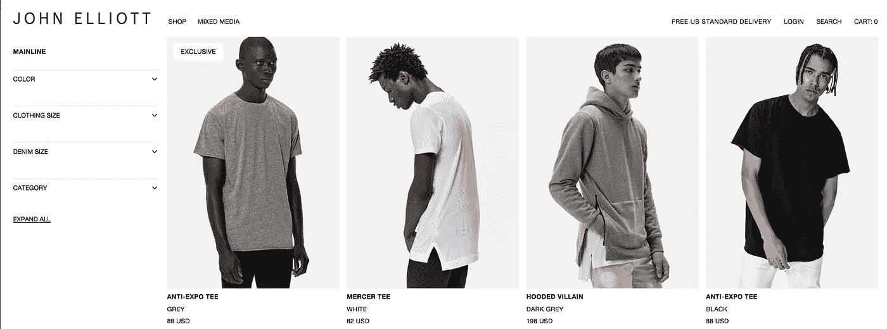
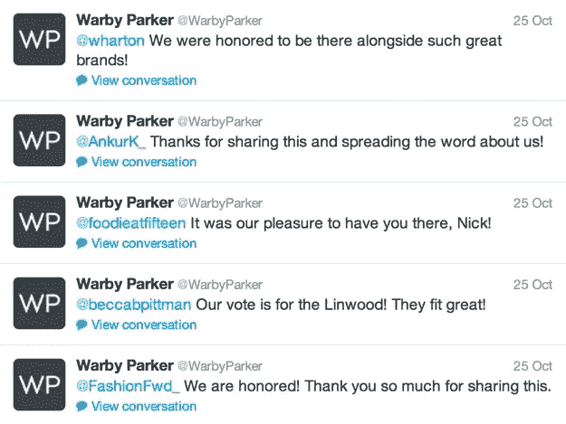
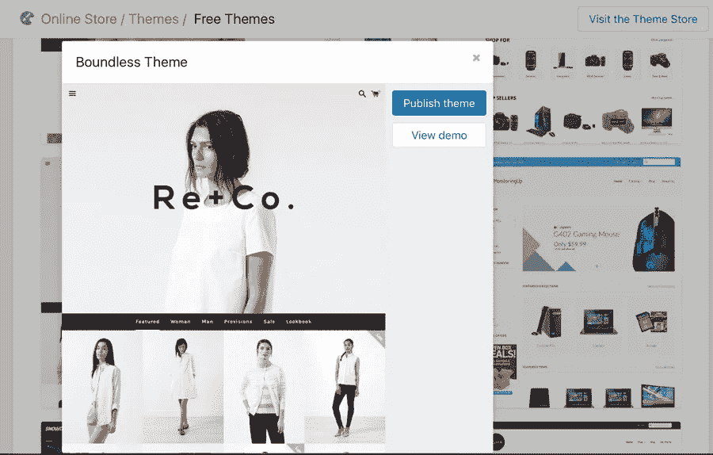
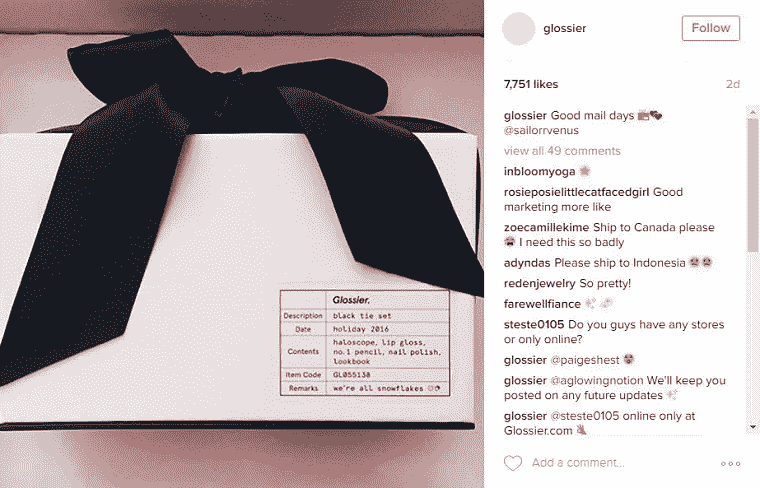

# 直接面向消费者的电子商务迅速崛起背后的 6 个原因

> 原文：<https://medium.com/swlh/6-reasons-behind-the-meteoric-rise-of-direct-to-consumer-e-commerce-8228a3b4fa84>

漫步在纽约市时尚的购物区 Soho，你会注意到一个奇特的现象。许多店面干脆就关门了，那些没有关门的只是弹出式商店或其他一些明显的临时租赁。几十年来，填补这种空白的商店是商业的守门人——没有办法绕过它们。在过去的十年里，这一切都变了。现在，你甚至在网上买卫生纸。你在网上买眼镜。你在网上买牛仔裤、运动鞋、靴子和牙刷。对于这些品牌中的许多来说，过去不可能像这样销售。如今，小品牌正在挑战大量的市场老手。他们赢了。

实体店是不可避免的祸害。除此之外，你还会如何将你的商品展示在顾客面前？特别是对某些行业来说——时尚就是其中之一——消费者亲自去感受和触摸产品几乎是必不可少的。当然，邮购目录是存在的，但它们几乎无法与我们今天认为理所当然的购物可能性相提并论。

随着世界变得越来越紧密，亚马逊等电子商务公司变得越来越庞大，消费者已经习惯了网上购物。他们信任大大小小的网上商店。随着时间的推移，在业务的许多其他部分也更容易执行——管理和开发网站，创作好的产品照片和内容，与客户联系，以及营销你的品牌。这降低了许多初创公司的准入门槛，允许一种全新的方式进入从未像初创公司类别那样热门的东西——物理产品。

如今，我们有无数的成功故事，从 Glossier 到 Bonobos，从 Warby Parker 到 Casper，涵盖了所有可以想象的产品类别。最终，它们与那些让它们在近几年蓬勃发展的公司有着相同的品质，这在很大程度上归功于互联网。

这里有一个原因。

## 你可以在降低价格和提高质量的同时降低成本。

电子商务意味着很难在价格上竞争。你有如此大的供应量，如果你的定价高于你产品的感知价值(就像奢侈品牌经常会做的那样)，你的日子会不好过。

当商店和批发商出局时，你突然有了两倍多的利润来玩和投资你的产品。这意味着你可以同时降低价格，创造更高质量的商品，同时还能赚更多的钱。这是显而易见的，许多品牌很快就明白了这一点。

当你已经有了被迫保持高成本的知名品牌(因为他们历来拥有更昂贵的分销系统，不希望降低在线成本，这会蚕食他们的店内销售)，直接面向消费者的品牌在质量和价格上具有令人难以置信的竞争力，尤其是在开始阶段。

Thursday Boots Co. built their brand on having quality boots at lower prices than the competition by keeping things online.

## 你不受批发商和商店的摆布。

将一个品牌的战略与其顾客的口味相协调也要困难得多。当然，在大多数层面上，这些品味和人口统计数据是可以理解的，但最终品牌必须按照商店或批发商的要求去做。因此，批发商的需求比顾客的需求更重要。

批发商和商店的需求和要求也限制了品牌可以用他们的产品线做什么。几乎没有实验的空间，因为如果他们卖不出去，对品牌和批发商来说都是高风险的。以时尚为例，你也经常被迫不断创造和更新季节性系列。商店需要流量，他们总是想要新的东西。当商店是唯一的销售方式时，如今时尚品牌拥有“永久”系列的趋势可能会更加难以改变。

重要的是，控制你的销售渠道意味着随着你的成长，你控制所有的客户数据、购物体验和利润。

John Elliott’s “MAINLINE” is a permanent collection of their high-quality basicwear.

## 你可以通过社交媒体直接与客户交流。

由于商店和批发商是一个缓冲，品牌也错过了客户关系的一个关键组成部分——与所述客户的直接沟通。只有销售人员或商店的客户支持人员才真正坐在第一线，听取客户的反馈，并且只能作为他们工作的商店的代表做出回应，而不一定考虑品牌的最佳利益。

如今，品牌可以通过我们日常使用的各种社交媒体渠道直接与客户沟通。客户的反馈可以立即被理解。如果你把握住了顾客需求的脉搏，那么你的市场调查就会每天自动地为你完成一部分。他们会告诉你他们想要什么。

这种差距已经被有效地弥合了，甚至有品牌会为新产品进行小型众筹活动。这是一举两得，既可以在生产前获得报酬，又可以实时了解客户的需求和愿望。

Warby Parker interacts with as many of their customers on Twitter as possible.

## 你有低成本的，有针对性的，可直接归因的营销。

> “我花在广告上的钱有一半都浪费了；问题是我不知道是哪一半。”约翰·沃纳梅克(1838-1922 年)

即使抛开前面所有的要点，你也必须首先以某种方式把你的品牌展现在顾客面前。互联网上充斥着各种各样的产品。一个不仅让直接面向消费者的品牌蓬勃发展，而且为脸书和谷歌等巨头提供主要收入来源的发展趋势是有针对性的数字营销的兴起。

如果你想用老派的方法做广告，你(充其量)对广告投资的投资回报率了解有限。也许如果你让顾客把优惠券退回商店，那么你可以做一些原始的跟踪，或者如果他们选择告诉你他们第一次听说你的地方。

现在，你有了程序化广告。简单来说，程序化意味着广告是根据特定的标准专门提供给你的。还记得当你开始搜索坎昆的餐馆时，突然你看到了酒店优惠的广告吗？你的兴趣是已知的，并存储在世界各地的数据库中，然后根据这些兴趣为你提供广告。或者根据你的搜索结果给你提供广告。无论哪种方式，有史以来第一次，你可以对广告活动有非常具体的目标偏好。这意味着，你可以直接瞄准你首先想要的 1000 个相关个人，而不是付钱给 10000 个人做广告，然后让其中的 9000 个人不感兴趣。虽然这是一种过于简单化的说法，但结果是一样的:你只需付出少得多的钱，就能锁定高质量的受众。

这就打开了接触有着荒谬的特定偏好的顾客的闸门，而且这样做的成本很低。您还收集了前所未有的大量数据，可以进一步将您的活动与您的现场分析系统相结合，以真正了解前来购买的人数和行为。这意味着你可以以闪电般的速度迭代，而不是等待商店的销售数字，然后查看有多少优惠券进来，等等。

Hawkers was a major success story with Facebook ads.

## 电子商务的准入门槛大幅下降。

这一个既是优点又是缺点。总的来说，作为一个小得多的玩家，你有能力在同一个市场上与大品牌竞争。建立一个网上商店并列出你的产品要便宜得多。如上所述，营销角度也更便宜。你甚至可以在你的卧室里履行，或者使用越来越多的创业友好型履行中心将你的货物运送给客户。

虽然产品的实际生产成本不太可能随着这里提到的所有东西而改变，但几乎所有的其他成本都会低得多。考虑到广告定位的特殊性，制作非常小众的产品并获得高额利润也变得很经济。

当然，这里的缺点是在许多情况下很难竞争。你会看到一批批饥肠辘辘的企业家在各地创造产品，并使用相同的营销和分销模式。Kickstarter 和 Indiegogo 等众筹网站已经允许没有传统融资的公司筹集相当数量的资金。很难找到一个区分因素。竞争对客户来说是好事，但对那些想打入市场的人来说就不那么好了。

考虑到差异化的难度，[我强烈认为首先拥有一个一流的品牌是至关重要的](https://uxdesign.cc/prioritize-brand-and-the-rest-will-follow-38c0d979532f)。实际上，许多类别的公司都缺乏资源，无法在产品上开发出如此巨大的差异化优势，从而独自经营业务。差异化仍然可以发生在体验和与品牌相关的感觉上，同时仍然拥有优秀的产品。

Shopify is a service provider allowing anyone to open up an e-commerce store.

## 你可以提供端到端的品牌体验。

如果没有商店和批发商，你就控制了整个品牌体验。你获得客户，教育他们，让他们感兴趣，说服他们购买，给他们发送一个伟大的产品，让他们再次购买，让他们告诉他们所有的朋友，并在整个过程中与他们沟通。基于前面的观点，建立一个合适的、强大的、有吸引力的品牌是非常重要的，不仅要看起来合法，而且要在情感层面上与顾客建立联系。当你控制了整个体验，你就有更大的机会让你的品牌战略与你的意图相结合。

你也创造了一支迷你福音传道者的军队。如果你是一家不知名的大公司，为什么会有人想把你的事情告诉他们的朋友呢？还是真的那么在乎你？如果你和你的客户处于同一水平，只是像一个人而不是一个公司一样行事，那么你的很多客户自然可以为你做很多营销跑腿工作。要做到这一点，你真的必须把所有的事情都做好，但这种现象是今天最大的直接面向消费者的参与者背后的原因。

Glossier does incredibly in this department, with fans who can’t get enough of everything they make.

最有趣的是，一些空置的店面正被直接面向消费者的公司出租。他们不否认与客户面对面交流的价值。这些商店将举办活动，展示独家产品和服务，并建立在线体验。你甚至有 Bonobo 的“指南商店”这样的概念，它不会让你把任何产品带回家。相反，你先试穿，然后在网上结账。

我是住在纽约市的数码战略家和偶尔的摄影师。在 Instagram 上通过 **@andreikorchagin** 关注我，或者在 andreikorchagin.com[访问我](http://andreikorchagin.com)。

## 这篇文章发表在《T4》杂志《创业》(The Startup)上，这是 Medium 最大的创业刊物，有 317，238 人关注。

## 在这里订阅接收[我们的头条新闻](http://growthsupply.com/the-startup-newsletter/)。

