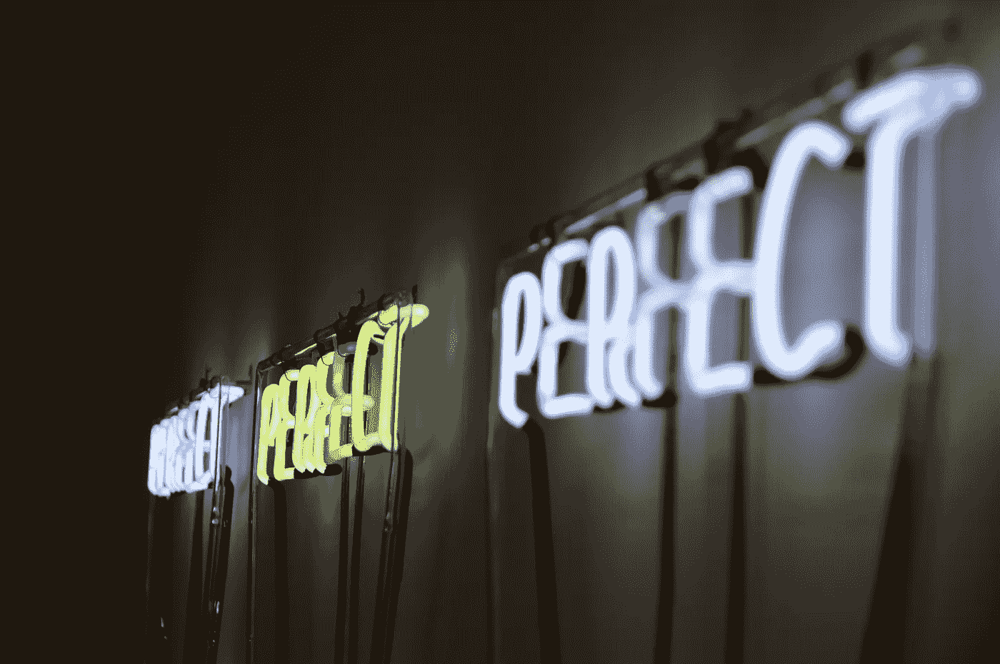

# 6 条让你成为完美主义者(并阻碍你成功)的“秘密”规则

> 原文：<https://medium.com/swlh/6-secret-rules-that-make-you-a-perfectionist-and-block-your-success-9fa50209647b>

[Jonathan Hoxmark](https://unsplash.com/@hoxmark) at [Unsplash.com](https://unsplash.com)

我是一个完美主义者。

我哪里知道？因为我花了 5 分钟的时间来解决上面这个简短的 3 个单词的句子。

呃…

虽然我很少在外面表现出来，但我对自己很严格。

我不够聪明。不够创新。不够有魅力。不够成功。不够有创业精神。

**不够*完美*不够。**

根据乔恩·阿库夫的《T4 完成 T5》一书，这种消极的自我对话是完美主义者的典型症状。

我现在意识到我肯定是其中之一。

然而，几十年来，我对自己完美主义的困境浑然不觉。

就在最近，当我仔细阅读乔恩那本见解深刻的书的每一页时，我的诊断结果才被揭示出来。

现在，我几乎觉得有义务指责他抄袭。

他的话揭示了我内心完美主义的挣扎。感觉就像是他从我的日记里偷了一些个人漫谈。

例如，我们完美主义者倾向于在头脑中编造武断的法令，抑制我们的成功和幸福。

乔恩称之为“秘密规则”。

它们深深地埋藏在我们的脑海中，决定着我们在日常生活中的行为和对环境的反应。

这是不幸的，因为这些“规则”从来没有植根于现实。最糟糕的是，它们阻止我们与世界分享最真实的、赠送礼物的自我。

# **您曾经告诉过自己以下陈述吗？…**

> **“要做有价值的事，必须是困难的。”**

检查。那就是我。

> “如果你不得不学习新的东西，你就失败了。”

检查。那也可能是我。

> “寻求帮助或模仿别人的商业成功之路是‘欺骗’。”

没错。罪名成立。

> “对我来说，获得比别人更多的成功是不公平的，即使我为此付出了努力。”

哇哦。这越来越诡异了。他在我家藏了摄像头和麦克风吗？

> "我必须挤出一天中的每一秒钟来提高效率。"

一周 7 天，一天 24 小时，不停地工作。这是任何“伟大”企业家都应该做的，对吗？

> “轻松赚钱不好。我必须用我稀缺的时间、精力和意志力来换取每一美元

*这个在我听来 ***完美*** 。你呢？如果是这样，你可能是一个隐藏的完美主义者。(不用担心。没有人是完美的。)*

*说实话，我并不总是服从所有这些秘密规则。*

*相反，它们被组合成一个强大的、窃取满足感的、减少影响的混合磁带，在我的脑海中一遍又一遍地循环。*

**还有最糟糕的部分？我大脑的理性部分知道这些秘密规则与我想要的生活方式背道而驰。**

*真是讽刺。作为追求最高生产率的一部分，我努力做到所谓的“完美”。更大的影响。更多的生活变得更好。*

*然而，我的秘密规则促成了与相反的*结果。**

*我变成了一个自我破坏者。并且在这个过程中，破坏了许多可以带来更充实、更成功的生活的机会。*

# *感谢上帝，我们都被赋予了自我意识。*

*你、我和每一个介于两者之间的人都有能力**俘虏每一个思想**并问我们自己:*

> *"这种想法对我是有益还是有害？"*

*我们只需要有意识地对待我们的想法，并对那些伤害我们的想法采取行动。*

***别忘了:完美主义是伪装的魔鬼。***

*没有意向性和自我意识，就很容易对流经你大脑的每一个完美主义者的想法打上你的“认可”的印记。*

*你告诉自己要更加努力。对自己期望更高。别搞砸了。咬紧牙关熬过痛苦。你可以，也应该永远做得更好。*

## *我写这篇文章的过程是伪装完美主义的一个典型例子。*

*我想一次坐下来就完成所有的工作。*

*算了吧。我不得不在一次会议中完成它。*

**为什么？因为我完美主义的大脑告诉我。武断的标准已经确立。**

***所以，当我 2 岁的儿子从午睡中醒来，尖叫着叫我的时候，我必须做出选择***

**我要不要不理他，完成这篇帖子？**

**或……**

**我是否做出了正确的* ***选择，这个选择符合我做一个好父亲的目的，并把我的小男人从他的卧室里救出来？****

*不，我不是疯子。我没有忽视我尖叫的孩子。*

*然而，我不得不与这种冲动作斗争。因为他就在那里。我肩膀上的小完美主义者在我耳边说着诱惑的话:*

> *“别理他。他没事。你不能半途而废。你有一个目标要完成。如果你现在停下来，以后再继续，就不会…..完美。”*

*这有多糟糕？*

*这种程度的完美主义是从哪里灌输给我的？*

*虽然我肯定这其中有很多影响，但我认为传统学校教育发挥了最大的作用之一:*

> *争取所有的 A。*
> 
> *不要犯错误。*
> 
> *穿过每个 T，点上每个 I。*
> 
> *哦，你没有走廊通行证？留堂！！*

*但是现实世界并不是这样的。*

*你应该预料到会犯一些错误。你应该期望放下琐碎的事情。在你的生意或生活的其他领域。*

*不，我不建议你故意犯错。那是愚蠢的。*

*我只是相信，当你取得相当大的成功时，错误是一个自然的副产品——不管你在你的“完美”计划上花了多少时间和精力。*

*因为很多时候，“好”就足够好了。*

# *你永远不应该追求完美。追求卓越。*

**如何？**

*你需要重新编程你的大脑，更新你的思维。你的秘密规则必须彻底废除。*

*根据 Jon Acuff 的说法，为了克服我们许多人遵循的“秘密”完美主义规则，你必须做三件事:*

1.  *识别他们。*
2.  *摧毁他们。*
3.  *更换它们。*

*现在，我不会在这里对每一步都进行详细描述。如果你想从杰夫·贝索斯买一本，我会把有趣的细节留给这本书。*

## ***我只想说:拿出你的日记，开始写吧。***

*当你从一个入口跳到另一个入口时，在你的思想中寻找趋势和模式。*

*深入挖掘。继续洞穴探险。你会找到你想要摧毁的东西。(而乔恩在他的书中揭示了几个关键问题，可以帮助你更快地找到你的秘密规则。)*

*那么，一旦你发现那些狡猾的、完美主义的罪犯，你会怎么做呢？*

## ***到了*消灭*和*替换*的时候了。***

*永远，永远不要让你的秘密规则再次挟持你。*

*因为即使你可能没有意识到，这一刻你也有很好的机会遵守一些秘密规则。*

*他们是守门人。保镖们。那些站在你和你内心渴望实现的目标之间的硬汉。*

> *所以是时候放开你的秘密规则了。取而代之的是有益于你和支持你目标的健康思想。*

***但是现在请注意这个警告:**这个“识别、销毁和替换”的过程将需要超过 10 分钟。*

*在你挖掘出深埋在你脑海中的所有秘密规则之前，你需要和你的日记进行多次拥抱。*

*但我向你保证，努力是值得回报的。*

> *一旦你的秘密规则被驱逐出你的大脑，你会被完美主义者- *破坏*，成功- *实现*的结果所震惊。*

*所以现在是时候了。我在这篇文章的结尾。和往常一样，完美主义带着一长串问题在我的脑海里留下了最后的痕迹:*

*我今天的帖子有多完美？*

*我 ***真的*** 提供了足够的价值吗？*

*我是否清楚地传达了在我脑海中跳跃的混乱想法——零错误或疏忽？*

*啊哦。现在思想变得更加无情了…*

> *“你的文笔一点都不好……”*
> 
> *“没有人会想看这个…”*
> 
> *“你有什么资格给别人提建议？你并不完美……”*

*没有。我没有。这就是为什么我应该按下发布键。*

*快点，在我改变主意之前。*

*记住，好就够了。*

*已发布。*

**

## *这个故事发表在 [The Startup](https://medium.com/swlh) 上，这是 Medium 最大的创业刊物，有 320，131+人关注。*

## *在这里订阅接收[我们的头条新闻](http://growthsupply.com/the-startup-newsletter/)。*

**