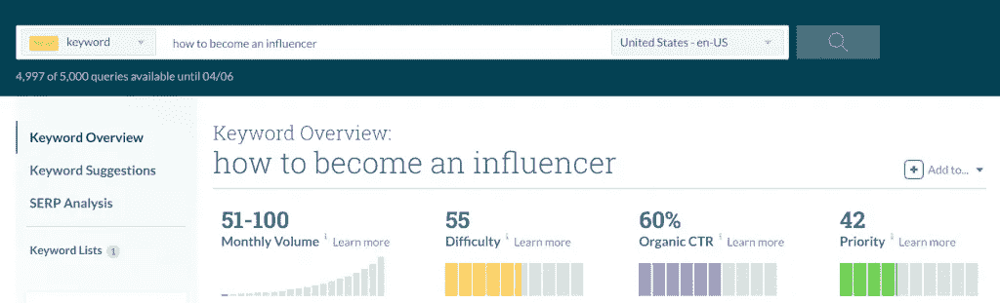
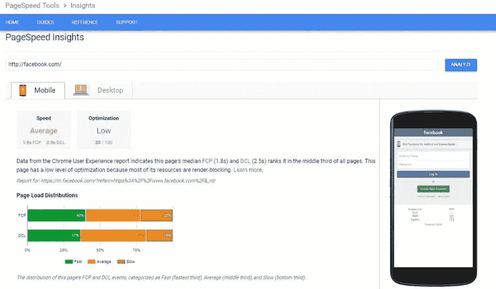
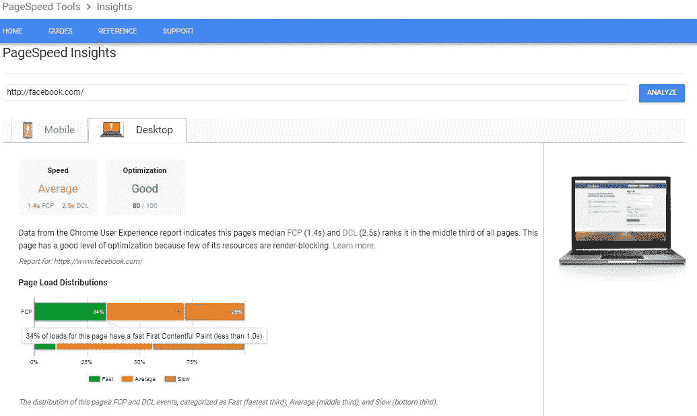
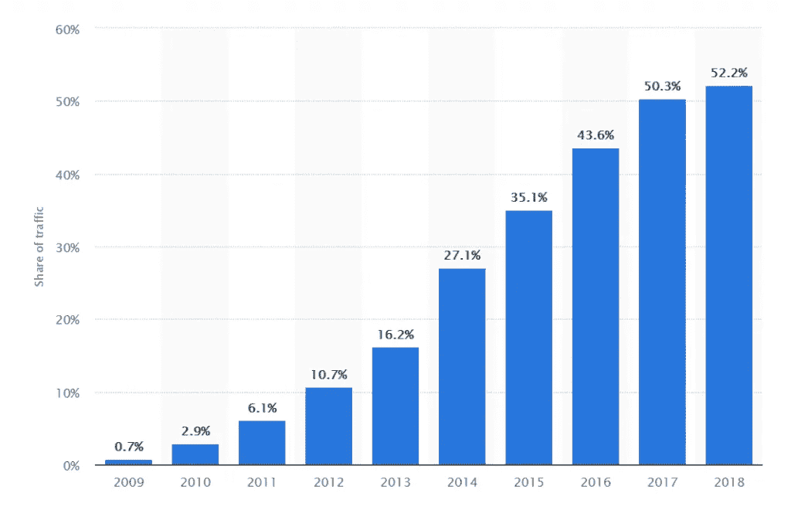
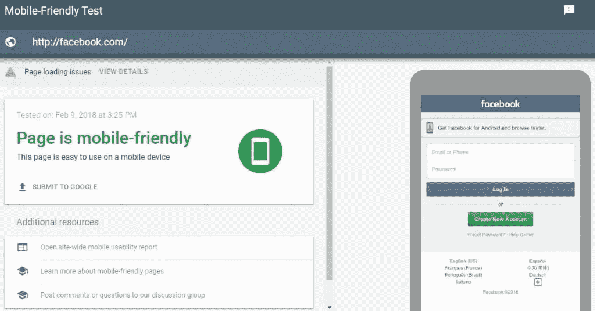
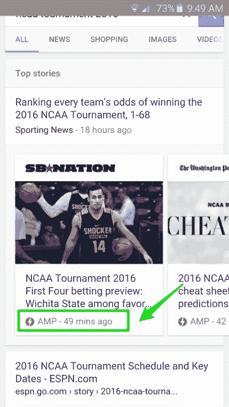

# 你需要立即停止的 6 个 SEO 错误

> 原文：<https://medium.com/swlh/6-seo-mistakes-you-need-to-stop-immediately-5692fbd75343>

随着近年来数字营销的快速发展，保持领先变得前所未有的困难。如今，数字领域的竞争异常激烈。但有一点没有改变，那就是搜索引擎优化(SEO)在确保你实现目标的过程中起着至关重要的作用。

你的在线营销需要与强大的搜索引擎优化策略相结合，才能真正取得成功。这需要一个持续的搜索引擎优化和性能分析的内容优化过程。然而，一些营销人员犯的一个基本错误是没有利用 SEO 的力量来推广他们的品牌。

一些营销人员试图避免艰苦的工作，并使用联盟营销快速获利。事实上，大量的营销人员更喜欢联盟营销而不是搜索引擎优化，因为它承诺快速赚钱。但是，你应该知道，这不应该是使用联盟营销的理由。它不能取代搜索引擎优化。如果你真的关心你的生意，你需要知道你的[品牌在搜索引擎中的排名。](https://www.polepositionmarketing.com/emp/how-to-get-more-clicks-than-the-sites-ranked-higher-than-you/)

不幸的是，SEO 可能是一个棘手的游戏，需要一些努力才能掌握。如果你最近开始关注 SEO，你可能只会看到很小的改进。不要因此而气馁。SEO 是一种可以在几周内实施的策略，但这需要时间来产生效果。

由于 SEO 竞争激烈，难度大，你犯的任何 SEO 错误不仅会浪费你的时间，还会损害你的业务。许多品牌发现自己因为没有以正确的方式实现 SEO 而受到谷歌的惩罚。纠正简单的 SEO 错误可以显著提高你的搜索排名。

这里有 6 个常见的搜索引擎优化(SEO)错误，你需要马上停止。

# #1.没有研究和优化关键词

确定你的重点关键词应该是创建你的 SEO 策略的第一步。虽然这看起来很简单，但许多营销人员和品牌仍在为此苦苦挣扎。

当 SEO 的概念相当新的时候，为关键词优化你的内容曾经是非常简单的。为了出现在谷歌的雷达上，公司会创建填充了特定关键词的内容。他们有时甚至会断章取义，只是为了把自己推到谷歌搜索的第一页。

虽然这种伎俩最初成功地获得了好的排名，但这种成功是短暂的。谷歌很快意识到，塞满关键词的内容给用户带来了非常糟糕的体验。

所以谷歌开始改变它的搜索算法。关键字填充被添加到黑帽 SEO 技术的列表中。随着谷歌现在使用[潜在语义索引(LSI)](https://blog.hubspot.com/marketing/what-is-latent-semantic-indexing-why-does-it-matter-for-your-seo-strategy) ，用特定的词填充你的内容已经变得毫无意义，更糟糕的是，还可能具有破坏性。忘记你的排名。如果谷歌当场抓住你，你的页面可能会被搜索引擎完全封杀。

那么，我们应该如何以正确的方式优化关键词的内容呢？从选择竞争少但搜索量大的关键词开始。这确保了有相当数量的人搜索它们，但是它们没有被你的许多竞争对手使用。你可以利用像 [Moz 关键词浏览器](https://moz.com/explorer)、[谷歌关键词规划器](https://adwords.google.com/intl/en_in/home/tools/keyword-planner/)或 [KeySearch](https://www.keysearch.co/) 这样的工具来找到合适的关键词。

确保混合以下内容:

*   向当地客户描述您的产品和服务的全球关键词，
*   吸引用户的通用关键词，
*   和宽泛的关键词，只要有人搜索相关的词，就会触发你的品牌的广告。

*图片来自 Moz*

找到正确的关键词是 SEO 的一个关键方面。花时间研究你的关键词会帮助你把你的品牌从竞争对手中区分出来。

# #2.站点加载速度不快

如果你没有关注排名因素的新闻，你可能没有意识到速度的必要性。谷歌多次声明“网站加载速度”是他们考虑排名的主要因素之一。此外，从 7 月份开始，它将[成为移动搜索的排名因素](https://webmasters.googleblog.com/2018/01/using-page-speed-in-mobile-search.html?utm_source=Clients&utm_campaign=7ba4c49520-CLIENT_EMAIL_CAMPAIGN_2018_03_15&utm_medium=email&utm_term=0_6e8ead0962-7ba4c49520-456375417)。

想想吧。如果你的网站很慢，访问者会一直等着它加载完吗？没错，大部分不会。谷歌不想对这些网站进行排名，因为它们提供的用户体验很差。除此之外，缓慢的网站加载速度会影响你的转化率，即使你的网站获得了排名和流量。

因此，如果你还没有检查你的网站的加载速度，现在是时候了。有很多方法可以测试你的网站速度。例如，谷歌的 PageSpeed 工具可以帮助你追踪网站的表现。它还提供了关于移动和桌面加载速度的完整报告。

*图片 via*[Google page speed Insights](https://developers.google.com/speed/pagespeed/insights/?url=facebook.com&tab=desktop)

# #3.不考虑移动优化

虽然这是一个常见的错误，但品牌为不考虑移动和手持设备的优化付出了高昂的代价。谷歌推出了移动优先的索引，这将成为谷歌搜索算法的主要部分。因此，如果你的网站不适合移动设备，你绝对应该考虑为移动设备进行优化。

*图像通过 Statista*

随着移动和手持设备用户[每年急剧增加](https://www.statista.com/statistics/241462/global-mobile-phone-website-traffic-share/)，为移动优化你的网站是一个好主意。确保创建一个响应的网站设计。它不仅易于管理，而且是最好的 SEO 友好解决方案之一。你可以使用谷歌的[手机友好测试](https://search.google.com/test/mobile-friendly?id=NWKbUN7cDpygQYKFRa2Rrg)来测试你的网站，看看它是否需要改进。

*图片 via* [*谷歌手机友好测试*](https://search.google.com/test/mobile-friendly?id=VnkoEhM5zbyt7EgRv8N2Rw)

# #4.不迁移到 HTTPS

在现代数字时代，我们不再只是浏览互联网，我们实际上生活在那里。随着越来越多的人每天使用互联网，安全已经成为主要关注的问题。

现在，除了简单地奖励迁移到 HTTPS 的排名更好的网站，谷歌自己的浏览器扩展将调出不在 HTTPS 的网站。从 2018 年 7 月开始，[谷歌将在 Chrome](https://security.googleblog.com/2018/02/a-secure-web-is-here-to-stay.html?utm_source=Clients&utm_campaign=7ba4c49520-CLIENT_EMAIL_CAMPAIGN_2018_03_15&utm_medium=email&utm_term=0_6e8ead0962-7ba4c49520-456375417) 中将所有“HTTP”网站标记为“不安全”。

那么 HTTPS 到底是什么？HTTPS 或安全超文本传输协议是 HTTP 的安全版本。通过采用 HTTPS，您为您的用户提供了三层保护。

1.  **身份验证:**身份验证确保您的用户与他们实际想要交流的网站进行交流。它保护你的用户免受[“中间人”攻击](https://us.norton.com/internetsecurity-wifi-what-is-a-man-in-the-middle-attack.html)。这不仅能确保你的用户停留在预定的页面上，还能在用户之间建立信任。
2.  **加密:**加密是保持你的数据交换被加密并防止被窃听的过程。这意味着您的个人信息不会被窃取，您的活动不会在互联网上被跟踪。
3.  **数据完整性:**数据完整性防止任何数据和信息在交换和传输过程中被破坏或修改。

从 HTTP 迁移到 HTTPS 背后的想法是让网络成为一个更安全的地方。这可以确保您的个人数据保持私密，不会被他人滥用。

谷歌真正透露他们的网站排名因素是相当罕见的。然而，当他们明确提到迁移到或创建 HTTPS 网站将提高网站排名，网站所有者绝对应该听。

# #5.不使用加速移动页面(AMP)

加速移动网页(AMP)是为出版商创建的免费软件编码标准。AMP 的主要目的是帮助出版商快速有效地加载他们的网站。那么 AMP 和搜索排名有什么关系呢？借助 AMP，出版商能够创建针对移动设备优化的内容，并能够随时随地加载。

例如，当你在谷歌上搜索新闻时，你看到的不是搜索结果，而是一连串的信息。谷歌会为你突出相关的故事和新闻。接下来会有网站贴上 AMP 标签，提示它们加载更快。

*图片经由* [*搜索引擎期刊*](https://www.searchenginejournal.com/how-will-googles-amp-pages-affect-seo/159741/)

这项开源计划是由谷歌在 2015 年宣布的。这项倡议的目标是改善移动网站的性能，提高速度，并使搜索无缝。自 2016[2016](https://searchengineland.com/library/google/google-amp-project)推出以来，谷歌将 AMP 整合网站放在搜索结果的特殊位置。

谷歌目前为使用 AMP 的网站提供两大好处。使用 AMP 的网页上有“AMP”标签，这表明该网站比其他网站运行得更快。谷歌还提高了使用 AMP 的网站的排名。

# #6.使用重复内容

生成大量内容的一个简单方法是利用不熟练的作者或文章旋转软件来旋转文章。通过使用这样的方法，你实际上是在创建一些马虎的内容，这些内容不会真正有益于或吸引访问者。随着内容营销的激烈竞争，这样的内容不会让你真正成功。

不仅如此，众所周知，谷歌会惩罚重复内容，抄袭会对你的搜索排名产生负面影响。此外，仅仅通过阅读你的内容，人们就能判断出它是否有价值和独特。

[内容](https://www.polepositionmarketing.com/emp/content-marketing-hack-creating-quality-blog-posts/)才是王道，应该准确、易读、写得好。写高质量内容的最好方法之一是遵循[谷歌的指导方针](https://webmasters.googleblog.com/2011/05/more-guidance-on-building-high-quality.html)。谷歌努力为用户提供最优质的内容。所以理解他们的需求并根据这些指导方针创作内容真的能帮到你。

高质量的内容是你的内容策略不可或缺的一部分。所以，如果你还没有考虑过，现在是时候了。

# 优化、跟踪和重复

当你实施这些改变时，跟踪它们对你排名的影响是很重要的。记下这一点将有助于你看到哪些改变对你有帮助，哪些没有，这样你就知道你需要更多地关注哪些方面，哪些改变应该放弃。

你可以使用排名追踪工具，比如专业排名追踪工具来分析你的网站在所有搜索引擎中的排名。他们的算法将帮助你了解你的网站所处的位置，这样你就可以领先于你的竞争对手。你可以在各种搜索引擎、移动设备和本地搜索中记录你的排名。

搜索引擎优化是数字营销的一个主要部分。正确的做法不仅会带来更多的游客，还会增加知名度。投资于正确的工具、资源和人员将会带来很大的不同。避免这些错误肯定会帮助你提高网站的排名。

你知道任何其他常见的搜索引擎优化错误吗？请在下面的评论区告诉我们。

***最初发表于***[***P*olePositionMarketing.com**](https://www.polepositionmarketing.com/emp/6-seo-mistakes-you-need-to-stop-right-now/)***。***

**关于作者**

[谢恩·巴克](https://shanebarker.com)是[内容解决方案](https://contentsolutions.io/)和 [Gifographics](http://gifographics.co/) 的创始人兼首席执行官。你可以在[推特](https://twitter.com/shane_barker)、[脸书](https://www.facebook.com/ShaneBarkerConsultant/)、 [LinkedIn](https://www.linkedin.com/in/shanebarker/) 、 [Instagram](https://www.instagram.com/shanebarker/) 上和他联系。

## 这个故事发表在 [The Startup](https://medium.com/swlh) 上，这是 Medium 最大的企业家出版物，拥有 328，729+人。

## 在这里订阅接收[我们的头条新闻](http://growthsupply.com/the-startup-newsletter/)。

