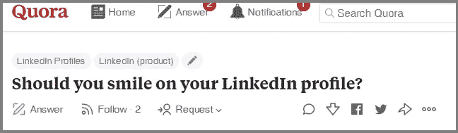
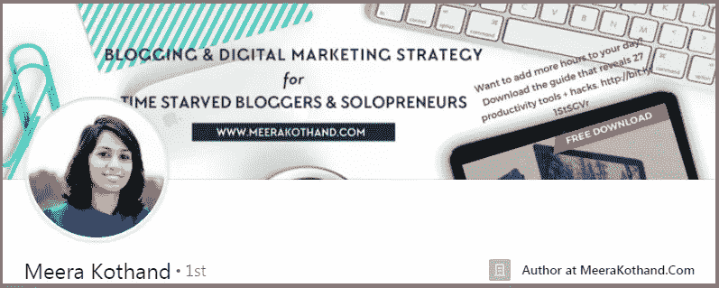
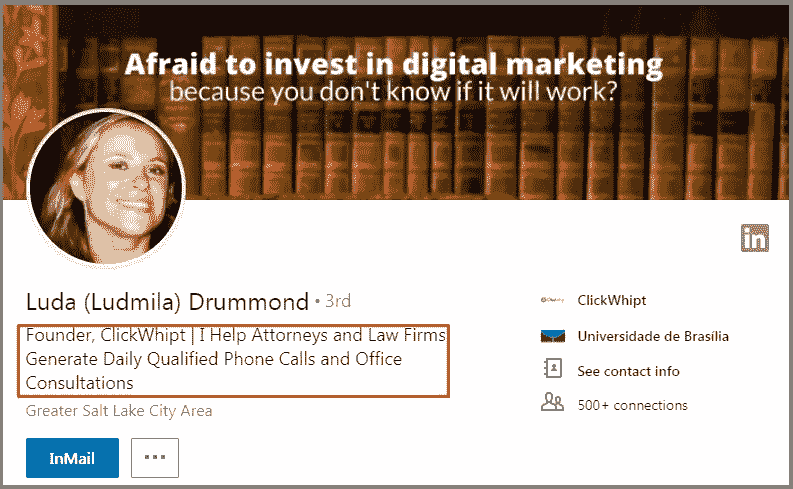
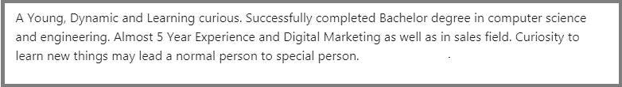
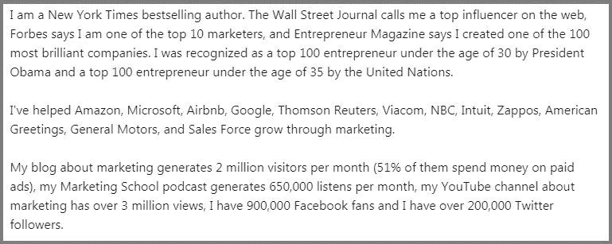
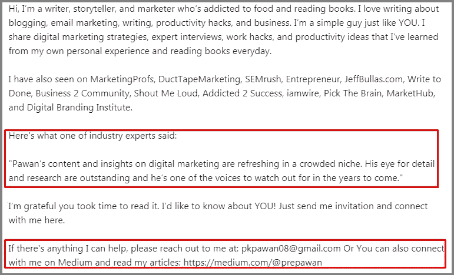
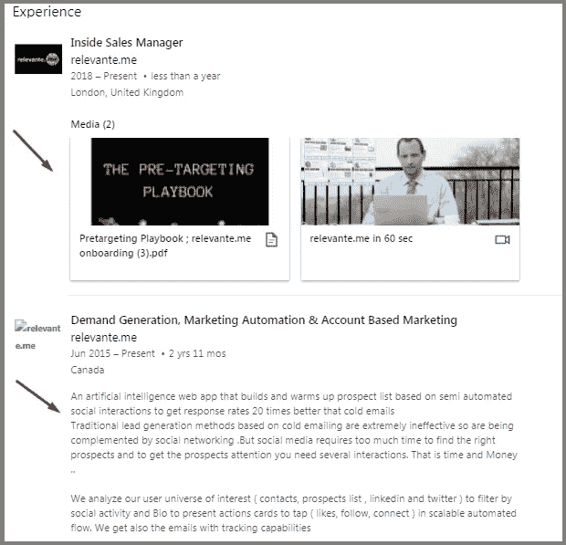
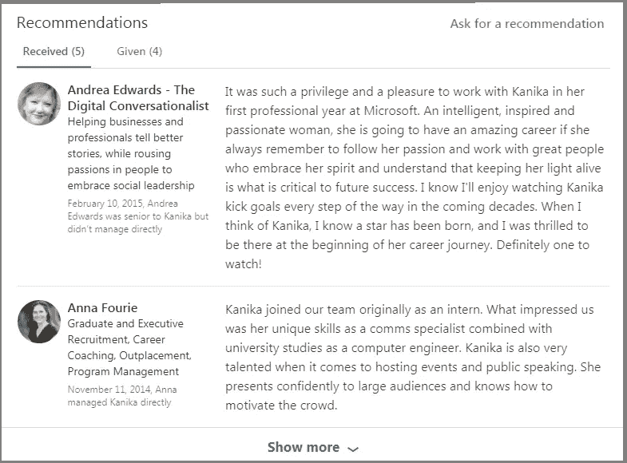
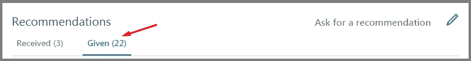
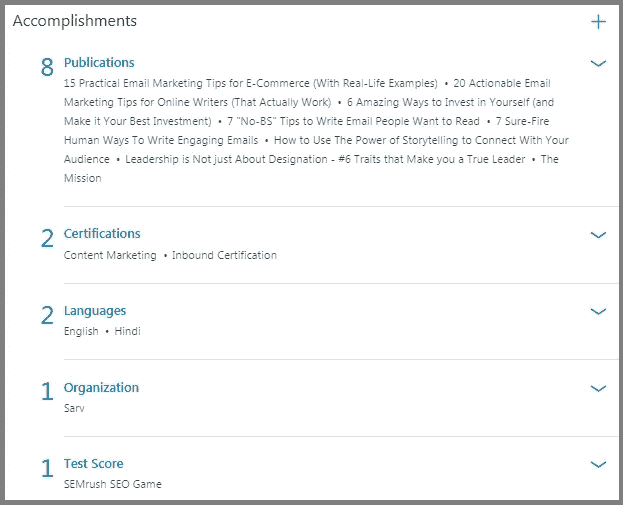

# 6 个简单的技巧将你的 LinkedIn 档案变成潜在客户生成机器

> 原文：<https://medium.com/swlh/6-simple-techniques-to-turn-your-linkedin-profile-into-lead-generation-machine-75904517ada8>

你的 LinkedIn 个人资料对你的进步有帮助吗？它是否为您带来了商机？

如果没有，那么你就错过了一个很好的机会。

本指南将向您展示将您的 LinkedIn 个人资料转变为潜在客户生成机器所需的一切。

听起来不错？让我们开始吧…

# 1.在个人资料图片中展示你的微笑

你应该在你的 LinkedIn 个人资料上微笑吗？

我不是说这个。我看到有人在 Quora 上问这样的问题:

看:

你不需要聘请专业摄影师，你只需要一张清晰、专业、笑容可掬的自拍照。

不要在你的个人资料照片里看起来像个连环杀手。

事实上，拥有一张专业的[个人资料图片会带来高达 21 倍的浏览量](https://blog.linkedin.com/2017/march/14/linkedin-profile-photo-tips-introducing-photo-filters-and-editing)和 9 倍的连接请求。

就像米拉做得很好一样…

LinkedIn 还允许你编辑或裁剪你的照片。六个照片过滤器可以确保你看起来最好。在这里看教程。

看完视频了吗？该下一个技巧了。

# 2.标题应该引人注目，引人注目

对大多数人来说，标题意味着职位和公司名称，对吗？

嗯……不尽然。

标题非常重要，因为它是你的潜在客户了解你的第一件事(在你的照片之后)。

不要泛泛而谈！

人们不希望再看到一个干巴巴的职称。让我们面对现实吧！

你的标题应该集中在如何帮助你的潜在客户。你带来的价值。不要听起来像推销员。

具体、相关、有针对性。

鲁大的标题以头衔和公司名称开头——“创始人，ClickWhipt”

但在后半部分，她讲述了自己如何帮助他人——“我帮助律师和律师事务所制作日常合格的电话和办公室咨询”

你如何做同样的事情:

建议你按照这个格式:**【标题】【公司名称】|我/我们帮助【观众】【受益】**

而且——Tada——你已经准备好了。

一旦你更新了你的个人资料图片和标题，继续第三个技巧。

# 3.让你的总结读起来有趣

潜在客户正在查看您的个人资料，但他们没有联系就离开了，好像没有明天一样？

这是你的简介摘要。

你不希望你的总结是这样的:

这听起来像是一份机器人简历。

相反，你用你的总结来讲述你的故事，你提供了什么价值，以及你的 USP，就像这样:

简短的段落(每段 2-3 行)使你的摘要易于阅读和消化。不要用第三人称写。别做那种人。

附上一份行业专家或客户的证明是个好主意。用一个清晰的行动号召结束总结，让与潜在客户的关系更上一层楼。

大概是这样的:

一旦你更新了你的总结，就进入下一个技巧。

# 4.展示您的经验以创建更好的网络

让我们做个交易:

这一节不应该浪费。

你的行业经验将你与有相同兴趣的团体、企业和个人联系在一起。

秘密？

在头条之后，这是你个人资料中阅读量最大的部分之一。

放置你现在和以前的角色。但是…不要忘记用几句话和你的技能来描述你的公司和你的工作简介。

Larisa Ontiveros 在这方面做得很好…

# 5.推荐和认可很重要！

有件事我们都同意:

Linkedin 是一个机会找到你的地方。

T2:认可和推荐是展示(而不仅仅是告诉)你的同事对你的看法的好方法。

这些能让你更好地了解自己真正的技能。向你现在和以前的同事寻求建议。

它显示了你的专业知识，就像这样:

今天花几分钟时间给你的同事写封推荐信。我经常给过去和现在同事写个性化的推荐信。

一旦你做到了这一点，就到了下一个技巧的时候了…

# 6.成就作为社会证明

这里有一个我注意到很多人都会犯的错误:

**没有修养部分。**

为什么这很重要？

如果你想赢得潜在客户的信任，你必须给他们一个理由。你的成就向他们展示了你的可信度。

LinkedIn 允许你添加你的证书、专利、出版物、课程、奖项等等。

我为什么要说这个？

添加此部分后，我收到了更高比例的新连接。它看起来是这样的:

# 现在轮到你了

你已经阅读了从你的 LinkedIn 个人资料中获取更多信息的 6 个技巧。我希望你喜欢它。现在是实施它们的时候了。

留下评论，让我知道你是否打算实现这些技术。

# 行动呼吁

**获取免费清单，成为 LinkedIn 超级明星。这份清单包含了这里所有的 6 种技巧…和 2 种额外的技巧。** [**立即下载！**](https://mailchi.mp/83c858043352/linkedin-checklist)

文章最初发表在[我的个人博客](http://prepawan.com/improve-linkedin-profile/)

## 这个故事发表在 [The Startup](https://medium.com/swlh) 上，这是 Medium 最大的企业家出版物，拥有 322，555+人。

## 在这里订阅接收[我们的头条新闻](http://growthsupply.com/the-startup-newsletter/)。

