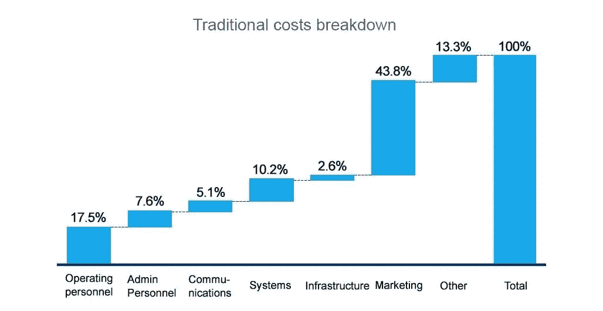
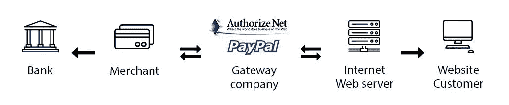

# 建立在线旅行社时要做出的 6 个战略决策

> 原文：<https://medium.com/swlh/6-strategic-decisions-to-make-when-building-an-online-travel-agency-42198a48e608>

据 Phocuswright 称，39%的数字旅游市场属于在线旅行社，而且这一数字有望增长。旅游服务的数字化，加上手机的主导地位，正迅速将天平向一种新的旅游购物形式倾斜。

在线旅行社(OTA)通过在一站式购物平台上提供全套旅游服务，推动了无缝旅行规划的发展。此外，个性化的推荐以及其他旅行者的数十条评论，正在迎合那些喜欢在一个地方规划自己旅行的顾客。

市场内的竞争对于寻求在巨头——Booking.com、Kayak、Momondo(都属于 Priceline 集团)和 Expedia、CarRentals 和 Hotels.com(由 Expedia，Inc .运营)之间开拓市场的新来者来说是可以理解的。在这样一个饱和且竞争激烈的市场中，有可能找到喘息的机会吗？如果是，建立一个有竞争力的在线旅行社的主要战略选择是什么？让我们找出答案。

# 1.选择一个利基旅游市场

控制 OTA 市场最大份额的品牌不仅拥有复杂的结构和广泛的软件，而且还能被客户和供应商识别。努力促进直接销售的 T4 酒店，对将库存交给小公司尤其谨慎。他们中的许多人正试图减轻对第三方关系的依赖，并将客户带回他们的网站。

这里有什么解决办法？提供基于位置的利基服务，以进入未被充分代表的市场，并获得狭窄受众的信任。

大多数受欢迎的在线旅行社，如 Kayak 和 Hipmunk，都是基于提供最便宜的航班和酒店的想法，坦白地说，这是一个很大的负担。BedandBreakfast.com 也是如此——寻求 B&B 住宿的旅行者的门户。青年旅舍也不再是一个小众领域——随着青年旅舍爱好者数量的增长，这些旅行者会点击一些热门网站来研究他们的选择。

据旅游网报道，这是 2017 年及以后要考虑的五个旅游市场:

*   **【浪子旅行】——为思想开放、崇尚自由的旅行者提供服务，他们的兴趣经常被视为禁忌**
*   ****特殊需求旅行**——行动不便和有残疾的旅行者寻求能够满足他们需求的航空公司和度假胜地**
*   **健康旅行——瑜伽和冥想静修正在获得年轻人和健康人群的支持**
*   **千禧一代有组织的旅游——迎合寻求冒险、探索和真实体验的年轻观众的假期**
*   ****专业游轮**——针对小众群体旅行者的特殊兴趣游轮**

**做你自己的研究，在你的领域找到一个相关的市场。浏览当地论坛，与博客作者交谈，加入讨论，了解该地区旅行者内心的挣扎。Innclusive.com 的创始人亲身经历了假期歧视，创造了一个连接旅行者和热情的主人的平台。**

# **2.获得认证**

**通常情况下，想要获得业内专业人士认可的旅行社需要获得认证。我们说*通常是*，因为在线旅行社在没有身份号码的情况下仍然有一些选择，我们将在后面介绍。有几个认证计划，你应该知道，每一个都有不同的要求，费用和潜在的津贴。让我们通俗地讨论其中的一些。**

****国际航空运输协会****

**国际航空运输协会的识别号码是全球公认的，是你在该行业的专业知识的公认证明。获得国际航空运输协会(IATA)的认证将带来诸多好处，例如，可以从约 250 家航空公司获得最优惠的价格，以及您和供应商之间的单一标准发票和支付界面。**

**然而，要成为国际航空运输协会的代理人，你首先需要证明你有多年的行业经验，获得营业执照，并满足财务标准。此外，等待批准可能需要数月时间。各个国家的情况也不一样，甚至在同一个州内也不一样。当然，这对新来者来说是一条陡峭的道路，需要认真的准备。**

****航空公司报告公司(ARC)****

**ARC 仅是美国旅行社的认证机构。就像 IATA 一样，ARC 认证将为您提供 200 多家运营商和一个工具包，包括信用卡处理程序和防欺诈服务。ARC 为不同的目的提供了三个认证等级，传统的认证等级不需要以前在该领域的经验。然而，高额的申请费和年费，以及严格的申请程序，包括与代理公司所有者的面谈，对一个新的代理公司来说是难以承受的。此外，ARC 要求该机构的一名员工通过 ARC 专家考试，这不仅增加了成本，而且延长了认证程序。ARC 还为旅行社组织网络研讨会，并提供全年支持。**

****国际邮轮公司协会(CLIA)****

**CLIA 认证只适用于销售游轮的旅行社。除了业内的认可和获得 95%的全球邮轮运力，CLIA 还提供培训和发展机会。如果你的生意中至少有一部分是专门做游轮的，你可能想要一个身份号码。幸运的是，获得基本会员资格不需要任何经验或申请费。但如果你想选择高级选项，你可能需要达到最低佣金标准，并被邀请加入。**

# **建立未经认证的在线旅行社**

**考虑到获得认证的繁琐过程，许多新的在线旅行社正在寻找不需要身份证就能进入旅游市场的方法。以下是实现这一点的方法。**

****备选方案 1:使用东道机构****

**主办机构是作为非 IATA 旅行社的伞式公司的认可机构。通过加入一个，你可以访问他们的认证 ID，可以使用他们的软件和 GDS，甚至可以咨询。这个选项允许一个容易的切入点，因为它的风险低，不需要大的投资。不同的主机提供不同的商业模式，你必须执行你的尽职调查，然后再向任何机构申请主机。有些要求包括佣金分成，在其他情况下，你要为每次预订支付费用。**

****选择二:加盟特许经营****

**对于不想发展自己品牌的企业来说，获得旅行社特许经营权是一个不错的选择。通过购买特许经营权，你可以接触到一个已建立的业务，并有现成的运营和营销流程。虽然特许代理获得 100%的佣金，但他们必须定期支付提成费，提成费可以是销售额的一定百分比，也可以是固定费用。就像东道机构一样，特许经营的要求是不同的，应该仔细审查。因为不是所有的特许经营店都与你共享他们的认证号，在某些情况下，你应该自己认证。**

****选项 3:连接航空公司集运商****

**像 [TravelFusion](https://www.travelfusion.com/corporate/supplier) 和[mystible](http://mystifly.com/)这样的服务通过提供从白标解决方案到 XML APIs 的各种技术，将在线旅行社与更小、更多样化的航空公司联系起来。由于整合商从航空公司购买打折机票，他们向在线旅行社提供更低的机票价格，从而在利基市场上获得竞争优势。**

# **3.考虑降低成本的做法**

**在线旅行社的长期成功与吸引重复预订和管理运营费用有关。虽然提供卓越的客户体验和采用移动优先的方法很重要，但也要了解有助于收入增长和成本降低的流程。**

****关注非航空销售****

**根据爱马仕管理咨询公司进行的一项调查，85%的在线旅行社销售额来自机票，而酒店仅占 14%。也就是说，更仔细的调查显示，酒店销售的毛利率几乎是航空公司的两倍——12%对 6%。因此，非航空销售代表着在线旅行社更大的增长机会。**

****控制营销费用****

**营销是 OTA 最大的成本驱动因素，但明智的费用处理可以最大限度地减少这些营销支出，并产生更多的转化。引入 CRM 系统来定制客户信息和管理报价。忠诚度计划也将促进重复使用。例如，Hotels.com 每十晚提供一次免费住宿。**

****

***在线旅行社的费用
来源:爱马仕管理咨询***

****自动化****

**在营销之后，线下支持经理是 OTA 在营销之后的第二大费用驱动因素。虽然通过各种渠道提供客户支持很重要，但大多数日常任务，如机票变更或队列管理，都可以实现自动化。**

# **4.集成预订引擎和第三方 API**

**预订引擎是旅行社的软件工具，用于直接从网站进行在线预订。它们存在于您的网站中，与网站构建器(如 WordPress)、支付网关、CRM 系统集成，并且可以连接到各种服务，如 Mailchimp 或 Google Analytics。除了充当后台办公室，它还允许用户检查可用性、预订、在线支付和接收确认电子邮件。**

**技术公司为 B2B 和 B2C 市场提供各种[预订解决方案](https://www.altexsoft.com/travel-technology/booking-reservation-systems/#utm_source=MediumCom&utm_medium=referral)，由不同的供应商与 GDS 整合，涵盖航班、酒店、套餐、活动和转机。**

**在开发预订和预约系统时，考虑以下必备功能:**

*   **可定制的布局**
*   **多语言支持**
*   **安全在线支付**
*   **报告仪表板**
*   **存货管理**
*   **基于云的**
*   **自动取消处理**

**旅游网站还可以集成应用编程接口(API)以提供更广泛的服务。它们将允许您的客户通过您的门户直接预订活动和餐厅，并管理公共交通。查看我们的博客文章，了解市场上主要的[旅游 API](https://www.altexsoft.com/blog/engineering/travel-and-booking-apis-for-online-travel-and-tourism-service-providers/#utm_source=MediumCom&utm_medium=referral)的概述，以及选择合适的 API 的建议。**

# **5.集成支付网关**

**支付网关是一种电子商务服务，充当网站和用户帐户之间的链接，以安全地处理支付。Gateway 对从浏览器传输到供应商的用户个人数据进行加密，向银行请求授权，然后将响应传输回网站以完成支付。**

****

***支付网关流程***

**Amadeus 和 Sabre 等提供商管理自己的支付处理系统。但是，您可以整合替代支付方式来增加您的投资组合并定制客户体验。这就是为什么你需要了解 PayPal、亚马逊支付和 WePay 等可用选项。在选择提供商之前，请考虑以下标准:**

****国家和货币。**根据您所在的市场，您可能希望了解不同的提供商支持哪些国家和货币。如果你计划发展和覆盖更多的市场，就要留意提供更广泛选择的系统。例如，FirstData 覆盖 50 多个国家和 140 种货币，而 WePay 只在美国有效。**

****预算。不同的提供商提供不同的设置、交易和管理费用。有些提供商计算个人费用，应事先联系。还有的根本不要月租费。****

****安全。**始终选择提供欺诈检测机制和内置安全措施(如令牌化)的提供商，以确保最高的安全性。这将保护您的声誉，并让客户放心，他们可以放心地在您的门户网站上进行支付。**

****设置。**直到最近，所有的电子商务店主都被要求设立一个商家账户，以允许他们的信用卡直接从网关接收付款。现在，一些提供商，如 PayPal 和 Stripe，允许直接向您的账户转账，简化了整合过程。然而，这些现代系统往往对每笔交易收取更高的费用，并将客户转移到异地完成支付。这可能会减少转化率，随着你的网站的增长，费用会增加。在选择传统或现代网关提供商之前，请考虑这两种选择。**

# **6.确保用户友好的系统**

**吸引访客到你的网站并不是唯一的步骤。你还必须确保你的平台是用户友好的，并为旅行者提供优质的用户体验。之前我们报道了[预订网站的 UX 最佳实践](https://www.altexsoft.com/blog/travel/merging-user-and-travel-experience-best-ux-practices-for-booking-and-reservation-websites/#utm_source=MediumCom&utm_medium=referral)，在那里我们讨论了简化搜索和评论的重要性。除此之外，在线旅行社优质用户体验的必备要素包括:**

****信任标志。**就像在任何电子商务服务中一样，你希望让你的客户相信他们可以向你提供交易信息。一项经济咨询调查发现，61%的顾客没有购买，因为他们找不到任何信任标志。**

****

***电子商务网站的信任标志(左)和显示最易识别网站的热图(右)
来源:Econsultancy***

****价格提醒。**确保启用电子邮件、短信或俯卧撑通知功能，以便在用户选择的日期通知他们价格下降和空房情况。**

****客户服务。**尽管在网上寻求旅游服务，游客仍然希望获得与人工代理相同的服务水平。为了建立客户忠诚度并提高转化率，通过提供您的联系信息、活跃于社交媒体并允许实时聊天来创建一个客户互动系统。目前，你甚至可以建造人工智能驱动的旅行聊天机器人，来处理重复的任务和回答常见的问题。**

# **总结**

**帮助 OTA 巨头获得客户信任的关键标准之一是透明度和对细节的关注。当面临各种选择时，不确定的旅行者不会感到压力，也不必翻遍行程描述来找到满足他们需求的那一个。因此，采用以用户为中心的方法来创建成功的电子商务平台，并投资于技术开发来支持它。**

*****原载于 AltexSoft 的博客:*** [***建立在线旅行社要做的 6 个战略决策***](https://www.altexsoft.com/blog/business/6-strategic-decisions-to-make-when-building-an-online-travel-agency/#utm_source=MediumCom&utm_medium=referral)**

******

## ***这个故事发表在 [The Startup](https://medium.com/swlh) 上，这是 Medium 最大的企业家出版物，拥有 296，127+人。***

## ***在这里订阅接收[我们的头条新闻](http://growthsupply.com/the-startup-newsletter/)。***

******