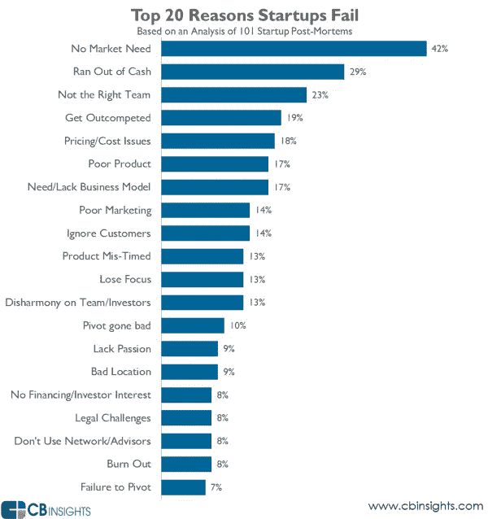
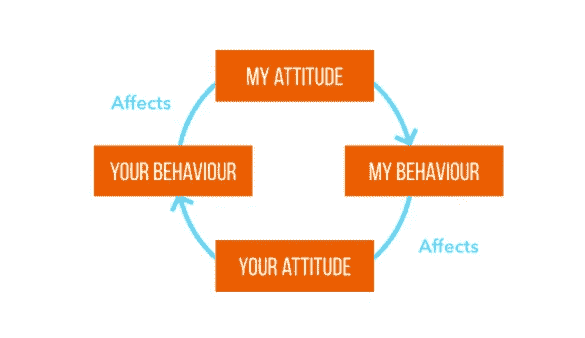
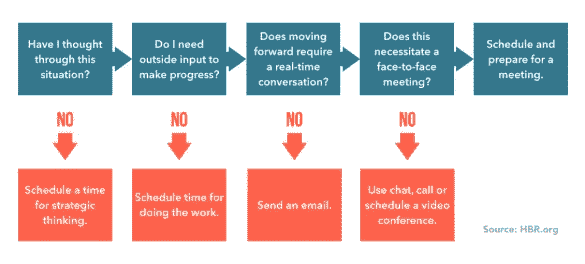
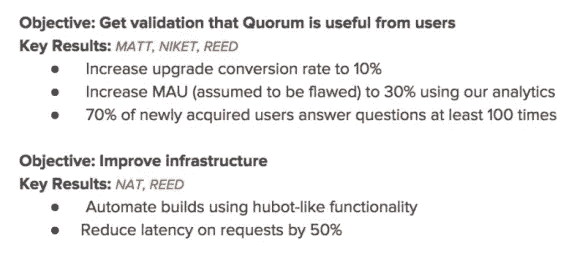

# 打造成功创业团队的 6 个策略

> 原文：<https://medium.com/swlh/6-strategies-for-building-a-winning-startup-team-e4eb855e6d7f>

**Originally published on** [**http://www.appsterhq.com**](http://www.appsterhq.com/?utm_source=CP&utm_medium=Medium)

伟大的创业团队会创建伟大的创业公司。包括投资者在内的关键利益相关者都知道这一点，这也是他们基于对产品创意*及其背后团队*的评估进行投资的原因。

一个高效的团队可以带着激情、精确和奉献来执行创业愿景。

然而，你如何建立这样一个相互支持、全面发展的创业团队，让团队成员相互促进发展呢？

在这篇文章中，我将探索实现这一点的几个关键技术，并分享一些来自三大洲 400 多名团队成员的实践经验。

# 你的创业成败在此一举

组建一个强大的、支持性的、有效的创业团队，能够一起工作，执行想法，并在必要时进行决策，这是启动和维持一个成功的创业公司的绝对基础。

CB Insights 的一项经常被讨论的研究证实了这一点。

CB Insights 分析了 100 多家初创企业的事后报告，试图找出许多初创企业失败的原因。以下是他们的发现:

虽然看到超过 70%的初创公司失败并不令人惊讶，因为要么他们的产品没有需求，要么他们最终耗尽了现金，但更令人震惊的是发现**近 25%的初创公司失败可归因于缺乏强大的团队**。

这些数据支持了这样一种观点，即效率低下的团队可能而且经常会让初创公司陷入困境。

马克·扎克伯格[称](https://gigaom.com/2011/05/20/mark-zuckerberg-me-in-team/)为“最重要的事情”:

> “作为一名企业家，对你来说，最重要的是，你需要建立一个真正优秀的团队。这就是我花了所有时间去做的事情。”

Y Combinator 的联合创始人保罗·格拉厄姆[警告说](http://paulgraham.com/startupmistakes.html)试图自己建立一切是困难的:

> “创业对一个人来说太难了。即使你可以自己做所有的工作，你也需要同事一起集思广益，劝你不要做愚蠢的决定，并在事情出错时让你振作起来。…然而，创始人之间的争斗出奇地普遍。我们资助的初创公司中，大约有 20%的创始人离开了……我见过的创始人之间的大多数纠纷都可以避免，如果他们在与谁一起创办公司时更加小心的话……***人是初创公司最重要的组成部分，所以不要在这方面妥协。***

*所以，你和谁一起工作对于你工作的最终成败至关重要。*

*但是，确切地说，你如何着手组建和维持一个强大而高效的初创团队呢？*

*让我们来看看 6 个具体策略:*

# *1.以身作则*

**

*作为一名初创企业的首席执行官和企业家，要求别人相信并帮助你实现一个特定的愿景，如果你不展现出你希望看到周围人效仿的优秀品质，你就不能指望你的团队成员信任并追随你。*

*众所周知的 [Betari Box](https://www.mindtools.com/pages/article/newCS_82.htm) 充分体现了一个人的态度和行为必然会影响另一个人的重要观点:*

**

*这是一个简单而有效的例子，说明你作为创始人的态度会影响你的行为方式，进而影响你同事的态度和行为。*

*贝塔里盒子很好地说明了这种反馈循环的循环性质:打破坏态度产生坏行为产生更多坏态度的循环是相当困难的。*

*拿破仑·波拿巴的军队对他如此忠诚，部分原因是因为他积极参加士兵的战斗。*

*换句话说，*他以身作则*——作为一个初创企业的创始人，你也需要这样做。*

*因此，至关重要的是，你要注意你的思维方式、行为方式以及与初创企业员工的交流方式会影响他们的热情、奉献和信心等水平。*

# *2.团队建设练习如果做得好，会有效果*

**

*希尔斯特团队建设活动通常不受员工欢迎，一项对 1950 年至 2007 年间进行的 103 项研究的数据分析提供了有力的科学证据，表明团队建设活动对团队表现有可衡量的积极影响，特别是在信任、协调和沟通方面。*

*设计和交付有效的团队建设活动的关键之一是**避免不自然或被迫的情况**。*

*如果你在想象一屋子的员工在听到他们的团队领导宣布下周末全体员工将前往森林参加私人团队建设务虚会后翻着白眼互相抱怨，那么你就知道我说的“不自然”和“被迫”是什么意思了。*

*当这种“练习”在*正常的、相关的和熟悉的*社交场合中进行时，成功的团队建设就发生了。*

*志愿者工作(这在某种程度上与你创业的目标、价值观或实践相关)、体育郊游、有趣的旅行和共享膳食——这些都是自然事件的例子，在这些事件中，当同事们互动并一起体验真实的情感时，真正的团队建设就会发生。*

# *3.会议是生产力杀手*

**

*协作软件开发商 Atlassian 进行的一项研究表明，技术员工平均每月花 30 多个小时参加会议，其中 50%以上的时间被证明是无效的。*

*此外，研究中的绝大多数员工承认在这些会议期间做白日梦和/或做其他工作，不到一半的人抱怨会议毫无意义和/或过于频繁。*

*这并不是说创业公司应该完全避免开会。*

*重要的因素是有效地确定*何时*召开会议以及会议应该采取什么形式。*

*我建议，作为一个初创企业的创始人，每当你需要决定是否应该与你的团队召开一次会议时，你可以使用下面的决策树:*

**

*让你召开的会议更有效率的一个方法是用每日例会*代替传统的自上而下、冗长乏味的商务会议。**

**每天的同一时间(通常在早上)在同一地点举行一次每日的 scrum。它们有严格的时间限制(通常每个 15 分钟)，以努力保持讨论的活跃、正常、相关和有影响力。**

**如果你发现每天与团队成员开会对你的初创团队的士气、团结和整体效率很重要，那么试着用每天的集体讨论代替传统的商业会议——你的员工可能会欣赏这种发展。**

# **4.自主，而不是微观管理**

****

**传统的商业智慧和实践都支持微观管理:高层员工不断监督和管理低层员工的日常习惯。**

**微观管理应该提高效率，防止生产力损失，让人们更加“负责任”。**

**然而，创业公司是一种不同的业务，因此他们对独特和非常规的运营方式反应最好。**

**[研究显示](https://hbr.org/2014/01/employees-perform-better-when-they-can-control-their-space),*选择*和*自主*——不是严格的控制和密切的监督——对初创企业的员工幸福感、积极性和绩效产生积极影响。**

**为了提高同事的绩效和工作满意度，您可以在以下四个方面为员工提供更大的自主权:**

*   **当他们工作(时间)——例如，试着切换到一个 [ROWE](http://www.gorowe.com/what-we-do-1/) ，也就是只注重结果的工作环境。**
*   ****他们如何工作(技术)** —给员工另一个自由，让他们自己决定如何完成要求的主要任务。**
*   ****与谁一起工作(团队)** —如果可能的话，让员工在一定程度上选择与他们一起工作的其他人。这可能很难实现，尤其是当你的初创企业规模很小的时候。**
*   ****他们做什么(任务)** —尝试利用“创意日”，在这段时间里，员工可以从事他们希望的任何项目/问题。一个著名的(也是久经考验的)例子是[谷歌的 20%政策](https://venturebeat.com/2017/05/13/can-googles-20-time-really-work-for-your-startup/):每个谷歌员工被允许将他/她的工作周的 20%花在他/她的主要任务之外的项目上——随着时间的推移，这种做法催生了谷歌的许多核心功能，包括 Gmail 和 AdSense。**

**正如运营一家初创公司的所有核心方面一样，自主权最终归结为实现正确的平衡:过多和过少的自由都会对你的团队动态造成严重破坏，从而扰乱你的业务。**

# **5.关注内在动机**

****

**增强的自主性能够积极影响工作满意度和绩效的原因之一是，自主性鼓励员工利用*内在动机。***

**内在动机是来自内部的动力、热情和激情，与来自外部的外在动机(如来自老板的威胁)相反。**

**[Heidi Grant Halvorson](https://www.forbes.com/sites/heidigranthalvorson/2011/09/15/how-to-give-employees-a-sense-of-autonomy-when-you-are-really-calling-the-shots/#4271359677c6) 很好地解释了为什么初创公司的创始人利用策略来增强员工的内在动力至关重要:**

> ***“你希望你的团队成员看到他们追求的目标有真正的价值。事实上，你希望他们把目标变成自己的……研究表明，最大的动力和最大的个人满足感来自于我们为自己选择的那些目标。自我选择的目标创造了一种特殊的动机，称为* ***【内在动机】****——为了自己的目的而做某事的愿望。当人们受到内在激励时，他们会感到更有创造力，并且更深入地处理信息。面对困难，他们更加坚持。他们表现更好。内在动力有强大的力量让我们前进。”***

**几年前 BNET(现为 CBS MoneyWatch)进行的一项调查显示，29%的员工认为做一些有意义的事情是他们工作的主要动力。25%的受访者表示，金钱激励了他们；17%的人表示认可是他们的动力来源。**

**不考虑额外津贴和奖金，当员工对自己追求的结果感兴趣并有所归属时，他们会发挥出最大的潜能。**

**以下是一些影响动机的重要因素:**

*   ****受到挑战**:当人们追求对个人有意义的目标时，他们会变得更有动力去取得成功，这些目标有可能实现，但不一定一定一定能实现。**
*   ****好奇心**:内在动机和增强的好奇心相互影响，相互学习和探索。**
*   ****合作与竞争**:在某些情况下，帮助他人，在其他情况下，参与友好和支持性的竞争，可以增加动力和驱动力。**
*   ****认可**:根据麦肯锡[的研究](http://www.mckinsey.com/business-functions/organization/our-insights/motivating-people-getting-beyond-money)，作为一个团队来庆祝成功，并为员工提供积极的反馈，比给员工发放奖金更有回报和激励作用。**

# **6.使用目标和关键结果(OKR)**

**[目标和关键成果](https://www.betterworks.com/okr/) (OKR)代表了为公司、团队甚至个人创造结构的有效手段。**

**该系统源于英特尔，由谷歌推广，后来被 Zynga、Palantir 和 Square 等公司采用。**

**以下是对 OKR 过程的简要描述:**

1.  **建立一个**目标**:例如，网站加载速度提高 30%，客户参与度提高 15%等。**
2.  **建立一些**关键结果**:例如，谷歌使用 0 到 1.0 的评分标准，达到完美的 1.0 表示目标不够雄心勃勃(谷歌工程师预计得分在 0.6 到 0.7 左右)**
3.  **执行任务并计算结果**

**这里有一个简单的 OKR 的例子:**

****

**okr 是有益的，因为它代表了一个简单明了的流程，代表所有相关人员有效地鼓励问责制。**

**这种方法如今并不十分流行，但大公司(如谷歌、Zynga、Palantir 和 Square)的许多工程师都承认，当他们密切跟踪自己的 okr 时，效率最高。**

> **最初发表于 http://www.appsterhq.com/**

************