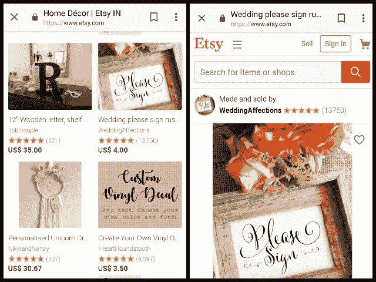

# 6 个超级有效的方法来优化你的移动转化率

> 原文：<https://medium.com/swlh/6-super-effective-ways-to-optimize-your-mobile-conversion-rates-d3c74da6cad3>

你知道全球电子商务销售额到 2018 年将达到 2774 万亿美元吗？然而，大多数电子商务企业仍然受到低移动转化率的困扰。截至 2017 年 Q1，[全球台式机转换率](https://shanebarker.com/blog/ecommerce-conversion-rate-optimization-expert-roundup/)徘徊在 [3.63%](https://www.smartinsights.com/ecommerce/ecommerce-analytics/ecommerce-conversion-rates/) ，智能手机转换率更低，为 1.25%。

这就提出了一个问题，“为什么[桌面转化率远远好于](https://shanebarker.com/blog/ultimate-conversion-rate-optimization-checklist/)移动转化率？”以下是一些原因:

*   桌面用户享受更快的页面加载速度。
*   桌面用户发现访问主菜单更容易。
*   搜索栏在桌面上更加突出。
*   桌面版的产品类别、图片和描述更清晰。

无处不在的智能手机占据了主导地位，导致在线流量激增。今天，超过 52%的全球网络流量来自智能手机。

因此，为移动用户创造友好的购物体验是必须的。如果你不这样做，你很可能会错过这些用户的大量业务。

这里有 6 个超级有效的方法可以优化你的移动转化率。

# 6 个超级有效的方法来优化你的移动转化率

# 1.优化您的移动网站的性能

网站极其缓慢的加载速度会让任何用户感到沮丧。一项研究发现，如果一个移动网站的加载时间超过 3 秒，53%的用户会离开。然而，同一项研究还发现，四分之三的移动网站的加载时间超过 10 秒。

*双击图像*

加载时间在 [5 秒或更短的移动网站从移动广告中获得的收入是那些加载时间更长的网站的两倍。现在你知道为什么速度对于你的移动网站的加载时间很重要了。除非你大幅提高手机网页的加载速度，否则你不会获得可观的移动转化率。](https://storage.googleapis.com/doubleclick-prod/documents/The_Need_for_Mobile_Speed_-_FINAL.pdf)

*双击图像*

那么如何提高你的移动网站性能呢？方法如下:

*   **关注减少服务器请求的数量**。这意味着评估请求的类型，找出它提供的好处。例如，你是否使用了太多的分析追踪器？还是你的广告设置是罪魁祸首？
*   **运行诊断程序，检查哪些文件占用了页面的大部分字节**。大文件需要更多的时间来下载。所以减少文件大小是有意义的。你可以通过缩小图像尺寸以适应手机屏幕，并保持字体数量最少来做到这一点。庞大的广告技术和视频会拖累你的网站。
*   区分需要显示在折叠上方的元素的优先级，而不是同时加载所有的元素。多个广告技术请求或大文件请求会降低网站的加载速度。

以下是一些有价值的工具，可以用来检查和评估您的移动站点性能:

*   **——这是一个有用的工具，它会告诉你你的网站是否是移动友好的。**

****

***谷歌图片***

*   **[**谷歌分析**](https://www.google.com/analytics)**——这将让你看到用户能够以多快的速度与你的内容互动，瓶颈在哪里。****
*   ****[**网页测试**](https://www.webpagetest.org/) —这个工具会在你的网站上运行各种速度测试，进行各种优化检查。最后，它将为您提供任何可以改进的建议。****

********

*****图片通过网页测试*****

*   ****Chrome DevTools —这些工具将帮助你跟踪布局或 JavaScript 的问题，并提供优化建议。****

# ****2.允许使用数字钱包****

****在手机屏幕上输入大量信息不仅令人厌烦，而且更加困难。即使他们喜欢你的产品，如果他们不得不输入他们的支付信息，他们可能会放弃他们的购物车。因为在移动设备上这么做很麻烦。你可以想象，这会大大降低你的移动转化率。****

****那么，如何解决这个问题呢？允许在你的网站上使用数字钱包支付。本质上，这是一种让消费者在线保存支付细节的服务，但这种方式非常安全。由于移动钱包中集成了多层加密，消费者可以安全方便地进行支付。****

****为了优化您的移动转化率，请将 Amazon Pay、PayPal 或 Apple Pay 等数字钱包集成到您的商店中。Baymard Institute 的一项研究发现，19%的购物者放弃购物车是因为担心分享支付细节的安全问题。手机钱包可以正面解决这个问题。****

********

*****图片通过北约智能挂载*****

****这里有一个来自手机安装解决方案提供商 Nato Smart Mount 的例子。当你使用他们的移动网站将任何产品添加到购物车时，你会看到一个使用 Amazon Pay 付款的选项。这是除了通常的支付选项使用您的信用卡。****

****数字钱包的出现为购物者提供了便利，也是提高移动转化率的一个好方法。****

# ****3.采用响应式设计****

****信任是网上购物的主要驱动力之一。网站的外观会极大地影响你在潜在客户心目中的可信度。****

****如果你的移动网站反应迟钝，设计糟糕，它会给人留下非常业余的印象。你的潜在客户认为你是一个不知道自己在做什么的人。这会影响可信度和信任度。从而降低你的移动转化率。****

****[Etsy 上](https://www.prnewswire.com/news-releases/etsy-inc-reports-fourth-quarter-and-full-year-2016-financial-results-300415211.html)[电子商务商店](https://shanebarker.com/blog/ecommerce-marketing-weekly-roundup/)的 65% 流量来自移动购物者。这些人喜欢在 Etsy 购物的一个最重要的原因是响应性设计。看看他们的移动网站有多干净，响应有多快。****

********

*****通过 Etsy 的图像*****

# ****4.改进导航****

****如果你的移动网站不容易导航，它会对你的移动转化率产生负面影响。原因很简单，客户将完全不知道点击哪里和去哪里。这将极大地影响他们的体验，并鼓励他们离开。****

****然而，如果你能提供一个很好的用户体验，它肯定会带来更好的移动转化率。因此，确保移动用户能够以最小的努力浏览你的网站，找到他们想要的东西。将所有页面元素排列整齐。这将有助于用户以系统的方式轻松浏览。****

****确保你的图片清晰地展示出来，并附有价格信息。突出你的 CTA 按钮，简单的向下滚动页面就可以看到产品描述。****

****整洁的页面保证了更好的可读性。这里有一个化妆品品牌 Beauty Bridge 的例子。你可以看到他们的导航菜单在移动网站上看起来有多简单。他们的产品页面也很整洁，给用户很好的体验。****

********

*****美人桥图片*****

# ****5.移除自动播放视频和弹出窗口****

****不可否认，正确实现的弹出窗口在产生潜在客户方面非常[有效](https://sumo.com/stories/pop-up-statistics)。但是，说到移动体验，大概没有比这些更烦人的了。它们不仅会打扰用户，还会阻止用户查看他们真正想要的内容。****

****结果呢？跳出率更高，移动转化率更低。****

****更好广告联盟[进行了一项关于在线广告的研究](https://www.betterads.org/research/)，他们调查了 25000 多人。根据这项研究，以下是移动网站上一些最令人厌恶的广告类型。****

*   ****弹出窗口****
*   ****自动播放视频****
*   ****持续闪烁的动画****
*   ****广告在解散前有倒计时****
*   ****有超过 30%广告的移动网页****

********

****因此，如果您的移动网站使用任何此类弹出窗口、视频或动画，请立即删除它们。这对你的移动转化率有很大的影响。****

# ****6.提供无缝和简单的结帐****

****顾客放弃购物车的一个主要原因是结账过程不方便。****

****事实上，贝玛研究所发现，如果结账时间长且复杂，28%的人会放弃购物车。另外，如果网站要求创建账户，37%的人会放弃购物车。****

****这些问题在移动体验中更加明显。如果记住几个要点，这当然是可以避免的。****

*   ****保持手机结账页面尽可能短。****
*   ****不要用太多的字段把页面弄得乱七八糟。****
*   ****不要坚持让用户创建一个帐户来购买。****
*   ****确保购物车物品的总成本显示在显著位置。****
*   ****通过网关提供简单的支付方式，快速处理请求。****

********

*****图片来自时装糖果*****

****这是一个很好的移动结账页面的例子。它不仅允许以客人身份结账，还允许使用亚马逊支付。它还突出显示了购物车的价值，这样顾客就能确切地知道他们付了多少钱。****

# ****最后的想法****

****良好的用户体验对提高移动转化率大有帮助——这是当今电子商务的全部意义。因此，请确保您使用上述策略来优化您的移动网站。****

****你能想到其他有效的方法来优化移动转化率吗？请在下面的评论中告诉我。****

# ******原载于** [**谢恩巴克**](https://shanebarker.com/blog/effective-optimize-mobile-conversion-rates/) **。******

******关于作者******

****[谢恩·巴克](https://shanebarker.com)是[Gifographics.co](http://gifographics.co/)的首席执行官，也是[内容解决方案](https://contentsolutions.io/)的创始人。你可以在[推特](https://twitter.com/shane_barker)、[脸书](https://www.facebook.com/ShaneBarkerConsultant/)、[领英](https://www.linkedin.com/in/shanebarker/)、 [Instagram](https://www.instagram.com/shanebarker/) 上和他联系。****

********

## ****这个故事发表在 [The Startup](https://medium.com/swlh) 上，这是 Medium 最大的创业刊物，拥有 303，461+人关注。****

## ****在这里订阅接收[我们的头条新闻](http://growthsupply.com/the-startup-newsletter/)。****

********