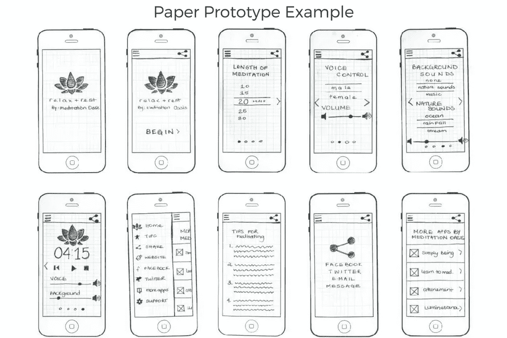
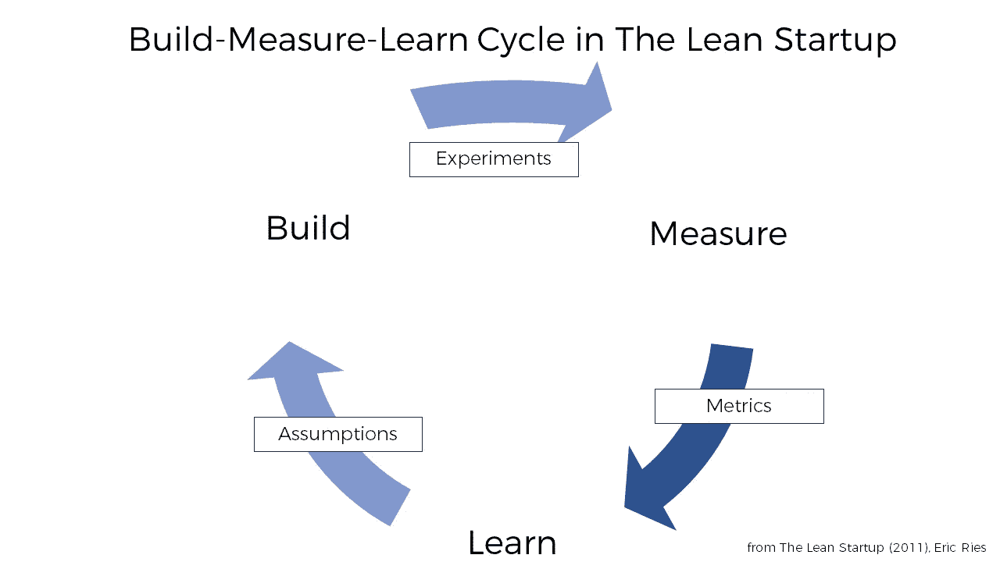
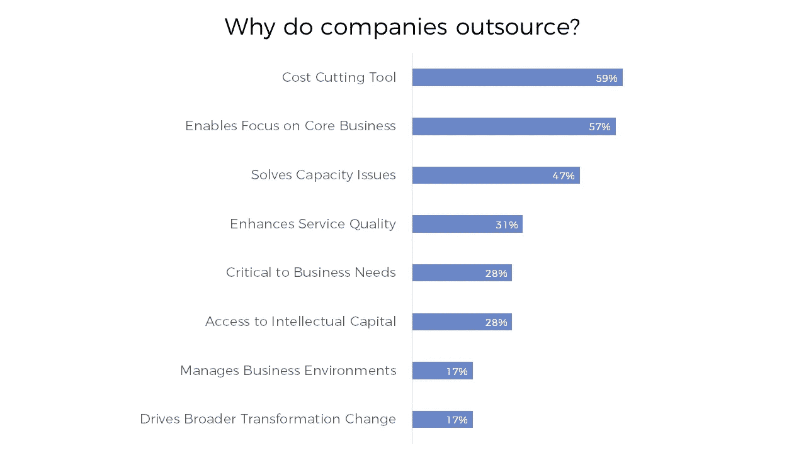
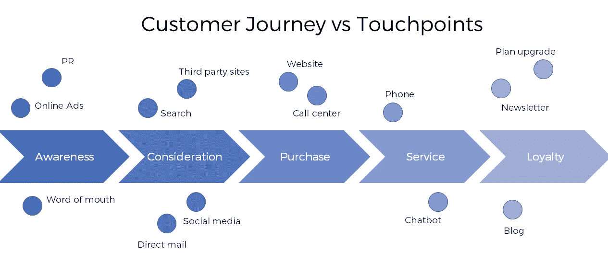
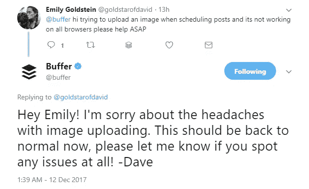

# 成功创业的 6 个技巧

> 原文：<https://medium.com/swlh/6-tech-tips-for-building-a-successful-startup-81a70e93090b>

有多少次你看到一个新锐创业公司的新闻，几个月后才发现它已经死了？他们网站的剩余部分充满了告别信息，也被称为“事后批评”，领导者在那里分享他们的遗憾和失败的原因，确保通知客户他们将很快收到退款。

初创公司失败的主要原因是缺乏市场需求。还记得那些价格过高的榨汁机吗？在用户意识到你可以用手榨他们定制的果汁包后，这些榨汁机引起了[的强烈反对](https://www.bloomberg.com/news/features/2017-04-19/silicon-valley-s-400-juicer-may-be-feeling-the-squeeze)？类似的命运等待着[臭名昭著的](http://mashable.com/2017/09/13/bodega-tech-distrust-silicon-valley/#HL2s6zsZ0aqk)酒窖自动售货机的创造者，他们麻木不仁地认为实体酒窖是一种不便，而不是众多小企业主的生计。

但我们不会在这里谈论进行初步的市场分析和探索客户需求，即使这些因素对创业公司的生存和成功至关重要。今天，我们把重点放在这个问题的工程方面。让我们跳过形成你的创新想法的阶段，直接进入创建一家将在预期挑战中保持漂浮的初创公司的技术细节。

# 早期阶段的原型

你可能会想，创建一个工作原型并不是你创业的开始。相反，你可能想在投入应用程序开发之前获得一些资本。这可能是因为你对原型的理解不准确。

原型是一个简单的界面，允许你的观众与产品进行视觉上的互动。原型不需要执行任何功能。它们灵活且易于创建，尤其是在现有工具的帮助下，如 [UXPin](https://www.uxpin.com/) 、 [Axure](https://www.axure.com/) 或许多其他工具。

*论文原型为一款张弛 app*
[*来源*](https://tmecley.wordpress.com/2014/03/05/relax-rest-paper-prototype-screen-prototype/)

出于多种原因，在最早阶段拥有一个原型是有帮助的:

1.  向投资者展示原型

如果你对一个应用程序有一个创新的想法，向投资者展示它到底是如何工作的会比试图用文字来解释一切更容易。通常，你不需要用高质量的设计和动画给他们留下深刻印象，尤其是如果你把它展示给你的 3f:朋友、家人和傻瓜——你新想法的最初支持者。你可以展示一个容易调整的计划和工作流程，而不仅仅是一个有想法的人。如果你决定制作一个高保真的互动原型，你可以使用特殊的软件，给投资者一部苹果手机，不需要任何编码就可以展示一个完全互动的屏幕。

2.进行研究和探索

创建有用原型的最困难阶段不是技术部分，而是构思。如果您不是一个熟悉技术的人，不熟悉应用程序开发的细节，那么您可能在设计真正有意义的线框时遇到问题。原型制作将帮助您了解什么类型的屏幕、动作和提醒您的产品需求，并允许您将您的想法转化为物理形式。

3.收集潜在用户的意见

无论您对市场的研究有多深入，以及您的买方角色有多详细，了解客户兴趣的最好方法是直接展示产品将如何帮助他们。通过在编程阶段之前收集即时反馈，您大大减少了开发不必要的特性所花费的时间。当然，这并不能免除您对实际工作产品的测试和 UX 评估。

原型是产品的第一个版本，是你的视觉草图。[29%的初创公司失败是因为他们没有现金了。防止这种情况的方法之一是，当您确实开始花钱时，做好准备。你的原型将为你的最有价值产品铺平道路——最低可行产品——你的想法版本，它只包含有待客户和投资者验证的重要特征。(查看我们关于](https://www.cbinsights.com/research/startup-failure-reasons-top/)[打造 MVP](https://www.altexsoft.com/blog/business/minimum-viable-product-types-methods-and-building-stages/#utm_source=MediumCom&utm_medium=referral) 的翔实文章。)这种逐步了解产品基础的方法将帮助您专注于您的初始目标，并更清楚地向您的团队传达您的想法。

# 采用精益启动方法

启动构建过程没有适用于每种情况的框架，所以您必须采用迭代的方法。为了提高你的初创公司的生存前景，让你能够运用获得的洞察力快速改进，使用精益创业方法。

在**精益创业**的世界里，你按照*建立-测量-学习*的方法工作——一种有效利用你的资源和利用反馈的方法。与其相信假设，不如建立一个 MVP，通过收集反馈和测量 KPI 来学习。这个循环一直持续到你与用户达成完全的理解，让这种智能告诉你如何创造一个可行的产品。

*精益启动方法论中的构建-测量-学习循环
来源:* [*精益启动*](https://www.amazon.com/Lean-Startup-Entrepreneurs-Continuous-Innovation/dp/0307887898/) *(2011)，Eric Ries*

精益创业原则规定了倾听你的听众、主动学习和加快开发周期的重要性。在这里，你不渴望打造一个完美的产品，也不写笨重的商业计划。相反，您使用关键绩效指标(KPI)并采用[持续部署](https://www.altexsoft.com/blog/business/continuous-delivery-and-integration-rapid-updates-by-automating-quality-assurance/#utm_source=MediumCom&utm_medium=referral)方法。

在《精益创业》一书中，Eric Ries 定义了创建和管理精益创业的四个原则:

1.  **消除不确定性**。在高度不确定的创业环境中，精益方法允许你对现实世界做出假设，保持灵活性，并使用[商业模型画布](https://www.altexsoft.com/blog/business/using-business-model-canvas-to-launch-a-technology-startup-or-improve-established-operating-model/#utm_source=MediumCom&utm_medium=referral)等工具持续测试你的愿景。
2.  **更聪明而不是更努力地工作。不要问自己*我们如何才能打造这个产品？质疑你是否应该开发这个产品。如果你建造了它，如何使它可持续发展。不要花几个月的时间来完善产品，然后把它展示给潜在的观众，然后发现他们一开始就不感兴趣。***
3.  **开发 MVP** 。MVP 是构建-测量-学习周期的核心组成部分。你的 MVP 是启动引擎的火花，让你开始衡量和学习。
4.  **经验证的学习**。为了展示你的创业的进展，做你的客户需要的东西。一步一步地调整你的计划，如果反馈告诉你要改变方向，就做好准备。

你不能错过的一步是一个团队。为了成功地创建和运行一个精益创业，你必须在你的业务中建立非孤立的关系，其中所有成员都是面向数据的、合作的和跨职能的。

# 外包技术人员

你知道吗，Slack、Skype、GitHub 甚至 Google 在发展初期都使用外包开发。拥有内部开发人员是一个很大的优势，但不是每个人都有能力在企业的早期阶段雇佣高级编程人员。让我们谈谈使用外包技术人员的好处:

*公司为什么外包
来源:* [*德勤 2016 年全球外包调查*](https://www2.deloitte.com/content/dam/Deloitte/nl/Documents/operations/deloitte-nl-s&o-global-outsourcing-survey.pdf)

**保持低成本**。通过外包，您可以节省高达 60%的运营成本。你可能知道，一份薪水只相当于雇员薪酬的三分之一。其余的用于税收、假期、退休计划等。有了海外员工，你就能以更低的价格找到熟练的程序员。虽然你必须支付参与的总成本，包括差旅费、任何沟通问题或额外的管理费用，但考虑到你住在北美或西欧，你的花费仍然比在国内少两倍。

**寻找专长**。你可以扩大你的人才库，找到你特定领域的专家比仅仅依靠本地供应商更容易。

**关注成长**。创办一家初创公司需要投入大量的时间和精力来做重要的决策、创新，以及做你的团队最擅长的事情。通过外包，你有机会弄清楚如何让你的业务更好，并把技术问题委托给别人。

但是，要确保你的外包活动给你带来想要的价值，你应该知道如何选择和管理你的合作伙伴。

1.  定义外包目标和指标。阐明你对供应商的期望，你想分配给外包团队的任务，以及你将如何控制工作。一个有经验的合作伙伴会很乐意与你讨论每一个细节，并提出成功合作的最佳框架。
2.  做出正确的选择。口碑是你选择商业伙伴的最佳推荐。看看像你这样的客户对这家公司的评价，并在 B2B 评级网站上寻找反馈，如[Clutch.co](https://clutch.co/)。
3.  有人在内部管理外包关系。无论外包与否，你的计划的技术部分是一个大的部分，需要你的管理。必须有人主持预定的周会，以验证完成的工作，回答团队的问题，并提供指导。

# 从规模开始考虑

社交电台，一个允许你听推文的应用程序，由于可扩展性问题而关闭。在他们的[事后总结](http://www.thesocialradio.com/)中，创始人们分享了他们不知道如何扩展应用程序，也不准备再维护它。

这是没有确定用例的新想法的常见问题。即使人们继续使用该产品，团队也没有想出一个策略来帮助它保持运转。

那么，在你决定扩大规模之前，你到底要如何准备你的产品呢？

1.  **确定结垢可能性**。有没有办法拓宽你的受众，让你的产品在未来对更多人有价值？获得额外资金的机会如何？你能看到你的创业公司在三年或五年后会在哪里吗？这些是你应该问自己的基本问题。
2.  **花额外的时间创业**。在画出未来建筑的平面图之前，你不会雇佣工人。如果您从头开始管理云存储和销售基础架构，您将能够更快地发展、营销和招聘，从而简化规模扩大。自动化您的组织和入职操作。不要试图成为每一个领域的专家，像 QuickBooks 提供的[发票平台那样使用软件来管理你的财务数据。](https://quickbooks.intuit.com/invoicing/)
3.  **向外长，不向上长**。水平扩展以保持变化的渐进性和可控性。当你看到你的模式对一组用户有效时，试着在另一组用户中复制成功，并学习个性化服务来服务他们。不要为了增长而获取更多的客户，而是逐渐增加你的员工、服务和地理覆盖面。
4.  **根据需要减去**。有时候，少即是多。在早期阶段，你的任务和操作可能仍然是最小的，但它们不应该随着增长而扩大。新的流程将取代或完全摆脱旧的流程，如果你过于专注于添加，旧的流程会让你慢下来。

可伸缩性的关键是要有远大的想法。您不必考虑原型中的每个未来期望，但要确保您随时准备好扩展。

# 优先考虑客户体验

如果伟大的想法不能在周围创造出令人惊叹的体验，那它就没有任何意义。一次出色的经历会培养出一群活跃而活跃的听众，让你从这个领域的竞争对手中脱颖而出。亚马逊(Amazon)和谷歌(Google)等领先公司提供的体验为客户设定了很高的期望值，因此其他公司无法实现这些期望。研究表明，25%的顾客在一次糟糕的经历后会转向竞争对手。

在他们的[客户体验指南](https://www.mckinsey.com/business-functions/operations/our-insights/the-ceo-guide-to-customer-experience)中，麦肯锡强调了走向以客户为中心的组织的三个阶段:

**观察。**客户之旅是从用户第一次意识到你的产品到入职和交易的一系列接触点。只关注其中的一点而看不到整个过程会导致令人满意的个人体验，但整体上却令人失望。使用分析工具和指标来确定什么对你的受众真正重要，并在整个体验过程中始终保持良好状态。

*客户旅程与接触点*

**形状**。回到精益方法，根据反馈设计客户互动，并在从客户那里获得更多数据时继续完善流程。个性化客户体验背后的技术将帮助你根据用户的输入自动定制内容。

**执行**。保持以用户为中心的方法作为你业务的基础。利用现有的客户之旅来调整您的运营流程，并让您的员工能够实现用户的期望。将衡量客户成功的指标与您的业务成果和员工 KPI 联系起来。

不管你有什么独特的商业目标和需求，优秀的客户体验对所有创业公司来说都是同等重要的。不要试图固定客户，让他们服从你的规则，而是改变你的公司，从一开始就消除问题。

# 设置反馈回路

我们已经确定，迭代过程对于创业来说是必不可少的，你的构建-测量-学习周期的学习部分由你将从你的观众那里收到的反馈来支持。有许多渠道可以帮助你联系用户，你可以同时使用所有的渠道。

**众筹。**众筹平台是联系你的目标受众、了解他们的兴趣和奋斗目标的最佳场所。选择一个您的客户群所在的网站，以及类似项目开展活动的网站。在这里，你将展示你的原型和 MVP，帮助投资者找到并支持你的产品上市。写一条强有力的信息，在社交媒体上分享你的页面，关注公众的反应和评论。不要直接去 Kickstarter，而是研究你可能的额外津贴。例如， [Indiegogo](https://www.indiegogo.com/en) 允许你在没有达到筹资目标的情况下收钱， [EquityNet](https://www.equitynet.com/) 不收取任何费用。

**网站或 app 分析**。即使用户没有直接告诉你任何事情，他们也能告诉你很多。通过定期在 [Google Analytics](https://analytics.google.com/) 或 [Kissmetrics](https://www.kissmetrics.com/) 上查看你网站的流量，你可能会发现他们访问 FAQ 页面的频率，或者是否需要很长时间才能找到“联系我们”部分。通过跟踪用户在一个网站上的旅程，你可以了解他们在什么时候离开页面，是什么阻止了他们，例如，完成购买。这些互动会告诉你客户在面试中无法描述的事情。

**评论区**。允许用户在浏览你的网站时给你反馈。使用简单的表格鼓励人们分享关注点和当前的问题，而不用通过电子邮件联系你。这样，你既能找到潜在客户，又能了解你还有哪些问题没有回答。

**社交媒体**社交渠道有助于你的客户以快速和非正式的方式与你联系，并使坦诚的对话变得更加容易。通过跟踪您的提及次数，您可以迅速对投诉做出反应，参与讨论，并了解您的产品的正面和负面体验。

*Buffer 积极响应 Twitter 上的帮助消息*

**调查**。构建一个吸引人的调查并不是一项简单的任务，尤其是考虑到人们在匿名回答问题时并不总是诚实的。营销人员通过调查来了解人们对品牌的态度，对顾客进行细分，或者通过[任务分析](https://www.usability.gov/how-to-and-tools/methods/task-analysis.html)来帮助区分特征的优先次序。为了确保你得到的回答确实是有帮助的，创造一些有目的的问题。例如，如果你不知道将来如何使用这些信息，不要问客户是如何找到你的网站的。另外，不要用一系列开放式问题来轰炸用户。而是给他们提供选项，把描述性的留到最后。确保你的调查时间正确:不要马上询问你的第一次访问者对产品的体验。

**可用性测试**。通过观察客户如何完成任务，注意所有的不便之处，你将能够发现设计中的错误，并认识到哪些地方可以改进。阅读我们之前关于[进行可用性测试](https://www.altexsoft.com/blog/uxdesign/usability-engineering-and-evaluation-achieving-efficiency-in-a-user-centered-world/#utm_source=MediumCom&utm_medium=referral)的文章，并有效地利用收集到的洞察力来了解更多。

**客户顾问委员会**。CAB 成员是已经对你的产品做出承诺的人。他们是你客户公司的高管，也是你忠实客户群的成员，他们能给你提供有价值的详细反馈。因为他们对帮助你成长和提供更好的服务感兴趣，你总是可以从他们那里得到实质性的建议和有价值的建议。客户顾问委员会通常每年召开一次或两次会议，进行长时间的讨论，以促成战略变革。

# “灵活一点，但要坚持原则。”

埃莉诺·罗斯福

*创业项目诞生于激情，但受到纪律和正确战略的驱动。你不能因为对自己的成功关注不够，花了太多精力忽视竞争对手在做什么，就让你的想法消失。*

*缺乏灵活性使得很多创业公司灭绝了。当客户反馈开始决定你的新方向时，准备好适应和改变。如果这种改变有望帮助你提供更好的体验和发展，那就接受它，调整你的公司。赋予员工权力，让他们保持动力，专注于期望的结果。事先准备好规模化，创造条件让这个过程无痛渐进。如果你想忠于你的想法，尽早检查你的假设，确保你试图创造的产品有需求。*

****原载于 AltexSoft 的博客:*** [***打造成功创业的 6 大技术秘诀***](https://www.altexsoft.com/blog/business/6-tech-tips-for-building-a-successful-startup/#utm_source=MediumCom&utm_medium=referral)*

****

## **这个故事发表在 [The Startup](https://medium.com/swlh) 上，这是 Medium 最大的企业家出版物，拥有 286，184+人。**

## **在这里订阅接收[我们的头条新闻](http://growthsupply.com/the-startup-newsletter/)。**

****