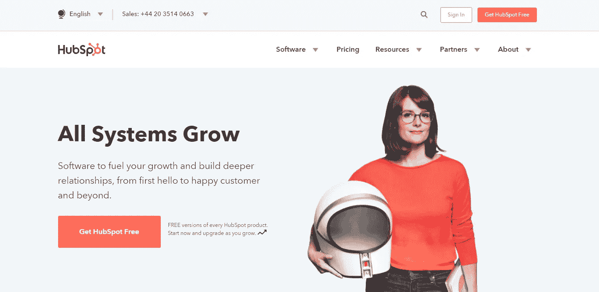

# 6.成功的商业网站备忘单——30 天的媒介

> 原文：<https://medium.com/swlh/6-the-successful-business-website-cheat-sheet-30-days-of-medium-42f89eb43e67>

欢迎回到 30 天中等

今天我会给你一张小抄，你可以用它**为你的企业建立一个简单、成功的网站。**

如果你错过了下面的【T4 我的媒体挑战】的前 5 天，你可以补上:

## [0。30 天的培养基](/swlh/30-days-of-medium-c7ab34953c6c)

## [1。建立自己的网站需要什么？— 30 天的培养基](/swlh/1-what-do-you-need-to-build-your-own-website-30-days-of-medium-1ed1ad4e505c)

## [2。如何找到你热爱的事业— 30 天的媒介](/swlh/2-how-to-find-a-business-you-love-30-days-of-medium-cb7a4a702d1b)

## [3。如何建立自己的网站—媒体 30 天](/swlh/3-how-to-build-your-own-website-30-days-of-medium-587f994672ec)

## [4。如何衡量你网站的表现——30 天媒体](/swlh/4-how-to-measure-your-websites-performance-30-days-of-medium-75e650969695)

## [5。如何通过回答他们的问题获得更多的客户——30 天介质](/swlh/5-how-to-get-more-customers-by-answering-their-questions-30-days-of-medium-b462d237533e)

## [6。成功的商业网站备忘单——媒体 30 天](/swlh/6-the-successful-business-website-cheat-sheet-30-days-of-medium-42f89eb43e67)

## 7。如何衡量成功——媒体 30 天

## 8。了解在线销售漏斗— 30 天媒介

## 9。什么是流量，为什么流量很重要？— 30 天的培养基

## 10。什么是 Google URL Builder，为什么要使用它？— 30 天的培养基

## 11。通过自动化你的社交媒体日程，让你的流量翻倍——30 天的媒体

## [12。如何辨别什么好卖— 30 天介质](/swlh/12-how-to-tell-what-sells-30-days-of-medium-ba3291d029d2)

## [13。我如何在 6，500% — 30 天的培养基中培养我的培养基](/swlh/13-how-i-grew-my-medium-following-6500-30-days-of-medium-c9d2d6f80b51)

## [14。你如何看待事情很重要——30 天中期](/swlh/14-how-you-look-at-things-matters-30-days-of-medium-f641b9733b90)

## [15。如何向小型企业销售服务— 30 天中等](/swlh/15-how-to-sell-services-to-small-businesses-30-days-of-medium-d6604c63b3b7)

## [16。如何通过有效的提案赢得更多交易— 30 天的媒介](/swlh/16-how-to-win-more-deals-with-effective-proposals-30-days-of-medium-481f16bbc86f)

## 17。如何在 10 分钟内建立一个网上商店——30 天的媒介

## [18。如何在任何地方工作— 30 天介质](/swlh/18-how-to-work-from-anywhere-30-days-of-medium-1c9cfa2d662f)

## [19。为什么你的网站会破坏你的销售——30 天媒体](/swlh/19-is-your-website-sabotaging-your-sales-30-days-of-medium-f63bdbdb350)

## [二十。你的流量从哪里来？— 30 天中值](/swlh/20-where-does-your-traffic-come-from-30-days-of-medium-a9b2d2c088bb)

## [21。如何真正识别倦怠——30 天中等水平](/swlh/21-how-to-actually-recognise-burnout-30-days-of-medium-7972a7a7a89e)

## [22。如何修改你的时间表并完成两倍的工作——30 天中等时间](/swlh/how-to-hack-your-schedule-and-get-twice-as-much-done-30-days-of-medium-441a509dc9be)

## [23。不要模仿你的竞争对手——30 天的媒介](/swlh/23-dont-copy-your-competitors-30-days-of-medium-56382b7ba8ed)

## 24。如何 SEO 优化一篇博文——30 天的媒介

## 25。独特或被遗忘——30 天的媒介

## 26。跟着感觉走——30 天中等水平

## 27。人们不支付平均 30 天的中等费用

## 28。如何做关键词研究— 30 天介质

## [29。为什么帕累托原则是世界上最大的诀窍——30 天中期](/swlh/29-why-the-pareto-principle-is-the-worlds-biggest-hack-30-days-of-medium-1c225f5c8aa1)

## 三十岁。你的内容比你的电话更有利可图——30 天的媒介

# 简单点，笨蛋

你的网站需要**简单。**

一个新访客需要能够猜出**你是谁**、**你做什么**，并且给一个理由**在最初的 10 秒内继续滚动**，否则你已经失去了他们。

避免行话，使用简单的语言，确保你做的事情容易理解。像**轮毂点**一样。

# 保持一致

一些**自己动手网站**看起来如此糟糕的主要原因是因为**没有一致性**。

在网站上使用**1-2 种颜色**和**一种风格** t。在服务页面上使用相同的布局，以相同的方式使用你的排版，等等，不胜枚举。

# 可以理解

你和你的团队正围坐在桌子旁纠结的那个任务陈述？ **Bin 它**。**没人管**。在宇宙的历史上，从来没有人关心过一个使命宣言。

大公司可以在这种事情上浪费钱，但作为小公司你不能。

人们关心**你做什么**，**你如何做**，以及**它如何能帮助他们**。使用**简单的语言**并且**与你的客户相关。**

# 移动友好

关于这一点，我真的需要说什么吗？你可能以前就听说过，从每一个营销博客上。

我会说只有**你像你一样关心你的生意。**

有很多人在做你做的事情，如果你的网站不是**移动友好的，因此对于商务人士来说不容易使用**，他们会很乐意关闭你的标签并**进入下一个。他们不会花宝贵的时间试图用他们的手指浏览你的非移动友好的小网站。**

# 拥有一个博客

你现在可能不明白写博客的重要性，但是你会明白的！

谷歌喜欢新鲜的内容，正如我在上一篇文章[中讨论的，如何通过回答他们的问题](/swlh/5-how-to-get-more-customers-by-answering-their-questions-30-days-of-medium-b462d237533e)来获得更多的客户，你可以通过博客文章和内容回答他们的问题**来获得客户。**

# 有一个资源部分

创建**电子书、清单、快速指南和其他可下载内容。**

访问你网站的 90% 的人将**不准备购买**或联系你，所以你需要能够通过免费的有价值的内容将他们转化为线索，这样你就可以培养他们，直到他们准备好做生意。

# 使用行动号召

提示到**的游客采取行动**，看着你的**列表爆炸**。

使用恰当的**行动号召、弹出窗口**和**滑动窗口**会给你的渠道带来巨大的影响。

# 不要慢

你的网站不一定要**快如闪电**，但一定要**不要超慢。**

如果你的网站加载时间太长，人们就会离开。

不要用太多的插件或脚本膨胀你的网站，目标是速度和效率的健康平衡。

# 使用社会证明

每个人都想要每个人想要的，但是没有人想要没人想要的。

**客户评价、案例研究和成功案例对于在线产生 B2B 销售线索至关重要。**

确保你的网站上到处都有客户评价、案例研究、客户标识、评论，尤其是在提示客户联系你或下载资源的页面上。

# 谁，什么，怎样，为什么？

您的网站结构应该简单，包括以下页面或部分:

**我们是谁(关于我们)**

**我们做什么(产品/服务)**

**我们如何做**

**为什么用我们**

**联系人详细信息(联系人页面)**

这就是你开始在网上发展所需要的一切，还有博客和良好的内容策略。

希望这对你有所帮助。我在这里写了一个更详细的[网页设计](https://squareinternet.agency/)指南，你可能会觉得很方便。

## 关于这个话题有什么问题吗？请在评论中告诉我。

## 你可能也喜欢这个:

## [为什么 WordPress 是在](/swlh/why-wordpress-is-the-best-platform-to-build-your-business-or-startup-website-on-df3fe932fad7)上建立业务或创业网站的最佳平台

## 如果你喜欢这个故事，请点击👏按钮并分享，帮助其他人找到它！欢迎在下方留言评论。

## 这篇文章发表在 [The Startup](https://medium.com/swlh) 上，这是 Medium 最大的创业刊物，拥有 318，120 多名读者。

## 在这里订阅接收[我们的头条新闻](http://growthsupply.com/the-startup-newsletter/)。

