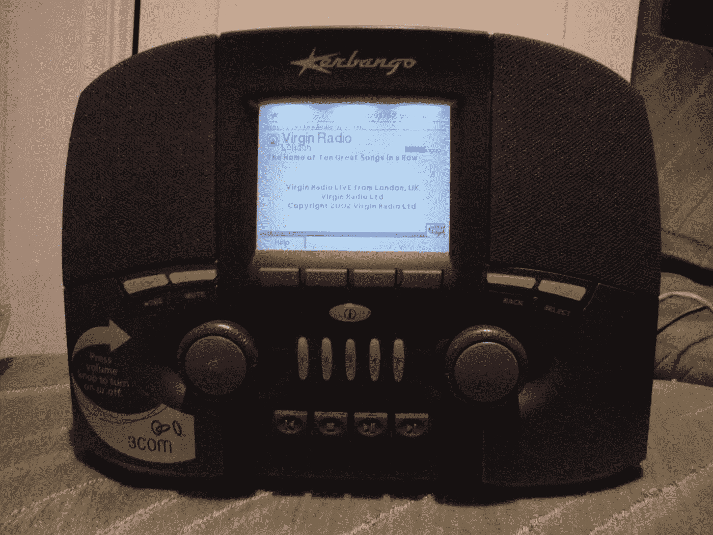
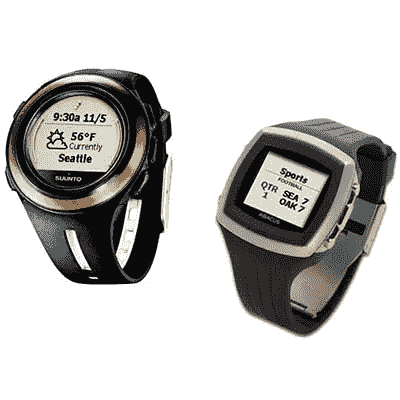

# 6 件超前但不成功的事情

> 原文：<https://medium.com/swlh/6-things-that-were-unsuccessfully-ahead-of-their-time-6c853c5dfd32>

时不时地，我看到一些东西，我的大脑会情不自禁地将它与远不那么成功的东西联系起来——然而惊人地相似——有时是最近的事情。

几天前我开始把这些事情列一个清单，我想我应该和你分享一下。

# 科尔班戈(2000 年)

如今，来自互联网的流媒体音乐无处不在。像“Alexa，播放古典音乐”或“好吧，谷歌，播放他们也许是伟人”和“嘿，Siri，播放我的新音乐组合”这样的短语是我们日常生活的一部分。音乐立即从我们的手机、平板电脑、蓝牙扬声器、电视和汽车中传出。

当我在零售货架上看到 Sonos、Bose 以及那家在其设备上贴有巨大加号和减号的公司的最新蓝牙音箱时，我不禁想起了 Kerbango 网络收音机。Kerbabngo 是在便携式音频技术达到 32 兆字节 [Diamond Rio](https://en.wikipedia.org/wiki/Rio_PMP300) 时开发的。该产品由 [3Com](https://en.wikipedia.org/wiki/3Com) 构思、开发、收购，最终在[苹果 iTunes](https://en.wikipedia.org/wiki/History_of_iTunes) 、 [Rip 推出之前被扼杀。混合。燃烧。](https://www.macworld.com/article/2934175/think-retro-rip-rip-mix-burn.html)，或者说 [iPod](https://en.wikipedia.org/wiki/IPod) 。

A Kerbango! by [James Cridland](https://www.flickr.com/photos/18378655@N00/516827346/)

是的，这个东西有旋钮和屏幕，一个可以移植到任何设备上的界面，你可以从这个设备上调用音乐，或者完全消失在语音助手后面。它也没有可用的个人曲目的深度目录。相反，它本质上是一台运行 Linux 的嵌入式计算机(这在当时是一个不小的成就)。它以我们今天会嗤之以鼻的比特率，以 MP3 和 RealAudio 格式播放网络电台。

杀死 Kerbango 的可能是它的要求:宽带互联网连接和有线以太网连接。

宽带在当时还是一个东西，但拨号上网对大部分联网家庭来说已经足够好了。许多(如果不是大多数的话)宽带连接家庭也将他们的电缆或 DSL 调制解调器直接连接到一台计算机，而不是集线器或交换机。即使你有一个本地网络，为了让 Kerbango 有任何意义，你必须从你的网络连接到你想使用设备的任何地方运行有线以太网。如果你想在电脑旁收听网络电台，你可能只需在电脑上打开 [Winamp](https://en.wikipedia.org/wiki/Winamp) 、 [RealAudio Player、](https://en.wikipedia.org/wiki/RealPlayer)或你选择的软件。

# 3Com 奥黛丽(2000–2001)

互联网泡沫刚刚破灭，这是一个推出任何产品的糟糕时机，更别说是一个为厨房设计的 500 美元的互联网设备了。3Com 的 Audrey 被认为是第一款适用于整个房子不同房间的 Ergo 品牌的互联网设备。这是最后一次。

3Com Ergo Audrey original Linen and Audrey custom-painted black with message light on by [Rob Hudson](https://commons.wikimedia.org/wiki/File:Ergo_Audrey_Original_and_Custom.JPG)

我记得在 Audrey 发布和推出之后。它运行一个名为 [QNX](https://en.m.wikipedia.org/wiki/QNX) 的 Unix 版本，这是我们很多 Linux 呆子都支持的。它有一种非常有趣的设计语言，看起来确实会(或者至少可以)在厨房里做得很好。

我还记得奥黛丽停产的那一天。我开车去了 Circuit City(一家出售电脑、电子产品、音乐和电影的大卖场，与百思买没什么不同),看看他们是否在打折。我不确定是有人捷足先登，还是根本没有现货，但当我到达那里时，只有演示版，而且不出售。

虽然现在说它们成功还为时过早，但在写这篇文章的时候，你可以走进商店，玩一系列前面有巨大触摸屏的三星冰箱。

[Samsung Family Hub](https://www.samsung.com/us/explore/family-hub-refrigerator/connected-hub/)

所以这是一件事。

# 杂货店送货(网络时代)

在网络泡沫时期，许多公司试图解决食品杂货配送问题。有几个，像[豆荚](https://www.peapod.com)，实际上取得了悄无声息的成功。他们中的大多数，像 Webvan、Streamline.com、Kozmo.com 和许多其他的网络公司都没有。

在找到一个更小的市场之前，Webvan 基本上在仓库和基础设施上烧光了大量现金。他们成了紧随其后的网络泡沫破灭的典型代表之一。

Kosmo.com 还在亚马逊 Prime Now 和 T2 Favor T3 的交汇处覆盖了一些有趣的领域，为音乐、电影和你可能在便利店找到的东西提供送货服务。

快进到今天，几乎每一个主要的杂货连锁店都在执行自己的内部提货服务，如果不是送货服务的话。像 [Instacart](https://www.instacart.com) 、 [Amazon Fresh](https://www.amazon.com/AmazonFresh-Grocery/) 和 [Google Express](https://express.google.com) 这样的公司和服务也随处可见。

# 外卖出租车(80 年代和 90 年代)

与杂货店送货相邻的是“我想要一些食物，但我不想出去买。”这是一个目前由 [Favor](https://favordelivery.com) 、 [Uber Eats](https://ubereats.com/) 、 [Amazon Restaurants](https://www.amazon.com/restaurants/landing) 和其他公司很好服务的利基市场。

有一段时间，Uber Eats 的美味午餐开着车到处跑，只等你点餐。我确实怀念那些有风险资本补贴的便利日子。今天，这些服务中的大多数可以在 30 分钟内将食物送到主要的大都市地区，这仍然是相当可靠的。

很容易将这种便利追溯到一种叫外卖出租车的服务，这是 1994 年《华盛顿邮报》的一篇文章中描述的一种业务。他们的目标人群是双职工家庭，作为一名学生，我只用过一两次，但是很方便。

当时成功交易的最大障碍之一是菜单分发。要么你知道你想要什么，要么你不得不打电话让人传真菜单给你。他们在参与餐馆的菜单底部嵌入联系信息方面做得相当出色。

他们还在电话簿的战略位置做了有效的广告，这就像是去掉评论的 Yelp 的原始版本。

# 微软平板电脑(2001 年)

虽然微软最近在 Surface 系列平板电脑上取得了成功，但人们很容易忘记，在 iPad 推出之前的近十年里，他们也有一个非常受欢迎的平板电脑系列，采用了当代的笔记本电脑部件。我记得在当时的技术会议上看到过这些，大部分是可转换的笔记本/平板电脑外形，尽管[还有更奇特的配置](https://en.wikipedia.org/wiki/Microsoft_Tablet_PC#Configurations)，如双屏小册子和可移动键盘平板电脑。

HP Tablet PC running Windows XP Tablet PC Edition by [Janto Dreijer](https://commons.wikimedia.org/wiki/File:HP_Tablet_PC_running_Windows_XP_(Tablet_PC_edition)_(2006).jpg)

如果我必须猜测它们为什么没有起飞并具有持久的能力，我必须引用它们与传统笔记本电脑相比的成本，以及你经常不得不为较慢的规格支付更多费用的事实。它们在特定的环境中找到了自己的位置，但从未像它们之后的事物那样受欢迎。

# 微软 SPOT Watch (2004)

虽然可穿戴设备的狂热似乎正在消退，但在过去几年里，肯定有很多成功的例子，其中很多都与健身有关。

许多手表可以通过蓝牙连接到手机，或者通过 WiFi 连接到本地网络。Apple Watch 等少数产品也可以连接到蜂窝 LTE 信号。

早在 2004 年，微软就推出了一系列联网手表，使用调频副载波频率将主要大都市地区的单向信息传递到你的手腕上。

What Microsoft got right with its smartwatch nearly a decade ago [at GigaOm](https://gigaom.com/2013/09/03/what-microsoft-got-right-with-its-smartwatch-nearly-a-decade-ago-more-than-you-think/)

当地天气、交通报告和新闻可以直接传送到你的手腕上。你甚至可以收到电子邮件和日历通知。还有一些其他的广播信息渠道，比如股票或者星座？

我戴了一年左右的化石算盘，能有这样的信息真的很好。但是屏幕分辨率很低，一个屏幕只能显示这么多信息。如果有的话，它通常会促使我在一个更强大的设备上查找信息，这是有帮助的，但不是独立的。它的单向通信最终也限制了它的有用性。

GigaOm [的 Kevin Tofel 让我回想起他在 2013 年](https://gigaom.com/2013/09/03/what-microsoft-got-right-with-its-smartwatch-nearly-a-decade-ago-more-than-you-think/)的回忆。

# 下一步是什么？

我们现在正在做什么，今天会失败，但以后会取得巨大成功？

从现在到 10 年后会发生什么变化，让今天的失败再次成为一个好主意？

我坚持不要果汁。

## 这篇文章发表在 [The Startup](https://medium.com/swlh) 上，这是 Medium 最大的创业刊物，拥有 277，994+读者。

## 在这里订阅接收[我们的头条新闻](http://growthsupply.com/the-startup-newsletter/)。

