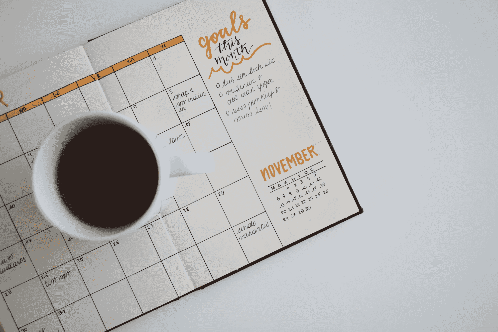

# 周末要做的 6 件事，为成功的一周做好准备

> 原文：<https://medium.com/swlh/6-things-to-do-on-the-weekend-to-set-yourself-up-for-a-successful-week-f6316e940b2f>

## 周一开始吧

# 1.放松和充电你的身体、思想和灵魂

补觉。做一些积极的再生，比如散步、按摩或者参加瑜伽班。关掉手机，花时间在大自然中，让你的注意力从事情上移开。通过阅读、创新或冥想来滋养你的灵魂。

# 2.与你爱的人联系

花一些额外的时间和你的伴侣亲密接触。和一个好朋友去喝杯咖啡。打电话给你妈妈。为你的家人做一顿周日烤肉。花时间回馈社区。

# 3.反思你的一周

本周什么进展顺利？什么不太顺利？你的生活符合你的优先事项和愿景吗？下周你能做得更好的是什么？你真正喜欢的是什么？你感激什么？

# 4.规划你的一周

你下周的首要任务是什么？3 个最重要的目标是什么？下周你将如何更接近你的梦想？你什么时候给自己定时间？你什么时候会为你爱的人和事花时间？

# 5.为一周做准备

准备健康的饭菜带到办公室。准备好你的运动服。剪指甲刮胡子。打扫你的公寓，储备你的冰箱

# 6.放下一周

洗个长澡。去练瑜伽。写在你的日记里。散散步。深呼吸。早点睡觉。让一周的沉重都过去吧。

# 你准备好提升你的生产力了吗？

注册到我的电子邮件列表，就可以获得我的免费资源和我的最佳内容的每周摘要，与其他伟大的作家混在一起。我希望你能加入我的部落！

**👉🏼** [**注册**](http://bit.ly/signup-lizhuber) **到我的邮箱列表**

[http://bit.ly/signup-lizhuber](http://bit.ly/signup-lizhuber)

**👉🏼** [**注册**](http://bit.ly/signup-lizhuber) **到我的邮箱列表**

## 这个故事发表在 [The Startup](https://medium.com/swlh) 上，这是 Medium 最大的创业刊物，拥有 325，521+人关注。

## 在这里订阅接收[我们的头条新闻](http://growthsupply.com/the-startup-newsletter/)。

