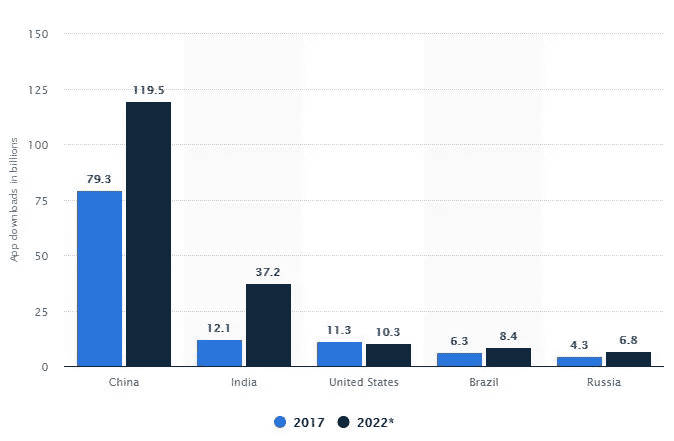
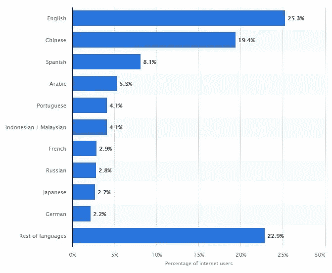

# 本地化移动应用程序时要记住的 6 件事

> 原文：<https://medium.com/swlh/6-things-to-remember-when-localizing-mobile-apps-a55a25a8e7e4>

对于任何想要充分利用其产品的开发者来说，本地化移动应用已经成为一种必然。像许多开发者几年前所做的那样，发布一个英文或一种通用语言的应用程序并保持这种状态不再是明智之举，尤其是在试图进入全球市场时。

Statista 的一项研究显示，2017 年美国有 113 亿应用程序被下载，而印度等其他国家有 121 亿，中国有 793 亿的下载量。预计到 2022 年，印度和中国的下载量将分别激增至 372 亿和 793 亿，而美国的下载量将降至 103 亿。这就是为什么移动应用程序开发现在正在超越英语泡沫，进入新的地区和市场，提高了应用程序对多语言支持的需求，这是通过移动应用程序本地化来实现的。

现在，如果管理不当，移动应用程序本地化对于开发人员来说可能是一个令人厌倦且充满压力的过程。这就是为什么我们编制了一个列表，列出了在本地化您的移动应用程序时需要记住的六件重要事情，以帮助您完成这一过程。

# 不只是翻译

永远不要认为移动应用程序本地化只是翻译，因为它远不止如此。本地化是指调整您的移动应用程序以适应不同的市场，这不仅仅包括语言方面，还包括单位和货币转换、日期格式、数字，甚至调整您的应用程序以适应社会习俗、法律法规和不同的技术标准。

2015 年，Airbnb 通过为中国用户创建本地化的注册流，将中国游客的用户群增长了 700%。新流程不仅允许中国用户使用他们的电子邮件地址、脸书或谷歌账户注册，还提供了使用微信或微博账户注册的选项，这是中国最受欢迎的两个社交媒体平台。这表明本地化的局限性是无穷的，它远远超出了基本的语言翻译。

# 超越应用

当开发人员想到本地化时，他们会立即想到应用程序本身的内容，而事实上，该过程的一个重要部分是本地化您在 app store 上的应用程序列表。元数据和关键字本地化对于应用的可发现性至关重要，应该始终放在第一位，甚至在应用内内容本地化之前，因为在大多数情况下，如果 app store 元数据没有本地化为相同的语言环境，用户不会下载应用，即使该应用在他们首选的语言环境中可用。

建议您从将 app store 元数据本地化到尽可能多的语言环境开始，即使您的应用内内容尚未本地化到这些语言环境，从关键词开始，然后是应用名称、描述和屏幕截图。事实上，多项研究表明，元数据本地化后，应用程序下载量和收入增加了 200%以上，并且通过在新地区下载应用程序，应用程序的可发现性也有所提高。

通过本地化元数据跟踪哪些国家或地区正在下载您的应用程序，这对于您确定要扩展哪些市场以及要将您的应用程序内内容本地化到哪些地区也非常有帮助。

**提示:**如果要进行本地化，最好不要在应用图标中包含您的应用名称。

# 超前思考

移动应用国际化不可能实现本地化。从技术上来说，这是可能的，但你不希望创建多个版本的代码，并在每次对应用程序进行微小更改时，浪费时间分别更新每个版本。这就是为什么在开始移动应用程序开发之前，在规划阶段就考虑本地化是明智的。

您需要让您的应用程序为本地化做好准备，这意味着不要硬编码任何文本或 UI 元素以便稍后能够提取它们，确保您的应用程序可以处理具有不同要求的不同语言、字母、数字和复数形式。当翻译成另一种语言时，文本也会增加大约 20-30 %,所以你需要确保你的用户界面具有适应性，能够处理这些情况。说到用户界面，你的应用程序界面可能必须完全改变为从右向左(RTL)的语言，比如希伯来语和阿拉伯语，以适应你的用户体验。

简而言之，你必须确保做好本地化计划，确保你的应用程序国际化，以避免将来遇到任何问题。

# 选择正确的工具

移动应用程序开发本身可能是一个单调乏味的过程，因此您希望本地化过程尽可能无缝，以免增加压力。这就是为什么强烈建议您使用本地化和翻译平台，这将有助于您自动化翻译工作流程。

使用本地化平台有无数的好处，因为它允许您在一个地方轻松管理本地化流程的所有方面。它通过允许您与翻译人员协调、管理翻译和跟踪项目进度来实现这一目标。

它们不仅可以节省您的时间和精力，而且本地化平台还可以以多种方式为您节省资金，例如允许您以较低的价格订购专业翻译，并为您提供翻译记忆库，该记忆库可以识别以前翻译过的字符串。

# 做出基于数据的决策

数据是一座金矿，在移动应用程序本地化过程中使用数据来指导您的决策可以极大地帮助您。当然，一个经验法则是，当你决定将你的应用程序本地化为哪种语言时，应该选择最常用的语言，包括英语、中文和西班牙语。

然而，如果你有一个已发布的应用程序，并且你已经有了一个用户群，那么根据你的应用程序已经吸引的不同人群来本地化你的应用程序可能会更有好处。这样，你就可以在那些你的应用已经建立起来的市场中扩张，而不是在黑暗中尝试扩张到你一无所知的新市场。

深入研究你的应用分析，阅读你的应用评论，研究不同的市场，时刻关注你的竞争对手在做什么，努力领先他们一步。

**提示:**截至 2017 年 6 月，互联网上最常用的[语言](https://www.statista.com/statistics/262946/share-of-the-most-common-languages-on-the-internet/)，按互联网用户份额排列为:

*   英语——25.3%
*   中国人——19.8%
*   西班牙语——8%
*   阿拉伯语——4.8%
*   葡萄牙语——4.1%
*   印度尼西亚人/马来西亚人——4.1%
*   日本人——3%
*   俄语——2.8%
*   法语——2.8%
*   德语——2.2%

# 一步一步来

移动应用本地化可能是一个巨大的过程，当它有回报时，它就真的有回报了。你真正需要记住的一件事是，这是一个渐进的过程。你不能只是全力以赴地期望把你的应用程序本地化成每一种语言和地区。你需要做出明智的决定，决定你想从这个过程中获得什么，以及如何获得。

移动应用程序本地化流程就是利用您的资源，并最大化这些资源的投资回报率。所以，试着一次专注于一个市场，一个你认为最有效并能给你带来最好结果的市场，全力以赴，反复测试。在这个过程中，你可能不得不做出取舍，但是没关系，做对你有用的事情，记住本地化的最终目标是在新的领域为你创造新的机会。这将帮助你吸引新用户，增加你的应用下载量和月活跃用户数(MAU ),从而增加你的收入，这几乎是任何移动应用的最终目标。

此外，请记住，移动应用程序本地化是一个持续的过程，将伴随您的移动应用程序开发之旅，随着应用程序的发展和变化，您也需要适应应用程序本地化版本的变化。这就是为什么使用与应用程序开发工作流程相集成的本地化和翻译平台至关重要。通过这样做，它将为您省去许多麻烦，并允许您专注于开发您的应用程序，而不必担心本地化过程。

## 这篇文章发表在 [The Startup](https://medium.com/swlh) 上，这是 Medium 最大的创业刊物，有+384，399 人关注。

## 订阅接收[我们的头条](http://growthsupply.com/the-startup-newsletter/)。

