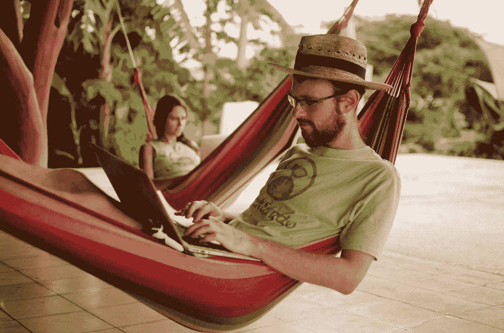
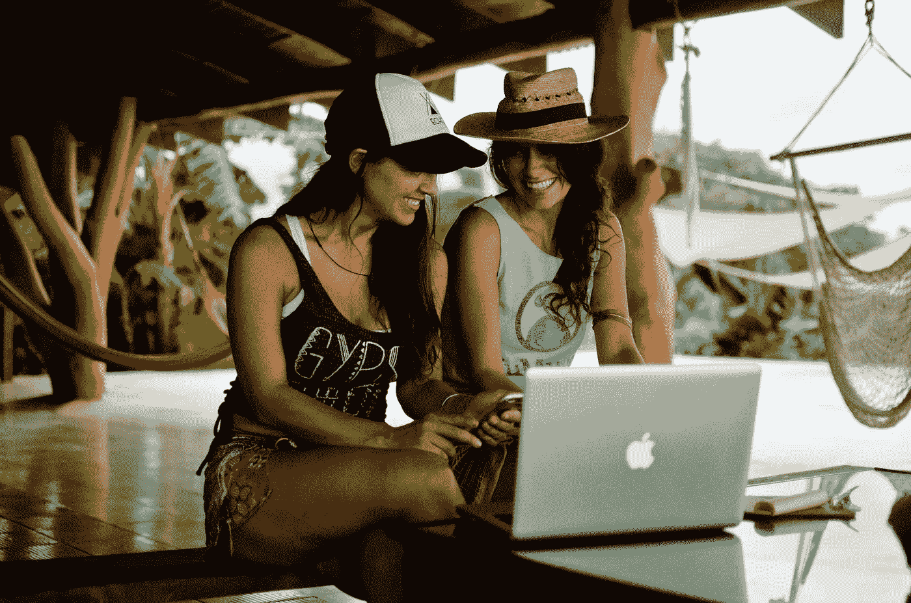
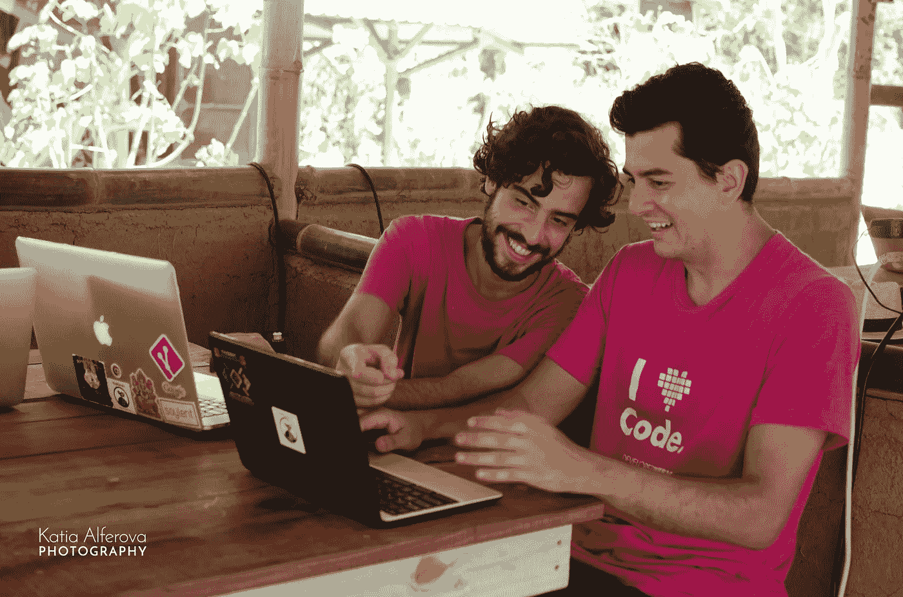
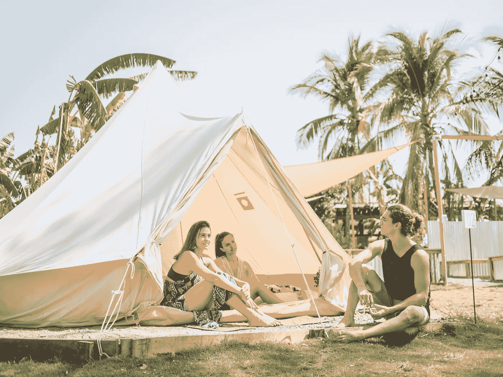
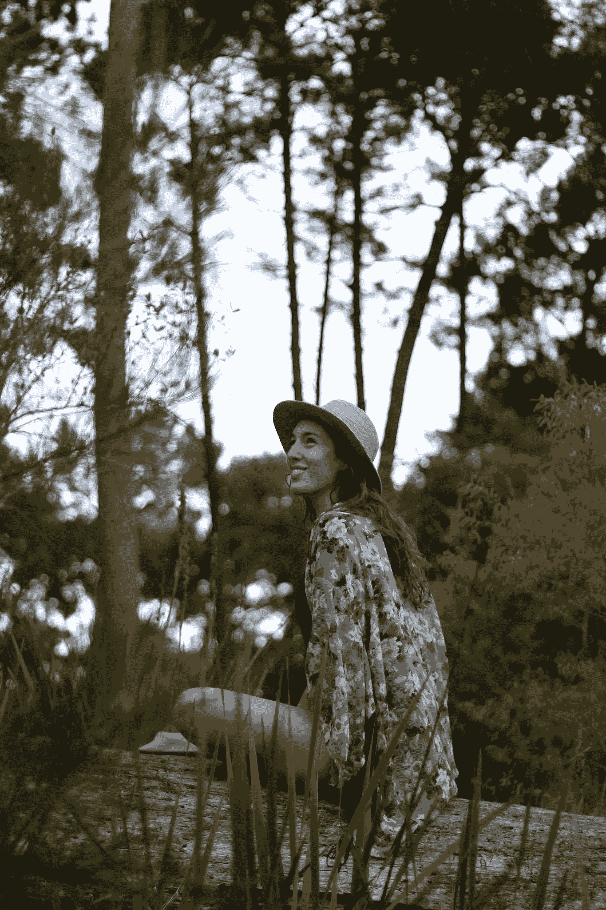

# 合作让你更有效率的 6 种方式

> 原文：<https://medium.com/swlh/6-ways-coworking-makes-you-more-productive-da9bf6facb04>

## 未来看起来很遥远。

NuMundo Co-Founder David Casey hard at (co)work.

*由努蒙多说书*[托比以色列 ](https://medium.com/u/c2eacbc6151a?source=post_page-----da9bf6facb04--------------------------------)

当我想到这一点时，我意识到我一直喜欢合作。

在我有任何工作之前，我经常做一些我父母称之为“平行游戏”的事情。在平行游戏中，两个或两个以上的学龄前朋友会在单独玩的时候分享空间。

从小到大，我更喜欢在餐桌上做作业。当我转向数字游牧生活方式时，我选择了热闹的咖啡馆作为我的流动办公室。我在随机声音和活动的背景下最能集中注意力。当受到其他不引人注目但充满活力的存在的刺激时，我创作出一些最有创意的作品。

简单地说，我喜欢和公司一起工作。

NuMundo team retreat in Costa Rica.

因此，对我来说，[协同工作](https://hbr.org/2015/05/why-people-thrive-in-coworking-spaces)是数字时代的一个快速发展的趋势。如果你没有注意到，像 [Selina](https://www.selina.com/cowork/) (哥斯达黎加) [Nonce](https://numundo.org/center/south-korea/nonce) (韩国)和 [*Permalab*](https://numundo.org/center/portugal/permalab) (葡萄牙)这样的合作空间正在世界的每个角落激增。

办公室共享工作空间越来越受欢迎。更令人兴奋的是(对我们这些数字游民来说)，越来越多的公司，比如 GitHub，允许他们的员工远程工作。根据目前所有的预测，未来看起来很遥远——到 2035 年将有 10 亿数字游牧民。

共同工作一般被定义为“一种自我导向、协作、灵活和自愿的工作方式，这种工作方式基于参与者之间的相互信任和共同核心价值观的共享。”

我要补充的是，这也更有趣，更有成效。

*When we get tired of working, we go to the beach!*

# 根据我的经验，合作从根本上来说比单干更有成效。原因如下:

1.  **触手可及的支持。**你真实的指尖——不是虚拟的、谷歌式的那种。对某些内容需要第二种意见？不知道如何措辞一封微妙的电子邮件？需要拥抱吗？没有什么比问一个真正的人更好的了。有了共同工作空间，那些人类专家只需点一下头或说声“嗨，你好”就可以了。
2.  **环境动作。**如果你像我一样，在“太安静了”的情况下，你很难集中注意力音乐作品。如果你[住在哥斯大黎加](https://numundo.org/experience/costa-rica/numundo-nuliving-experience)，丛林音乐会也是如此。但是，在附近工作的其他人的声音、视觉甚至感觉都有一种独特的刺激。此外，周围都是志同道合的企业家和变革者，他们的工作让你钦佩，这真他妈的鼓舞人心。
3.  **情感充值。事实证明，短暂而活跃的休息会让我们在回到手头的工作时更有效率。当我们利用这些休息时间进行有意义的(非虚拟的)互动时——例如，喝咖啡时的短暂聊天、按摩交易或午餐时间的瑜伽课——我们会更有成就感。有了共同工作空间，给我们的情感电池充电的机会就像给我们的技术充电站一样多。**
4.  **问责。**没有什么比看着其他高度积极的人将他们的热情倾注到有目的的项目中更能激励努力工作和专注。共同工作空间倾向于吸引那种[使命驱动的数字流浪者](https://numundo.org/experience/costa-rica/numundo-nuliving-experience)，他们居住在 [NuMundo](http://www.numundo.org) 的全球社区中。虽然你可能认为共同工作会导致拖延，但以我的经验来看，这实际上让我们更负责任。我想那些被吸引到这些空间的位置独立者会同意的。
5.  **联网。**那些志同道合的创业者和变革者？他们可能是你的下一个商业伙伴、合作者或附属机构。在今天的工作环境中，我们的职业和个人生活在寻找目标驱动的工作中完美地纠缠在一起。拥抱不可避免的事情，利用共同工作空间作为在各个层面建立联系的理想场所。
6.  快乐的人更有效率。协同工作，如同平行游戏，是*的乐趣*。它以一种整体的方式满足了我们人类对互动、支持、社区和激励的需求。当我们的需求得到满足时，我们可以把快乐的能量集中在完成任务上。

Happy people. Happy work.

你是同事吗？我们很想听听！请在评论中分享你的经历。

## 准备好投入到共同工作、共同生活的可持续生活方式中了吗？【2020 年 2 月，在哥斯大黎加举办第二届 NuMundo NuLiving 体验。在 9 月 30 日之前，在退房时输入折扣代码 NUBIRD，即可享受此次沉浸式活动九折优惠。

想要一边工作一边环游世界吗？在 NuMundo 上查看更多合作空间:

**【俄罗斯】**

*[*吉维斯·海克利之家*](https://numundo.org/center/spain/the-giveth-hacker-house) *(西班牙)**

*[*【吴哥枢纽】*](https://numundo.org/center/cambodia/angkor-hub) *【柬埔寨】**

*[*CoDome*](https://numundo.org/center/kenya/codome) *(肯尼亚)**

*[*Hubud*](https://numundo.org/center/indonesia/hubud-1) *(巴厘岛)**

*[*神山*](https://numundo.org/center/japan/week-kamiyama-stay-work) *(日本)**

*托比·伊斯雷尔(努蒙多首席说书人)是一个流浪汉兼说书人，他有一个装满帽子的隐喻壁橱。她是一个创造性的推动者、编辑和作家，也是一个训练有素的授权自卫教练和瑜伽教练。她定期主持研讨会和务虚会，以增强权能、激发灵感和进行变革。她是运动、食物和文字的全职爱好者，通过舞蹈、诗歌、歌曲创作和食用炼金术来表达光明和黑暗。目前，托比住在哥斯达黎加。(她从联合国授权的和平大学获得了媒体、和平与冲突研究的硕士学位，并为木瓜、阳光和意识社区留下来。)*

****

## *这篇文章发表在 [The Startup](https://medium.com/swlh) 上，这是 Medium 最大的创业刊物，拥有+400，714 名读者。*

## *在这里订阅接收[我们的头条新闻](http://growthsupply.com/the-startup-newsletter/)。*

**