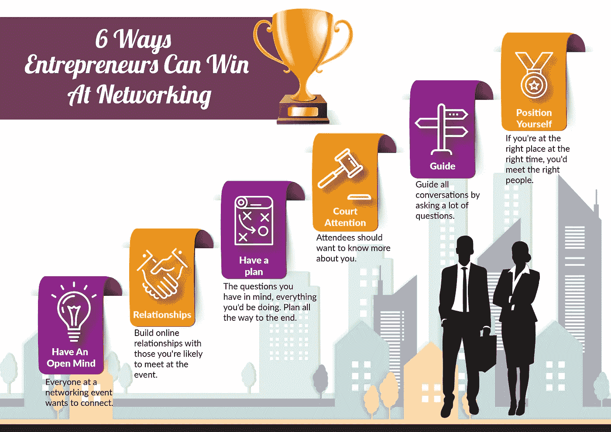

# 企业家在社交活动中获胜的 6 种方式

> 原文：<https://medium.com/swlh/6-ways-entrepreneurs-can-win-at-networking-events-ef59d7771511>

任何人都可以参加社交活动。然而，那些在这些事件中获胜的人以一种特殊的方式出现，并在他们到达之前和到达时做一些事情。

我们去看看你出现前后应该做些什么。

## 1.驱除有毒的思想

一条红色领带。牛仔外套。公寓会更好。他们不会喜欢我的。我不符合规格。嘿！这不是选美！

参加社交活动的每个人都想建立联系。按照计划建立关系，[学习新事物](http://www.passionforbusiness.com/articles/skills-for-networking.htm)并会见你所在行业的有影响力的人。

一切，[冒名顶替综合症](https://www.bustle.com/articles/119129-12-signs-you-might-be-suffering-from-imposter-syndrome-fellow-perfectionists-im-looking-at-you)，这一切都在你的脑子里。对网络开发、自由写作甚至博客来说，初出茅庐也没什么。

但是因为你不够好而感觉不好是不对的。因为事实是，只要你的企业在创新，你就永远不够好。总会有更好的。

往好的方面想，参加会议的每个人都是为了学习或提高某样东西。

所以，没有人真的足够好。

你想认识什么人？他们也很想见到你。走动时面带微笑，准备好和一两个人握手。

## 2.在线建立关系

“你好，约翰，我喜欢你周四发给我的虚拟主机信息图，忍不住在 facebook 上分享了它”，这听起来如何？

好吧，这个怎么样——“你好，约翰，你周四发的博文不错，我一直是你的忠实粉丝”？如果你像我一样内向，第一个开场白会更令人欣慰。

当你在网上建立关系时，你有一张脸，所以谈话从“你是谁？”“哦，那个在……写博客的人，怎么样了？”给你圈子里的人发信息，如果你觉得他们感兴趣，就邀请他们。在活动中，你可以和更多熟悉的面孔开始聊天。

你知道，每个人都想认识受欢迎的家伙。

让你的名字在你所在行业的大多数人口中家喻户晓的一个快速方法是[瞄准有影响力的人](http://www.jon-lee-clark.com/reasons-your-business-needs-a-marketing-agency/)。

这些人有大量的追随者，只要从中分一杯羹，你的生意就会非常好。

你可以使用像 Moz 的 followerwonk 这样的工具来搜索 Twitter 上的影响者。

找到你与这些影响者的共同兴趣，并就这些话题进行互动。

自然，而不是垃圾邮件。分享在要求分享之前，先做好人。

在会议之前，如果你确定你联系的某个特定的有影响力的人会出席，你可以离线交谈。

他们会感谢支持的。

## 3.有计划

我同意。现实永远不会像计划那样顺利。但这就是你应该计划的原因吗？不要！

实际上，[写计划](https://michaelhyatt.com/5-reasons-why-you-should-commit-your-goals-to-writing/)迫使你思考你可能遇到的问题。

所以你要去参加这个活动，你想去见谁？你脑子里有什么问题？你将如何吸收你将得到的所有信息？

如何？在哪里？为什么？什么？

如果你想避开所有的问号，就要有计划！

每个计划都应该从写下你打算实现的目标开始。写下你想联系的特定类型的人。

如果你不设定目标，事后就没有办法追踪进展。

做你的作业。研究你想认识的人或团体。更多地了解他们的生活和生意，这样你就有足够的话题开始了。

## 4.像孔雀一样吸引注意力

你很难开始对话。众所周知，你是一个好的倾听者。然后，像孔雀一样。他们不会在人群中迷路。人应该去……嘿，那是谁，他在干什么…当他们看到你的时候。不，不要奇怪，除了穿着，走路，甚至说话的方式，让别人想开始问。

“参与者:哦，裤子不错，这条腰带是怎么回事？
你:啊，那是东方时尚，你开服装店？”是啊，你的“虚荣”本性让你上当了。

## 5.问很多问题

人们喜欢谈论，尤其是关于他们自己。这让他们觉得自己很重要，也让你觉得自己很有知识。你不想做太多的回答，所以你最好的办法是通过提问来引导对话按照你希望的方式进行。你的问题会帮助你遇到的人自己找到答案。

还记得你需要[与影响者](https://www.launchmetrics.com/resources/blog/reasons-measure-influencer-engagement)的关系吗？是的，你可以问他们。

试着问正确的问题，问题太多了。

你可以从询问他们是如何得知这个事件的开始，也许他们认识发言人，或者是他们关系网中的某个人告诉他们的。

这个问题暴露了你和这个人的共同兴趣，所以你也要和他们建立联系。

询问他们正在进行的项目。这个问题让你了解他们在项目中的挣扎，甚至为你提供帮助提供了机会。

并询问他们对某个演讲或演讲者的看法。

也分享你对演讲者的看法。这个问题可以让你更多地了解他们将会在哪些业务领域应用他们所学的知识。

## 6.定位你自己

定位就是在正确的时间和地点把自己呈现给正确的人。

如果你在参加一个社交活动，你就在正确的地点。那么如何遇到合适的人呢？

你可以志愿帮忙做一些保证活动成功的事情。幕后工作给了你这个机会。

另辟蹊径？简单。要求被介绍。既然你已经开始和一些人交谈，问问他们是否认识你想见的有影响力的人。当你遇到那些有影响力的人时，你需要将他们视为你成功的阶梯，所以要留下良好的第一印象。

永远不要忘记，跟进。将您的所有联系信息集中在一个地方，这使得后续工作更加容易和方便。

定位也适用于你在跟进过程中传达信息的方式。

虔诚地遵循这些建议，你就没有理由会在人际交往中失败。

# 感谢阅读！:)如果您喜欢这篇文章，请点击👏按钮。这对我意义重大，也有助于其他人了解这个故事。

## 让我们连接:

# [insta gram](https://www.instagram.com/jon_clark/)|[Twitter](https://www.twitter.com/jonleeclark)|[脸书](https://www.facebook.com/jonleeclark) | [Snapchat](https://www.snapchat.com/add/jonleeclark)

*原载于***。**

**

## *这个故事发表在 [The Startup](https://medium.com/swlh) 上，这是 Medium 最大的企业家出版物，拥有 292，582+人。*

## *在这里订阅接收[我们的头条新闻](http://growthsupply.com/the-startup-newsletter/)。*

**