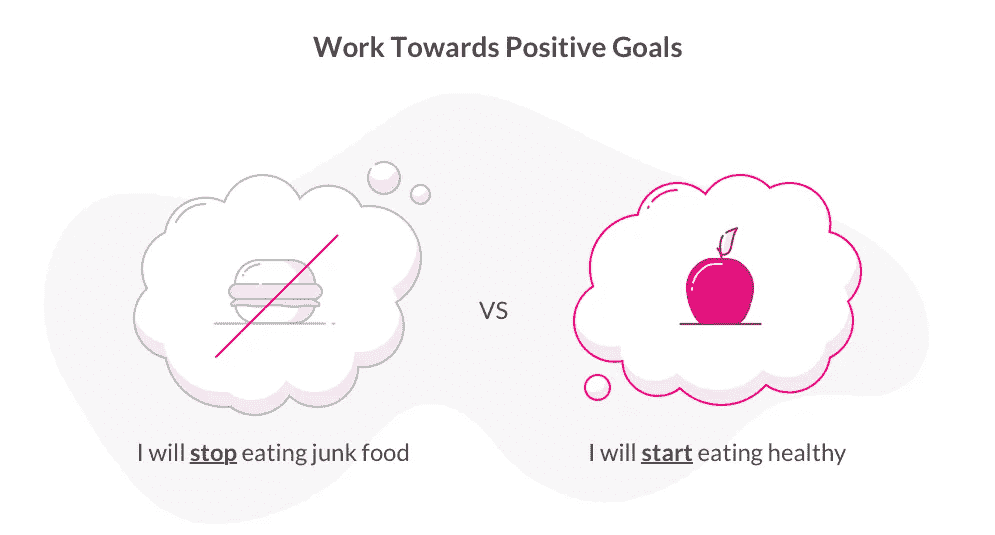
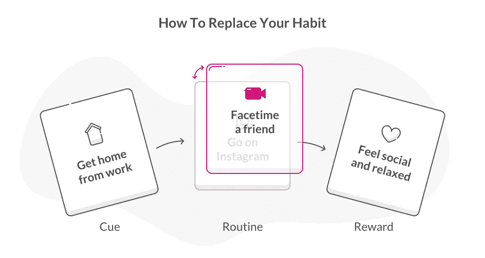

# 改掉坏习惯的 6 种方法

> 原文：<https://medium.com/swlh/6-ways-to-hack-your-bad-habits-43cd4482a816>

花点时间回想一下你今天早上做了什么。很有可能，你醒来，起床，刷牙，完成你通常的早晨例行公事。

你对自己的所作所为想了多少？是主动决策的结果，还是习惯？

根据畅销书作家查尔斯·杜希格的说法，尽管我们可能没有意识到，习惯构成了我们行为的 40%以上。习惯是我们大脑进化的捷径——它们让我们的大脑自动驾驶，所以我们的身体可以接管。

事情是这样的:当我们一遍又一遍地做同样的事情——就像早晨的例行公事——我们的大脑会注意到。它把这一系列的动作变成了一个自动的程序，并把这个习惯储存起来以备后用。发生这种情况是为了让我们不必整天做无数的决定。

习惯能节省大量的时间和精力，除非它们对我们的快乐、幸福或生产力产生负面影响。无论是[超支](https://www.lemonade.com/blog/budgeting-tricks/)，咬指甲，不断检查我们的手机，长期迟到，还是深夜吃零食，都太容易让我们的大脑陷入浪费的习惯。

但是这里有一个好消息——因为我们的习惯是由我们的大脑制造的，所以改掉坏习惯的关键就是知道与大脑交流的正确方式。就这么简单。这里有 6 个有科学依据的方法来破解你的大脑，最终结束那些坏习惯。

# 1.诊断你的习惯

确定你习惯的原因看起来非常可怕，但事实是几乎任何习惯背后都有一个非常清晰的公式。正如查尔斯·杜希格解释的那样，每个习惯都有三个基本组成部分:

1.  线索——触发你习惯的感觉、时间或地点
2.  常规——习惯本身
3.  奖励——习惯满足的渴望

弄清这些因素是改变你习惯的第一步。方法如下:密切关注接下来几次你的例行公事(理解为:习惯)发生的时候，试着注意促使它发生的暗示和奖励。为了达到最佳效果，记下每次的提示、常规和奖励。

假设你正试图打破你在 Instagram 上花费数小时的习惯，因为这个习惯妨碍了一个激情项目。问问你自己，“是什么触发了这个惯例？”还有，‘我的身体想要满足什么渴望？’

下一次，请注意:如果你结束了漫长的一天工作回到家(暗示)，扑通一声坐在沙发上，浏览你的信息(例行公事)，并且在这样做后感到放松和社交联系(奖励)，把它们都写下来。几次之后，看看你的行为是否有一个模式。如果你总是在下班回家后浏览 Instagram，或者注意到你的 Instagram 活动满足了你对社交互动的渴望，你就有所发现了。

诊断你的坏习惯不仅会帮助你找到有效的替代方法(后面会详细介绍)，还会帮助你更加意识到你的习惯。这种意识会将你的习惯从一种无意识的、下意识的例行公事转变成一种有意识的行为。

# 2.创造新环境

既然你已经找到了习惯的“线索”,你就开启了打破习惯的第一步。由于提示告诉你的大脑进入自动模式并开始你的习惯，当提示不存在时，你就不太可能完成例行公事。

所以这里的技巧是完全消除线索。怎么会？我们的首席行为官丹·艾瑞里说，要充分利用一个全新的环境。

> “如果你搬到一个新的地方，你不会有所有这些环境因素。Ariely 教授解释说:“如果你利用休假的时间，或者在几周内做其他事情，这些时间确实是打破习惯的好时机。

证据就在布丁里:研究人员发现，转到新大学的学生比对照组的学生更有可能改变他们的习惯，因为他们没有接触到熟悉的线索。

回到我们的 Instagram 例子，追求这个目标的最佳时间是在度假或工作旅行期间。由于你的大脑不会暴露在典型的触发因素下，你就不必在试图打破这个习惯时与你的本能作斗争。一旦你回到你熟悉的环境，继续你的连胜会容易得多。

# 3.关注你会做什么，而不是你不会做什么

让我们来谈谈习惯的另一个核心组成部分:例行公事。既然你现在是一个完全的习惯专家，你知道“常规”就是习惯本身——你试图打破的东西。

通常，当我们开始停止一个常规时，我们倾向于以消极的方式思考我们的目标——我们告诉自己我们将停止咬指甲，戒烟，或者结束我们的超支。

然而，我们大脑的习惯系统并不理解消极目标(我将停止增加体重)——相反，它们通过朝着积极目标努力来学习(我将开始锻炼)。事实上，研究表明，我们更有可能[达到一个目标](https://www.lemonade.com/blog/prioritize-future-self/)，这个目标涉及达到一个想要的结果(锻炼)而不是消除一个不想要的结果(增加体重)。

为什么？心理学家说[追求负面目标](https://www.psychologytoday.com/us/blog/dont-delay/200902/approaching-success-avoiding-the-undesired-does-goal-type-matter)与无能感、自尊心下降和对进步的不满意有关——这些情绪阻止我们采取行动。另一方面，一想到要达到一个积极的目标，我们更容易变得兴奋，这将增加我们实现目标的机会。

所以，与其放弃在 Instagram 上花太多时间，不如把在一个激情项目上花更多时间(T4 时间)作为你的目标。或者，与其试图停止在餐馆过度消费，不如开始在家吃更多的饭菜。

# 4.创造一个你会喜欢的替代品

这是我们的大脑无法理解消极目标的另一个原因:我们的大脑和身体很难完全停止一种习惯。一旦习惯形成，一旦我们的大脑识别出线索并渴望奖励，我们就会本能地完成例行公事。所以告诉你自己你将停止在餐馆过度消费并不能解决问题。

与其试图消除这个习惯——这几乎从未奏效——不如给你的大脑一个新的程序来代替旧的。怎么会？保持旧的线索，并提供奖励，但插入一个新的套路。

让我们回到 Instagram 的例子——你已经确定，一旦你下班回家(cue)，你渴望社交互动和放松(奖励)，但你不想让你的日常事务占用你太多的时间。

为了取代这个习惯，想一想你回家后可以做的另一项活动，它可以满足你社交和放松的需要。尝试与一位朋友进行几分钟的 FaceTiming，或者甚至与几个朋友建立好友关系。尝试一些惯例，看看什么最适合你。

一旦你找到了你的新习惯，每当提示和渴望来临时，努力去做。由于这个新习惯会满足你大脑的渴望，你不会感到身体或心理上的阻力。你做得越多，你的大脑就越容易记住这个新习惯——很快，它就会变成你的第二天性。

# 5.与朋友分享你的进步

与他人分享你的目标有一种被低估的力量。根据 ASTC 的一项研究，如果你告诉一个朋友你正在朝着一个目标努力，你有 65%的机会完成它。如果你和朋友约好见面或喝咖啡来讨论你的目标，你完成目标的几率会上升到 95%。这是很强大的。

为什么和朋友分享这么有效？一旦我们对他人做出公开承诺，我们往往会觉得有义务坚持到底，因为我们的基本驱动力是觉得我们的行为和信念是一致的。用心理学的话来说，这种倾向被称为认知失调。

与朋友分享也会带来积极的强化。假设你告诉一个朋友，你决心要多锻炼(而不是少吃)。当你告诉他你早上锻炼的情况时，他可能会用表扬来回应。当这种情况发生时，你的大脑会将听到“干得好”或“我为你骄傲”的快乐内化，这将进一步激励你继续锻炼。

所以，当你开始改掉一个坏习惯时，给一个朋友发短信——最好是一个也在努力改掉一个坏习惯的朋友。如果你承诺告诉对方你的成功和挫折，你将有更大的机会彻底改掉你的坏习惯。

# 6.对自己宽容点

当你开始改掉一个坏习惯时，你的努力可能不会尽善尽美。在漫长的一天工作后，你可能会屈服，花一个小时滚动浏览你的提要，尽管你尽了最大努力不这么做。或者你仍然可能在外面吃饭时多花 30 美元，尽管你想更多地在家吃饭。

当(而不是如果)这种情况发生时，你能做的最好的事情就是善待自己。如果你痛打自己，你可能会开始将你的目标与负面情绪联系起来，这可能会干扰你的进步和动力。

好消息是:根据 Phillippa Lally 博士进行的一项研究，如果你时不时地搞砸，不会对你大脑中的习惯形成过程产生实质性影响。(习惯是如何形成的)如果你屈服了，简单地跳回到马车上，习惯的形成会继续下去，就像从未被打断过一样。

事实上，在你寻求打破习惯的过程中，犯错实际上是富有成效的一步——它会给你上一堂关于你习惯的新课，可以指导你的策略。如果你试图坚持健康饮食，但在你朋友的生日晚宴上屈服了，你将学会为下次做准备。很有可能，这种经历会让你一劳永逸地战胜你的消极习惯，取得更大的成功。

# 是时候侵入你的大脑了！

我们都有想改掉的习惯，但是试图完全戒掉它是行不通的。我们的大脑是我们身体中最强大的器官——一旦习惯根深蒂固，打破它的唯一方法就是用大脑能理解的方式与大脑交流。有了这些技巧和工具，你会立刻停止改变你的习惯，谁知道呢——也许这种改变会以一种让你惊讶的方式改善你的生活。

**感谢阅读！如果你从这篇文章中学到了什么，点击拍手按钮👏来帮助别人找到它，并在下面留下评论。**

**更多由行为经济学驱动的生活窍门，请查看** [**柠檬水故事**](https://stories.lemonade.com/) **。带着柠檬水兜一圈，头转向**[**Lemonade.com**](https://goo.gl/VTJ2xi)**。**

## 这个故事发表在 [The Startup](https://medium.com/swlh) 上，这是 Medium 最大的创业刊物，拥有 315，628+人关注。

## 在这里订阅接收[我们的头条新闻](http://growthsupply.com/the-startup-newsletter/)。

