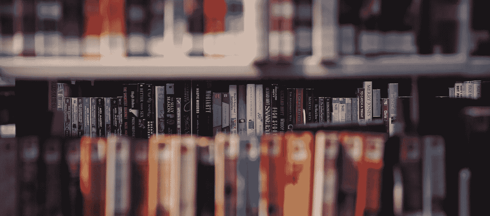

# 了解区块链和加密的 6 种方法

> 原文：<https://medium.com/swlh/6-ways-to-learn-about-blockchain-and-crypto-187fe15ee197>

## 2017 年是区块链成为主流的一年。价格飞涨，比特币充斥着新闻，每个人都想成为下一个密码百万富翁。

Photo by [Paul Schafer](https://unsplash.com/photos/t6oZEgL0z18?utm_source=unsplash&utm_medium=referral&utm_content=creditCopyText) on [Unsplash](https://unsplash.com/?utm_source=unsplash&utm_medium=referral&utm_content=creditCopyText)

## 但在 2018 年，该行业仍存在一些问号。